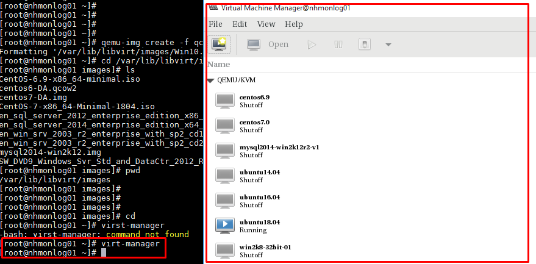
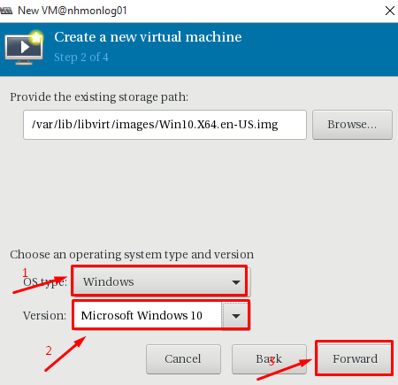
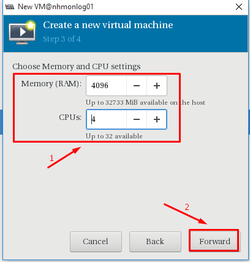
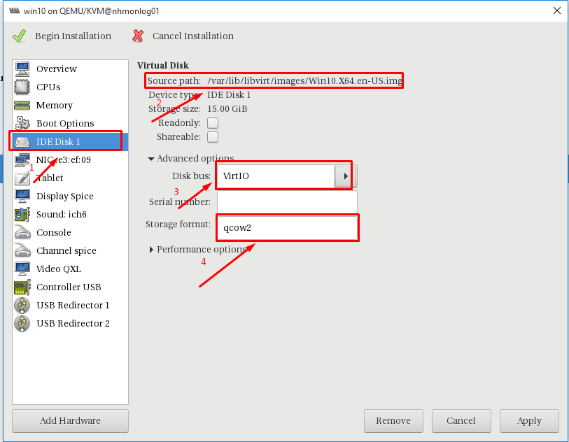
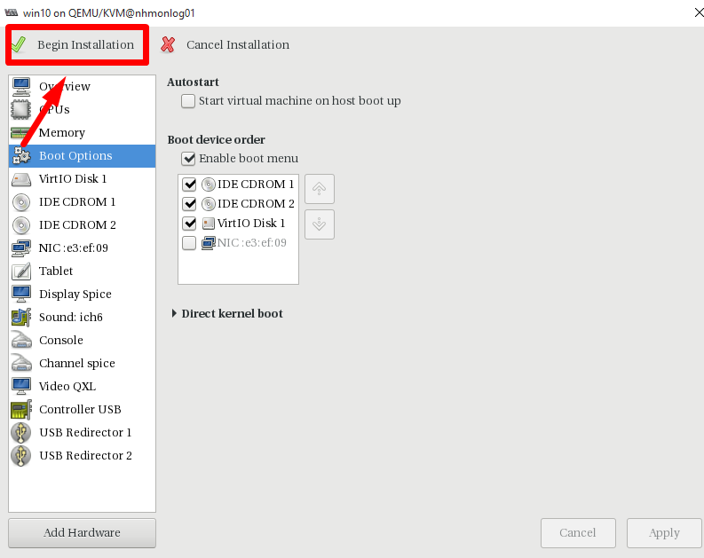
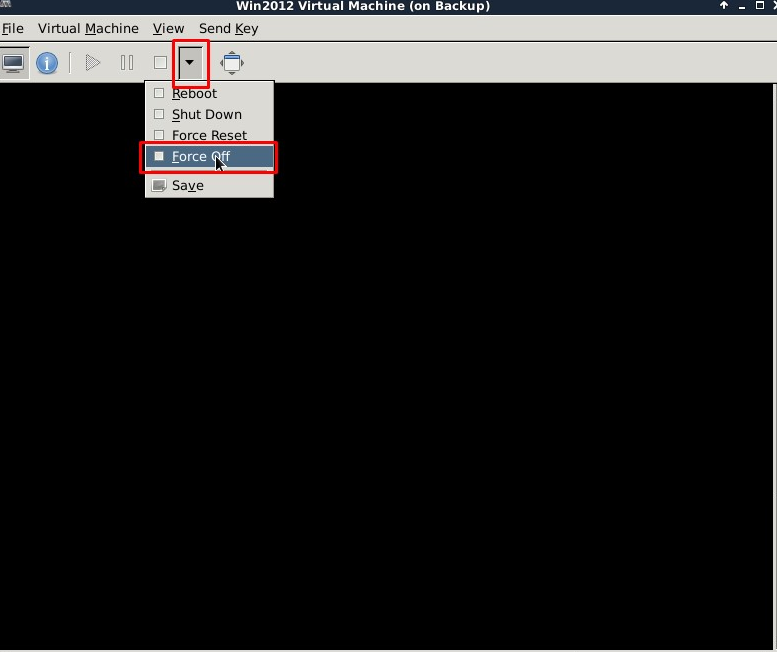

# Hướng dẫn tạo image windows 10 #

## 1. Chuẩn bị ## 

- Một server KVM để tạo image
    + Đã cài virt-manager và libguestfs-tool
    + Dải mạng bridge cho máy ảo. 
    + ISO VirtIO
- File ISO windows 10

Lưu ý:  Máy ảo KVM nên có cấu hình cao, dung lượng Disk size lớn và RAM cao để việc đóng image được nhanh.

## 2. Các bước cài đặt ##

**Bước 1:** Thực hiện trên host KVM, tạo file có định dạng `qcow2` cho máy ảo và lưu tại thư mục /var/lib/libvirt/images/ (áp dụng minsize 15Gb)

```sh
qemu-img create -f qcow2 /var/lib/libvirt/images/Win10.X64.en-US.img 15G
```


**Bước 2**: Copy file ISO windows 10 vào thử mục /var/lib/libvirt/images


**Bước 3**: Tạo máy ảo trên host KVM

Để sử dụng giao diện virt-manager và khởi tạo máy ảo phải cài đặt Xming để khi chạy lệnh `virt-manager`sẽ hiện ra giao diện quản lý máy ảo



Lựa chọn cách thức tạo máy ảo


**Bước 4**: Khai báo thông tin máy ảo




- Khai báo thông tin về CPU và RAM cho máy ảo



- Chỉnh sửa tên máy ảo, lựa chọn "Customize configuration before install" sau đó Finish


- Chỉnh lại "Disk bus" và "Storage Format" của Disk 1



- Lựa chọn "Add hardware", sau đó add thêm CD ROM với ISO Windows 10.


- Lựa chọn device type


- Lựa chọn "Add hardware", sau đó add thêm 1 CD ROM trống


- Trong phần "NIC", lựa chọn giải mạng Bridge

Lựa chọn dải mạng mà bridge cho VM khi tạo ra để ra internet


- Chỉnh sửa thứ tự boot -> Apply -> Begin install




**Bước 5**: Chinh sua channel

- Khi click begin -> force off may ao ngay lap tuc




**Bước 2**

**Bước 2**
