# Hướng dẫn cài đặt IPAM trên CentOS 7

### Mục lục

[1, Chuẩn bị](#chuanbi)

[2, Mô hình](#mohinh)

[3, Các bước cài đặt](#setup)

[4, Link tham khảo](#thamkhao)

<a name="chuanbi"></a>
## 1, Chuẩn bị

- Server: Cài đặt OS CentOS 7

- RAM: 4Gb

- CPU: 2 core

- Disk: 100 Gb

- Network: 1 interface

Server ra được internet, disable firewall, selinux, hostaname...


<a name="mohinh"></a>
## 2, Mô hình


<a name="setup"></a>
## 3, Các bước cài đặt

Bước 1: Cài đặt các gói cần thiết

```sh
yum -y install epel-release
yum -y update
yum -y install httpd mariadb-server mariadb
```

Bước 2: Update repo

```sh
rpm -Uvh https://mirror.webtatic.com/yum/el7/webtatic-release.rpm
yum -y update
```

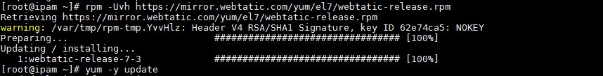

Bước 3: Cài đặt PHP modules

```sh
yum -y install php71w php71w-cli php71w-session php71w-sockets php71w-gmp php71w-mcrypt php71w-simplexml php71w-json php71w-gettext php71w-filter php71w-pcntl php71w-mbstring php71w-gd php71w-common php71w-ldap php71w-pdo php71w-pear php71w-snmp php71w-xml php71w-mysql git
```

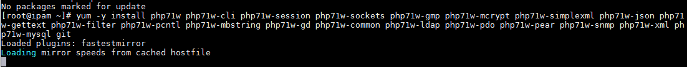


- Kiểm tra version PHP

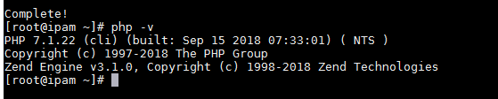

Bước 4: Chỉnh sửa time zone trong file php.ini


```sh
vi /etc/php.ini

edit 

Asia/Ho_Chi_Minh

```

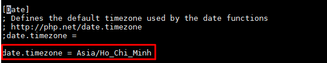

Bước 5: Khởi động service httpd, mariadb

```sh
systemctl start httpd
systemctl enable httpd
systemctl start mariadb
systemctl enable mariadb
```

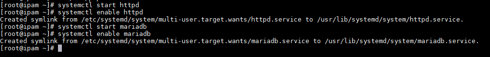

Bước 6: Cài đặt thông tin về SQL

- Thiết lập thông tin cho mysql

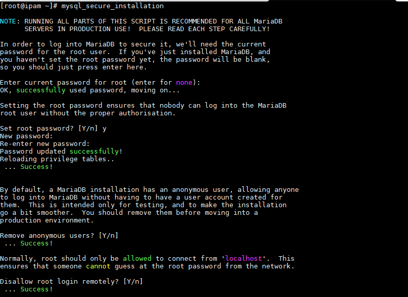

```sh
mysql -u root -p
CREATE DATABASE phpipam_data;
CREATE USER 'phpipam_user'@'localhost' IDENTIFIED BY 'datpasstuyy';
GRANT ALL PRIVILEGES ON phpipam_data.* TO 'phpipam_user'@'localhost';
FLUSH PRIVILEGES;
```


Bước 7: Tải các package của IPAM


```sh
cd /var/www
 
git clone https://github.com/phpipam/phpipam.git 

cd phpipam

git checkout 1.3
```

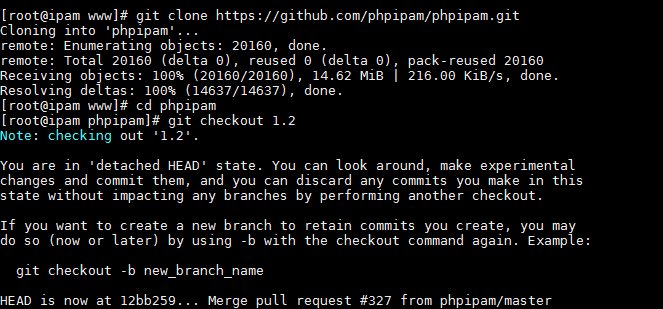

Bước 7: Set quyền cho IPAM

```sh
chown -R apache:apache /var/www/phpipam
```
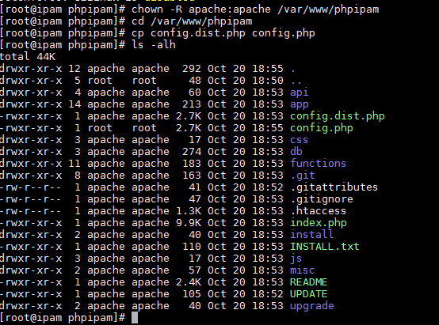

Bước 8: Chỉnh sửa file config ipam

```sh
cd /var/www/phpipam 
cp config.dist.php config.php
```


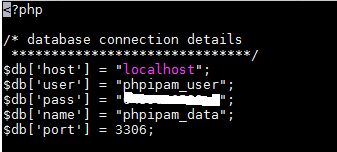

Cài đặt với đúng thông tin database đã thiết lập.


Bước 9: Tạo file config ipam trong `httpd/conf.d`

```sh
vi /etc/httpd/conf.d/phpipam.conf

add nội dung

<VirtualHost *:80>
    ServerAdmin localhost
    DocumentRoot "/var/www/phpipam"
    ServerName localhost
    ServerAlias localhost
    <Directory "/var/www/phpipam">
        Options Indexes FollowSymLinks
        AllowOverride All
        Require all granted
    </Directory>
    ErrorLog "/var/log/httpd/phpipam.yourdomain.com-error_log"
    CustomLog "/var/log/httpd/phpipam.yourdomain.com-access_log" combined
</VirtualHost>

```

- Restart lại service httpd, mariadb

```sh
systemctl restart httpd
systemctl restart mariadb
```

Bước 10: Truy cập giao diện IPAM

http://ip_server_ipam

- Lựa chọn 1 để hệ thống tự detect sqp ipam

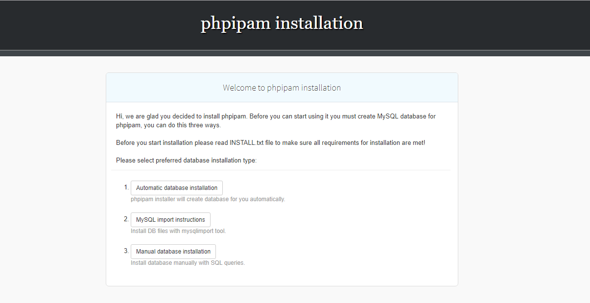

- Thiết lập thông số database: Click "Show advance option" bỏ hết tích

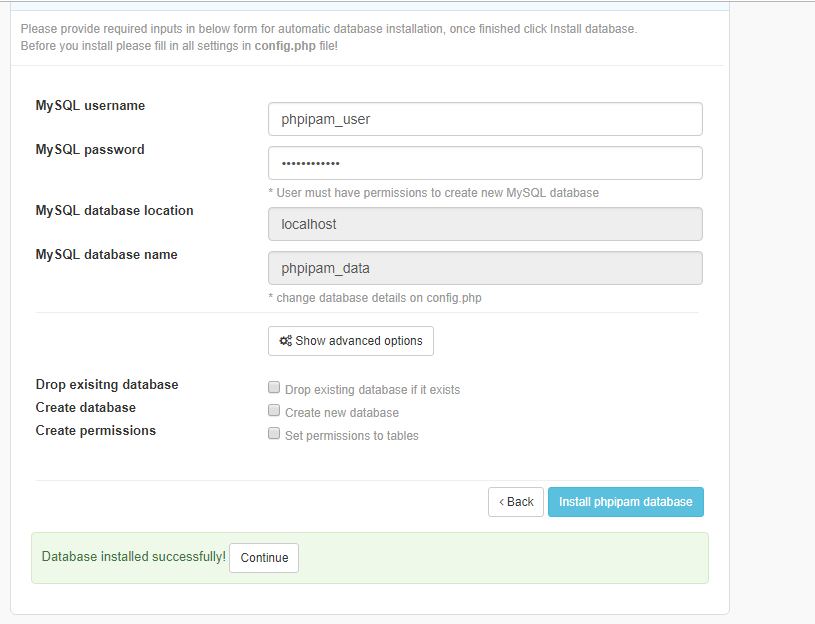

- Thiết lập config admin cho ipam

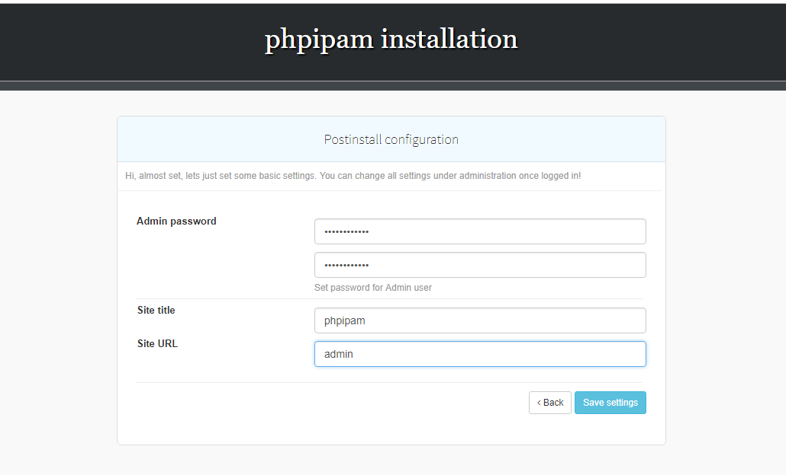

- Login thành công

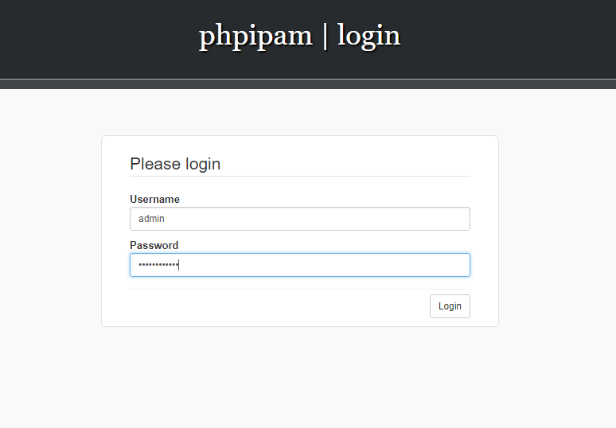

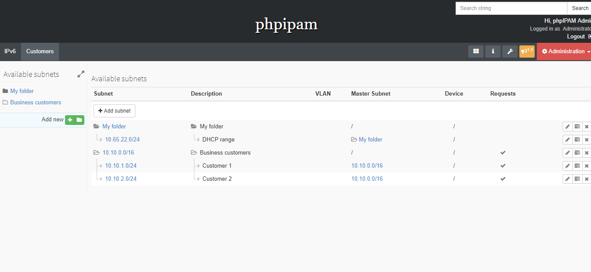

<a name="thamkhao"></a>
## 4, Link tham khảo

https://hostpresto.com/community/tutorials/how-to-install-phpipam-on-centos-7/

https://phpipam.net/phpipam-installation-on-centos-7/

https://phpipam.net/documents/installation/


