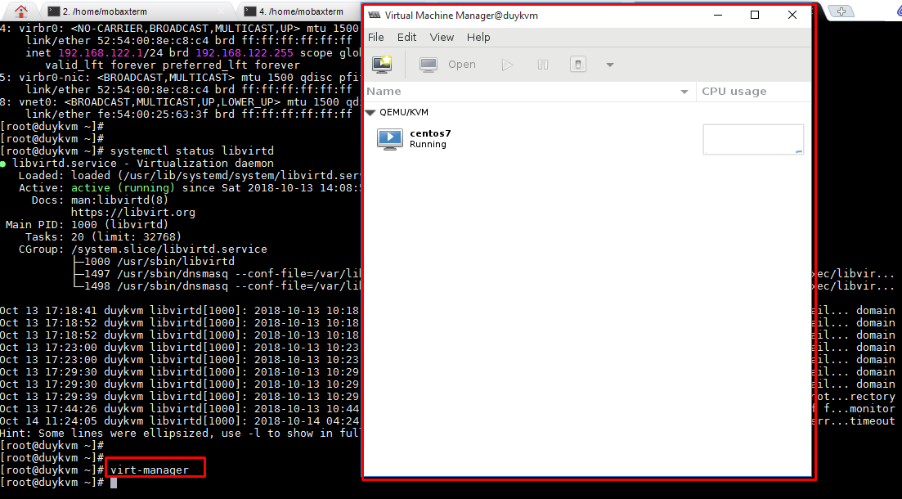
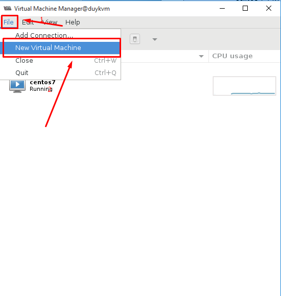
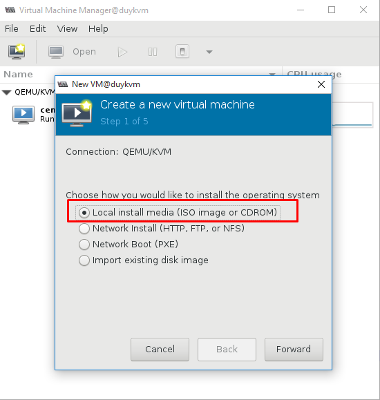
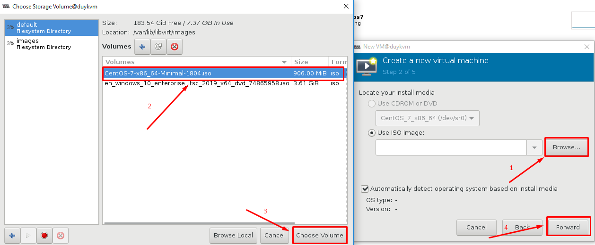
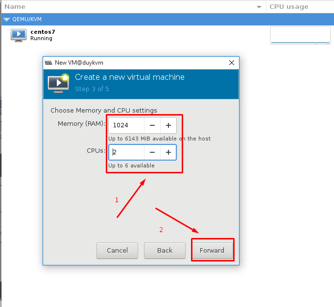
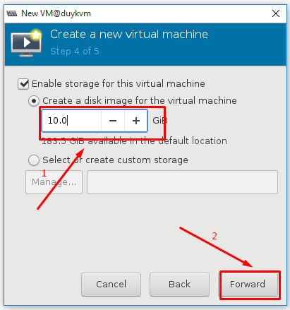
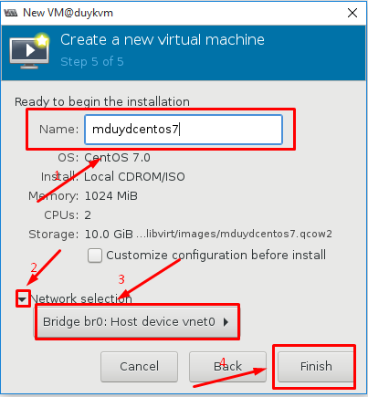
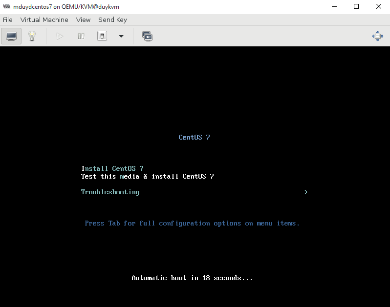

# Create virtual machine (GUI)

## A, Môi trường thực hiện LAB

- KVM server

- Cài đặt XMing

- File .iso hệ điều hành
	
## B, Mô hình


## C, Các bước thực hiện

Bước 1: Chạy lệnh `virt-manager` để khởi tạo GUI

```sh
virt-manager
```



Bước 2: Tạo máy ảo

File -> Virtual Machine



- Lựa chọn cách thức cài đặt

	+ Local install media: Cài đặt từ file ISO
	
	+ Network install: Cài đặt qua giao thức HTTP, FTP, NFS
	
	+ Network boot (PXE): Cài đặt qua cobbler
	
	+ Import existing disk image: Cài đặt từ một file img có sẵn.
	


Ở đây cài đặt từ file ISO chọn `Local install media`

- Tìm và lựa chọn file ISO



- Set thông số RAM, vCPU



- Set dung lượng disk của VM



- Đặt tên cho máy ảo và lựa chọn card mạng của máy ảo.



- Click `Finish` quá trình cafid đặt OS bắt đầu.



- Tiến hành cài đặt OS bình thường.


