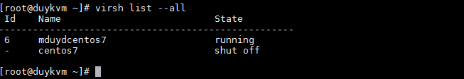

# Tìm hiểu một số lệnh cơ bản với Virsh

## A, Một số lệnh cơ bản thao tác với máy ảo

### 1, Bật máy ảo

+ Start 

```sh
virsh start <name_máy_ảo>
```

+ Start và mở console

```sh
virsh start --console
```

### 2, Tắt máy ảo

```sh
virsh shutdown <name_máy_ảo>

or

virsh destroy <name_máy_ảo>
```

### 3, Auto bật máy ảo

```sh
+enable

virsh autostart <name_máy_ảo>

+disable

virsh autostart --disable <name_máy_ảo>
```
### 4, List tất cả máy ảo

```sh
virsh list --all
```


### 5, 	Chuyển chế độ console GuestOS <-> HostOS

Hệ điều hành chủ (host operating system): là hệ điều hành chạy trên máy chủ.

Hệ điều hành khách (guest operating system): là hệ điều hành chạy trên một VM

### 6, Dump file xml máy ảo

```sh
virsh dumpxml <name_máy_ảo>
```

### 7, Reboot máy ảo

```sh
virsh reboot <name_máy_ảo>

or

virsh reset <name_máy_ảo>
```

### 8, Hiển thị thông tin về cpu

```sh
virsh vcpuinfo <name_máy_ảo>
```

### 9, Suppen máy ảo

```sh
virsh suspend <name_máy_ảo>
```

### 10, Cho máy ảo tiếp tục hoạt động

```sh
virsh resume <name_máy_ảo>
```

### 11, Hiển thị thông tin io disk

```sh
virsh blkiotune <name_máy_ảo>
```

### 12, Hiển thị cpu statistic

```sh
virsh cpu-stats <name_máy_ảo>
```

## B, Lệnh giám sát một số thông tin máy ảo

- Thông tin chung của máy ảo

```sh
virsh dominfo <name_máy_ảo>
```

- Thông tin về disk máy ảo

```sh
virsh domblklist <name_máy_ảo>
```

- Thông tin I/O disk

```sh
virsh domblkstat  <name_máy_ảo>
```

- Thông tin về interface

```sh
virsh domcontrol <name_máy_ảo>

virsh domif-getlink <name_máy_ảo>
```

- List all interface máy ảo

```sh
virsh domiflist <name_máy_ảo>
```

- Hiển thị thông tin về RAM máy ảo

```sh
virsh dommemstat <name_máy_ảo>
```

- Hiển thị thông tin trạng thái máy ảo

```sh
virsh domstate <name_máy_ảo>
```

## C, Hiển thị thông tin về node KVM

- Hiển thị thông tin về dung lượng node

```sh
virsh capabilities
```
- Hiển thị ram free

```sh
virsh freecell
```

- Hiển thị hostname

```sh
virsh hostname
```

- Hiển thị các tham số của RAM

```sh
virsh node-memory-tune
```

- Hiển thị thông tin CPU

```sh
virsh nodecpumap
```

- Hiển thị thông tin CPU

```sh
virsh nodecpustats
```

- Hiển thị thông tin chung của node

```sh
virsh nodeinfo
```

- Hiển thị thông tin về RAM 

```sh
virsh nodememstats
```

- Hiển thị version ảo hóa của VM

```sh
virsh version
```
