# Hướng dẫn cài đặt webvirt trên CentOS 7

### Mục lục

[1, Chuẩn bị](#chuanbi)

[2, Mô hình](#mohinh)

[3, Các bước cài đặt](#setup)

[4, Cài đặt add node KVM vào webvirt](#addkvm)

[5, Tạo máy ảo bằng file XML trên webvirt](#vmxml)


[5, Link tham khảo](#thamkhao)

<a name="chuanbi"></a>
## 1, Chuẩn bị

- Server webvirt:
	
	+ OS: CentOS 7 bản 1804 (Chạy trên ESXi)

	+ RAM: 4Gb
	
	+ CPU: 2 core
	
	+ Disk: 100Gb
	
	+ Network: 1 interface
	
- Server KVM:

	+ OS: CentOS 7 bản 1804 (Chạy trên ESXi)

	+ RAM: >8G

	+ Disk: 200G

	+ CPU: 4x2 Core
- Thiết lập thông tin cơ bản cho server

```sh
hostnamectl set-hostname webvirtduy1
echo "Setup IP ens160"
nmcli c modify ens160 ipv4.addresses 10.10.10.109/24
nmcli c modify ens160 ipv4.gateway 10.10.10.1
nmcli c modify ens160 ipv4.dns 8.8.8.8
nmcli c modify ens160 ipv4.method manual
nmcli con mod ens160 connection.autoconnect yes

sudo systemctl disable firewalld
sudo systemctl stop firewalld
sed -i 's/SELINUX=enforcing/SELINUX=disabled/g' /etc/sysconfig/selinux
sed -i 's/SELINUX=enforcing/SELINUX=disabled/g' /etc/selinux/config
```

```sh
yum install epel-release
yum update -y
```


<a name="setup"></a>
## 2, Mô hình

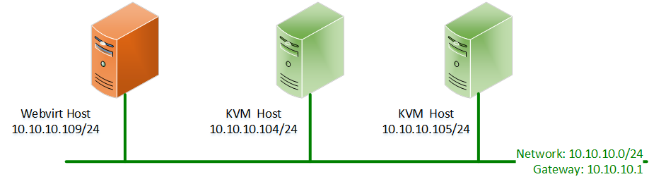


<a name="setup"></a>
## 3, Các bước cài đặt

Bước 1: Cài đặt các package cần thiết

```sh
yum install epel-release
yum -y install git python-pip libvirt-python libxml2-python python-websockify supervisor nginx
yum -y install gcc python-devel
pip install numpy
```

Bước 2: Thiết lập thư mục cho webvirt, python và môi trường Django

```sh
mkdir /var/www/ 
cd /var/www
```
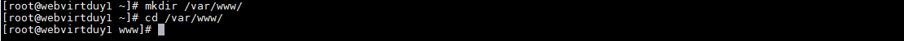

- Trong thư mục www vừa tạo clone thư viện webvirt về:

```sh
git clone git://github.com/retspen/webvirtmgr.git
```
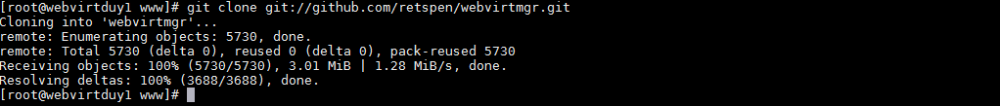

- Đảm bảo các file trong `webvirtmgr` đầy đủ

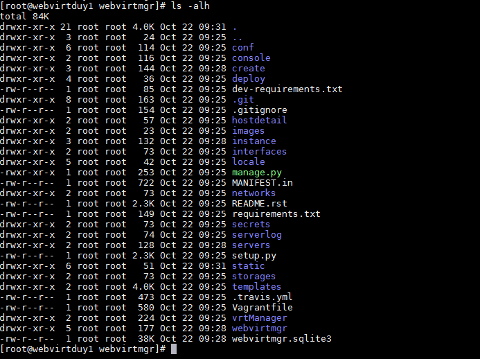

- Cài đặt môi trường cho webvirt

```sh
cd webvirtmgr
sudo pip install -r requirements.txt
```
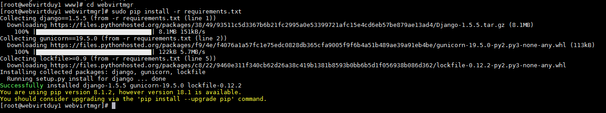

- Đồng bộ đb

```sh
./manage.py syncdb
```

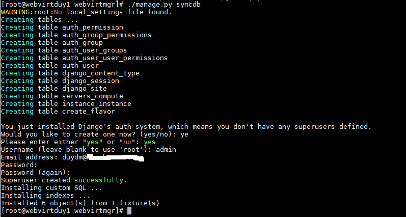

Username/Pass chính là nhập thông tin tài khoản để login vào webvirt

- Thu thập thông tin db

```sh
./manage.py collectstatic
```
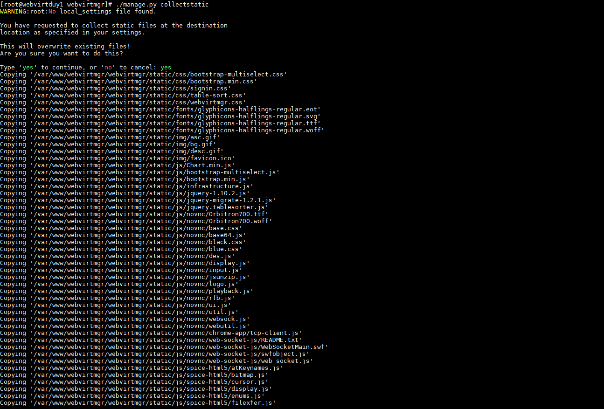

Bước 3: Cấu hình nginx

Tạo file config webvirtmgr trong ngĩn config

```sh
vi /etc/nginx/conf.d/webvirtmgr.conf

Add nội dung

server {
    listen 80 default_server;

    server_name $hostname;
    #access_log /var/log/nginx/webvirtmgr_access_log; 

    location /static/ {
        root /var/www/webvirtmgr/webvirtmgr; # or /srv instead of /var
        expires max;
    }

    location / {
        proxy_pass http://127.0.0.1:8000;
        proxy_set_header X-Real-IP $remote_addr;
        proxy_set_header X-Forwarded-for $proxy_add_x_forwarded_for;
        proxy_set_header Host $host:$server_port;
        proxy_set_header X-Forwarded-Proto $scheme;
        proxy_connect_timeout 600;
        proxy_read_timeout 600;
        proxy_send_timeout 600;
        client_max_body_size 1024M; # Set higher depending on your needs 
    }
}
```

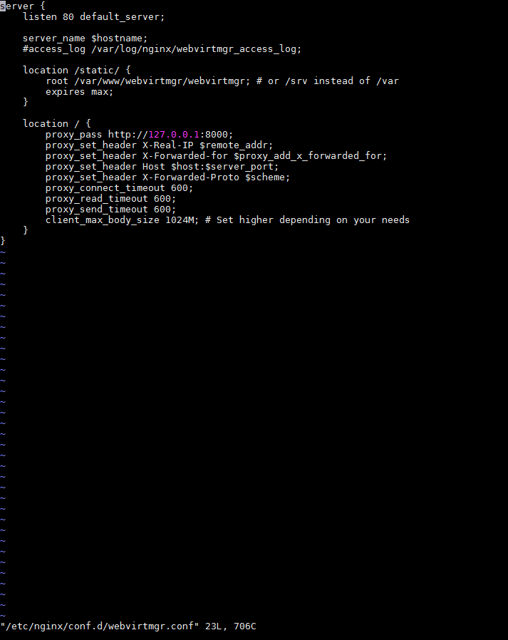

- Chỉnh sửa config nginx

```sh
vi /etc/nginx/nginx.conf
```

Comment lại khối server

```sh
#    server {
#        listen       80 default_server;
#        listen       [::]:80 default_server;
#        server_name  _;
#        root         /usr/share/nginx/html;
#
        # Load configuration files for the default server block.
#        include /etc/nginx/default.d/*.conf;

#        location / {
#        }

#        error_page 404 /404.html;
#            location = /40x.html {
#        }

#        error_page 500 502 503 504 /50x.html;
#            location = /50x.html {
#        }
#    }
```
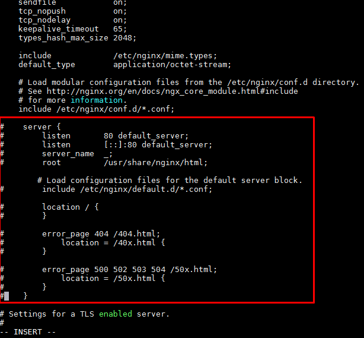

- Khởi động lại service nginx

```sh
systemctl restart nginx
systemctl enable nginx
chkconfig supervisord on
```
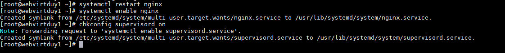

Bước 4: Cấu hình supervisor

```sh
sudo chown -R nginx:nginx /var/www/webvirtmgr
```
 Tạo file webvirtmgr.ini

```sh
vi /etc/supervisord.d/webvirtmgr.ini

Add nội dung

[program:webvirtmgr]
command=/usr/bin/python /var/www/webvirtmgr/manage.py run_gunicorn -c /var/www/webvirtmgr/conf/gunicorn.conf.py
directory=/var/www/webvirtmgr
autostart=true
autorestart=true
logfile=/var/log/supervisor/webvirtmgr.log
log_stderr=true
user=nginx

[program:webvirtmgr-console]
command=/usr/bin/python /var/www/webvirtmgr/console/webvirtmgr-console
directory=/var/www/webvirtmgr
autostart=true
autorestart=true
stdout_logfile=/var/log/supervisor/webvirtmgr-console.log
redirect_stderr=true
user=nginx

```

```sh
systemctl stop supervisord
sudo systemctl start supervisord
```

Bước 5: Update thay đổi trong webvirtmgr

```sh
cd /var/www/webvirtmgr
git pull
./manage.py collectstatic
systemctl restart supervisord
```
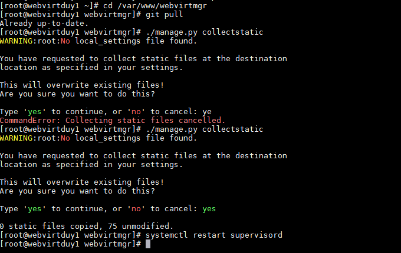

Bước 6: Debug

```sh
./manage.py runserver 0:8000
```

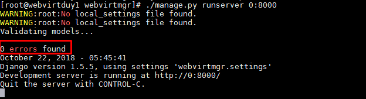

Bước 7: Truy cập giao diện websockify

```sh
http://ip_server_webvirt
```
- Truy cập webvirt thành công

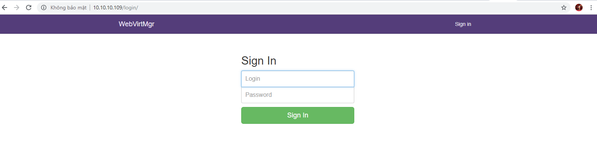


- Nhập thông tin đăng nhập

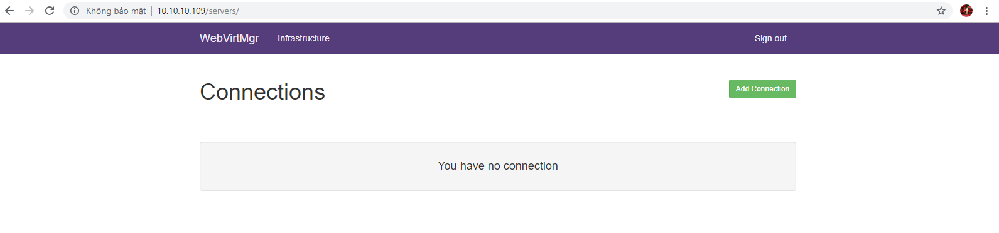

Ở đây có thể thao tác add host KVM vào để quản lý qua giao diện web.

<a name="addkvm"></a>
## 4, Cài đặt add node KVM vào webvirt

Bước 1: Kiểm chế độ ảo hóa của KVM 

```sh
cat /proc/cpuinfo| egrep -c "vmx|svm"
```
Giá trị trả về khác 0 là ok

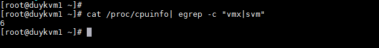

Bước 2: Chỉnh sửa cấu hình libvirt

```sh
vi /etc/libvirt/libvirtd.conf
```
Sửa các thông tin giống như sau

```sh
listen_tls = 0
listen_tcp = 1
listen_addr = "0.0.0.0"
tcp_port = "16509"
auth_tcp = "none"
```

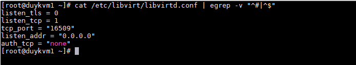

```sh
vi /etc/sysconfig/libvirtd

edit như sau

LIBVIRTD_ARGS="--listen"
```

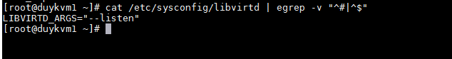

- Kiểm tra lại cài đặt

```sh
systemctl restart libvirtd
ps ax | grep libvirtd
ss -antup | grep libvirtd
virsh -c qemu+tcp://127.0.0.1/system
```

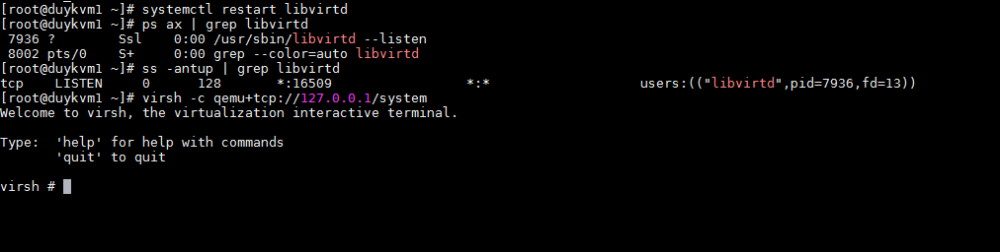


Bước 3: Add host ở giao diện webvirt

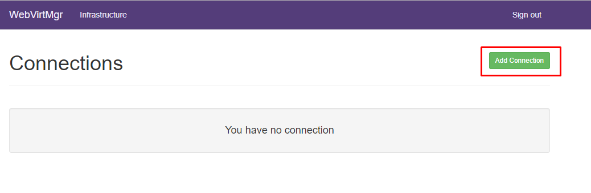
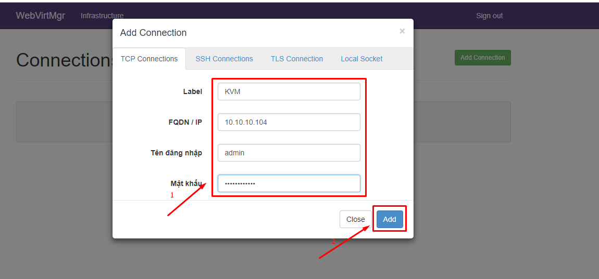
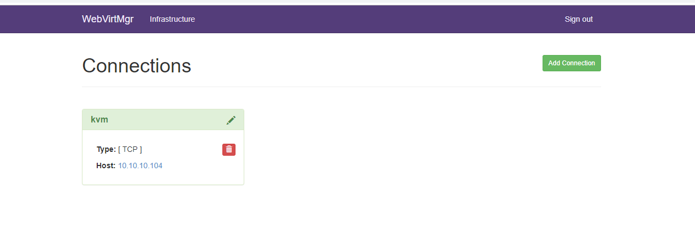


<a name="vmxml"></a>
## 5, Tạo máy ảo bằng file XML trên webvirt

Bước 1: Tạo một ổ đĩa cho máy ảo khai báo dung lượng và định dạng là raw

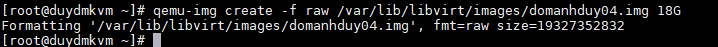

Bước 2: Tạo uuid

```
yum install uuid -y

uuid
```


Bước 3: Chuẩn bị file XML

```
<domain type='kvm'>
  <name>domanhduy0404</name>
  <uuid>4c487f14-dcc0-11e8-9b54-000c29863449</uuid>
  <memory unit='KiB'>2097152</memory>
  <currentMemory unit='KiB'>1048576</currentMemory>
  <vcpu placement='static'>5</vcpu>
  <os>
    <type arch='x86_64' machine='pc-i440fx-rhel7.0.0'>hvm</type>
    <boot dev='cdrom'/>
  </os>
  <features>
    <acpi/>
    <apic/>
  </features>
  <cpu mode='custom' match='exact' check='partial'>
    <model fallback='allow'>SandyBridge</model>
  </cpu>
  <clock offset='utc'>
    <timer name='rtc' tickpolicy='catchup'/>
    <timer name='pit' tickpolicy='delay'/>
    <timer name='hpet' present='no'/>
  </clock>
  <on_poweroff>destroy</on_poweroff>
  <on_reboot>restart</on_reboot>
  <on_crash>destroy</on_crash>
  <pm>
    <suspend-to-mem enabled='no'/>
    <suspend-to-disk enabled='no'/>
  </pm>
  <devices>
    <emulator>/usr/libexec/qemu-kvm</emulator>
    <disk type='file' device='disk'>
      <driver name='qemu' type='raw'/>
      <source file='/var/lib/libvirt/images/domanhduy04.img'/>
      <target dev='vda' bus='virtio'/>
      <address type='pci' domain='0x0000' bus='0x00' slot='0x07' function='0x0'/>
    </disk>
    <disk type='file' device='cdrom'>
      <driver name='qemu' type='raw'/>
	  <source file="/var/lib/libvirt/images/CentOS-7-x86_64-Minimal-1804.iso"/>
      <target dev='hda' bus='ide'/>
      <readonly/>
      <address type='drive' controller='0' bus='0' target='0' unit='0'/>
    </disk>
    <controller type='usb' index='0' model='ich9-ehci1'>
      <address type='pci' domain='0x0000' bus='0x00' slot='0x05' function='0x7'/>
    </controller>
    <controller type='usb' index='0' model='ich9-uhci1'>
      <master startport='0'/>
      <address type='pci' domain='0x0000' bus='0x00' slot='0x05' function='0x0' multifunction='on'/>
    </controller>
    <controller type='usb' index='0' model='ich9-uhci2'>
      <master startport='2'/>
      <address type='pci' domain='0x0000' bus='0x00' slot='0x05' function='0x1'/>
    </controller>
    <controller type='usb' index='0' model='ich9-uhci3'>
      <master startport='4'/>
      <address type='pci' domain='0x0000' bus='0x00' slot='0x05' function='0x2'/>
    </controller>
    <controller type='pci' index='0' model='pci-root'/>
    <controller type='ide' index='0'>
      <address type='pci' domain='0x0000' bus='0x00' slot='0x01' function='0x1'/>
    </controller>
    <controller type='virtio-serial' index='0'>
      <address type='pci' domain='0x0000' bus='0x00' slot='0x06' function='0x0'/>
    </controller>
    <interface type='bridge'>
      <mac address='52:54:00:5d:bf:2f'/>
      <source bridge='br0'/>
      <model type='virtio'/>
      <address type='pci' domain='0x0000' bus='0x00' slot='0x03' function='0x0'/>
    </interface>
    <serial type='pty'>
      <target type='isa-serial' port='0'>
        <model name='isa-serial'/>
      </target>
    </serial>
    <console type='pty'>
      <target type='serial' port='0'/>
    </console>
    <channel type='unix'>
      <target type='virtio' name='org.qemu.guest_agent.0'/>
      <address type='virtio-serial' controller='0' bus='0' port='1'/>
    </channel>
    <channel type='spicevmc'>
      <target type='virtio' name='com.redhat.spice.0'/>
      <address type='virtio-serial' controller='0' bus='0' port='2'/>
    </channel>
    <input type='tablet' bus='usb'>
      <address type='usb' bus='0' port='1'/>
    </input>
    <input type='mouse' bus='ps2'/>
    <input type='keyboard' bus='ps2'/>
    <graphics type='spice' autoport='yes'>
      <listen type='address'/>
      <image compression='off'/>
    </graphics>
    <sound model='ich6'>
      <address type='pci' domain='0x0000' bus='0x00' slot='0x04' function='0x0'/>
    </sound>
    <video>
      <model type='qxl' ram='65536' vram='65536' vgamem='16384' heads='1' primary='yes'/>
      <address type='pci' domain='0x0000' bus='0x00' slot='0x02' function='0x0'/>
    </video>
    <redirdev bus='usb' type='spicevmc'>
      <address type='usb' bus='0' port='2'/>
    </redirdev>
    <redirdev bus='usb' type='spicevmc'>
      <address type='usb' bus='0' port='3'/>
    </redirdev>
    <memballoon model='virtio'>
      <address type='pci' domain='0x0000' bus='0x00' slot='0x08' function='0x0'/>
    </memballoon>
  </devices>
</domain>
```

Bước 4: Tạo trên giao diện webvirt

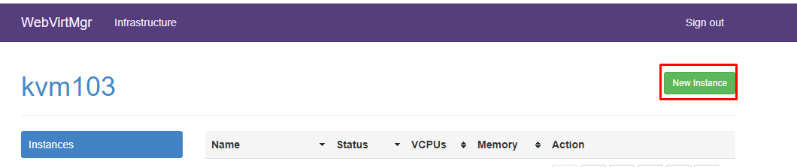

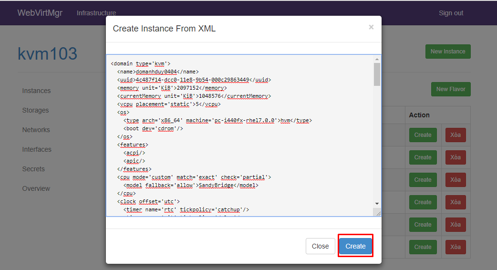

Với những gì đã khai báo ở file XML webvirt sẽ load lên đúng với cấu hình

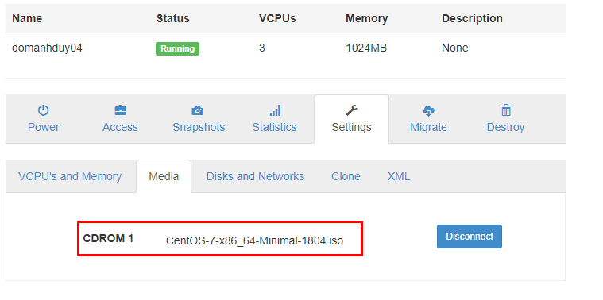

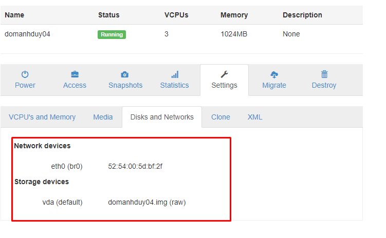

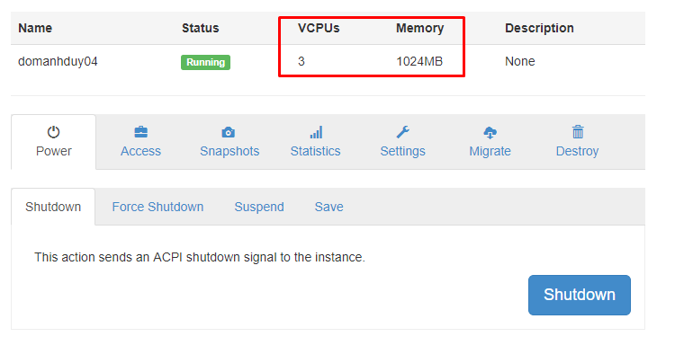

- Start instance lên và cài đặt bình thường


<a name="thamkhao"></a>
## 5, Link tham khảo

https://github.com/retspen/webvirtmgr/wiki/Install-WebVirtMgr

https://github.com/doxuanson/thuctap012017/blob/master/XuanSon/Virtualization/Virtual%20Machine/KVM/Tool%20use%20KVM.md#3.3

https://github.com/meditechopen/meditech-thuctap/blob/master/MinhNV/KVM/docs/th%E1%BB%B1c%20h%C3%A0nh/install_webvirt_U14.md
