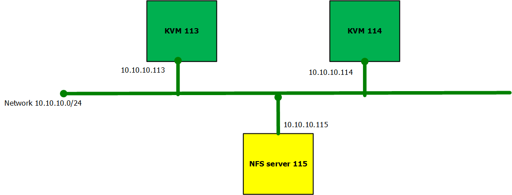
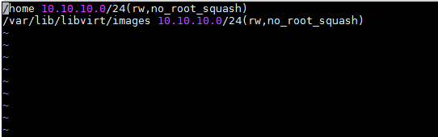
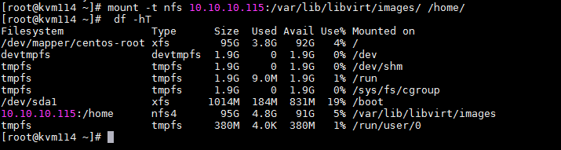
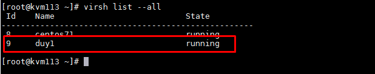
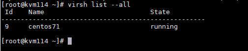
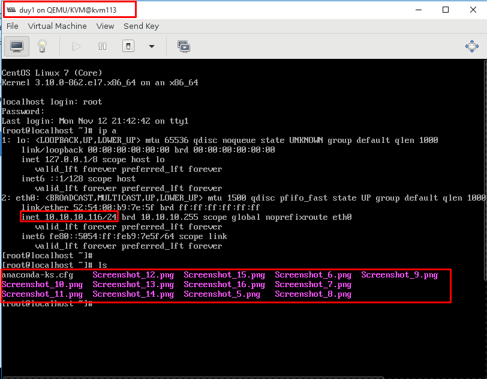
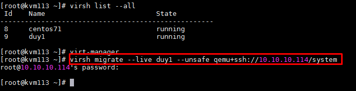
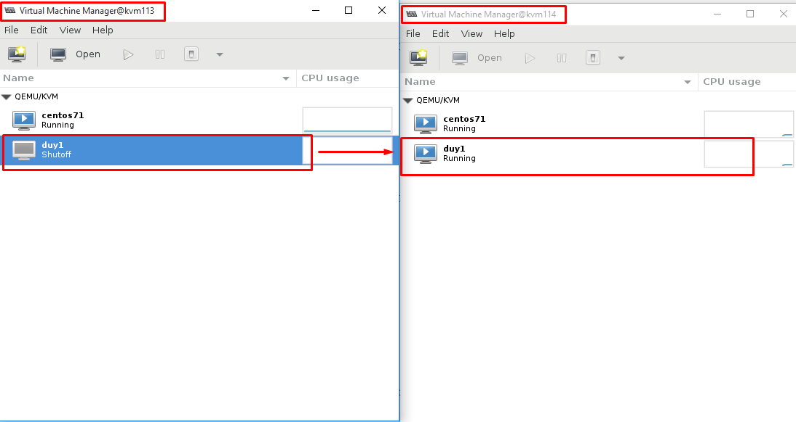
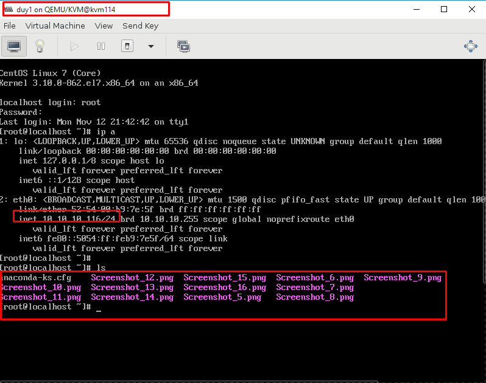

# LAB Live Migration

### Mục lục

[1. Mô hình ](#plan)

[2. Cơ chế và cấu hình](#coche)

[3. Live Migration](#live)

<a name="plan"></a>
## 1. Mô hình



<a name="coche"></a>
##2. Config server

- Cơ chế cơ bản của live-migrate: Về cơ bản cơ chế di chuyển vm khi vm vẫn đang hoạt động. Quá trình trao đổi diễn ra nhanh các phiên làm việc kết nối hầu như không cảm nhận được sự gián đoạn nào. Quá trình Live Migrate được diễn ra như sau: 

	+ Bước đầu tiên của quá trình Live Migrate 1 ảnh chụp ban đầu của VM cần chuyển trên host KVM113 được chuyển sang VM trên host KVM114. 
	
	+ Trong trường hợp người dùng đang truy cập VM tại host KVM113 thì những sự thay đổi và hoạt động trên host KVM113 vẫn diễn ra bình thường, tuy nhiên những thay đổi này sẽ không được ghi nhận. 
	
	+ Những thay đổi của VM trên host KVM113 được đồng bộ liên tục đến host KVM114.
	
	+Khi đã đồng bộ xong thì VM trên host KVM113 sẽ offline và các phiên truy cập trên host KVM113 được chuyển sang host KVM114.

- Cấu hình 2 server KVM để thực hiện migration

+ Thực hiện cấu hình KVM server theo hướng dẫn sau: [Hướng dẫn cài đặt KVM](https://github.com/domanhduy/ghichep/blob/master/DuyDM/KVM/docs/Install-KVM-server.md)

+ Thực hiện cấu hình NFS server làm store chung cho 2 host KVM.

Cài đặt NFS Server 10.10.10.115

```
yum -y install nfs-utils
```

Chỉnh sửa file etc/exports

```
vi /etc/exports

Thêm dòng sau

/var/lib/libvirt/images 10.10.10.0/24(rw,no_root_squash)

systemctl start rpcbind nfs-server
systemctl enable rpcbind nfs-server 
```




Thực hiện cài đặt trên cả 2 KVM host 10.10.10.113, 10.10.10.114 (NFS Client)

```
yum -y install nfs-utils
systemctl start rpcbind 
systemctl enable rpcbind 
```

Mount thư mục chưa máy ảo /var/lib/libvirt/images/ trên host KVM vào 1 thư mục chung trên NFS server

```
mount -t nfs 10.10.10.115:/var/lib/libvirt/images/ /home/
```



<a name="live"></a>
## 3. Live Migration

Trên host KVM 113 có một máy ảo đang chạy bình thường được set IP là 10.10.10.116

Trong quá trình tạo VM trên host cần phải chọn chế độ Cache=none ( chọn chế độ này với mục đích các tiến trình trên VM sẽ không được cache trên Ram vật lý nên sẽ không bị mất thông tin khi Migrate sang host khác).





+ Sử dụng lệnh sau để migration sang host KVM 114

```
virsh migrate --live duy1 --unsafe qemu+ssh://10.10.10.114/system
```



+ Lúc chuyển xong VM trên host KVM 113 được live-migrate sẽ ở trạng thái shutoff và sang host KVM114 ở trạng thái running.



+ VM đã sang host KVM114 vẫn giữ được ip và dữ liệu như cũ.



## 4. Tham khảo
https://github.com/hocchudong/KVM-QEMU


