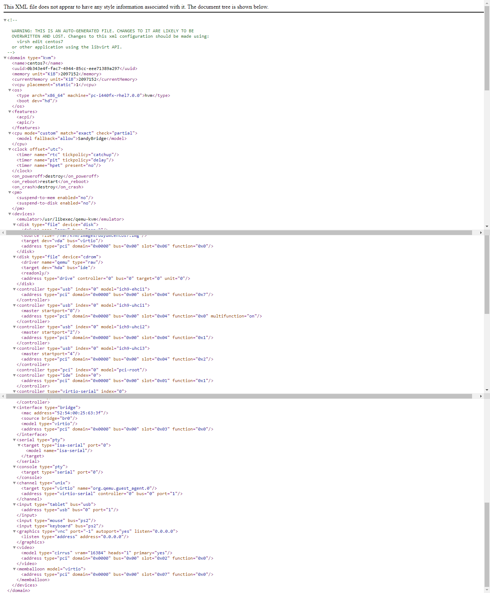
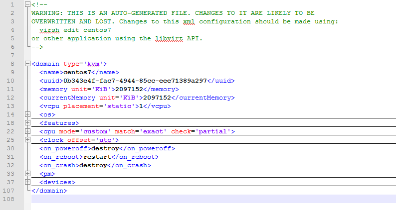

# Tìm hiểu về file XML trong KVM

### Mục lục

[1. Tổng quan về file XML](#tongquan)

[2. Các thành phần của file XML](#thanhphan)

[3. Tạo máy ảo từ file XML](#vmxml)

<a name="tongquan"></a>

## 1, Tổng quan về file XML

- VM trong KVM có hai thành phần chính đó là VM's definition được lưu dưới dạng file XML mặc định ở thư mục /etc/libvirt/qemu và VM's storage lưu dưới dạng file image.

- File domain XML chứa những thông tin về thành phần của máy ảo (số CPU, RAM, các thiết lập của I/O devices...)

- libvirt dùng những thông tin này để tiến hành khởi chạy tiến trình QEMU-KVM tạo máy ảo.

- KVM cũng có các file XML khác để lưu các thông tin liên quan tới network, storage...

- Mục đích chính của XML là đơn giản hóa việc chia sẻ dữ liệu giữa các hệ thống khác nhau, đặc biệt là các hệ thống được kết nối với Internet.




<a name="thanhphan"></a>
## 2, Các thành phần của file XML

File xml nhìn cơ bản có thể thấy tổ chức theo khối lệnh, có nhiều khối lệnh cùng trong 1 khối lệnh tổng quan, cú pháp giống HTML có thẻ đóng, thẻ mở.



Thẻ quan trọng không thể thiếu trong file domain xml là `domain`

+ Tham số `type` cho biết hypervisor đang sử dụng của VM.

- Các tham số bên trong có ý nghĩa như sau:

`name` thông tin về tên VM

```sh
<name>centos7</name>
```

- `uuid` : Mã nhận dạng quốc tế duy nhất cho máy ảo. Format theo RFC 4122. Nếu thiếu trường uuid khi khởi tạo, mã này sẽ được tự động generate.

```sh
<uuid>0b343e4f-fac7-4944-85cc-eee71389a297</uuid>
```

