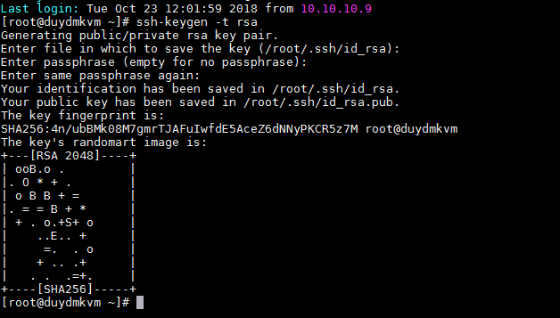
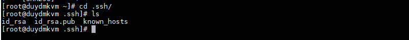
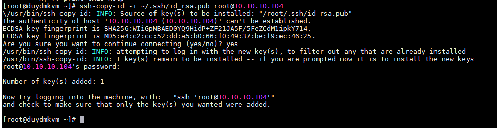
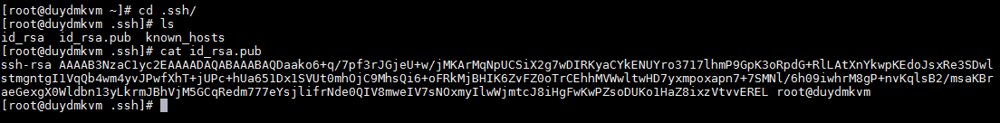
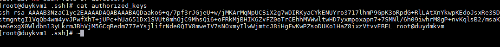

# Tìm hiểu về SSH key


### Mục lục

[1. Tổng quan](#tongquan)

[2. Thành phần](#thanhphan)

[3 . Sử dụng key trong SSH](#sudung)

[4. Tắt tính năng sử dụng pass ssh mà chỉ cho sử dụng ssh key](#ssh)

<a name="tongquan"></a>
## 1. Tổng quan

Về bản chất ssh key trong Linux sử dụng mã hóa khóa công khai sử dụng cặp khóa private và public key trong xác thực và phân quyền.

SSH key sinh ra một cặp key được dùng để mã hóa bất đối xứng, gồm có public key và private key. SSH key không dùng để mã hóa nội dung nào cả, mà chỉ dùng để xác minh quyền truy cập (cụ thể ở trong ngữ cảnh tìm hiểu là SSH vào server)


- Việc sử dụng password mỗi khi login vào server tiềm tàng một số nguy cơ:

+ Người sử dụng phải nhớ password

+ Dễ bị tấn công từ điển, vét cạn mật khẩu.

+ Một sô nguy cơ bị lộ mật khẩu

<a name="thanhphan"></a>
## 2. Thành phần

Khi tạo ra một SSH Key về cơ bản có 3 thành phần quan trọng như sau:

+ Public Key (dạng file và string) – Copy ký tự key này vào file ~/.ssh/authorized_keys trên server muốn shh key tới.

+ Private Key (dạng file và string) – Lưu file này vào máy tính, sau đó sẽ thiết lập cho PuTTY, WinSCP, MobaXterm,..để có thể login.

+ Keypharse (dạng string, cần ghi nhớ) – Mật khẩu để mở private key, nếu khai báo tham số này khi đăng nhập vào server nó sẽ hỏi cái này.

<a name="sudung"></a>
## 3 . Sử dụng key trong SSH

Có thể sử dụng key theo hai cách:

+ Cách 1: Từ SRV1 genkey và copy public key sang SRV2, SRVn...

+ Cách 2: Từ SRV2 genkey và copy private key sang SRV2

Lưu ý: 

	Copy-id public key, private vào đúng thư mục.
	
	Với cặp key được sịnh ra bởi user root thì public key sẽ được gửi đi (SRV1),nhưng nếu server muốn ssh tới (SRV2) có nhiều user thì sẽ cần thêm key cho tất cả user đó.

Hai cách trên đều có thể sử dụng ssh key nhưng chỉ sử dụng cách 1, vì private key là chìa khóa để giải mã tuyệt đối không được truyền trên đường truyền internet sẽ có nguy cơ bị chặn bắt trên đường truyền mất private key thuật toán mã hóa sẽ không an toàn.

Mô hình


### 3.1. Trường hợp sử dụng user root (SRV1) để gen key

Bước 1: Login với user roor -> Tạo key trên server SRV1 - 10.10.10.103

```sh
ssh-keygen -t rsa
```
Trong trường hợp nhập passphrase, thì dù người khác có copy được cặp key của bạn cũng không thể dùng được vì phải biết mật khẩu nữa. Có thể lựa chọn passphrase là empty.



- Cặp key được tạo ra



Bước 2: Copy public key sang server muốn remote

```sh
ssh-copy-id -i ~/.ssh/id_rsa.pub root@10.10.10.104

```

Mặc định khi sử dụng lệnh này để copy key thì nội dung public key sẽ được ghi vào file ~/.ssh/authorized_keys



Bước 3: Kiểm tra key được copy sang server remote






Public key được copy sang server remote ok .

Bước 3: SSH sang server không cân nhập password


Lúc này ta đứng từ user root của SRV1 ssh sang SRV2 không cần nhập pass.

<a name="ssh"></a>
## 4. Tắt tính năng sử dụng pass ssh mà chỉ cho sử dụng ssh key


