# Một số lệnh cơ bản nhất trong Linux

### Mục lục

[1. Cấu trúc thư mục của Linux](#cautruc)

[2. Một số command basic](#commandbasic)


<a name="cautruc"></a>
## 1. Cấu trúc thư mục của Linux

Nhìn chung cấu trúc chung của một hệ điều hành nhân Linux thường có cấu trúc thư mục như sau


- / - Root

Đúng với tên gọi của mình: nút gốc (root) đây là nơi bắt đầu của tất cả các file và thư mục. Chỉ có root user mới có quyền ghi trong thư mục này. Chú ý rằng /root là thư mục home của root user chứ không phải là /.

- /bin - Chương trình của người dùng

Thư mục này chứa các chương trình thực thi. Các chương trình chung của Linux được sử dụng bởi tất cả người dùng được lưu ở đây. Ví dụ như: ps, ls, ping...

- /sbin - Chương trình hệ thống

Cũng giống như /bin, /sbinn cũng chứa các chương trình thực thi, nhưng chúng là những chương trình của admin, dành cho việc bảo trì hệ thống. Ví dụ như: reboot, fdisk, iptables...

- /etc - Các file cấu hình

Thư mục này chứa các file cấu hình của các chương trình, đồng thời nó còn chứa các shell script dùng để khởi động hoặc tắt các chương trình khác. Ví dụ: /etc/resolv.conf, /etc/logrolate.conf

- /dev - Các file thiết bị

Các phân vùng ổ cứng, thiết bị ngoại vi như USB, ổ đĩa cắm ngoài, hay bất cứ thiết bị nào gắn kèm vào hệ thống đều được lưu ở đây. Ví dụ: /dev/sdb1 là tên của USB bạn vừa cắm vào máy, để mở được USB này bạn cần sử dụng lệnh mount với quyền root: # mount /dev/sdb1 /tmp

- /tmp - Các file tạm

Thư mục này chứa các file tạm thời được tạo bởi hệ thống và các người dùng. Các file lưu trong thư mục này sẽ bị xóa khi hệ thống khởi động lại.

- /proc - Thông tin về các tiến trình

Thông tin về các tiến trình đang chạy sẽ được lưu trong /proc dưới dạng một hệ thống file thư mục mô phỏng. Ví dụ thư mục con /proc/{pid} chứa các thông tin về tiến trình có ID là pid (pid ~ process ID). Ngoài ra đây cũng là nơi lưu thông tin về về các tài nguyên đang sử dụng của hệ thống như: /proc/version, /proc/uptime...

- /var - File về biến của chương trình
Thông tin về các biến của hệ thống được lưu trong thư mục này. Như thông tin về log file: /var/log, các gói và cơ sở dữ liệu /var/lib...

- /usr - Chương trình của người dùng

Chứa các thư viện, file thực thi, tài liệu hướng dẫn và mã nguồn cho chương trình chạy ở level 2 của hệ thống. Trong đó
+ /usr/bin chứa các file thực thi của người dùng như: at, awk, cc, less... Nếu không tìm thấy chúng trong /bin hãy tìm trong /usr/bin
+ /usr/sbin chứa các file thực thi của hệ thống dưới quyền của admin như: atd, cron, sshd... Nếu không tìm thấy chúng trong /sbin thì hãy tìm trong thư mục này.
+ /usr/lib chứa các thư viện cho các chương trình trong /usr/bin và /usr/sbin
+ /usr/local chứa các chương tình của người dùng được cài từ mã nguồn. Ví dụ như cài apache từ mã nguồn, nó sẽ được lưu dưới /usr/local/apache2

- /home - Thư mục người của dùng

Thư mục này chứa tất cả các file cá nhân của từng người dùng. Ví dụ: /home/duydm

- /boot - Các file khởi động

Tất cả các file yêu cầu khi khởi động như initrd, vmlinux. grub được lưu tại đây. Ví dụ vmlixuz-2.6.32-24-generic

- /lib - Thư viện hệ thống

Chứa cá thư viện hỗ trợ cho các file thực thi trong /bin và /sbin. Các thư viện này thường có tên bắt đầu bằng ld* hoặc lib*.so.*. Ví dụ như ld-2.11.1.so hay libncurses.so.5.7

- /opt - Các ứng dụng phụ tùy chọn

Tên thư mục này nghĩa là optional (tùy chọn), nó chứa các ứng dụng thêm vào từ các nhà cung cấp độc lập khác. Các ứng dụng này có thể được cài ở /opt hoặc một thư mục con của /opt

- /mnt - Thư mục để mount

Đây là thư mục tạm để mount các file hệ thống. Ví dụ như # mount /dev/sda2 /mnt

- /media - Các thiết bị gắn có thể gỡ bỏ

Thư mục tạm này chứa các thiết bị như CdRom /media/cdrom. floppy /media/floopy hay các phân vùng đĩa cứng /media/Data (hiểu như là ổ D:/Data trong Windows)

- /srv - Dữ liệu của các dịch vụ khác

Chứa dữ liệu liên quan đến các dịch vụ máy chủ như /srv/svs, chứa các dữ liệu liên quan đến CVS.

<a name="commandbasic"></a>
## 2. Một số command basic

- Chường trình thực thi các gói cài đặt (tương tự nơi cài đặt các gói phần mềm trong windows)

Các chương trình thực thi nên ở các thư mục:

```
/bin
/usr/bin
/sbin
/usr/sbin
/opt
```

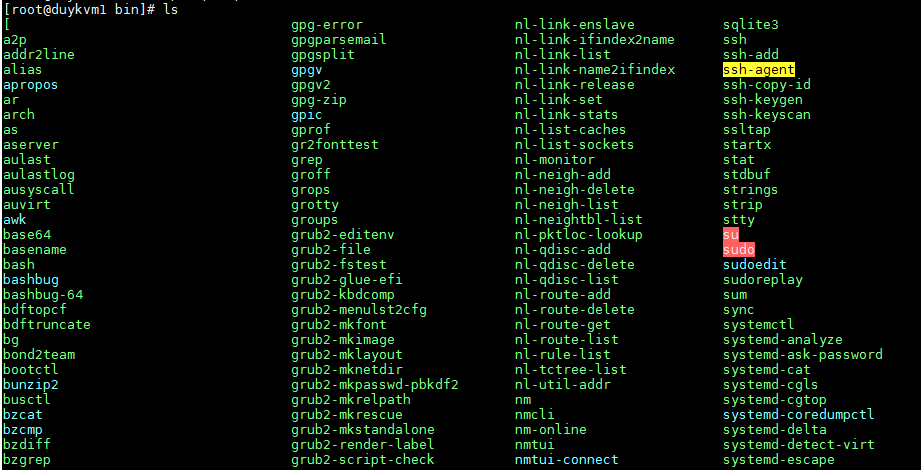

+Xác định chương trình thực thi trong file hệ thống sử dụng lệnh

```
which <ten_chuong_trinh>
```

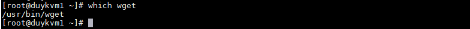

+Tìm kiếm chính xác hơn trong toàn bộ hệ thống file

```
whereis <ten_chuong_trinh>
```

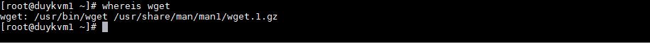

- Thao tác chuyển đổi cấp bậc trong cây thư mục.

Ở vị trí dấu nhắc hiện tại ta có thể chuyển tới một vị trí hay thư mục khác, lùi về thư mục cha...

```
cd		Chuyển về thư mục home
cd ..	Chuyển về thư mục cha
cd -	Chuyển về thư mục vừa rời đi trước đó
cd /	Chuyển đến thư mục root(/)
cd /home/	Chuyển đến thư mục /home/
```

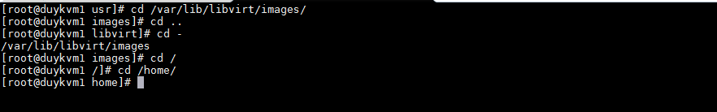

- Thao tác hiển thị cây thư mục hiện hành

```
ls	Liệt kê nội dung của thư mục đang hiện tại làm việc
ls -a	Liệt kê thêm các file ẩn
ls -la	Hiển thị thêm các thông tin chi tiết của file và thư mục
```

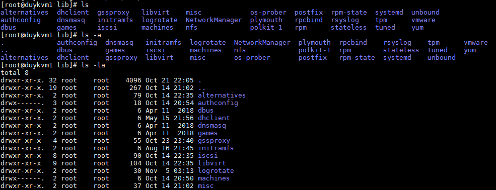

```
yum install tree -y
tree	Hiển thị cây thư mục của toàn bộ hệ thống filesystem
tree -d	Chỉ hiện thị cây các thư mục mà bỏ qua danh sách các file
```

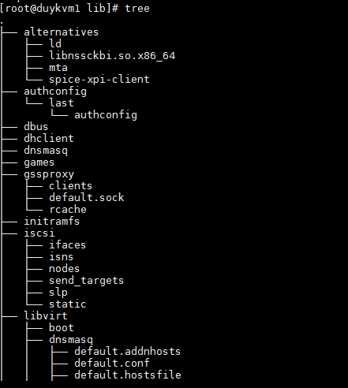

- Hard link và Symbolic link

Khác nhau giữa hard link và soft link

*)Hard link: Khi tạo ra một file mới hard link đến file cũ thì hai file này sẽ cùng tham chiếu tới 1 vùng nhớ chứa địa chỉ của data, nên khi thay đổi nội dung từ 1 file thì file kia cũng thay đổi theo và khi xóa file cũ đi thì file mới đó không ảnh hưởng.

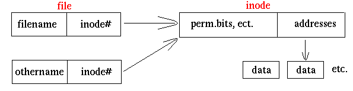


+Hard link là một liên kết (link) trỏ đến vị trí lưu một file trên ổ cứng:

Nếu đổi tên, xóa hoặc di chuyển file gốc sang thư mục khác, hard link vẫn mở được file đó vì nó vẫn trỏ đến vị trí lưu file cố định trên ổ cứng.

Tên hard link có thể khác tên file gốc, hard link có thể nằm trong một thư mục khác với thư mục của file gốc. Vì vậy một file có thể có nhiều tên file nằm ở các thư mục khác nhau. Khi truy cập vào hard link (ví dụ nhấn chuột) sẽ truy cập đến file (mở hoặc chạy).

Nếu đồng thời mở một file từ các hard link và tên file gốc, khi sửa ở một bản, các bản khác cũng sẽ thay đổi theo sau khi refresh hoặc reload vì thực chất là sửa trên cùng một file.

Nếu xóa hard link hoặc xóa tên file gốc nhưng còn một hard link, file vẫn không bị xóa. File chỉ bị xóa khi không còn cái gì trỏ đến vị trí lưu nó. Như vậy muốn xóa một file, phải xóa tên file và tất cả các hard link của nó.

Hard link không tạo được với thư mục và không tạo được với file nằm trên một partition khác.

Hard link được tạo bởi lệnh ln: ln <path/tên file> <tên hard link>.


*)Soft link: Khi tạo 2 file soft link tới nhau thì file mới sẽ trỏ tới vùng địa chỉ của file mới, nên khi xóa file cũ đi, file mới sẽ không thể truy cập đến dữ liệu được nữa. Đơn giản soft link là một liên kết tạo một đường dẫn khác đến thư mục hoặc file gốc.

Softlink tạo được với thư mục, file nằm trên partition khác.

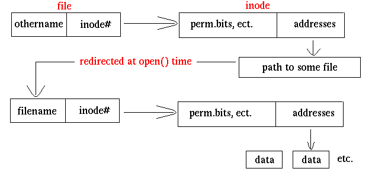

Command `ln`  sử dụng để tạo hard link hoặc soft link, cũng như symnolic link hoặc symlink.

+Hard link
Có duy1.txt tạo hard link là file duy2.txt

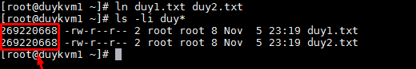

Thay đổi nội dung file duy1.txt thì file duy2.txt cũng thay đổi nội dung

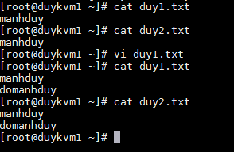


Xóa file cũ duy1.txt đi thì file duy2.txt không bị tác động.

+Soft link

```
ln -s filegoc filelink
```
Có 1 file duy1.txt thực hiện soft link

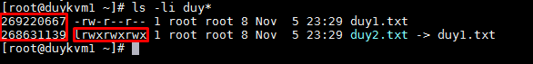

2 file tham chiếu tới 2 vùng nhớ khác nhau và quyền của file tạo ra luôn là `lrwxrwxrwx `

Thay đổi nội dung một file thì file kia cũng thay đổi

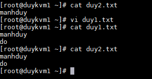

Xóa file cũ thì file mới không còn truy cập được.

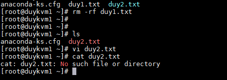


