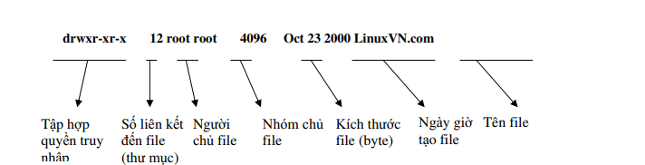

# File Permissions

### Mục lục

[1. File Permissions](#file)

[2. Thay đổi quyền sở hữu file với lệnh chown](#chown)

[3. Thay đổi quyền truy cập file với lệnh chmod](#chmod)

<a name="file"></a>
## 1. File Permissions

Trong Linux mỗi file đều có một user sở hữu gọi là owner. Mỗi file cũng sẽ có một group sở hữu, những người trong group này có các permission nhất định: read, write và execute.

Mỗi file và thư mục trong Linux đều có một chủ sở hữu và một nhóm sở hữu, cũng như một tập hợp các quyền truy nhập. Cho phép thay đổi các quyền truy nhập và quyền sở hữu file và thư mục nhằm cung cấp truy nhập nhiều hơn hay ít hơn.

Linux có 3 nhóm phân quyền chính, không bao nhau:

```
Owner: chỉ cấp quyền cho chủ sở hữu của file.
Group: chỉ cấp quyền cho nhóm sở hữu của file.
Other: cấp quyền cho những người dùng và nhóm không thuộc 2 nhóm trên.
```

- Thông tin về một file có dạng sau



Trong đó, dãy 10 ký tự đầu tiên mô tả kiểu file và quyền truy nhập đối với tập tin đó. Theo mặc định, người dùng tạo một file chính là người chủ (sở hữu) của file đó và là người có quyền sở hữu nó. Người chủ của file có đặc quyền thay đổi quyền truy nhập hay quyền sở hữu đối với file đó. Tất nhiên, một khi đã chuyển quyền sở hữu của mình cho người dùng khác thì người chủ cũ không được phép chuyển quyền sở hữu và quyền truy nhập được nữa.

Tập hợp một chuỗi có 10 ký tự đã giới thiệu trên đây được chia ra làm 4 phần: kiểu file,các quyền truy nhập đến file của chủ sở hữu, của nhóm sở hữu và người dùng khác.

Có một số kiểu file trong Linux. Ký tự đầu tiên trong tập hợp 10 ký tự mô tả kiểu file và quyền truy nhập sẽ cho biết file thuộc kiểu nào (chữ cái đó được gọi là chữ cái biểu diễn). 

+ Bảng dưới đây sẽ liệt kê các kiểu file trong Linux:

|Chữ cái biểu diễn|Kiểu file|
|-------|-----------|
|d|Thư mục (directory)|
|b|File kiểu khối (block-type special file)|
|c|File kiểu ký tự (character-type special file)|
|l|Liên kết tượng trưng (symbolic link)|
|p|File đường ống (pipe)|
|s|Socket|
|-|File bình thường (regular file)|

+ Có ba loại quyền truy nhập chính đối với thư mục/file, đó là: đọc (read - r), ghi (write - w) và thực hiện (execute - x).

Quyền đọc cho phép người dùng có thể xem nội dung của file với rất nhiều chương trình khác nhau, nhưng họ sẽ không thể thay đổi, sửa chữa hoặc xóa bất kỳ thông tin nào trong đó. Tuy nhiên, họ có thể sao chép file đó thành file của họ và sửa chữa file bản sao. 

Quyền ghi là quyền truy nhập tiếp theo. Người sử dụng với quyền ghi khi truy nhập vào file có thể thêm thông tin vào file. Nếu có quyền ghi và quyền đọc đối với một file, có thể soạn thảo lại file đó - quyền đọc cho phép xem nội dung, và quyền ghi cho phép thay đổi nội dung file. Nếu chỉ có quyền ghi, sẽ thêm được thông tin vào file, nhưng lại không thể xem được nội dung của file. Loại quyền truy nhập thứ ba là quyền thực hiện, quyền này cho phép người dùng có thể chạy được file, nếu đó là một chương trình khả thi. 

Quyền thực hiện độc lập với các quyền truy nhập khác, vì thế hoàn toàn có thể có một chương trình với quyền đọc và quyền thực hiện, nhưng không có quyền ghi. Cũng có trường hợp một chương trình chỉ có quyền thực hiện, có nghĩa là người dùng có thể chạy ứng dụng, nhưng họ không thể xem được cách nó làm việc hay sao chép nó.

|Quyền truy nhập|Ý nghĩa|
|-------|-----------|
|---|Không cho phép một quyền truy nhập nào|
|r--|Chỉ được quyền đọc|
|r-x|Quyền đọc và thực hiện (cho chương trình và shell script)|
|rw-|Quyền đọc và ghi|
|rwx|Cho phép tất cả các quyền truy nhập (cho chương trình)|

Đối với thư mục thì chỉ có ba loại ký hiệu của các quyền truy nhập là: ---, rx và rwx, vì nội dung của thư mục là danh sách của các file và các thư mục con có bên trong thư mục đó. Quyền đọc một thư mục là được xem nội dung của thư mục đó và quyền thực hiện đối với một thư mục là quyền tìm được file và thư mục con có trong thư mục.

Sự hạn chế trường hợp về quyền truy nhập thư mục được giải thích như sau: 

	+ Giả sử chỉ có quyền đọc trên thư mục, khi đó sẽ xem được có những file hay thư mục nào trong thư mục nhưng lại không thể xem cụ thể nội dung của một file hay thư mục có trên thư mục đó vì không tìm được nó.
	
	+ Hoặc giả sử có quyền thực hiện - quyền này sẽ cho phép tìm được file có trên thư mục - nhưng lại không có quyền đọc đối với một thư mục.

<a name="chown"></a>
2. Thay đổi quyền sở hữu file với lệnh chown

Để thay đổi quyền sở hữu đối với một file, hãy sử dụng lệnh chown với cú pháp như sau:

```
chown [tùy chọn] [chủ][.nhóm] <file ...>
```

Lệnh này cho phép thay chủ sở hữu `file`. Nếu chỉ có tham số về `chủ`, thì người dùng chủ sẽ có quyền sở hữu file và nhóm sở hữu không thay đổi. Nếu theo sau tên người `chủ` là dấu "." và tên của một nhóm thì nhóm đó sẽ nhóm sở hữu file. Nếu chỉ có dấu "." và nhóm mà không có tên người chủ thì chỉ có quyền sở hữu nhóm của file thay đổi, lúc này, lệnh chown có tác dụng giống như lệnh chgrp (lệnh chgrp được trình bày dưới đây).
Các tùy chọn của lệnh chown:

```
-c, --changes : hiển thị dòng thông báo chỉ với các file mà lệnh làm thay đổi sở hữu (số thông báo hiện ra có thể ít hơn trường hợp -v, -verbosr).

-f, --silent, --quiet : bỏ qua hầu hết các thông báo lỗi.

-R, --recursive : thực hiện đổi quyền sở hữu đối với thư mục và file theo đệ quy.

-v, --verbose : hiển thị dòng thông báo với mọi file liên quan mà chown tác động tới (có hoặc không thay đổi sở hữu).

--help : đưa ra trang trợ giúp và thoát
```

<a name="chmod"></a>
## 3. Thay đổi quyền truy cập file với lệnh chmod

Cú pháp lệnh chmod có ba dạng:

```
chmod [tùy-chọn] <mod [,mod]...> <file...>
chmod [tùy-chọn] <mod-hệ-8> <file...>
chmod [tùy-chọn] --reference=nhómR <file...>
```

Lệnh chmod cho phép xác lập quyền truy nhập theo kiểu (mode) trên file. Dạng đầu tiên là dạng xác lập tương đối, dạng thứ hai là dạng xác lập tuyệt đối và dạng cuối cùng là dạng gián tiếp chỉ dẫn theo quyền truy nhập của file nhómR.
Các tùy chọn của lệnh chmod được liệt kê như dưới đây và có ý nghĩa tương tự các
tuỳ chọn tương ứng của các lệnh chown, chgrp:

```
	-c, --changes
	-f, --silent, --quiet
	-v, --verbose
	-R, --recursive
	--help
	và tham số --reference=RFILE cũng ý nghĩa gián tiếp như trong lệnh chgrp.
```
Giải thích về hai cách xác lập quyền truy nhập file trong lệnh chmod như sau: xác lập tuyệt đối (dùng hệ thống mã số viết theo hệ cơ số 8 biểu diễn cho các quyền truy nhập) và xác lập tương đối (dùng các chữ cái để biểu diễn quyền truy nhập).


