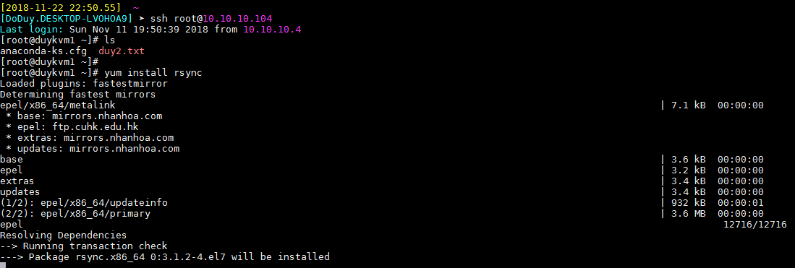
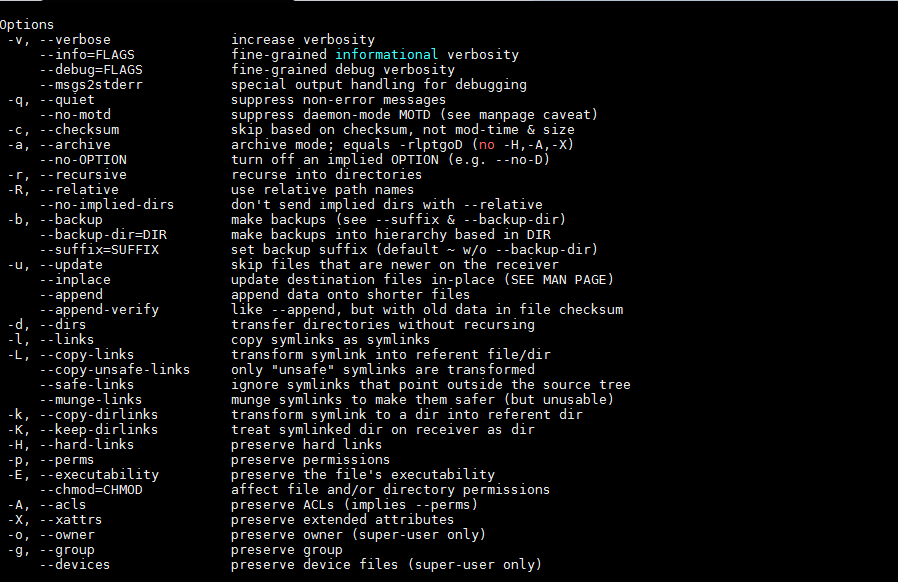
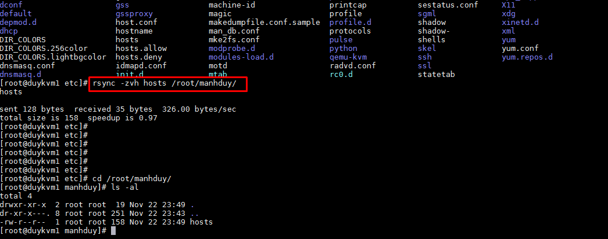
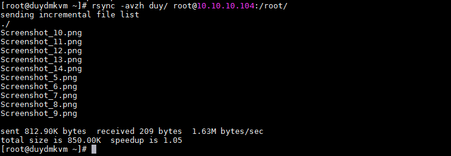
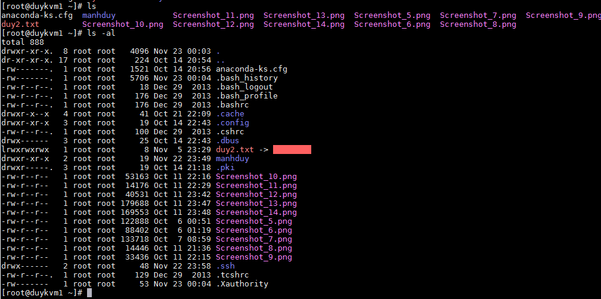

# Tìm hiểu về Synchronize data trong Linux

## 1. Khái quát

Rsync (Remote Sync) là một công cụ dùng để sao chép và đồng bộ file/thư mục được dùng rất phổ biến. Có thể dùng Rsync để đồng bộ dữ liệu trên local hoặc giữa các server với nhau một cách dễ dàng.

Rsync sử dụng thuật toán delta-copy (chỉ copy phần khác nhau) làm giảm số lượng dữ liệu gửi qua mạng bằng cách gửi chỉ những khác biệt giữa các tập tin nguồn và các tập tin hiện tại đích đến.

Rsync hỗ trợ copy giữ nguyên thông số của files/folder như Symbolic links, Permissions, TimeStamp, Owner và Group.

Rsync nhanh hơn scp vì Rsync sử dụng giao thức remote-update, chỉ transfer những dữ liệu thay đổi mà thôi.

Rsync tiết kiệm băng thông do sử dụng phương pháp nén và giải nén khi transfer.

Rsync không yêu cầu quyền super-user.

Rsync có 2 mode:
	+ Một là dùng như lệnh copy bình thường (ssh, rsh). 
	
	+ Hai là chạy deamon (hay gọi là service). Rsync daemon mặc định bind đến cổng 873. Khi chạy ở daemon mode, rsync có thể hoạt động giống 1 ftp server, tức cho phép download file public. Config rsync daemon được thực hiện trong file rsyncd.conf. Rsync daemon mặc định bind đến cổng 873
	


## 2. Cài đặt và thực hiện rsync

```
yum install rsync
```



- Cấu trúc lệnh cơ bản

```
rsync options source destination

Source: dữ liệu nguồn
Destination: dữ liệu đích
Options: một số tùy chọn thêm

```

+Tham số tùy chọn

```
-v: hiển thị trạng thái kết quả
-r: copy dữ liệu recursive (dạng đệ quy), nhưng không đảm bảo thông số của file và thư mục
-a: cho phép copy dữ liệu recursive (dạng đệ quy), đồng thời giữ nguyên được tất cả các thông số của thư mục và file
-z: nén dữ liệu khi transfer, tiết kiệm băng thông tuy nhiên tốn thêm thời gian
-h: human-readable, output kết quả dễ đọc
--delete: xóa dữ liệu ở destination nếu source không tồn tại dữ liệu đó.
--exclude: loại trừ ra những dữ liệu không muốn truyền đi, nếu cần loại ra nhiều file hoặc folder ở nhiều đường dẫn khác nhau thì mỗi cái phải thêm --exclude tương ứng.
```


### 2.1. Rsync copy local trên server

```
rsync -zvh hosts /root/manhduy/
```



### 2.2. Rsync copy file và thư mục giữa các server

```
rsync -avzh duy/ root@10.10.10.104:/root/
```






