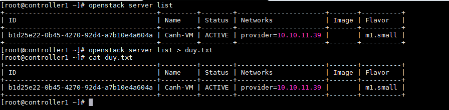
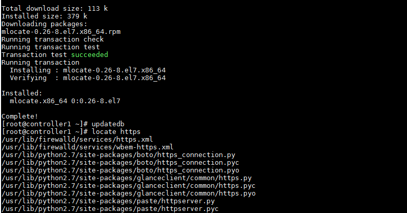

# Làm việc với file trong Linux

### Mục lục

[1. Luồng làm việc của file](#work)

[2. Tìm kiếm file](#search)

[3. Quản lý file](#mana)


<a name="work"></a>
## 1. Luồng làm việc của file

Khi các lệnh linux được thực thi, mặc định có 3 dòng dữ liệu file chuẩn luôn mở để sử dụng. 3 dòng dữ liệu (stream) cơ bản đó là stdin (0), stdout (1) và stderr (2)

```sh
	+ standard input or stdin	
	+ standard output or stdout
	+ standard error or stderr
```
Thông thường, stdin đơn giản hiểu là bàn phím, stdout là thiết bị đầu cuối (màn hình terminal), stderr thường chuyển hướng đến log file error.
 
	stdin (0): Thường là những thiết bị nhập input cho Shell ví dụ như bàn phím.
	
	stdout (1): Hiển thị kết quả các lệnh lên terminal (hoặc màn hình) cho chúng ta thấy.
	
	stderr (2): Hiển thị ra các lỗi trong quá trình thực hiện một lệnh hoặc một công việc nào đó.


- Chuyển hướng output

Có thể chuyển hướng các kết quả từ việc thực thi lệnh (stdout) bằng dấu lớn hơn “>“





Nếu file output đã có nội dung trong đó. Khi chuyển hướng stdout bằng dấu “>” thì nội dung trước đó của nó sẽ bị xoá sạch. Để tránh nội dung cũ của file output bị xoá nên sử dụng dấu “>>“. Dấu “>>” này được hiển là append, có nghĩa là nó sẽ viết thêm dữ liệu vào cuối file.


- Chuyển hướng error

Có thể chuyển hướng stderr (2) bằng dấu “2>“. Phương pháp chuyển hướng các lỗi khi thực hiện lệnh này có tác dụng tránh làm rối mắt hoặc làm phiền người dùng. Có thể chuyển hướng các thông báo lỗi tới một file text để sau này đọc dễ hơn. Hoặc là chuyển tới /dev/null không quan tâm tới nó nữa.

- Pipes

Pipes trong Linux được ký hiệu là dấu gạch đứng “|“. Pipes cho phép lấy kết quả của lệnh phía trước nó làm input cho lệnh phía sau nó.

<a name="search"></a>
## 2. Tìm kiếm file

- Locate

Chức năng "locate" trong Linux hỗ trợ tìm kiếm thông qua cơ sở dữ liệu và thư mục được xây dựng trước đó trên hệ thống. Tìm kiếm phù hợp với thư mục có chứa chuỗi ký tự chỉ định. Hầu hết hệ thống Linux chạy tự động cập nhật cơ sở dữ liệu một ngày một lần. Có thể cập nhật cơ sở dữ liệu bất cứ lúc nào bằng lệnh `updatedb`.

Cài đặt chức năng locate

``
yum install -y mlocate
updatedb
``


Thao tác với lệnh locate với nhiều option truyền vào.

``
locate -0 string : Hiển thị tất cả kết quả trên một dòng

locate -c string : Hiển thị số lượng các kết quả trả về.

locate -e string : Xem file có tồn tại hay không.

locate -l so string: Giới hạn số kết quả trả về.
``

<a name="mana"></a>
## 3. Quản lý file

|Lệnh|Sử dụng|
|-------|-----------|
|cat  |Được sử dụng để xem các tệp có nội dung ngắn|
|tac  |Được sử dụng để xem một tệp ngược, bắt đầu bằng dòng cuối cùng|
|less |Được sử dụng để xem các tệp lớn vì nó là một chương trình phân trang; nó tạm dừng ở mỗi màn hình văn bản, cung cấp khả năng cuộn lại và cho phép bạn tìm kiếm và điều hướng trong tệp|
|tail |Được sử dụng để in 10 dòng cuối cùng của một tệp theo mặc định. Bạn có thể thay đổi số dòng bằng cách thực hiện -n 15 hoặc chỉ -15 nếu bạn muốn xem 15 dòng cuối thay vì mặc định|
|head |Ngược lại với tail, in 10 dòng đầu tiên của file|
|touch|Tạo mới một file trống mới|
|mkdir|Tạo mới một thư mục trống|
|rmdir|Xóa một thư mục trống|


	
	