# Ghi chép training project keystone

Keystone là một project cung cấp các dịch vụ Identity, Token, Catalog, Policy cho các project khác trong OpenStack.

Hiểu đơn gian Keystone là một project có cung cấp 2 nhiệm vụ chính:

+ Xác thực người dùng đăng nhập (sử dụng username/password), xác định quyền của người dùng đối với hệ thống OpenStack

+ Xác thực giữa các project trong OpenStack (đơn giản là trường hợp khởi tạo máy ảo theo luồng phải có quá trình xác thực giữa các project với nhau - sử dụng token).

### 1. Thao tác kyestone trên CLI

Trong OpenStack để người dùng có thể thực hiện phải có 2 chủ thế là user, project và user phải được gắn vào project nào đó thì project đó mới có ý nghĩa còn không user và project chỉ là một phần tử trôi nổi trong OpenStack và không thực hiện được gì.

- Tạo sửa xóa user

Hiển thị toàn bộ project có trong hệ thống

```
openstack project list
```

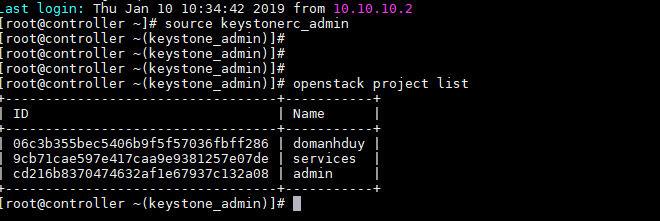

View chi tiết thông tin về một project nào đó có trong hệ thống

```
openstack project show <id>
```
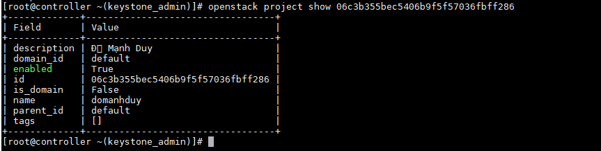

- Tạo, sửa, xóa project

+ Tạo

```
openstack project create
  [--description <description>]
  [--enable | --disable]
  <tên project>

  openstack project create --description DoDuy --enable duydm

```

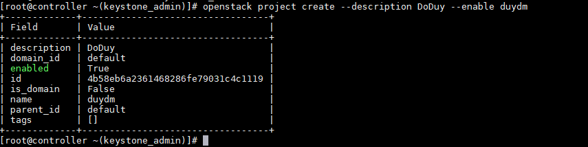

+ Sửa

VD: Sửa tên project

```
openstack project set --name manhduy(new) duydm(old)
```

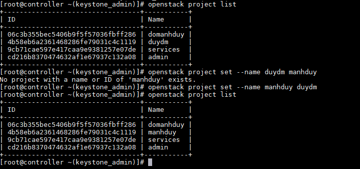

+ Xóa

```
openstack project delete manhduy/id
```

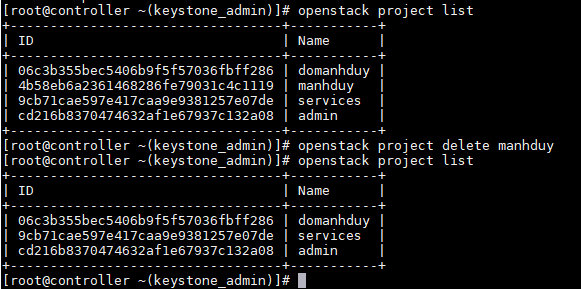

- Tạo, sửa, xóa user

+ Sửa

```
openstack user create 
   [--project <project>]
   [--password <password>] [--password-prompt]
   [--email <email-address>] [--enable | --disable] [--or-show]
   <tên user>
```

openstack user create --project domanhduy --password 0435626533a@ --enable kythuatduydm

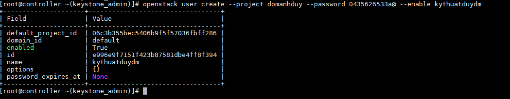

+ Sửa

```
openstack user set [--project <project>]
  [--password <user-password>] [--password-prompt]
  [--email <email-address>] [--enable | --disable]
  <tên user>
```
openstack user set  kythuatduydm --project domanhduy --email manhduy107@gmail.com 

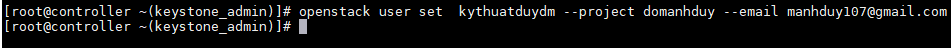

+ Xóa

```
openstack user delete <tên hoặc ID của user>
```

openstack user delete  kythuatduydm

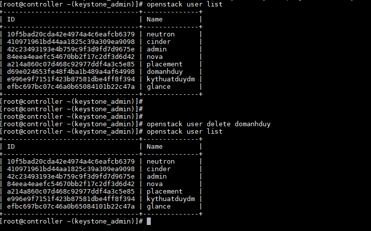

### 2. Gán/Hiển thị role của user trong OpenStack

+ Gán role

```
openstack role add --project <tên project> --user <tên user> tên role 
```

openstack role add --project domanhduy --user kythuatduydm admin

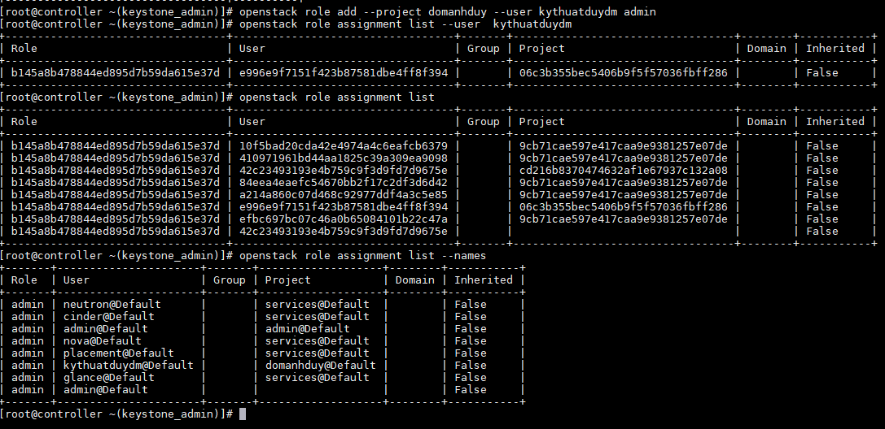

openstack role assignment list --names

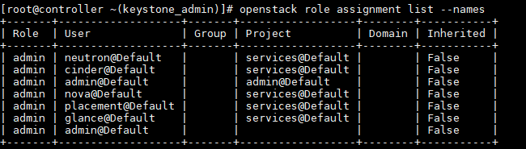

### 3. Đường dẫn và phân loại log của keystone

Project keystone được cài đặt trên máy chủ controller nên phải tìm kiếm log trên controller

```
cd /var/log/httpd

và 

cd /var/log/keystone
```

Có 2 thư mục log của keystone: httpd, keystone


log keystone: Cho ta những thông tin về quá trình tạo token xác thực người dùng login, quá trình tạo sửa xóa user, project, role, các thao tác đối với user, project, role.

httpd-keystone: Hiển thị log quá trình get thông tin bởi trình duyệt.

### 4. Truy cập và show database của keystone

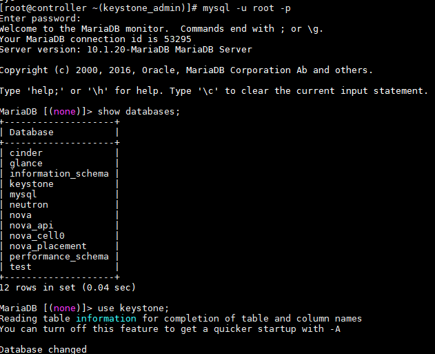

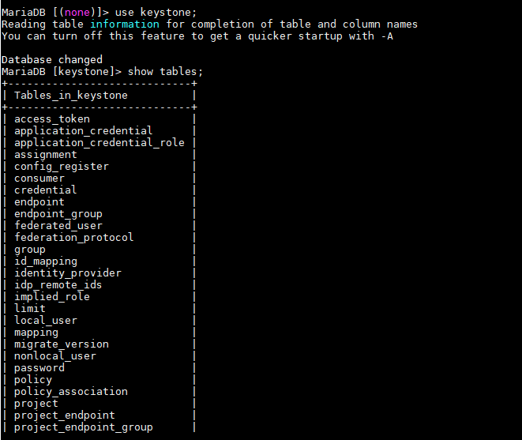

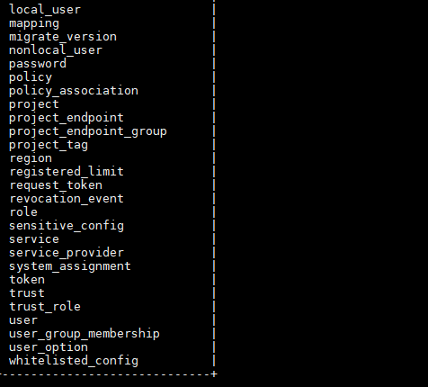


### 5. Ánh xạ việc tạo, sửa, xóa project, user với các dòng log tương ứng

- Tạo project

+ Tạo ra token

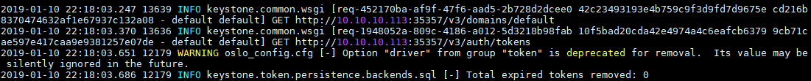

+ Tạo trong domain, có role nào.

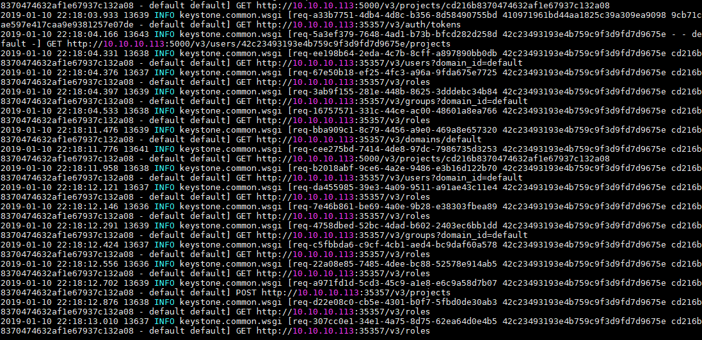


### 6. Các kiểu của token keystone

- UUID Tokens

- PKI Tokens

- Fernet Tokens

### 6. Tìm hiểu về cách phân quyền cho user và role thông qua file policy,json.

- Giới hạn quyền thao tác trên dashboard openstack

Trong packstack thư mục policy.json thường ở đây

```
cd /etc/openstack-dashboard/
```

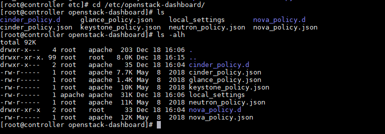


+ Tạo role mới

```
openstack role create duydddm
```

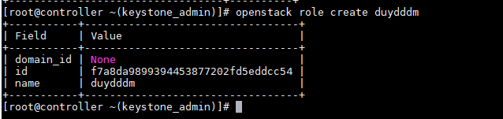

```

+ Tạo role

openstack user create duydddm --domain default --password duydddm
```

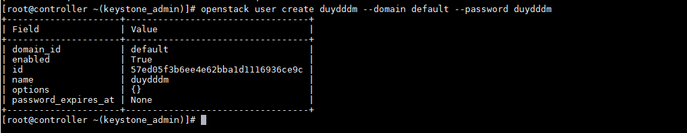

+ Để gán role `duydddm` cho user `duydddm` vào project domanhduy

```
openstack role add --user duydddm --user-domain default --project domanhduy --project-domain default duydddm
```
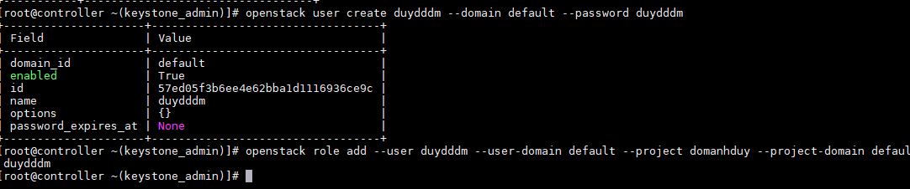

- Thực hiện đối với dạng câu lệnh

Tùy vào phiên bản OpenStack thì một số project có file policy.json, một số lại không có file policy.json muốn áp policy.jon cho project thì phải tạo file policy.jon trong /etc/project, phân quyền chown root:cinder policy.json

Restart service cinder, httpd.


