# Lab limit Bandwidth IO trên VM

Khi phát hiện 1 VPS có hiện tượng Bandwidth IO cao được phát hiện qua một số cách nhứ:

+ Có cảnh báo qua telegram về đường bond3 (CEPH-COM) traffic cao

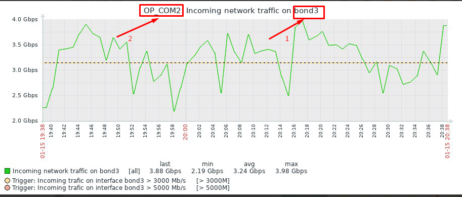

+ Kiểm tra các traffic qua biểu đổ

Traffic Port CEPH-COM to Compute 

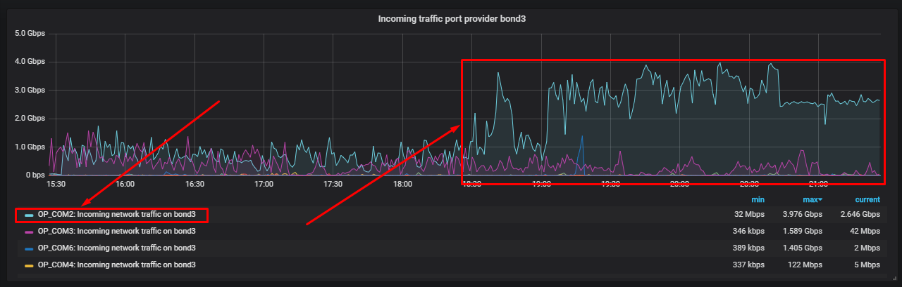

CEPH I/O Bandwidth 

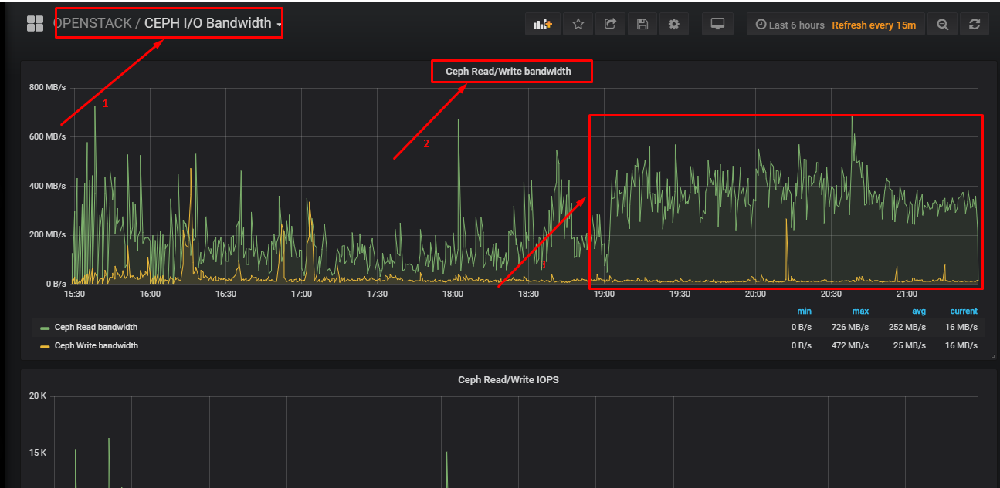

=> Xác định được VM ở COM nào đang gây ra hiện tượng I/O Bandwidth cao.

+ Xác định chính xác VM nào.

ssh vào COM đó sử dụng lệnh `virt-top`

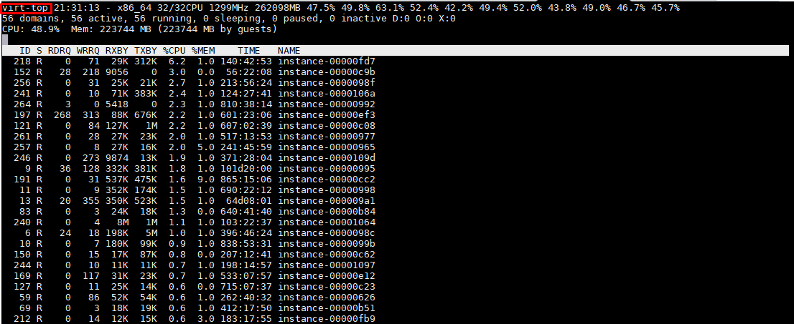

Trích xuất thông tin instance-xxx

dump file xml để lấy thông tin ID

```
virsh dumpxml instance-xxx
```

## Test QoS Bandwidth IO

+ Chuẩn bị 1 VPS 

Lấy ID VM trên KVM

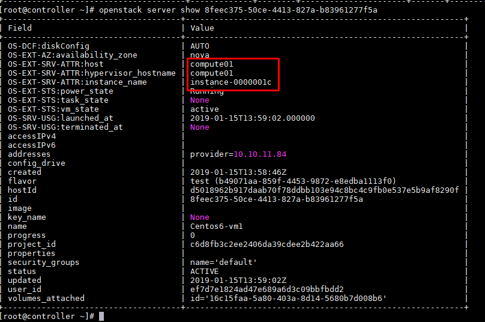

+ Thực hiện trên node COM chứa VM đó.

Xem VM đó đã được áp policy QoS nào chứa.

```
virsh domblklist instance-0000001c

virsh blkdeviotune instance-0000001c vda
```

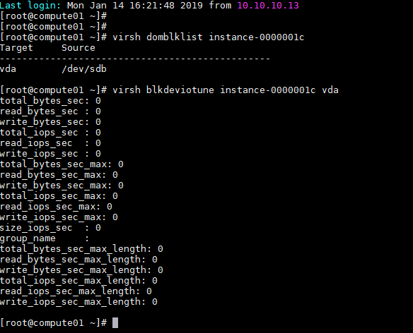

Như trên hình là chưa có policy được áp dụng đối với VM này trên KVM.

Ý nghĩa các tham số trên:

total_bytes_sec: Giới hạn tổng throughput (lượng data truyền đi trong một khoảng thời gian), mặc định là bytes per second.

read_bytes_sec : Giới hạn throughput đọc, mặc định là bytes per second

write_bytes_sec: Giới hạn throughput ghi, mặc định là bytes per second

total_iops_sec : Chỉ định giới hạn tổng I/O trên giây.

read_iops_sec  : Chỉ định giới hạn đọc I/O trên giây.

write_iops_sec : Chỉ định giới hạn ghi I/O trên giây.

total_bytes_sec_max: Chỉ định giá trị max cho throughput, mặc định là bytes per.

read_bytes_sec_max: Giới hạn throughput đọc max, mặc định là bytes per second.

write_bytes_sec_max: Giới hạn throughput ghi max, mặc định là bytes per second.

total_iops_sec_max: Chỉ định giới hạn max tổng I/O trên giây.

read_iops_sec_max: Chỉ định giới hạn max đọc I/O trên giây.

write_iops_sec_max: Chỉ định giới hạn max ghi I/O trên giây.

size_iops_sec  : Chỉ định giới hạn size iops, mặc định I/O trên giây.

group_name     :

total_bytes_sec_max_length: Chỉ định thời lượng tính bằng giây cho phép giới hạn max tổng throughput.

read_bytes_sec_max_length: 0

write_bytes_sec_max_length: 0

total_iops_sec_max_length: Chỉ định thời lượng tính bằng giây cho phép giới hạn max I/O

read_iops_sec_max_length: 0

write_iops_sec_max_length: 0


+ Test thử VM đó.

```
Read rand 4k
sync; echo 3 > /proc/sys/vm/drop_caches && name=read-rand; fio --randrepeat=1 --rw=randread --ioengine=libaio --size=4G --filename=testfile --name=read-rand --direct=1 --gtod_reduce=1 --bs=4k --iodepth=64 --runtime=600 --time_based && rm -rf testfile
```


bw=420274 B/s = 0,42 MB/s

+ Thực hiện limit bandwidth read với bandwidth 300000 B/s

```
virsh blkdeviotune instance-0000001c vda --read_bytes_sec 300000 --live
```
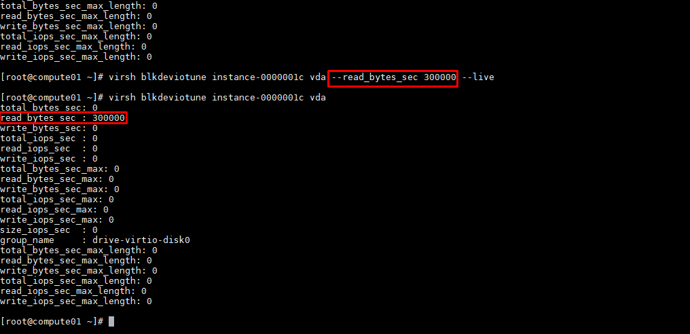

+ Test sau khi QoS


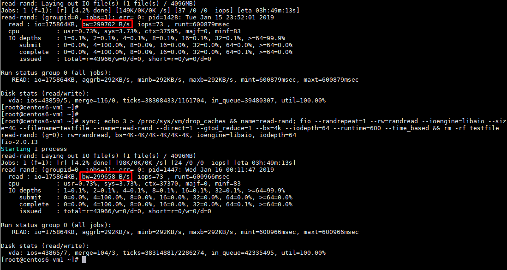

Kết quả bandwidth read xấp xỉ 300000 B/s

## Test QoS Read Bandwidth IO public

+ Show policy

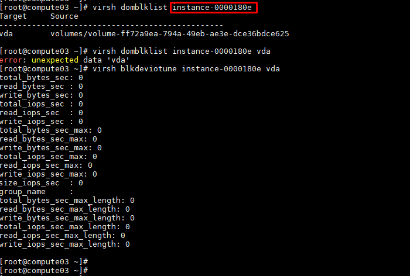

+ Test dd

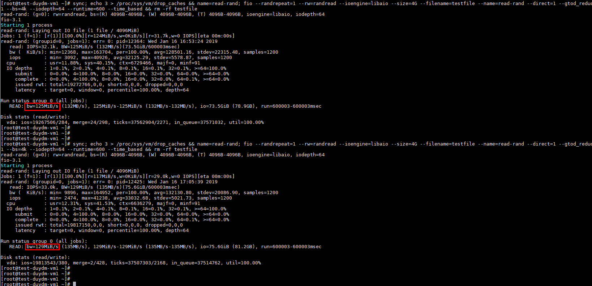

Test Read rand 4k 2 lần đều có bandwidth io xấp xỉ 129MiB/s

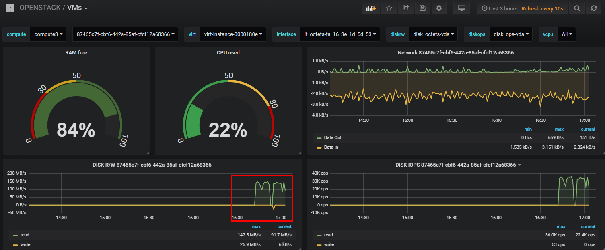

+ Thực hiện QoS Read Bandwidth xuống mức 50MiB/s

```
virsh blkdeviotune instance-0000180e vda --read_bytes_sec 50000000 --live
```

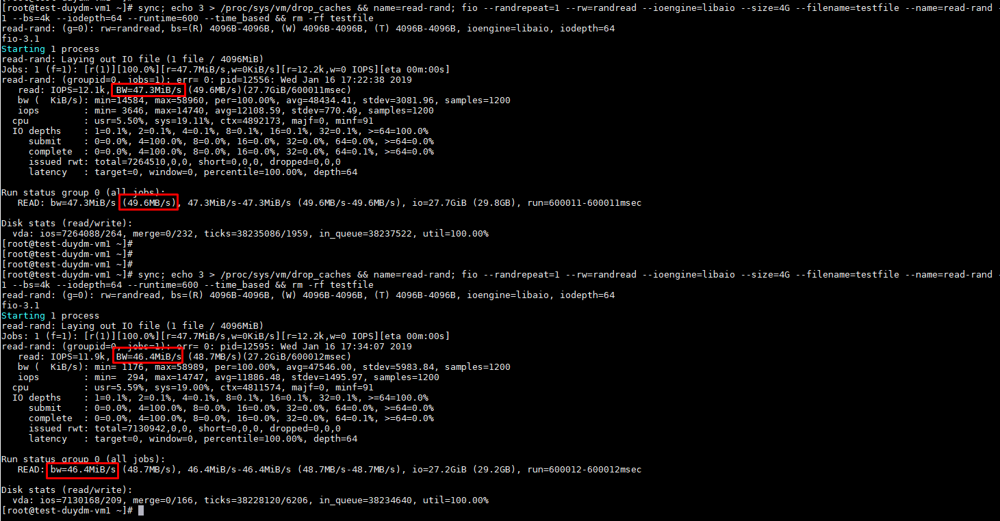

Test Read rand 4k 2 lần đều có bandwidth io xấp xỉ 48.7MB/s

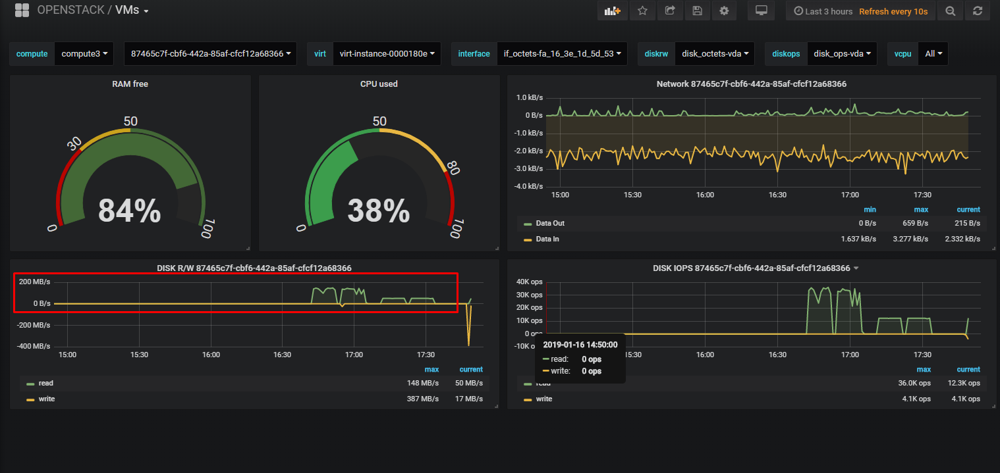

## Test QoS Read/Write Bandwidth IO public

+ Show policy

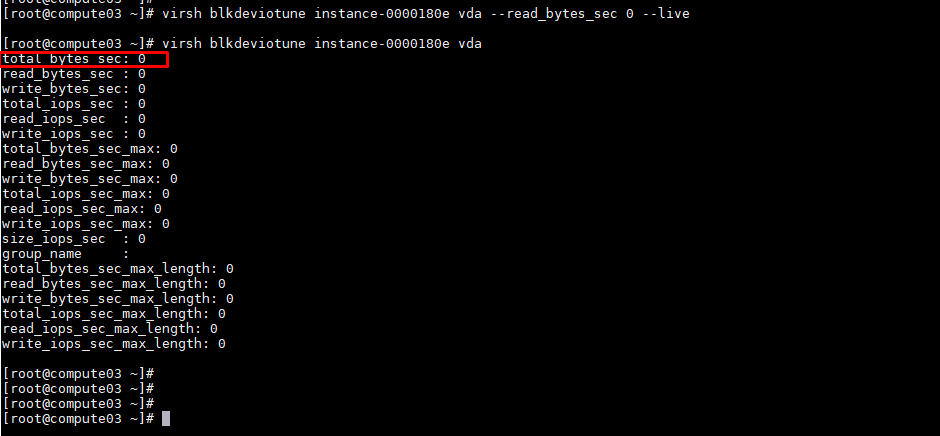

```
# Mix R/W 4k
sync; echo 3 > /proc/sys/vm/drop_caches && name=mixrw; fio --randrepeat=1 --ioengine=libaio --direct=1 --gtod_reduce=1 --name=mixrw--filename=testfile --iodepth=64 --size=4G --readwrite=randrw --rwmixread=75 --runtime=600 --time_based && rm -rf testfile
```

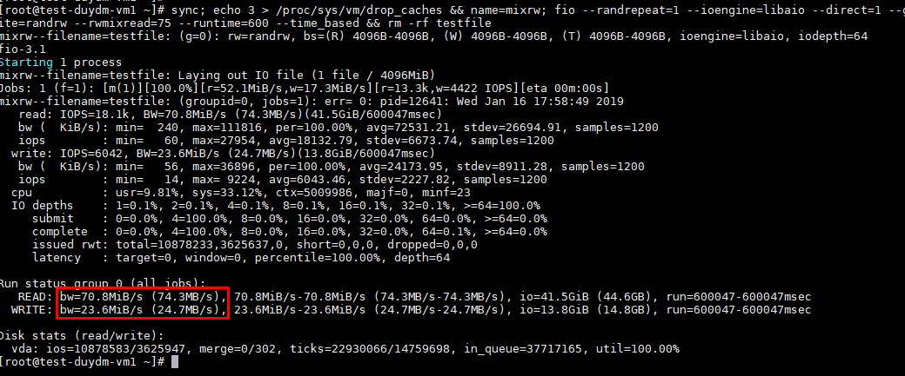

+ Thực hiện QoS Read/Write Bandwidth xuống mức 30MiB/s

```
virsh blkdeviotune instance-0000180e vda --read_bytes_sec 30000000 --write_bytes_sec 30000000 --live
```

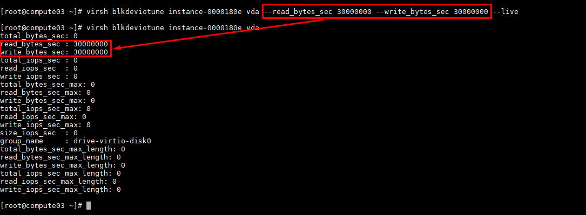

