# Test QoS network Lab

Kịch bản test

Tạo 2 VM 1 đóng vài trò client - 1 đóng vai trò server

+ Cài đặt tool iperf, nload để đẩy và soi traffic

Client: 10.10.11.82 

Server: 10.10.11.84

## 1. Test chưa có áp dụng QoS network

+ Trên server iperf bật mode s

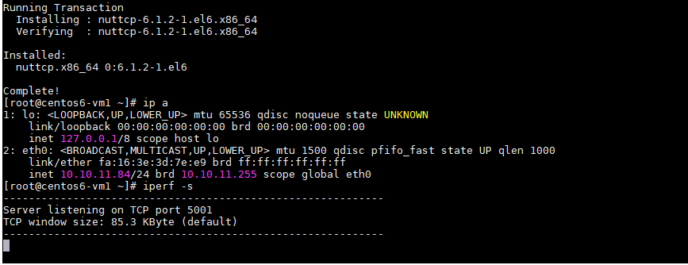

+ Trên client iperf bật mode c 

Thực hiện lệnh đẩy traffic về server

```
iperf -c 10.10.11.84 -i1 -t 100 -m
```
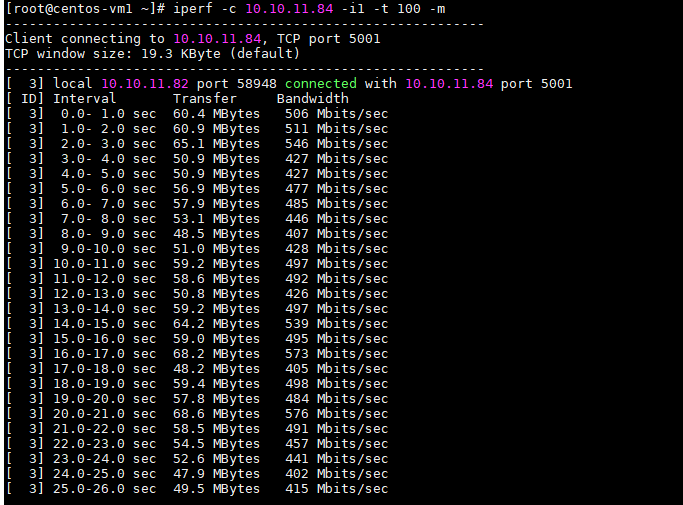

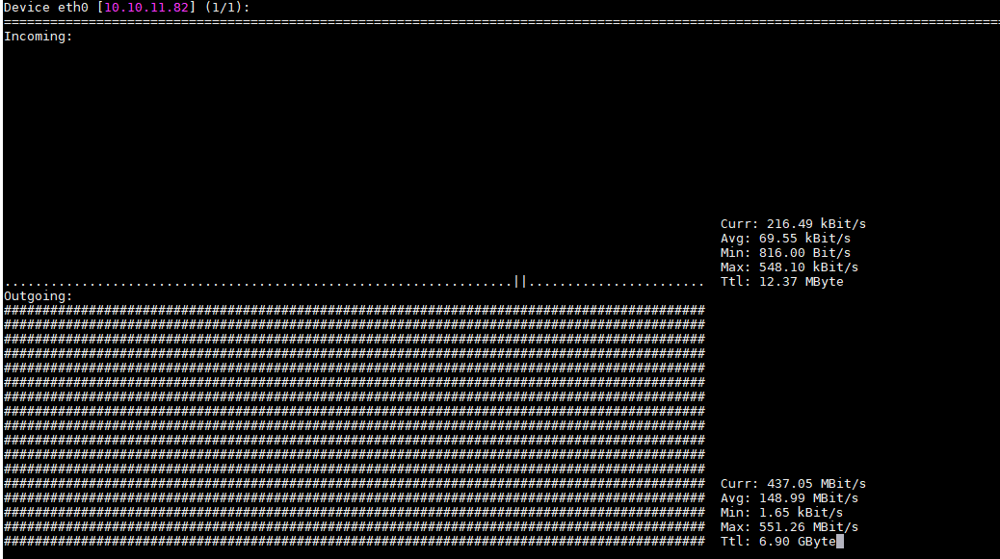

Trên con 11.82 đẩy ra qua eth0 đo được chiều outgoing dao đông khoảng 500 Mbits

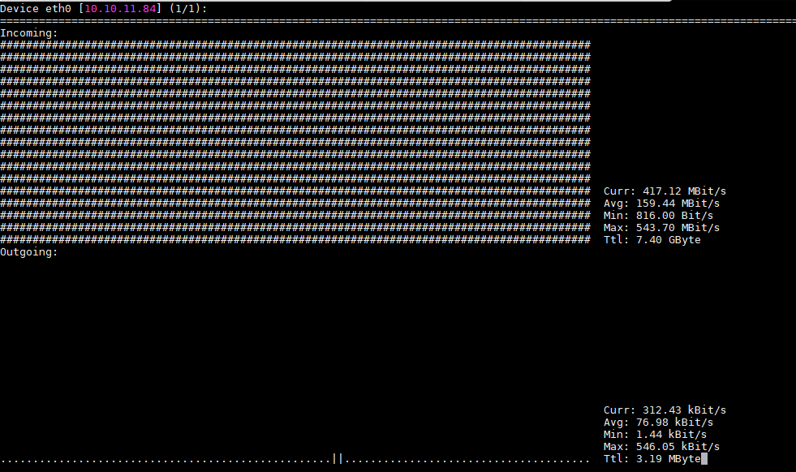

Trên con 11.84 eth0 đo được chiều incomming dao đông khoảng 500 Mbits

## 2. Áp dụng QoS cho máy Client 11.82 để limit băng thông đẩy ra qua interface

### 2.1. Thực hiện cấu hình và tạo policy

Sau khi cấu hình QoS network trên node CTL, COM thì thực hiện tạo policy như sau (Tạo policy ở đây áp cho project):

```
openstack network qos policy create interface-incoming-10Mb --project admin
openstack network qos policy create outgoing-incoming-10Mb --project admin
openstack network qos policy create interface-outgoing-10Mb --project admin
```

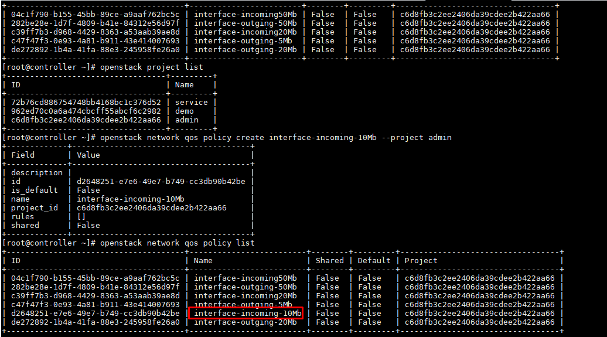

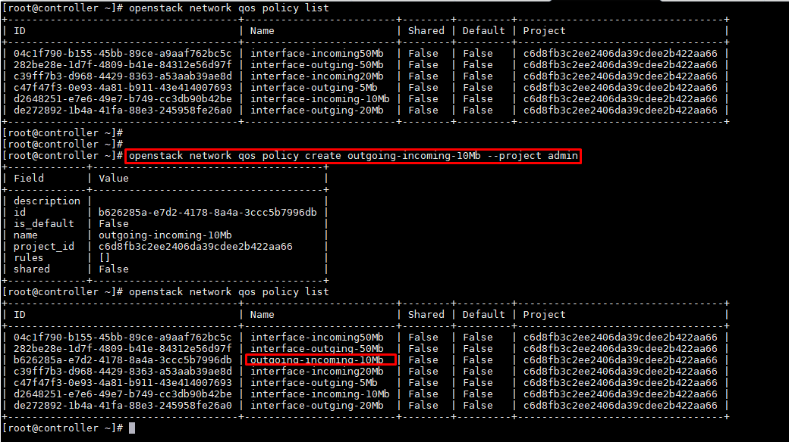


Sau khi đã tạo xong policy -> Tiến hành tạo rule cho policy

Tạo Qos policy giới hạn incoming traffic của vm với mức 10Mbps trong project admin

```
openstack network qos rule create --type bandwidth-limit --max-kbps 10000 --max-burst-kbits 16000 --ingress interface-incoming-10Mb
```

Tạo Qos policy giới hạn outgoing traffic của vm với mức 20Mbps trong project admin

```
openstack network qos rule create --type bandwidth-limit --max-kbps 10000 --max-burst-kbits 16000 --egress interface-outgoing-10Mb
```
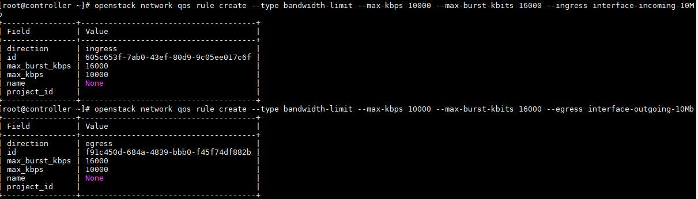

Tạo Qos policy giới hạn cả incoming và outgoing traffic của vm với mức 10Mbps trong project admin

```
openstack network qos rule create --type bandwidth-limit --max-kbps 10000 --max-burst-kbits 16000 --egress outgoing-incoming-10Mb
openstack network qos rule create --type bandwidth-limit --max-kbps 10000 --max-burst-kbits 16000 --ingress outgoing-incoming-10Mb
```

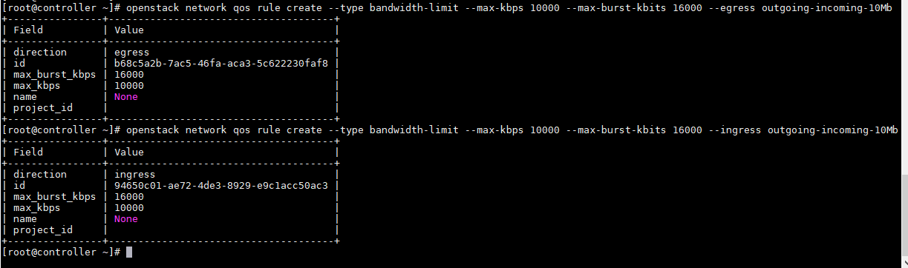

### 2.2. Sử dụng các rule đã set cho policy để áp QoS

Có 2 cách áp

Áp dụng cho từng port riêng lẻ 

``` 
openstack port set --qos-policy $qos_policy_name $port_id
```

Áp dụng trên cả network : 

```
openstack network set --qos-policy $qos_policy_name $network_id
```

Chú ý : Tại 1 thời điểm, 1 port chỉ được phép áp dụng 1 Qos Policy. Nếu tiếp tục set qos lên port thì policy sau sẽ đè lên policy trước.

- Thực hiện áp lên port của VM

Từ VM xác định port_id của VM đóng sử dụng câu lệnh:

```
openstack port list | grep $IP
```

Ở đây:

Client: 10.10.11.82 -> port_id: e116c178-20d9-4fa1-a51e-3e048ea8025e

Server: 10.10.11.84 -> port_id: ebf49c42-c013-4847-a3ec-bca0f3670726

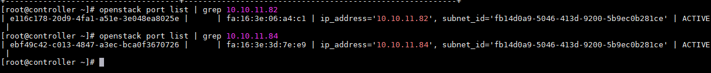

Áp rule outgoing-incoming-10Mb cho port VM 10.10.11.82

```
openstack port set --qos-policy outgoing-incoming-10Mb e116c178-20d9-4fa1-a51e-3e048ea8025e
```

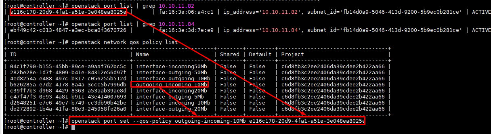

### 2.3. Thực hiện test lại

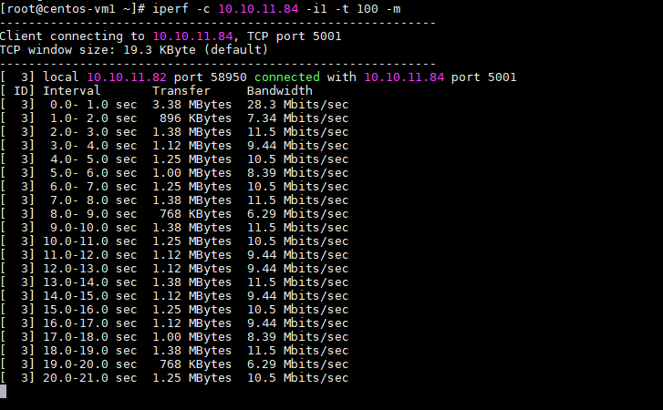

Trên con 11.82 đẩy ra qua eth0 đo được chiều outgoing dao đông khoảng 10 Mbits

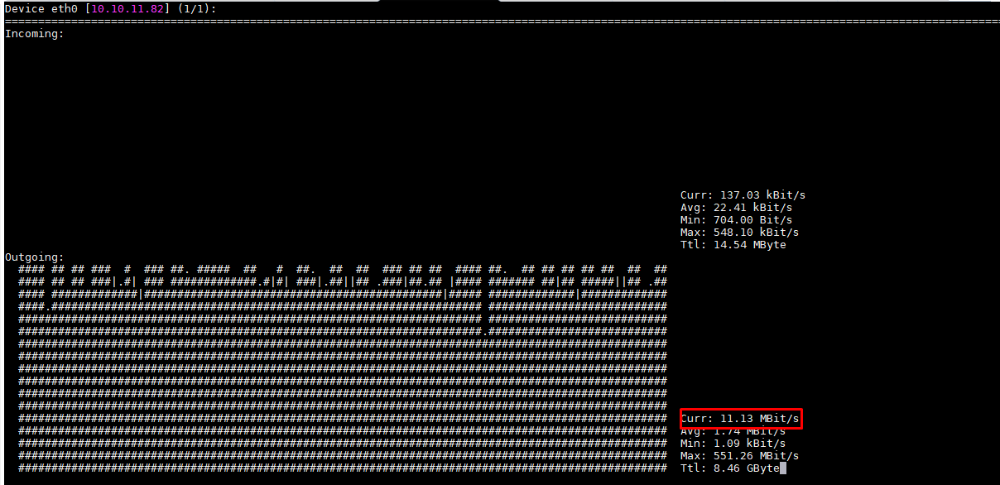

Trên con 11.84 đẩy ra qua eth0 đo được chiều incoming dao đông khoảng 10 Mbits

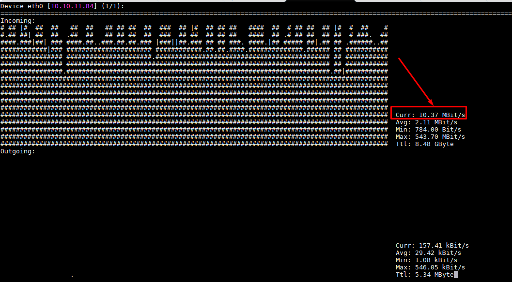


Gỡ policy QoS

```
openstack port unset --qos-policy outgoing-incoming-10Mb e116c178-20d9-4fa1-a51e-3e048ea8025e
```


