# Hướng dẫn triển khai Zabbix server 4.0, grafana server 5.4 trên CentOS 7

### Mục lục

[1. Chuẩn bị](#chuanbi)<br>
[2. Cài đặt zabbix server](#zabbixserver)<br>
[3. Cài đặt grafana server](#grafanaserver)<br>
[4. Cài đặt zabbix agent lên host client](#zabbixagent)<br>
[5. Thiết lập alert zabbix](zabbixalert)<br>
[6. Tùy biến item zabbix giám sát server Linux](#item)<br>
[7. Hướng dẫn set graph zabbix-grafana cơ bản](#graph)<br>

<a name="chuanbi"></a>
## 1. Chuẩn bị

**Zabbix server**

+ Ram: 8 GB
+ CPU: 4 core
+ Disk: 300GB
+ Interface: 1
+ OS : CentOS 7.5

**Grafana server**

+ Ram: 6 GB
+ CPU: 6 core
+ Disk: 100GB
+ Interface: 1
+ OS : CentOS 7.5

- Thao tác chuẩn bị cơ bản:

+ Set hostname
+ Set địa chỉ IP tĩnh
+ Kiểm tra firewall, selinux
+ Update các package
+ Add tcp_wraper
+ Config cmd log

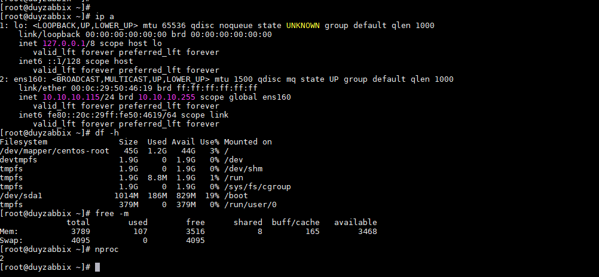

**Nếu bạn thực hiện lab nên snapshot lại trước khi cài đặt.**

Hiện tại zabbix đã release bản Zabbix 4.0 LTS (1-10-2018) nên ở đay ta sử dụng cài đặt zabbix4.0

<a name="zabbixserver"></a>
## 2. Cài đặt zabbix server

### Bước 1: Download repo zabbix và cài đặt một số package

```
yum install epel-release
rpm -ivh https://repo.zabbix.com/zabbix/4.0/rhel/7/x86_64/zabbix-release-4.0-1.el7.noarch.rpm
yum -y install zabbix-server-mysql zabbix-web-mysql mysql mariadb-server httpd php
```


### Bước 2: Create Db

Start service mariadb và auto start khi khởi động lại server

```
systemctl start mariadb
systemctl enable mariadb
```
Thiết lập password root cho mysql

```
mysql_secure_installation
```

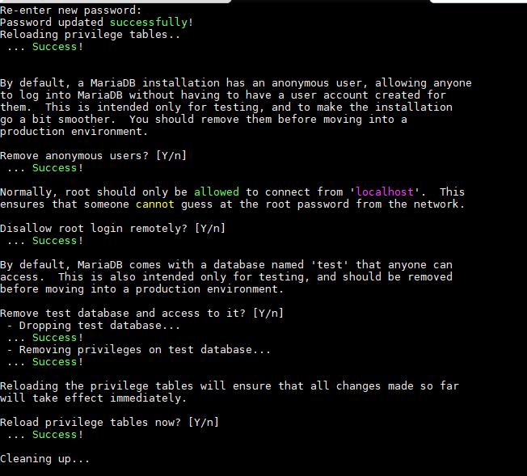

Khai báo biến và gán giá trị cho việc config database mysql

```
userMysql="root"
passMysql="passWord"
portMysql="3306"
hostMysql="localhost"
nameDbZabbix="zabbix_db"
userDbZabbix="zabbix_user"
passDbZabbix="passWord"
```
Config database zabbix

```
cat << EOF |mysql -u$userMysql -p$passMysql
DROP DATABASE IF EXISTS zabbix_db;
create database zabbix_db character set utf8 collate utf8_bin;
grant all privileges on zabbix_db.* to zabbix_user@localhost identified by 'passWord';
flush privileges;
exit
EOF
```

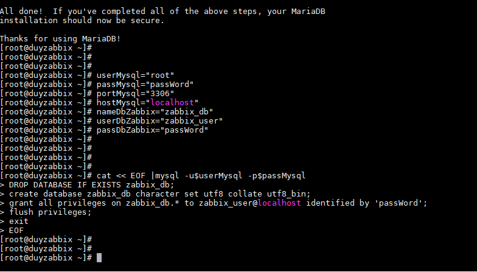

### Bước 3: Thiết lập một số tham số tối ưu mysql

Thực hiện trước bước import db của zabbix vào mysql 

+ Phải stop service mysql

```
systemctl stop mariadb
```

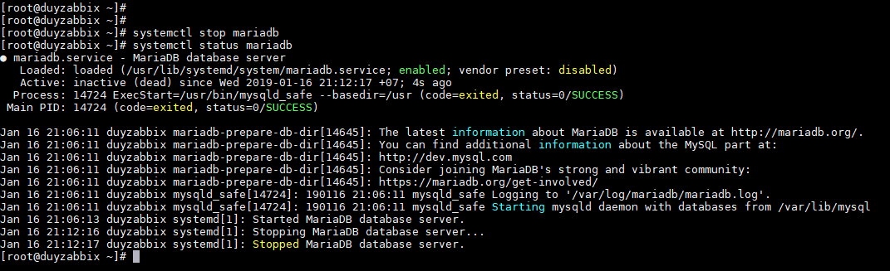

+ Enable InnoDB file-per-table

Sửa hoặc thêm dòng cấu hình này trong `/etc/my.cnf`

```
innodb_file_per_table=1
```

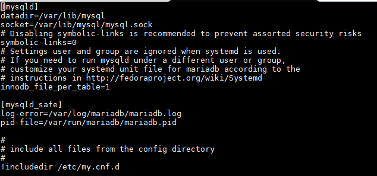

+ Tunning Change or Move MySQL /tmp Directory to tmpfs mysql zabbix

Thực hiện theo tài liệu: 

https://github.com/domanhduy/ghichep/blob/master/DuyDM/Zabbix/docs/tunning-mysql-tmp-tmps-zabbix.md

+ Khởi động lại zabbix database

```
systemctl restart mariadb
```

### Bước 4: Import database zabbix

Start lại service mysql

```
systemctl start mariadb
```

```
cd /usr/share/doc/zabbix-server-mysql-4.0.3
gunzip create.sql.gz
mysql -u root -p zabbix_db < create.sql
```

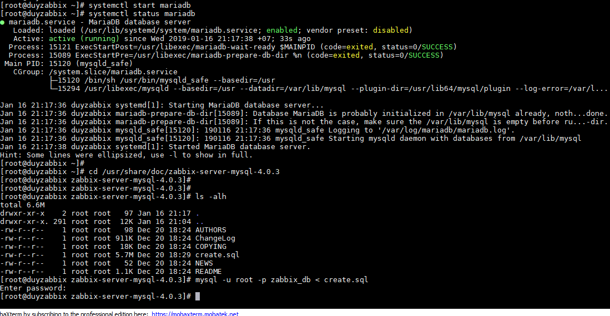

### Bước 5: Config DB

```
sed -i 's/# DBHost=localhost/DBHost=localhost/g' /etc/zabbix/zabbix_server.conf
sed -i "s/DBName=zabbix/DBName=$nameDbZabbix/g" /etc/zabbix/zabbix_server.conf
sed -i "s/DBUser=zabbix/DBUser=$userDbZabbix/g" /etc/zabbix/zabbix_server.conf
sed -i "s/# DBPassword=/DBPassword=$passDbZabbix/g" /etc/zabbix/zabbix_server.conf
```

### Bước 6: Configure PHP Setting

```
sed -i 's/max_execution_time = 30/max_execution_time = 600/g' /etc/php.ini
sed -i 's/max_input_time = 60/max_input_time = 600/g' /etc/php.ini
sed -i 's/memory_limit = 128M/memory_limit = 256M/g' /etc/php.ini
sed -i 's/post_max_size = 8M/post_max_size = 32M/g' /etc/php.ini
sed -i 's/upload_max_filesize = 2M/upload_max_filesize = 16M/g' /etc/php.ini
echo "date.timezone = Asia/Ho_Chi_Minh" >> /etc/php.ini
```

### Bước 7: Restart service

```
systemctl start zabbix-server
systemctl enable zabbix-server
systemctl start httpd
systemctl enable httpd
systemctl restart zabbix-server
systemctl restart httpd
```

### Bước 8: Truy cập config trên zabbix web-mysql

http://ipserver/zabbix

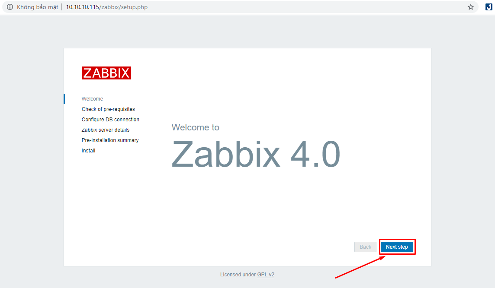

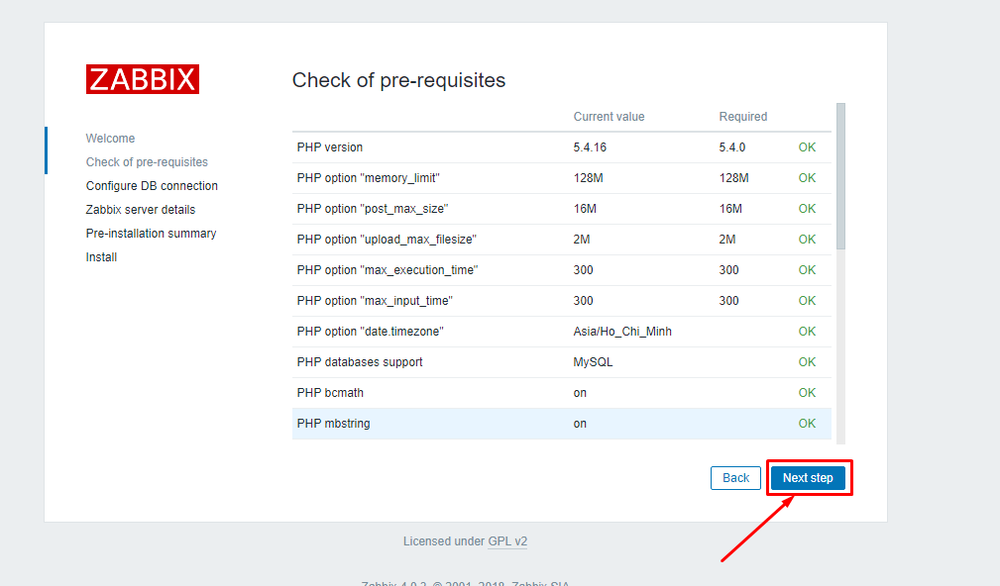

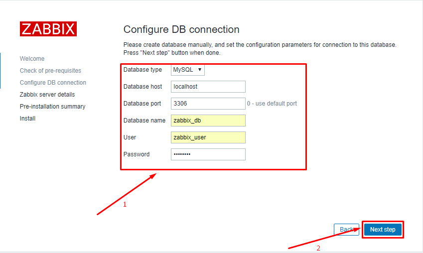

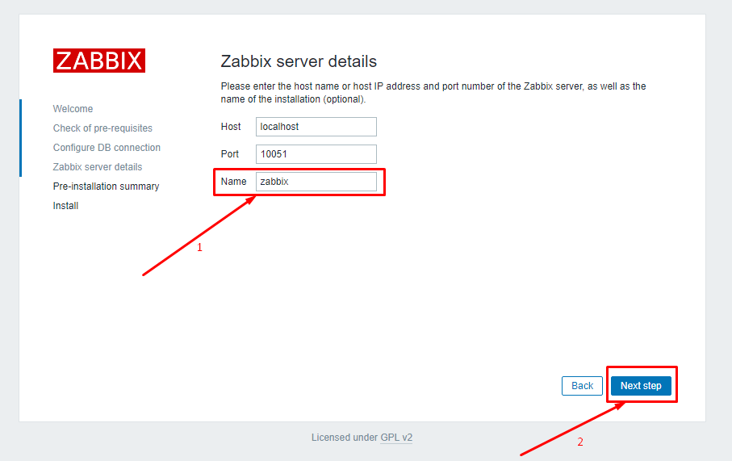

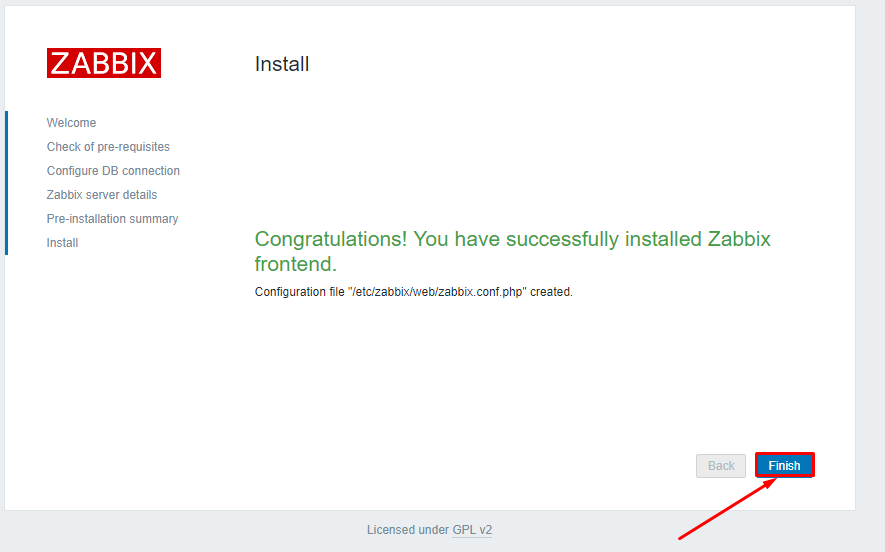

Cài đặt zabbix server 4.0 thành công.

### Bước 9: Login

Sử dụng tài khoản mặc định

```
Admin/zabbix
```
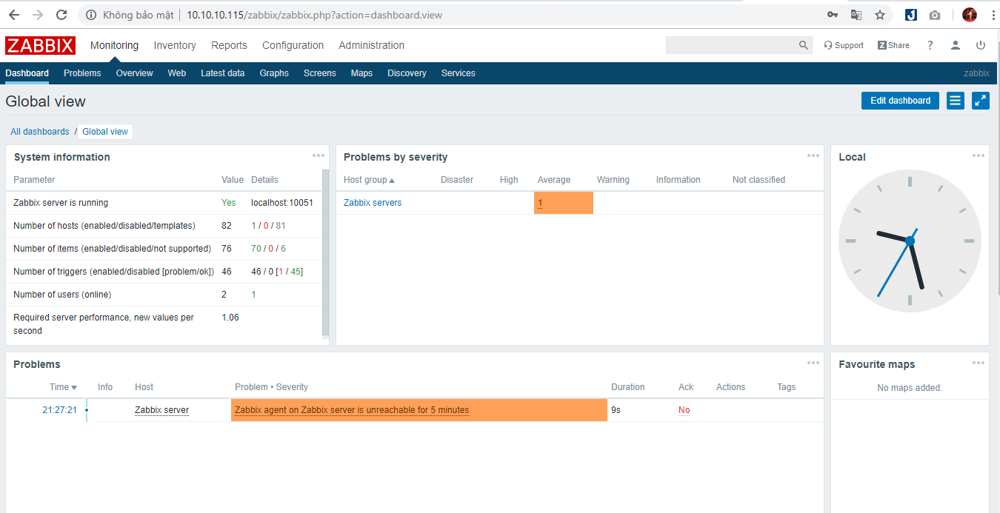

<a name="grafanaserver"></a>
## 3. Cài đặt grafana server

### 3.1. Cài đặt

Thực hiện các bước cài đặt ở link dưới

https://github.com/domanhduy/grafana/blob/master/docs/1.Install-grafana5.4-Centos7.md

### 3.2. Kết nối API zabbix server - grafana

Enable plugin zabbix - grafana (thực hiện trên grafana server)

```
grafana-cli plugins install alexanderzobnin-zabbix-app
```


Kết nối API zabbix server


+ Lựa chọn `Add Datasource`

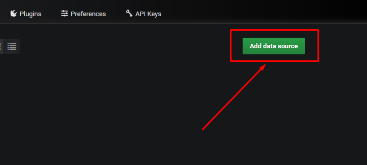

Trường URL điền: 

```
http://ip-zabbix-server/zabbix/api_jsonrpc.php
```

Zabbix API details điền: Username/pasword login dashboard zabbix server.

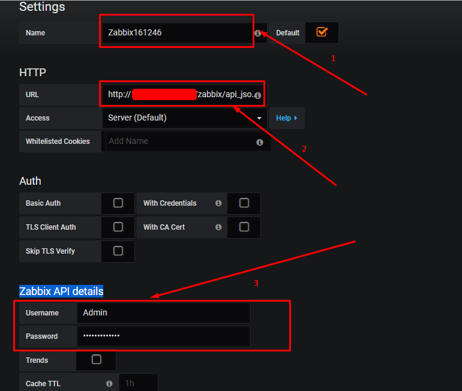

Save & Test


Vậy đã kết nối API zabbix với grafana

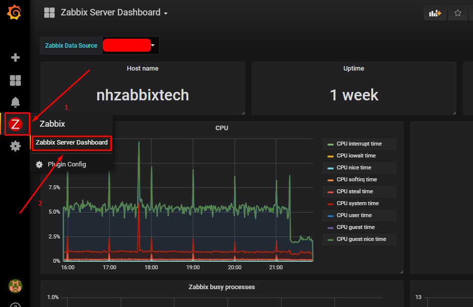

<a name="zabbixagent"></a>
## 4. Cài đặt zabbix agent lên host client

```
wget https://raw.githubusercontent.com/domanhduy/ghichep/master/DuyDM/Zabbix/scripts/install-agent-zabbix4-centos.sh
```

```
bash install-agent-zabbix4-centos.sh
```

Chú ý nhập IP server zabbix.

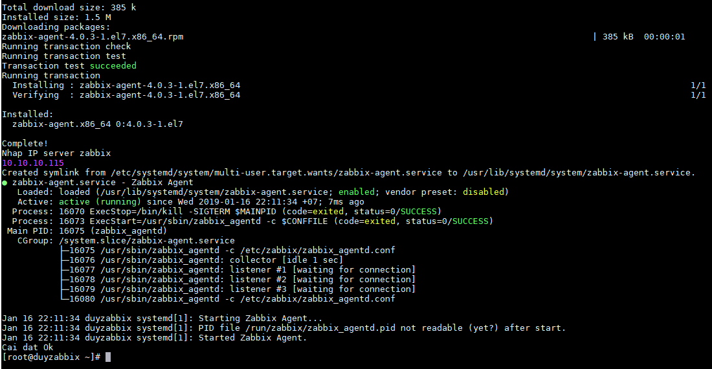

<a name="zabbixalert"></a>
## 5. Thiết lập alert zabbix

Thực hiện theo hướng dẫn:

https://github.com/domanhduy/zabbix-monitor/tree/master/Alert

Lưu ý: Setup alert qua telegram theo hướng dẫn `TelegramV1`

<a name="item"></a>
## 6. Tùy biến item zabbix giám sát server Linux

Khi giám sát các server Linux thường sử dụng template `Template OS Linux` có sẵn của zabbix. Về cơ bản template này đáp ứng tương đối đủ các item để lấy metric của server linux. Tuy nhiên ta phải tùy biến thêm item về disk, ram ...

- Lấy phần trăm sử dụng định phân vùng root: 	Used disk space on / (percentage)

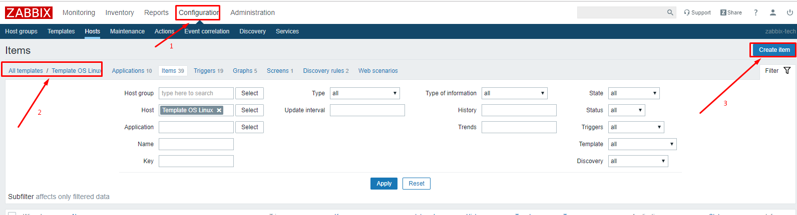

Điền các thông số sau:

```
Name: Used disk space on / (percentage)
Type: Caculated
Key: use.disk.root
Formula: 100*last("vfs.fs.size[/,used]")/last("vfs.fs.size[/,total]")
Update interval: 5m
Applications: Filesystems
```


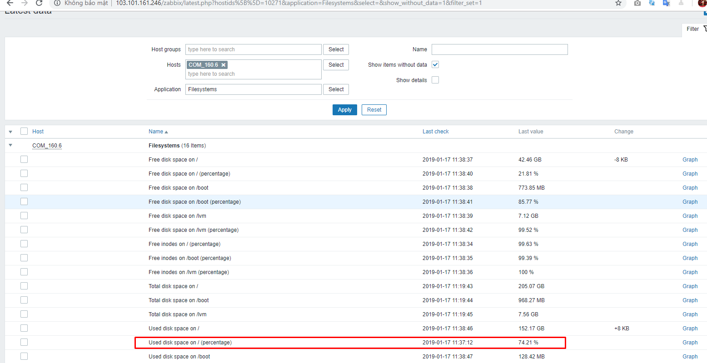

- Lấy phần trăm RAM Used

Mặc định khi sử dụng template `Template OS Linux` sẽ không có giá trị metric % RAM used.

Tạo các item để lấy % RAM Used (đã trừ đi cache RAM)

Thực hiện tạo lần lượt các item sau cho memory

+ Tạo item RAM cache B (Byte)

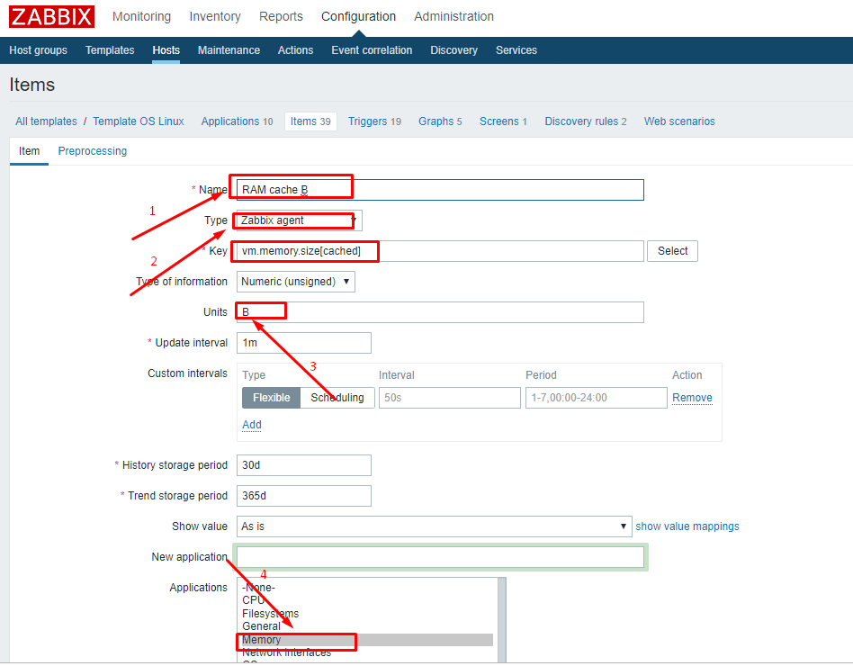

``` 
Name: RAM cache B
Type: Zabbix agent
Key: vm.memory.size[cached]
Update interval: 1m
Applications: Memory
```

+ Tạo item 	RAM cache %

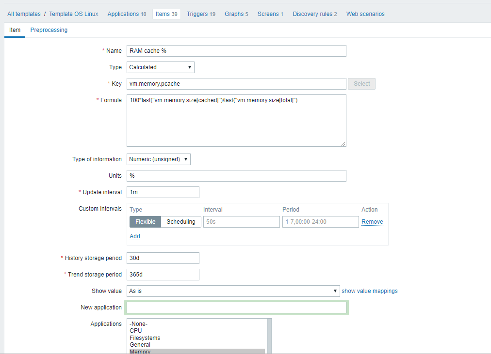

```
Name: RAM cache %
Type: Caculated
Key: vm.memory.pcache
Formula: 100*last("vm.memory.size[cached]")/last("vm.memory.size[total]")
Update interval: 1m
Applications: Memory
```

+ Tạo item 	RAM pused (Ram used dạng %)

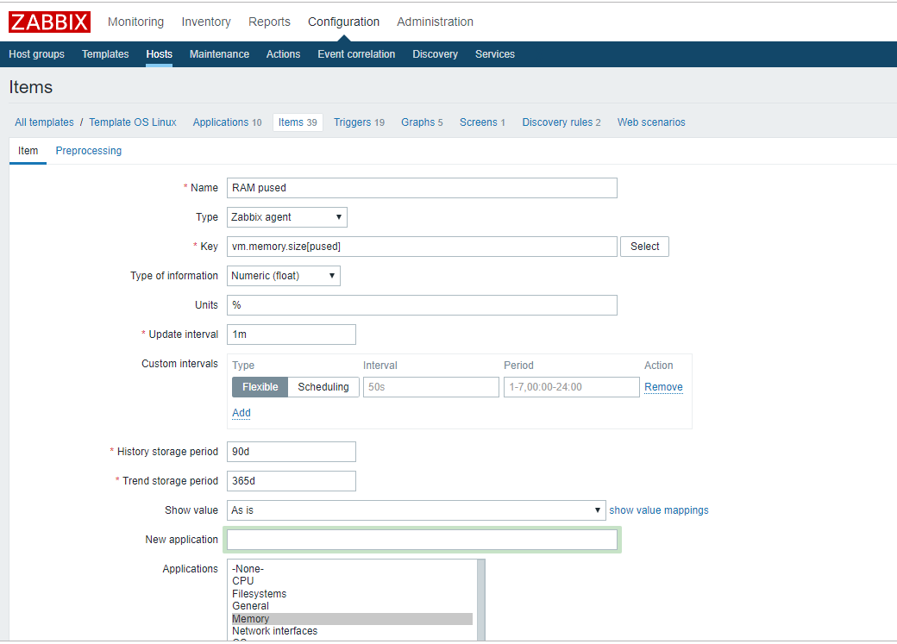

```
Name: RAM pused
Type: Zabbix agent
Key: vm.memory.size[pused]
Update interval: 1m
Applications: Memory
```

+ Tạo RAM USED % Current

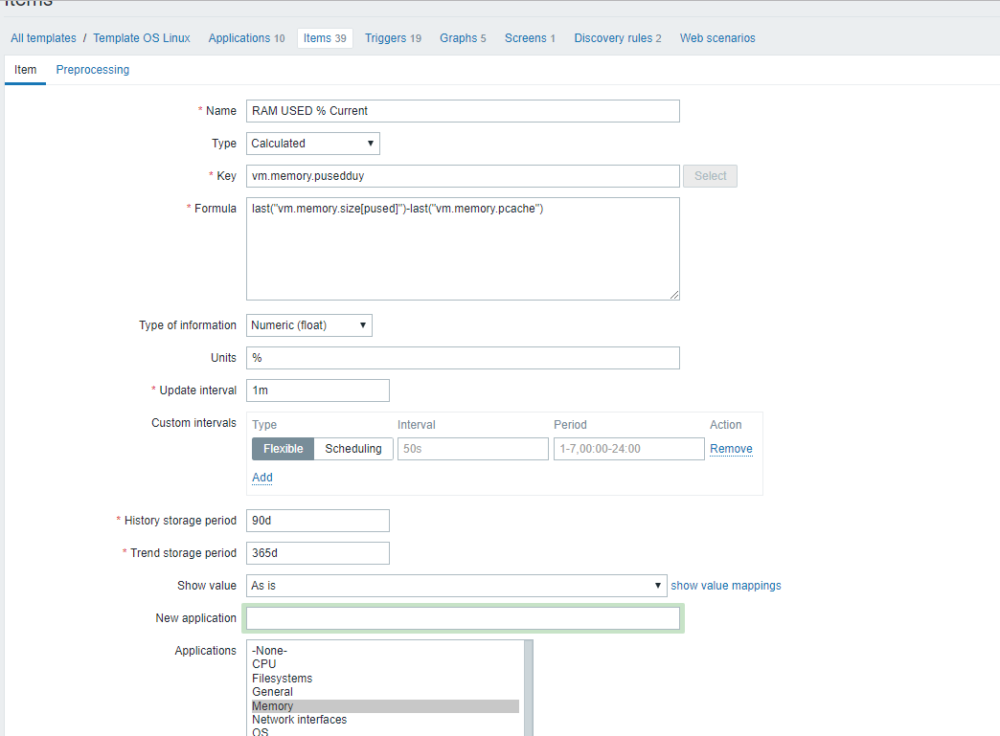

```
Name: RAM USED % Current
Type: Caculated
Key: vm.memory.pusedduy
Formula: last("vm.memory.size[pused]")-last("vm.memory.pcache")
Update interval: 1m
Applications: Memory
```

+ Lấy giá trị thành công.

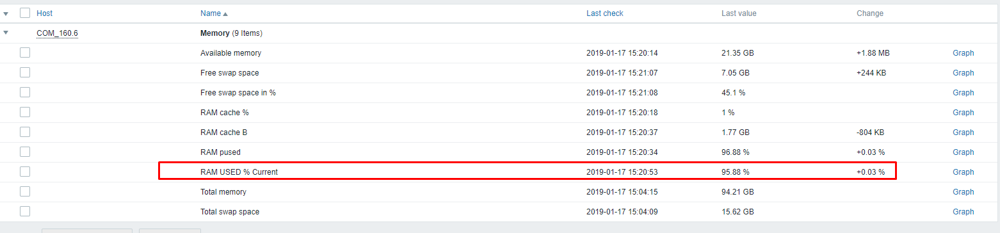

<a name="graph"></a>
## 7. Hướng dẫn set graph zabbix-grafana cơ bản

+ Thao tác đặt tên host trên dashboard zabbix

Để setup được các biểu đồ trên grafana được thuận tiện và nhanh chóng phải thống nhất cách đặt trên group, các host trong group phải đặt trên có tiền tố với cấu trúc cú pháp giống nhau.

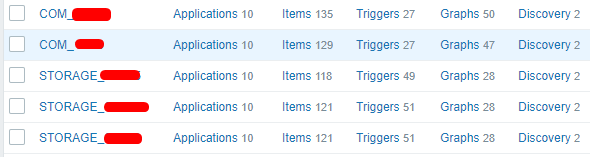

+ Trên grafana khi tạo một dashboard mới ta sẽ phải khai báo các biến như Grup, host, applications muốn lấy metric.

Lấy các group

[](../images/img-install-zabbix4/Screenshot_867.png)

Lấy host trong group

[](../images/img-install-zabbix4/Screenshot_868.png)

Lấp các `Applications` thể hiện trên zabbix

[](../images/img-install-zabbix4/Screenshot_870.png)

Khi khai báo các biến ta có thể chọn động giá trị của biến đó trên graph grafana.

[](../images/img-install-zabbix4/Screenshot_871.png)

+ Một số kỹ thuật regex name

`*` lấy tất cả.

/^(abc.*)/  lấy tất cả các giá trị bắt đầu bằng abc.

/^(?!abc)/ bỏ giá trị abc.


