# Hướng dẫn sử dụng script discovery range IP

Author: MinhNV-KMA

Kiểm tra trạng thái của các IP trong range IP và thiết lập cảnh báo

## Thực hiện config trên zabbix server

+ Bước 1: Cài đặt python 3.5

```
yum -y install https://centos7.iuscommunity.org/ius-release.rpm
yum -y install python35u python35u-pip python35u-devel
python3.5 -V
```

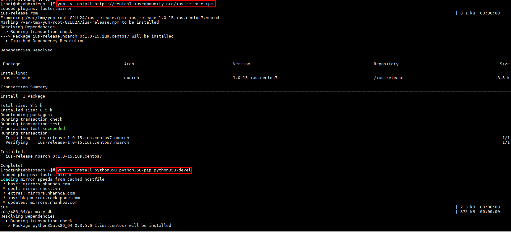

+ Bước 2: Tải script về zabbix server

```
cd /usr/local/bin/
wget https://raw.githubusercontent.com/domanhduy/ghichep/master/DuyDM/Zabbix/scripts/discovery_ip_range.py
chmod +x discovery_ip_range.py
```

+ Bước 3: Test script

```
python3.5 discovery_ip_range.py 192.168.70.40 192.168.70.50
```

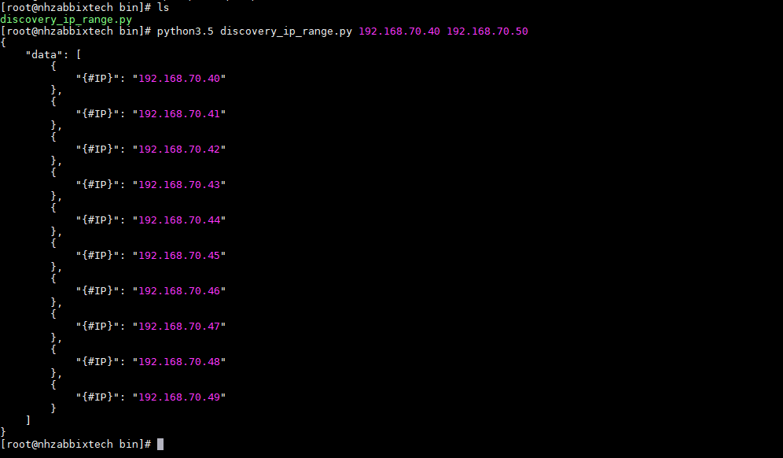

## Thực hiện trên Dashboard zabbix

**Configuration -> Host -> Lựa chọn Zabbix server -> Dicovery**

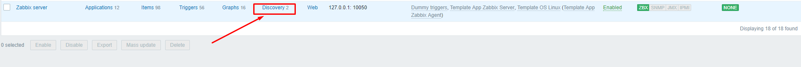


+ Bước 4: Tạo thêm rule mới

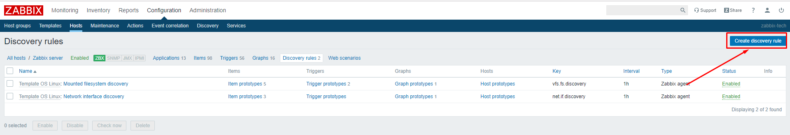

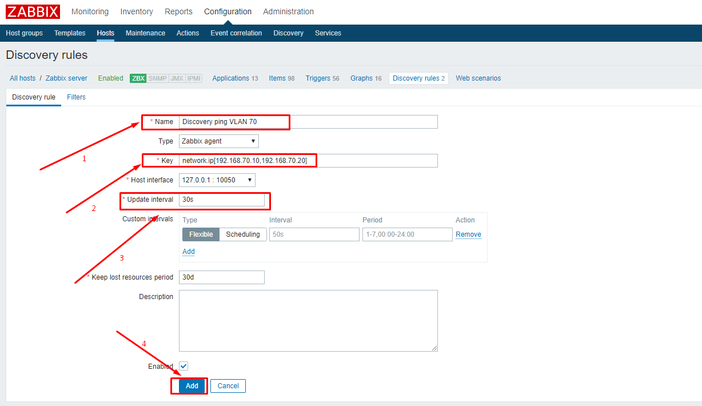

++ Name: Tên rule

++ key: Chú ý đúng cú phải và điền địa chỉ đầu và cuối của range IP

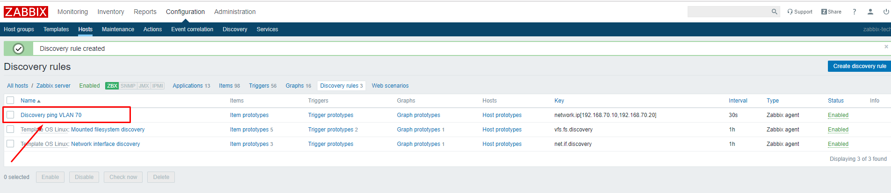


+ Tạo thêm item mới Discovery Network

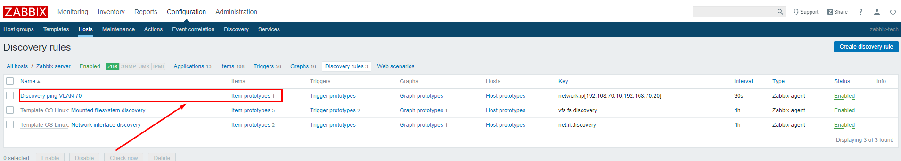

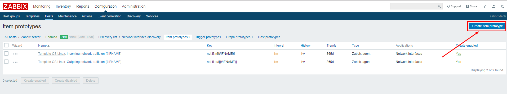

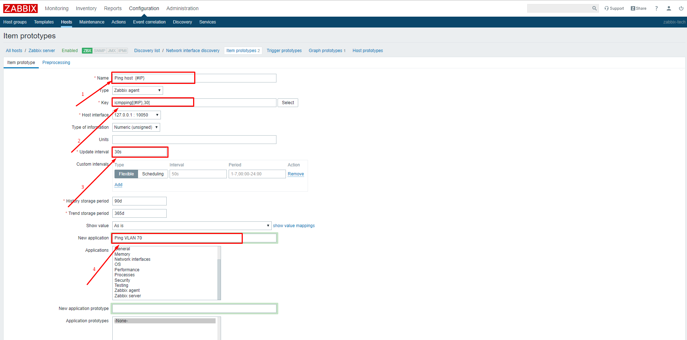

++ Name: Ping host  {#IP}

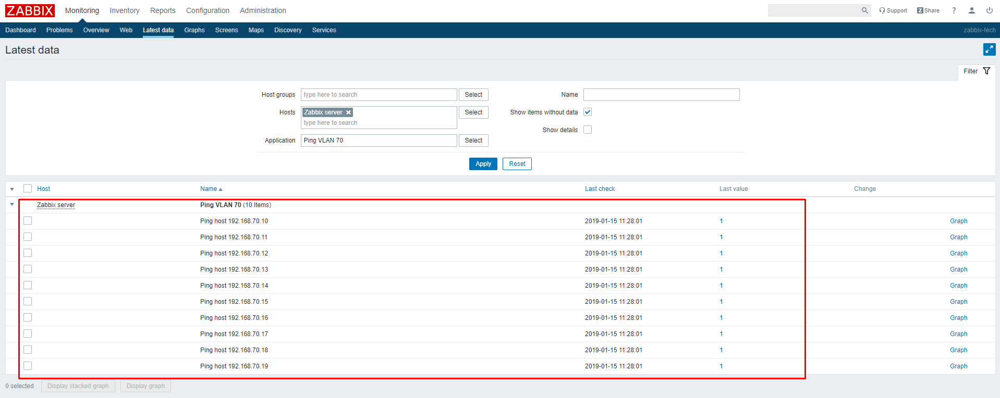

Lưu ý: Item, key khai báo trong zabbix không được trùng nhau.


```
#IP là biến quy định cho host
```

++Update interval: 30s 

Khoảng thời gian update mới value

++ Key: icmpping[{#IP},30]

Sử dụng icmp ping 30 gói trong khoảng thời gian interval trên.

++ Type: Simple check

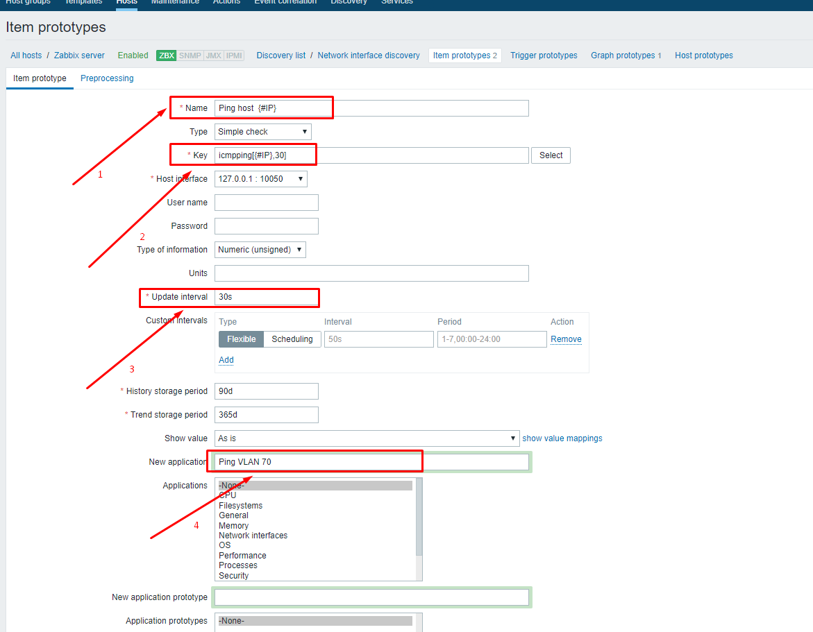

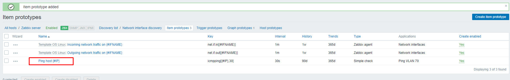


+ Kiểm tra kết quả


