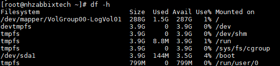
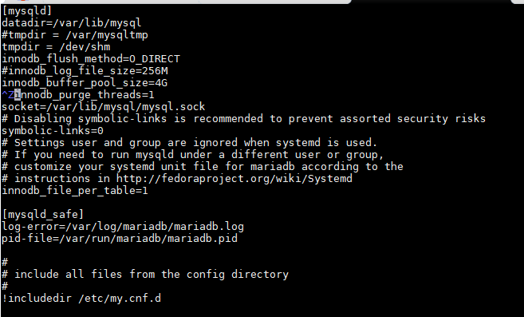
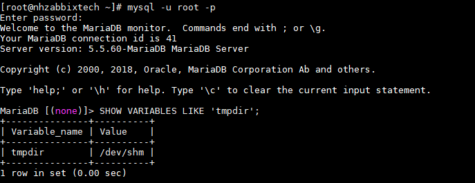
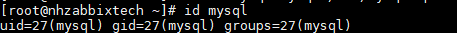
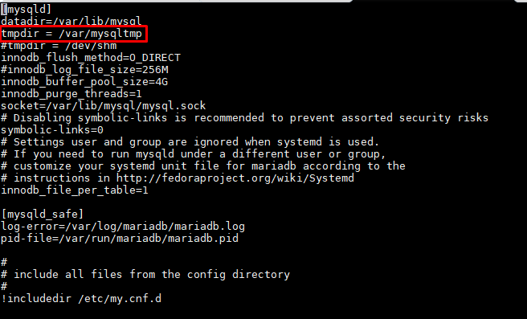
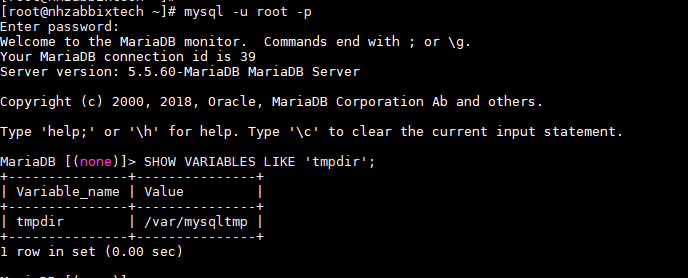

# Tunning Change or Move MySQL /tmp Directory to tmpfs mysql zabbix

Đối với các truy vấn zabbix vào bộ phận lưu trữu thường có hiện tượng là nút cổ chai. Đối với các truy vấn chậm này, MySQL ghi các bảng tạm thời vào đĩa, đưa chúng vào các kết quả trung gian, sau đó truy vấn lại chúng để có kết quả cuối cùng. Cách tối ưu này cải thiện đáng kể hiệu năng truy vấn.

## 1. Sử dụng thư mục tmps hiện có

```
df -h
```



Hệ thống tệp / dev / shm thuộc loại hệ thống tệp tạm thời và có 3,9 GB được phân bổ cho. Do đó ta cần cấu hình cho MySQL sử dụng thư mục này.

```
chmod 1777 / dev / shm
```

```
vi /etc/my.cnf
```

Thêm dòng config vào blog mysqld

``` 
[mysqld]
tmpdir = / dev / shm
```



```
systemctl restart mariadb
```

+ Kiểm tra trong database

```
SHOW VARIABLES LIKE 'tmpdir';
```


## 2. Tạo một thư mục tmps mới

```
mkdir -p / var / mysqltmp
```

```
chown mysql: mysql / var / mysqltmp
```

xác định id user mysql, lưu ý id user (uid) và id group (gid) để chỉnh sửa fstab

```
id mysql
```


Chỉnh sửa / etc / fstab

```
vi / etc / fstab
```

Thêm dòng

```
tmpfs /var/mysqltmp tmpfs rw,gid=27,uid=27,size=1024M,nr_inodes=50k,mode=0700 0 0
```

```
mount -a
```

Chỉnh sửa file config  /etc/my.cnf

```
vi /etc/my.cnf
```

Thêm dòng config vào blog mysqld

``` 
[mysqld]
tmpdir = /var/mysqltmp
```



```
systemctl restart mariadb
```

+ Kiểm tra trong database




## Tham khảo

https://www.evoluso.com/how-to-change-or-move-mysql-tmp-directory-to-tmpfs/