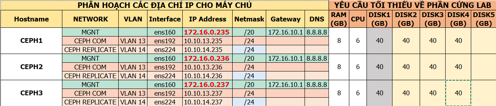
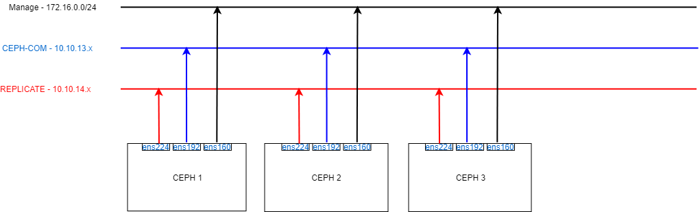

# 1. Chuẩn bị



### CEPH 1
- MNGT : 172.16.0.235
- CEPH COM : 10.10.13.235
- CEPH REPLICATION : 10.10.14.235

### CEPH 2
- MNGT : 172.16.0.236
- CEPH COM : 10.10.13.236
- CEPH REPLICATION : 10.10.14.236

### CEPH 3
- MNGT : 172.16.0.237
- CEPH COM : 10.10.13.237
- CEPH REPLICATION : 10.10.14.237

# 2. Mô hình



# 3. Cài đặt

## 3.1 Chuẩn bị:

- Set hostname + ip
```sh
hostnamectl set-hostname ceph1
echo "nameserver 8.8.8.8" > /etc/resolv.conf
```

- Update
```sh
yum install epel-release -y
yum update -y
```

- Cấu hình IP

(Thực hiện trên 3 node )

```sh

nmcli c modify ens192 ipv4.addresses 10.10.13.235/24
nmcli c modify ens192 ipv4.method manual
nmcli con mod ens192 connection.autoconnect yes

nmcli c modify ens224 ipv4.addresses 10.10.14.235/24
nmcli c modify ens224 ipv4.method manual
nmcli con mod ens224 connection.autoconnect yes

sudo systemctl disable firewalld
sudo systemctl stop firewalld
sudo systemctl disable NetworkManager
sudo systemctl stop NetworkManager
sudo systemctl enable network
sudo systemctl start network
sed -i 's/SELINUX=enforcing/SELINUX=disabled/g' /etc/sysconfig/selinux
sed -i 's/SELINUX=enforcing/SELINUX=disabled/g' /etc/selinux/config
```

- Cấu hình file `/etc/hosts` ( Lưu ý diền IP dải <CEPH_COM> )
```sh
cat << EOF >> /etc/hosts
10.10.13.235 ceph1
10.10.13.236 ceph2
10.10.13.237 ceph3
EOF
```

## 3.2 Cài đặt Chronyd
```sh
yum -y install chrony
timedatectl set-timezone Asia/Ho_Chi_Minh

# Ở đây sử dụng server IP 172.16.0.243 làm NTP server
sed -i 's/server 0.centos.pool.ntp.org iburst/server 172.16.0.243 iburst/g' /etc/chrony.conf
sed -i 's/server 1.centos.pool.ntp.org iburst/#/g' /etc/chrony.conf
sed -i 's/server 2.centos.pool.ntp.org iburst/#/g' /etc/chrony.conf
sed -i 's/server 3.centos.pool.ntp.org iburst/#/g' /etc/chrony.conf
sed -i 's/#allow 192.168.0.0\/16/allow 172.16.0.0\/20/g' /etc/chrony.conf
systemctl enable chronyd.service
systemctl start chronyd.service
systemctl restart chronyd.service
chronyc sources
```

## 3.3 Cài đặt CEPH

```sh
yum install -y wget 
wget https://download.ceph.com/rpm-luminous/el7/noarch/ceph-deploy-2.0.1-0.noarch.rpm --no-check-certificate
rpm -ivh ceph-deploy-2.0.1-0.noarch.rpm
```

- Cài đặt python-setuptools để ceph-deploy có thể hoạt động ổn định.
```
curl https://bootstrap.pypa.io/ez_setup.py | python
```

- Tao SSH KEY (o day su dung user root de deploy Ceph):
```sh
ssh-keygen
```

```sh
ssh-copy-id root@ceph1
ssh-copy-id root@ceph2
ssh-copy-id root@ceph3
```

-
```sh
mkdir /ceph-deploy && cd /ceph-deploy
ceph-deploy new ceph1
```
- Kiểm tra lại thông tin folder ceph-deploy:
	- `ceph.conf` : file config được tự động khởi tạo
	- `ceph-deploy-ceph.log` : file log của toàn bộ thao tác đối với việc sử dụng lệnh ceph-deploy.
	- `ceph.mon.keyring` : Key monitoring được ceph sinh ra tự động để khởi tạo Cluster.
	
- Bổ sung thêm vào file `ceph.conf`
```sh
cat << EOF >> /ceph-deploy/ceph.conf
osd pool default size = 2
osd pool default min size = 1
osd crush chooseleaf type = 0
osd pool default pg num = 128
osd pool default pgp num = 128

public network = 10.10.13.0/24
cluster network = 10.10.14.0/24
EOF
```

-	`public network` : Đường trao đổi thông tin giữa các node Ceph và cũng là đường client kết nối vào.
-	`cluster network` : Đường đồng bộ dữ liệu.

- Cài đặt CEPH Luminous
```sh
ceph-deploy install --release luminous ceph1 ceph2 ceph3 

```

- Kiểm tra sau khi cài đặt
```
ceph -v 
```
- Khởi tạo cluster với các node mon (Monitor-quản lý) dựa trên file ceph.conf
```sh
ceph-deploy mon create-initial
```
- Sau khi thực hiện lệnh phía trên sẽ sinh thêm ra 05 file : 
- ceph.bootstrap-mds.keyring, 
- ceph.bootstrap-mgr.keyring, 
- ceph.bootstrap-osd.keyring, 
- ceph.client.admin.keyring 
và ceph.bootstrap-rgw.keyring. 
Quan sát bằng lệnh ll -alh

Để node ceph1 có thể thao tác với cluster chúng ta cần gán cho node ceph1 với quyền admin bằng cách bổ sung cho node này admin.keying

ceph-deploy admin ceph1


5. Khởi tạo MGR
Ceph-mgr là thành phần cài đặt cần khởi tạo từ bản lumious, có thể cài đặt trên nhiều node hoạt động theo cơ chế Active-Passive.

Cài đặt ceph-mgr trên ceph1
```sh
ceph-deploy mgr create ceph1
```

Ceph-mgr hỗ trợ dashboard để quan sát trạng thái của cluster, Enable mgr dashboard trên host ceph01.
```sh
ceph mgr module enable dashboard
ceph mgr services
```

http://ceph1:7000
```sh
ceph-deploy disk zap ceph1 /dev/sdb
ceph-deploy osd create --data /dev/sdb ceph1
```

REMOVE tu node chua OSD
```sh
# khong doc /ghi du lieu tu OSD
ceph osd out osd.$i
ceph osd down osd.$i
systemctl stop ceph-osd@$i
ceph osd crush rm osd.$i
ceph osd rm osd.$i
ceph auth del osd.$i
```


