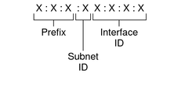
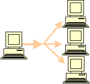

# Địa chỉ IPv6 và phân loại

Địa chỉ IPv6 có chiều dài 128 bit, điều đó cho phép có thể biểu diễn đến 3.4x1038 (340.000.000.000.000.000.000.000.000.000.000.000.000) địa chỉ

Một địa chỉ IPv6 thường được viết thành 8 nhóm, mỗi nhóm gồm có 4 số hexa phân cách bởi dấu ":", ví dụ:

`2001:0DC8::1005:2F43:0BCD:FFFF`

Điều này đã nảy sinh một vấn để khi trình duyệt của bạn xử lý bất cứ những cái gì đó phía sau dấu ":" như một số chỉ thị của cổng. Trong trường hợp đó, các địa chỉ IPv6 được phân biệt bên trong dấu ngoặc khi chúng được sử dụng như một phần của URL. Ví dụ:

`HTTP://[2001:0DC8:0000:0000:1005:2F43:0BCD:FFFF]/`

Giống như có thể chỉ định số của cổng với địa chỉ IPv4, bạn cũng có thể chỉ định số cổng khi sử dụng địa chỉ IPv6. Số cổng phải đi sau cùng một định dạng bắt buộc như khi sử dụng IPv4. Và ở bên ngoài các dấu ngoặc. Ví dụ:

`HTTP://[2001:0DC8:0000:0000:1005:2F43:0BCD:FFFF]:80/`

Để xem một địa chỉ IPv6 được phân chia như thế nào thành các phần con khác nhau của nó, bạn hãy quan sát đến địa chỉ dưới đây: 

`2001:0DC8:0000:0000:1005:2F43:0BCD:FFFF`

Phần `site prefix` của địa chỉ này là: `2001:0DC8:0000`. Trường tiếp theo là `0000` biểu thị `subnet ID`. Các byte còn lại `1005:2F43:0BCD:FFFF` biểu thị `interface ID`. 

## 1. Rút gọn cách viết địa chỉ IPv6:

- Quy tắc 1: Trong một nhóm 4 số hexa, có thể bỏ bớt những số 0 bên trái. Ví dụ cụm số “0000” có thể viết thành “0”, cụm số “09C0” có thể viết thành “9C0”

- Quy tắc 2: Trong cả địa chỉ ipv6, một số nhóm liền nhau chứa toàn số 0 có thể không viết và chỉ viết thành "::". Tuy nhiên, chỉ được thay thế một lần như vậy trong toàn bộ một địa chỉ ipv6.

## 2. Phân loại:

Theo cách thức một gói tin được truyền tải đến đích, địa chỉ IPv6 bao gồm ba loại: `unicast`, `multicast`, `anycast`. 

Để hoạt động được, thiết bị IPv6 có thể và cần phải được gắn nhiều dạng địa chỉ thuộc ba loại địa chỉ đã nêu trên.

RFC 3513 - Internet Protocol Version 6 (IPv6) Addressing Architecture mô tả cấu trúc ba loại địa chỉ ipv6:

### 2.1 Địa chỉ unicast

Địa chỉ unicast xác định một giao diện duy nhất trong phạm vi tương ứng. Trong mô hình định tuyến, các gói tin có địa chỉ đích là địa chỉ unicast chỉ được gửi tới một interface duy nhất.  Địa chỉ unicast được sử dụng trong giao tiếp một – một

### 2.2 Địa chỉ multicast

Địa chỉ multicast định danh nhiều interface. Gói tin có địa chỉ đích là địa chỉ multicast sẽ được gửi tới tất cả các interface trong nhóm được gắn địa chỉ đó. Địa chỉ multicast được sử dụng trong giao tiếp một – nhiều.

Trong địa chỉ ipv6 không còn tồn tại khái niệm địa chỉ broadcast. Mọi chức năng của địa chỉ broadcast trong ipv4 được đảm nhiệm thay thế bởi địa chỉ ipv6 multicast. Ví dụ chức năng broadcast trong một subnet của địa chỉ ipv4 được đảm nhiệm bằng một loại địa chỉ ipv6 là địa chỉ multicast mọi node phạm vi link (link-local scope all-nodes multicast address `FF02::1`)

### 2.3. Địa chỉ anycast

Địa chỉ anycast cũng xác định tập hợp nhiều giao diện. Tuy nhiên, trong mô hình định tuyến, gói tin có địa chỉ đích anycast chỉ được gửi tới một giao diện duy nhất trong tập hợp. Giao diện đó là giao diện “gần nhất” theo khái niệm của thủ tục định tuyến.

### 2.4 So sánh với địa chỉ IPv4

|IPv4 Address|	IPv6 Address|
|---|---|
|Internet address classes|Không sử dụng trong IPv6|
|Multicast addresses (224.0.0.0/4)|	IPv6 multicast addresses (FF00::/8)|
|Broadcast addresses	|Không sử dụng trong IPv6|
|Địa chỉ không xác định 0.0.0.0	|Địa chỉ không xác định ::|
|Địa chỉ loopback  127.0.0.1|	Địa chỉ loopback ::1|
|Public IP addresses	|Global unicast addresses|
|Private IP addresses (10.0.0.0/8, 172.16.0.0/12, and 192.168.0.0/16)	|Site-local addresses (FEC0::/10)|
|Autoconfigured addresses (169.254.0.0/16)|	Link-local addresses (FE80::/64)|
|Text representation: Dotted decimal notation|	Text representation: Colon hexadecimal format with suppression of leading zeros and zero compression. IPv4-compatible addresses are expressed in dotted decimal notation.|
|Network bits representation: Subnet mask in dotted decimal notation or prefix length	|Network bits representation: Prefix length notation only
|DNS name resolution: IPv4 host address (A) resource record	|DNS name resolution: IPv6 host address (AAAA) resource record|
|DNS reverse resolution: IN-ADDR.ARPA domain|	DNS reverse resolution: IP6.ARPA domain|

**Tham khảo**

http://daotaoipv6.vnnic.vn/