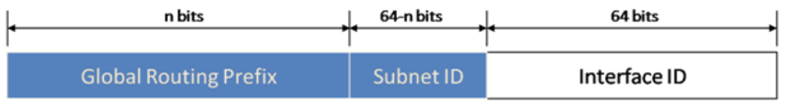

# Các dạng địa chỉ IPv6

Địa chỉ unicast có năm dạng sau đây :
1) Địa chỉ đặc biệt (Special address)
2) Địa chỉ Link-local
3) Địa chỉ Site-local
4) Địa chỉ định danh toàn cầu (Global unicast address)
5) Địa chỉ tương thích (Compatibility address)

## 1. Địa chỉ đặc biệt

`0:0:0:0:0:0:0:0` hay còn được viết "::" là dạng địa chỉ “không định danh” được sử dụng để thể hiện rằng hiện tại node không có địa chỉ.

`0:0:0:0:0:0:0:1` hay "::1" được sử dụng làm địa chỉ xác định giao diện loopback, cho phép một node gửi gói tin cho chính nó, tương đương với địa chỉ 127.0.0.1 của ipv4.

## 2. Địa chỉ Link-local

Trong IPv6, các node trên cùng một đường link coi nhau là các node lân cận (neighbor node).

Giao thức Neighbor Discovery (ND) là một giao thức thiết yếu, phục vụ giao tiếp giữa các node lân cận.

Địa chỉ link-local được tạo nên từ 64 bit định danh giao diện Interface và một tiền tố (prefix) quy định sẵn cho địa chỉ link-local là `FE80::/10`.

**Cấu trúc của địa chỉ link-local**

Một địa chỉ link-local cũng dựa vào interface identifier (định danh giao diện), nhưng dùng một dạng khác cho tiền tố mạng (network prefix).

Dạng địa chỉ link-local

|bits	| 10	| 54 |	64 |
|--|--|--|--|
|field	|prefix	|zeroes	|interface identifier|

Địa chỉ link-local bắt đầu bởi 10 bit tiền tố `FE80::/10` (giá trị nhị phân `1111 1110 10`), theo sau bởi 54 bit 0. 64 bit còn lại là định danh giao diện (Interface ID).

4) Địa chỉ định danh toàn cầu (Global unicast address)
- Định nghĩa ở RFC 3587
- 
- Cấu hình tự động ở interface

## 3. Tóm tắt các dạng địa chỉ IPv6:

|Bit | Dạng địa chỉ | Chú thích|
|---|---|---|
|:: | Địa chỉ đặc biệt | |
|::1 | Địa chỉ loopback | |
|FE80::/10 | Địa chỉ link-local | |
|FEC0::/10 | Địa chỉ site local | Đã được hủy bỏ |
|2000::/3 | Địa chỉ unicast định danh toàn cầu.
Trong đó: 2002::/16 là Địa chỉ của tunnel 6to4  |
|::w.x.y.z | Địa chỉ tương thích | Dùng cho công nghệ tunnel tự động.|
|::FFFF:w.x.y.z | Địa chỉ IPv4 - map | Dùng trong biên dịch địa chỉ IPv6-IPv4 |
|FF::/8 |Địa chỉ multicast ||
|FF01::1 |Địa chỉ multicast mọi node phạm vi node||
|FF02::1 |Địa chỉ multicast mọi node phạm vi link||
|FF01::2 |Địa chỉ multicast mọi router phạm vi node||
|FF02::2 |Địa chỉ multicast mọi router phạm vi link||
|FF05::2 |Địa chỉ multicast mọi router phạm vi site||
|FF02::1:FF/104 |Địa chỉ multicast Solicited node||

**Tham khảo**

https://mirrors.deepspace6.net/Linux+IPv6-HOWTO/x1159.html
https://vi.wikipedia.org/wiki/%C4%90%E1%BB%8Ba_ch%E1%BB%89_IPv6