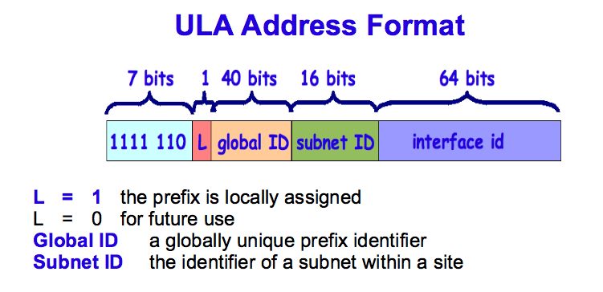
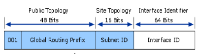
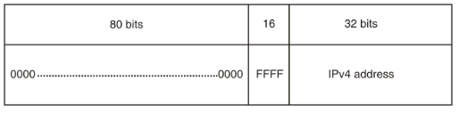

# Các dạng địa chỉ IPv6

Địa chỉ unicast có năm dạng sau đây :
1. Địa chỉ đặc biệt (Special address)
2. Địa chỉ Link-local
3. Địa chỉ Site-local
4. Địa chỉ định danh toàn cầu (Global unicast address)
5. Địa chỉ tương thích (Compatibility address)

## 1. Địa chỉ đặc biệt

`0:0:0:0:0:0:0:0` hay còn được viết "::" là dạng địa chỉ “không định danh” được sử dụng để thể hiện rằng hiện tại node không có địa chỉ.

`0:0:0:0:0:0:0:1` hay "::1" được sử dụng làm địa chỉ xác định giao diện loopback, cho phép một node gửi gói tin cho chính nó, tương đương với địa chỉ `127.0.0.1` của ipv4.

## 2. Địa chỉ Link-local

Trong IPv6, các node trên cùng một đường link coi nhau là các node lân cận (neighbor node)

Địa chỉ link-local được tạo nên từ 64 bit định danh giao diện Interface và một tiền tố (prefix) quy định sẵn cho địa chỉ link-local là `FE80::/10`.

**Cấu trúc của địa chỉ link-local**

Một địa chỉ link-local cũng dựa vào interface identifier (định danh giao diện), nhưng dùng một dạng khác cho tiền tố mạng (network prefix).

Dạng địa chỉ link-local

Địa chỉ link-local bắt đầu bởi 10 bit tiền tố `FE80::/10` (giá trị nhị phân `1111 1110 10`), theo sau bởi 54 bit 0. 64 bit còn lại là định danh giao diện (Interface ID).

## 3. Địa chỉ site-local
Dạng địa chỉ ipv6 Site-local được thiết kế với mục đích sử dụng trong phạm vi một mạng, tương đương với địa chỉ dùng riêng (private) trong ipv4

Địa chỉ Site-local được định nghĩa trong thời kỳ đầu phát triển IPv6. Trong quá trình sử dụng IPv6, người ta nhận thấy nhu cầu sử dụng địa chỉ dạng site-local trong tương lai phát triển của thế hệ địa chỉ ipv6 là không thực tế và không cần thiết. Do vậy, IETF đã sửa đổi RFC3513, loại bỏ đi dạng địa chỉ site-local. Chức năng của địa chỉ Site-local được thay thế bởi dạng địa chỉ IPV6 khác đang được dự thảo, là Globally Unique Local

## 3b. Unique Local Unicast Addresses (ULA)
Được sử dụng để thay thế địa chỉ site-local.

IETF đã dành riêng khối địa chỉ `fc00::/7` vào tháng 10 năm 2005 để sử dụng trong các mạng IPv6 riêng tư và xác định thuật ngữ Unique Local Unicast Addresses (ULA)

Khối địa chỉ `fc00::/7` được chia thành hai phần, `fc00::/8` và `fd00 ::/8`.

Khối `fc00::/8` không xác định.

Khối `fd00::/8` được xác định cho /48 tiền tố, được hình thành bằng cách đặt bốn mươi bit có ý nghĩa nhỏ nhất của tiền tố thành chuỗi bit được tạo ngẫu nhiên.

Một tiền tố định tuyến trong phạm vi `fd00 ::/8` có thể được xây dựng bằng cách tạo một chuỗi thập lục phân 40 bit ngẫu nhiên, lấy ví dụ này là `e48dba82e1`. Chuỗi được gắn vào tiền tố `fd00::/8`. Điều này tạo thành tiền tố định tuyến 48 bit `fde4:8dba:82e1::/48`. Với tiền tố này, 65536 mạng con có kích thước /64 có sẵn cho mạng riêng.

Các tiền tố trong phạm vi `fd00::/8` có các đặc điểm tương tự như các phạm vi địa chỉ riêng của IPv4: 

- Chúng không được cấp bởi một sổ đăng ký địa chỉ và có thể được sử dụng trong các mạng mà không có ai tham gia bên ngoài. 
- Không được đảm bảo là duy nhất trên toàn cầu. 
- Các mục nhập Hệ thống tên miền ngược (DNS) (trong ip6.arpa) cho `fd00::/8` ULAs không thể được ủy quyền trong DNS toàn cầu.

Vì `fd00::/8` ULA không có nghĩa là được định tuyến bên ngoài miền quản trị (trang web hoặc tổ chức) của họ, nên các quản trị viên của các mạng kết nối thông thường không cần phải lo lắng về tính duy nhất của tiền tố ULA. Tuy nhiên, nếu các mạng yêu cầu định tuyến các ULA với nhau trong trường hợp sáp nhập, chẳng hạn, rủi ro va chạm địa chỉ là nhỏ nếu sử dụng thuật toán lựa chọn RFC 4193.

## 4. Địa chỉ định danh toàn cầu (Global unicast address)
Đây là dạng địa chỉ tương đương với địa chỉ ipv4 public. Chúng được định tuyến và có thể liên kết tới trên phạm vi toàn cầu. 

3 bít đầu tiên 001 xác định dạng địa chỉ global unicast.

## 5. Địa chỉ tương thích (Compatibility address)
	
Địa chỉ tương thích được định nghĩa nhằm mục đích hỗ trợ việc chuyển đổi từ địa chỉ ipv4 sang địa chỉ ipv6, bao gồm:
- Sử dụng trong công nghệ biên dịch giữa địa chỉ ipv4 – ipv6
- Hoặc được sử dụng cho một hình thức chuyển đổi được gọi là "đường hầm – tunnel", lợi dụng cơ sở hạ tầng sẵn có của mạng ipv4 kết nối các mạng ipv6 bằng cách bọc gói tin ipv6 vào trong gói tin đánh địa chỉ ipv4 để truyền đi trên mạng ipv4.

- IPv4-compatible (::x.y.z.w), được dùng khi các node IPv6/IPv4 liên lạc với nhau bằng IPv6.
- IPv4-mapped (::FFFF:x.y.z.w), được dùng khi node IPv4 liên lạc với node IPv6.
- 6to4 được dùng khi liên lạc giữa các node IPv4 và các node IPv6 thông qua định tuyến IPv4. Có định dạng kết hợp giữa prefix2002::/16 và 32-bit của địa chỉ public IPv4.

**Địa chỉ IPv4-compatible**

Địa chỉ IPv4-compatible được tạo từ 32 bit địa chỉ ipv4 và được viết như sau:

`0:0:0:0:0:0:w.x.y.z` hoặc `::w.x.y.z`

Trong đó `w.x.y.z` là địa chỉ ipv4 viết theo cách thông thường

Dạng địa chỉ IPv4-compatible được sử dụng cho công nghệ tunnel tự động. Nếu một địa chỉ IPv4-compatible được sử dụng làm địa chỉ ipv6 đích, lưu lượng ipv6 đó sẽ được tự động bọc trong gói tin có ipv4 header và gửi tới đích sử dụng cơ sở hạ tầng mạng ipv4.

Hiện nay, nhu cầu về dạng kết nối tunnel tự động này không còn nữa. Do vậy, dạng địa chỉ này cũng đã được loại bỏ không còn sử dụng trong giai đoạn phát triển tiếp theo của địa chỉ ipv6.

**Địa chỉ IPv4-mapped**

Địa chỉ IPv4-mapped cũng được tạo nên từ 32 bít địa chỉ ipv4 và có dạng như sau: `0:0:0:0:0:FFFF:w.x.y.z` hoặc `::FFFF:w.x.y.z`

Trong đó `w.x.y.z` là địa chỉ ipv4 viết theo cách thông thường.

Ví dụ: `::FFFF:129.144.52.38`

Địa chỉ này được sử dụng để biểu diễn một node thuần ipv4 thành một node ipv6 và được sử dụng trong công nghệ biên dịch địa chỉ IPv4 – IPv6 (ví dụ công nghệ NAT-PT, phục vụ giao tiếp giữa mạng thuần địa chỉ ipv4 và mạng thuần địa chỉ ipv6). Địa chỉ IPv4-mapped không bao giờ được dùng làm địa chỉ nguồn hay địa chỉ đích của một gói tin ipv6.

**Địa chỉ 6to4**

IANA đã cấp phát một prefix địa chỉ dành riêng `2002::/16` trong vùng địa chỉ có ba bít đầu 001 (vùng địa chỉ unicast toàn cầu) để sử dụng cho một công nghệ chuyển đổi giao tiếp ipv4-ipv6 rất thông dụng có tên gọi công nghệ tunnel 6to4.

Địa chỉ 6to4 được sử dụng trong giao tiếp giữa hai node chạy đồng thời cả hai thủ tục ipv4 và ipv6 trên mạng cơ sở hạ tầng định tuyến của ipv4. Địa chỉ 6to4 được hình thành bằng cách gắn prefix `2002::/16` với 32 bít địa chỉ ipv4 (viết dưới dạng hexa), từ đó tạo nên một prefix địa chỉ /48.

# Địa chỉ Mulicast

Địa chỉ Multicast IPv6 thực hiện cả chức năng broadcast và multicast của IPv4. Có nhiều loại địa chỉ multicast IPv6, mỗi loại địa chỉ multicast IPv6 có phạm vi hoạt động tương ứng. Lưu lượng của địa chỉ IPv6 multicast sẽ được chuyển tới toàn bộ các host trong một phạm vi hay chỉ được chuyển tới nhóm các host nào đó trong phạm vi là tùy thuộc vào loại địa chỉ multicast.

Cấu trúc của địa chỉ IPv6:

Địa chỉ ipv6 multicast luôn được bắt đầu bởi 8 bít prefix 1111 1111. Dạng địa chỉ này rất dễ phân biệt vì nó luôn được bắt đầu bằng `FF`. Địa chỉ multicast không bao giờ được sử dụng làm địa chỉ nguồn của một gói tin IPv6 .

Để phân biệt dạng địa chỉ multicast, nhóm địa chỉ multicast và phạm vi của chúng, trong cấu trúc địa chỉ multicast sử dụng những nhóm bít tạo thành các trường sau đây: Cờ - flag (4 bit), phạm vi - Scope (4 bít) và Định danh nhóm-Group ID (32 bit)

- Cờ (Flag) : Trường này có bốn bít `0T00`, trong đó 3 bít hiện chưa sử dụng được đặt giá trị 0, bít T sẽ xác định đây là dạng địa chỉ IPv6 multicast được IANA gắn vĩnh viễn (permanent-assigned) hay được gắn không vĩnh viễn do người sử dụng tự quy định (non permanent-assigned). Khái niệm này cũng tương tự như khái niệm well-known port trong thủ tục TCP/IP.

- Bít T=0, có nghĩa đây là địa chỉ multicast IPv6 vĩnh viễn (well known) được IANA quy định. RFC2375 - IPv6 Multicast Address Assignments cung cấp danh sách các loại địa chỉ well-known multicast hiện đang được quy định bởi IANA. 

- Bít T=1, đây là dạng địa chỉ multicast không vĩnh viễn

- Phạm vi (Scope): Trường này gồm 4 bít xác định phạm vi của nhóm địa chỉ multicast. Hiện nay đang định nghĩa các giá trị như sau:
    - 1: Phạm vi Node
    - 2: Phạm vi Link
    - 5: Phạm vi Site
    - 8: Phạm vi tổ chức Organisation
    - E: Phạm vi toàn cầu Global 

Giải thích một cách rõ ràng hơn, nếu ta thấy 4 bít trường scope là "0001" (Scope có giá trị 1) khi đó phạm vi của địa chỉ multicast này là phạm vi node. Gói tin multicast sẽ chỉ được gửi trong phạm vi các giao diện trong một node mà thôi.

Nếu 4 bít này là "0010", giá trị trường Scope là 2, phạm vi của địa chỉ multicast là  phạm vi link. Gói tin multicast được gửi trên phạm vi toàn bộ đường local link.

Router sử dụng giá trị trường Scope của địa chỉ multicast để quyết định có forward lưu lượng multicast hay không. Ví dụ địa chỉ multicast FF02::2 có phạm vi link-local, router sẽ không bao giờ forward gói tin này ra khỏi phạm vi local link.

- Nhóm (Group ID) – Thực hiện chức năng định danh các nhóm multicast. Trong một phạm vi scope, có nhiều nhóm multicast (ví dụ nhóm multicast các router, nhóm multicast mọi node, nhóm multicast mọi máy chủ DHCP…). Giá trị các bít Group ID sẽ định danh các nhóm multicast. Trong một phạm vi, số định danh này là duy nhất. Lưu lượng có địa chỉ đích multicast sẽ được chuyển tới các máy thuộc nhóm multicast xác định bởi Group ID, trong phạm vi xác định bởi Scope.

Theo thiết kế ban đầu, Group ID gồm 112 bít. Với 112 bít, có thể định danh 2112 group. Tuy nhiên, để có thể truyền đi trên mạng tới đích, datagram dữ liệu phải chứa thông tin địa chỉ IP (lớp network) và địa chỉ lớp link-layer (địa chỉ MAC trong trường hợp kết nối Ethernet) tương ứng. Để có được ánh xạ 1-1 từ một địa chỉ IPv6 multicast tới một địa chỉ Ethernet multicast MAC duy nhất, số lượng bít của Group ID được khuyến nghị là 32 bít. Chúng ta sẽ tìm hiểu quy tắc ánh xạ địa chỉ IPv6 multicast tới địa chỉ Ethernet multicast MAC trong mục sau.

# Địa chỉ AnyCast

Địa chỉ anycast được gắn cho một nhóm nhiều giao diện. Gói tin được gửi tới địa chỉ anycast sẽ được chuyển đi theo cấu trúc định tuyến tới giao diện gần nhất trong nhóm (tính theo thủ tục định tuyến). RFC3513 định nghĩa địa chỉ anycast với những đặc điểm như sau:

- Anycast không có không gian địa chỉ riêng mà thuộc vùng địa chỉ unicast. Khi một địa chỉ unicast được gắn đồng thời cho nhiều giao diện, nó sẽ trở thành địa chỉ anycast.

- Một địa chỉ anycast có thể được gắn cho nhiều giao diện của nhiều node.

Địa chỉ anycast không bao giờ được sử dụng làm địa chỉ nguồn của một gói tin ipv6. Hiện nay, địa chỉ anycast không được gắn cho ipv6 host mà chỉ được gắn cho ipv6 router. Một trong những ứng dụng mong muốn của địa chỉ anycast là sử dụng để xác định một tập các router thuộc về một tổ chức cung cấp dịch vụ Internet.

Hiện nay, mới chỉ có một dạng địa chỉ anycast được định nghĩa và ứng dụng. Đó là địa chỉ anycast Subnet-Router. Một địa chỉ anycast Subnet-Router tương ứng với một prefix địa chỉ trong subnet.

## 3. Tóm tắt các dạng địa chỉ IPv6:

|Bit | Dạng địa chỉ | Chú thích|
|---|---|---|
|:: | Địa chỉ đặc biệt | |
|::1 | Địa chỉ loopback | |
|FE80::/10 | Địa chỉ link-local | |
|FEC0::/10 | Địa chỉ site local | Đã được hủy bỏ |
|2000::/3 | Địa chỉ unicast định danh toàn cầu.
Trong đó: 2002::/16 là Địa chỉ của tunnel 6to4  |
|::w.x.y.z | Địa chỉ tương thích | Dùng cho công nghệ tunnel tự động.|
|::FFFF:w.x.y.z | Địa chỉ IPv4 - map | Dùng trong biên dịch địa chỉ IPv6-IPv4 |
|FF::/8 |Địa chỉ multicast ||
|FF01::1 |Địa chỉ multicast mọi node phạm vi node||
|FF02::1 |Địa chỉ multicast mọi node phạm vi link||
|FF01::2 |Địa chỉ multicast mọi router phạm vi node||
|FF02::2 |Địa chỉ multicast mọi router phạm vi link||
|FF05::2 |Địa chỉ multicast mọi router phạm vi site||
|FF02::1:FF/104 |Địa chỉ multicast Solicited node||

**Tham khảo**

https://mirrors.deepspace6.net/Linux+IPv6-HOWTO/x1159.html
https://vi.wikipedia.org/wiki/%C4%90%E1%BB%8Ba_ch%E1%BB%89_IPv6