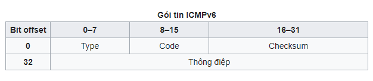

Internet Control Message Protocol version 6 (ICMPv6) là phiên bản được biến đổi và nâng cấp của Internet Control Message Protocol (ICMP) cho giao thức liên mạng thế hệ 6 (IPv6).

Gói tin ICMPv6

Gói tin ICMPv6 bao gồm phần header và phần thông điệp. ICMPv6 header bao gồm ba trường: Type (8 bít), Code (8 bít) và Checksum (16 bít).

- `type` xác định loại thông điệp. Giá trị từ 0 tới 127 (bít đầu tiên là 0) chỉ thông điệp lỗi, từ 128 tới 255 (bít đầu tiên là 1) thông điệp thông tin.

- `code` phân dạng sâu hơn gói tin ICMPv6, định rõ đây là gói tin dạng gì trong từng loại thông điệp ICMPv6.

- `checksum` cung cấp giá trị sử dụng để kiểm tra lỗi cho toàn bộ gói tin ICMPv6.

Gói tin ICMPv6: 

Các loại thông điệp:

Tham khảo thêm ở link: 
http://www.iana.org/assignments/icmpv6-parameters/icmpv6-parameters.xhtml

Thông điệp thông tin ICMPv6 chia thành hai nhóm: Thông điệp thông tin cơ bản và Thông điệp thông tin mở rộng.

- Thông điệp thông tin cơ bản: Bao gồm "Echo request" và "Echo reply". Hai dạng thông điệp này được sử dụng trong chẩn đoán mạng: ping, traceroute, ..

- Thông điệp thông tin mở rộng: Là những thông điệp ICMPv6 được sử dụng bởi thủ tục thực hiện chức năng giao tiếp giữa các node lân cận trong một đường kết nối Neighbor Discovery - ND và thủ tục quản lý quan hệ thành viên nhóm multicast Multicast Listener Discovery - MLD, phục vụ cho các quy trình hoạt động cốt yếu của địa chỉ IPv6.
Xử lý thông điệp

Khi một nút ICMPv6 nhận một gói tin, nó phải thực hiện những hành động tùy thuộc vào loại thông điệp. Giao thức ICMPv6 phải hạn chế số lượng các thông điệp lỗi gửi đến cùng một điểm đến để tránh quá tải mạng. Ví dụ, nếu một nút tiếp tục chuyển các gói tin lỗi, ICMP sẽ báo hiệu lỗi tới gói đầu tiên và sau đó làm như vậy theo định kỳ, với thời gian tối thiểu cố định hoặc với tải trọng mạng tối đa cố định. Một thông điệp lỗi ICMP không bao giờ được gửi để đáp ứng với một thông điệp lỗi ICMP khác.