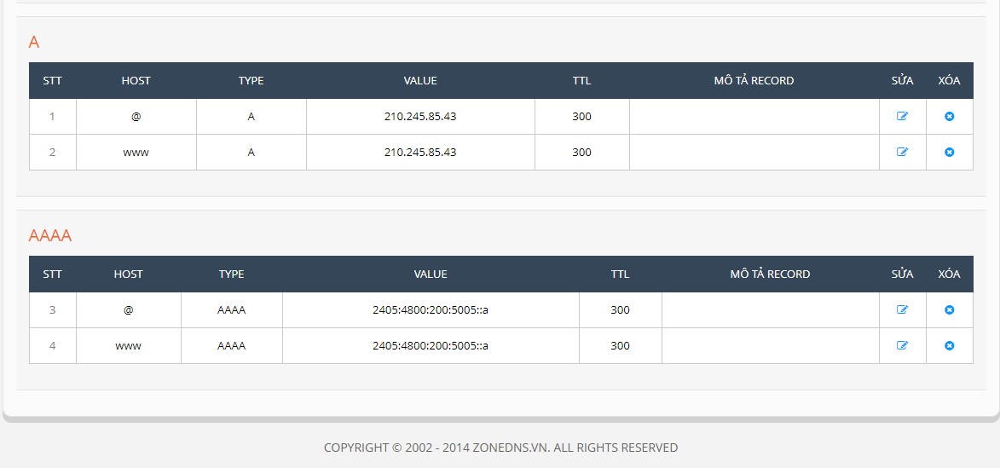

# Cài đặt Apache sử dụng song song IPv4 và IPv6 #

## Cấu hình IPv4 và IPv6

- Thực hiện thay đổi cấu hình IP:

```
vi /etc/sysconfig/network-scripts/ifcfg-eth0
```

Thực hiện thay đổi cấu hình `eth0` như dưới:
```
DEVICE=eth0
HWADDR=00:0C:29:8B:0E:19
TYPE=Ethernet
UUID=7108eeb6-4e66-465a-b906-de4989e3dd82
ONBOOT=yes
NM_CONTROLLED=yes
BOOTPROTO=static
IPV6INIT=yes
NETWORKING_IPV6=yes
IPV6ADDR=2405:4800:200:5005::a/64
IPV6_DEFAULTGW=2405:4800:200:5005::1
DNS1=2001:4860:4860::8888
DNS2=2001:4860:4860::8844
IPV4_FAILURE_FATAL="no"
IPADDR="210.245.85.43"
PREFIX="24"
GATEWAY="210.245.85.1"
```

- Khởi động lại network

```
service network restart
```

- Kiểm tra IP

```
   [root@centos6test ~]# ip a
    1: lo: <LOOPBACK,UP,LOWER_UP> mtu 65536 qdisc noqueue state UNKNOWN 
    link/loopback 00:00:00:00:00:00 brd 00:00:00:00:00:00
    inet 127.0.0.1/8 scope host lo
    inet6 ::1/128 scope host 
       valid_lft forever preferred_lft forever
    2: eth0: <BROADCAST,MULTICAST,UP,LOWER_UP> mtu 1500 qdisc pfifo_fast state UP qlen 1000
    link/ether 00:0c:29:8b:0e:19 brd ff:ff:ff:ff:ff:ff
    inet 210.245.85.43/24 brd 210.245.85.255 scope global eth0
    inet6 2405:4800:200:5005::a/64 scope global 
       valid_lft forever preferred_lft forever
    inet6 fe80::20c:29ff:fe8b:e19/64 scope link 
       valid_lft forever preferred_lft forever
```

## Cài đặt LAMP

### Cài đặt Apache

```
yum install httpd -y
``` 

- Khởi động service Apache

```
service httpd start
```

- Mở port 80

```
/sbin/iptables -I INPUT -p tcp --dport 80 -j ACCEPT
/sbin/ip6tables -I INPUT -p tcp --dport 80 -j ACCEPT
/etc/rc.d/init.d/iptables save
```

- Tạo document root và folder chứa log

```
mkdir -p /var/www/minhphuong.pw/public_html
mkdir /var/www/minhphuong.pw/logs
```

**Nếu tạo thêm các virtual host khác thì reload service Apache**

`service httpd reload`

### Cài đặt MySQL

```
yum install mysql-server -y
service mysqld start
```

- Cấu hình cho mysql

`/usr/bin/mysql_secure_installation`

### Cài đặt PHP

```
yum install php php-mysql -y
```

- Thiết lập cho Apache và MySQL khởi dộng cùng máy chủ

```
chkconfig httpd on
chkconfig mysqld on
```

- Khởi động lại service Apache

```
service httpd restart
```

### Cấu hình virtual host

- Tạo file minhphuong.pw.conf

```
vi /etc/httpd/conf.d/minhphuong.pw.conf
```

- Chèn nội dung:

```
	<VirtualHost *:80>
     	ServerAdmin webmaster@minhphuong.pw
     	ServerName minhphuong.pw
     	ServerAlias www.minhphuong.pw
    	DocumentRoot /var/www/minhphuong.pw/public_html/
     	ErrorLog /var/www/minhphuong.pw/logs/error.log
     	CustomLog /var/www/minhphuong.pw/logs/access.log combined
	</VirtualHost>
```

- Thực hiện việc upload mã nguồn vào thư mục root và trỏ domain vè IPv4 (IPv6):




