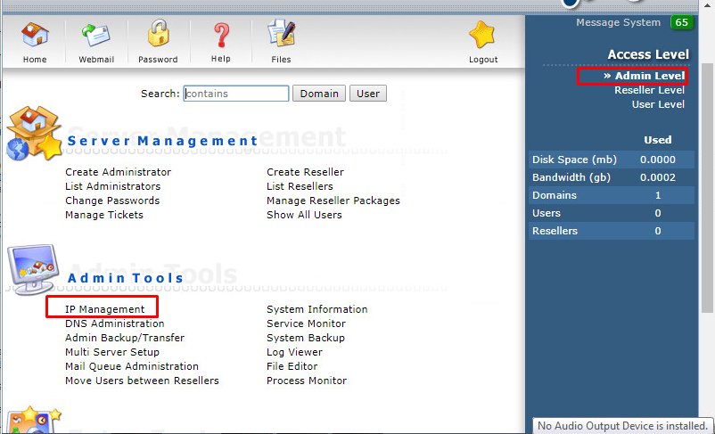
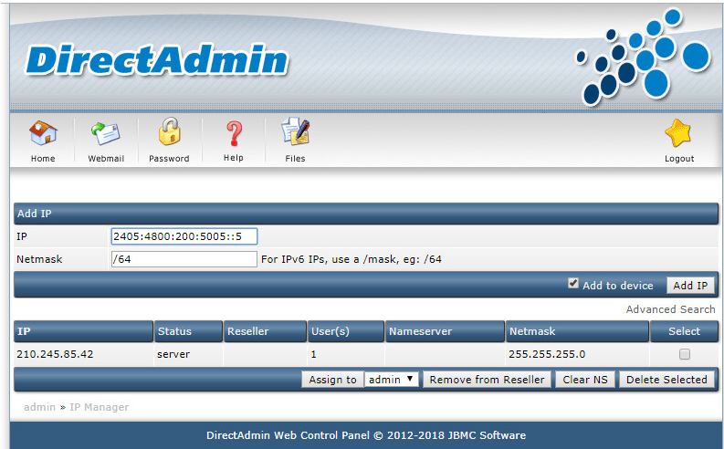
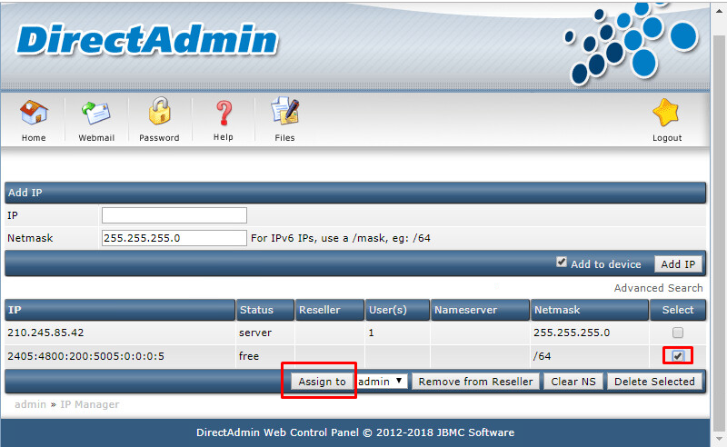
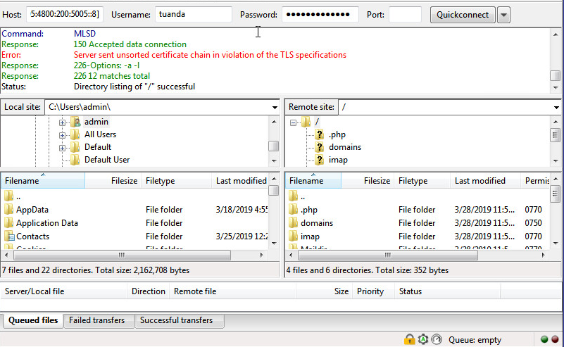

DirectAdmin từ phiên bản 1.37.0 đã hỗ trợ IPv6, cụ thể:

## Cấu hình để DirectAdmin sử dụng IPv6:
Thêm `ipv6=1` vào file `/usr/local/directadmin/conf/directadmin.conf`.
Sau đó restart lại DirectAdmin:

`
service directadmin restart
`
Sau đó có thể truy cập DirectAdmin thông qua IPv6, port 2222.

## Add IP vào DirectAdmin:
Tương tự như IPv4, `Admin Level` -> `IP Manager`.


Sau đó điền địa chỉ IPv6 (Không cần dấu `[ ]`):



Add IPv6 vào user sử dụng:



## Apache
Apache đã hỗ trợ IPv6 nên không cần thay đổi.

## Exim
Kiểm tra exim có compiled với IPv6 không:
```sh
[root@srv ~]# /usr/sbin/exim -bV | grep IPv6
Support for: crypteq IPv6 Perl OpenSSL move_frozen_messages Content_Scanning DKIM DNSSEC Event OCSP PRDR Experimental_SRS
```

Thay đổi cấu hình để Exim listen IPv6:

- Sửa `disable_ipv6=false` trong file : `/etc/exim.variables.conf`.

- Sau đó restart lại exim

`service exim restart `

- Kiểm tra lại exim listen IPv6:
```sh
[root@srv ~]# netstat -tulpn | grep exim
tcp        0      0 0.0.0.0:587                 0.0.0.0:*                 LISTEN      27160/exim          
tcp        0      0 0.0.0.0:465                 0.0.0.0:*                   LISTEN      27160/exim          
tcp        0      0 0.0.0.0:25                  0.0.0.0:*                   LISTEN      27160/exim          
tcp        0      0 :::587                      :::*                        LISTEN      27160/exim          
tcp        0      0 :::465                      :::*                        LISTEN      27160/exim          
tcp        0      0 :::25                       :::*                        LISTEN      27160/exim          
```

## Dovecot
Nếu sử dụng Dovecot 2.0.x, sửa `/etc/dovecot.conf`:

```sh
#IPv4
listen = *

#IPv4 and IPv6:
#listen = *, ::
```
Thành
```sh
#IPv4
#listen = *

#IPv4 and IPv6:
listen = *, ::
```
Với Dovecot 1.2.x, thêm vào file `/etc/dovecot.conf`:

`listen = "*, [::]"`

Sau đó restart lại Dovecot:

`service dovecot restart `

Kiểm tra lại Dovecot listen IPv6:
```sh
[root@srv ~]# netstat -tulpn | grep dovecot
tcp        0      0 0.0.0.0:993                 0.0.0.0:*                   LISTEN      8757/dovecot/imap-l 
tcp        0      0 0.0.0.0:995                 0.0.0.0:*                   LISTEN      731/dovecot/pop3-lo 
tcp        0      0 0.0.0.0:110                 0.0.0.0:*                   LISTEN      731/dovecot/pop3-lo 
tcp        0      0 0.0.0.0:143                 0.0.0.0:*                   LISTEN      8757/dovecot/imap-l 
tcp        0      0 :::993                      :::*                        LISTEN      8757/dovecot/imap-l 
tcp        0      0 :::995                      :::*                        LISTEN      731/dovecot/pop3-lo 
tcp        0      0 :::110                      :::*                        LISTEN      731/dovecot/pop3-lo 
tcp        0      0 :::143                      :::*                        LISTEN      8757/dovecot/imap-l
```

## FTP
Đã hỗ trợ IPv6, thử đăng nhập thông qua IPv6:



## Bind (named)
- Add thêm vào file `/etc/named.conf `:

`listen-on-v6 port 53 { any; };`

- Restart lại service BIND : 

`service named restart`

- Kiểm tra lại service BIND listen IPv6 port 53 TCP/UDP.
