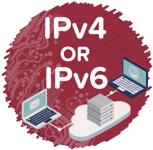

## 1. Tổng quan

Trong bối cảnh phát triển của Internet, giao thức IPv4 với 32 bit địa chỉ vẫn tiếp tục được sử dụng, hiện đang phục vụ tốt cho hoạt động mạng toàn cầu. Tuy nhiên, IPv4 đã bộc lộ một số hạn chế, khiến những nhà nghiên cứu, những tổ chức tiêu chuẩn hóa chịu trách nhiệm về hoạt động mạng toàn cầu nhận thấy cần có sự phát triển lên một tầm cao hơn của giao thức Internet.

IPv6, phiên bản mới của thủ tục Internet. Đây là phiên bản của giao thức Internet được thiết kế nhằm khắc phục những hạn chế của giao thức Internet IPv4 và bổ sung những tính năng mới cần thiết trong hoạt động và dịch vụ mạng thế hệ mới

## 2. Nhược điểm của địa chỉ IPv4
 
### a. Cấu trúc định tuyến không hiệu quả:

Mỗi router phải duy trì bảng thông tin định tuyến lớn, đòi hỏi router phải có dung lượng bộ nhớ lớn. Tồn tại song song trong mạng có cả VLSM, NAT,..

### b. Hạn chế về tính bảo mật và kết nối đầu cuối – đầu cuối:

Trong cấu trúc thiết kế của địa chỉ IPv4 không có cách thức bảo mật nào đi kèm. IPv4 không cung cấp phương tiện hỗ trợ mã hóa dữ liệu. Kết quả là hiện nay, bảo mật ở mức ứng dụng được sử dụng phổ biến, không bảo mật lưu lượng truyền tải giữa các host. 

Nếu áp dụng IPSec là một phương thức bảo mật phổ biến tại tầng IP, mô hình bảo mật chủ yếu là bảo mật lưu lượng giữa các mạng, việc bảo mật lưu lượng đầu cuối – đầu cuối được sử dụng rất hạn chế.

Để giảm nhu cầu tiêu dùng địa chỉ, hoạt động mạng IPv4 sử dụng phổ biến công nghệ biên dịch NAT (Network Address Translator). Trong đó, máy chủ biên dịch địa chỉ (NAT) can thiệp vào gói tin truyền tải và thay thế trường địa chỉ để các máy tính gắn địa chỉ Private có thể kết nối vào mạng Internet

**Mô hình sử dụng NAT của địa chỉ IPv4 có nhiều nhược điểm:**

- Không có kết nối điểm – điểm và gây trễ: Làm khó khăn và ảnh hưởng tới nhiều dạng dịch vụ (VPN, dịch vụ thời gian thực). Thậm chí đối với nhiều dạng dịch vụ cần xác thực port nguồn/ đích, sử dụng NAT là không thể được. Trong khi đó, các ứng dụng mới hiện nay, đặc biệt các ứng dụng client-server ngày càng đòi hỏi kết nối trực tiếp end-to-end.

- Việc gói tin không được giữ nguyên tình trạng từ nguồn tới đích, có những điểm trên đường truyền tải tại đó gói tin bị can thiệp, như vậy tồn tại những lỗ hổng về bảo mật.

### c. Nguy cơ thiếu hụt không gian địa chỉ

- Cùng những hạn chế của IPv4 thúc đẩy sự đầu tư nghiên cứu một giao thức internet mới, khắc phục những hạn chế của giao thức IPv4 và đem lại những đặc tính mới cần thiết cho dịch vụ và cho hoạt động mạng thế hệ tiếp theo. Giao thức Internet IETF đã đưa ra, quyết định thúc đẩy thay thế cho IPv4 là IPv6 (Internet Protocol Version 6), giao thức Internet phiên bản 6, còn được gọi là giao thức IP thế hệ mới (IP Next Generation – IPng). Địa chỉ Internet phiên bản 6 có chiều dài gấp 4 lần chiều dài địa chỉ IPv4, bao gồm 128 bit.

## 3. Mục tiêu trong thiết kế IPv6

IPv6 được thiết kế với mục tiêu như sau:
- Không gian địa chỉ lớn hơn và dễ dàng quản lý không gian địa chỉ.
- Hỗ trợ kết nối đầu cuối-đầu cuối và loại bỏ hoàn toàn công nghệ NAT
- Quản trị TCP/IP dễ dàng hơn: DHCP được sử dụng trong IPv4 nhằm giảm cấu hình thủ công TCP/IP cho host. IPv6 được thiết kế với khả năng tự động cấu hình, không cần sử dụng máy chủ DHCP, hỗ trợ hơn nữa trong việc giảm cấu hình thủ công.
- Cấu trúc định tuyến tốt hơn: Định tuyến IPv6 được thiết kế hoàn toàn phân cấp.
- Hỗ trợ tốt hơn Multicast: Multicast là một tùy chọn của địa chỉ IPv4, tuy nhiên khả năng hỗ trợ và tính phổ dụng chưa cao.
- Hỗ trợ bảo mật tốt hơn.
- Hỗ trợ tốt hơn cho di động.

**Tham khảo**
http://daotaoipv6.vnnic.vn/ch1/1_1_3/index.html
