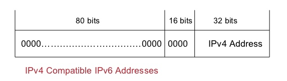
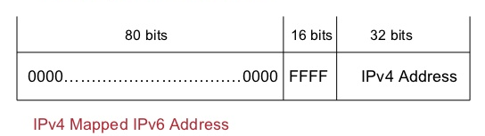

Compatibility Addresses

- IPv4-compatible addresses

0:0:0:0:0:0:w.x.y.z hoặc ::w.x.y.z (w.x.y.z là biểu diễn của IPv4), được sử dụng bởi node IPv4/IPv6 giao tiếp với node IPv6-only thông qua hạ tầng IPv4.

- IPv4-mapped addresses

0:0:0:0:0:FFFF:w.x.y.z hoặc ::FFFF:w.x.y.z, được sử dụng để biểu diễn kết nối từ IPv4 node đến IPv6 node. Thường được sử dụng trên các hệ thống với vai trò như translator giữa IPv4-only and IPv6-only nodes.

- 6over4 addresses
Bao gồm 64bit tiền tố unicast và unicast IPv4 address (dịch ra hệ 16). Thường được sử dụng khi automatic tunneling mechanism - RFC 2529

6over4 addresses are comprised of a valid 64-bit unicast address prefix and the interface identifier ::WWXX:YYZZ (where WWXX:YYZZ is the colon-hexadecimal representation of w.x.y.z, a unicast IPv4 address assigned to an interface). An example of a link-local 6over4 address based on the IPv4 address of 131.107.4.92 is FE80::836B:45C. 6over4 addresses are used to represent a host when using the automatic tunneling mechanism defined in RFC 2529. 

•	6to4 addresses
6to4 addresses are based on the prefix 2002:WWXX:YYZZ::/48 (where WWXX:YYZZ is the colon-hexadecimal representation of w.x.y.z, a public IPv4 address assigned to an interface). 6to4 address prefixes are used to represent a site when using the automatic tunneling mechanism defined in RFC 3056, also known as 6to4.

•	ISATAP addresses
Intra-site Automatic Tunnel Addressing Protocol (ISATAP) addresses are composed of a valid 64-bit unicast address prefix and the interface identifier ::0:5EFE:w.x.y.z (where w.x.y.z is a unicast IPv4 address assigned to an interface). An example of a link-local ISATAP address is FE80::5EFE:131.107.4.92. ISATAP is defined in the Internet draft titled "Intra-Site Automatic Tunnel Addressing Protocol (ISATAP)" (draft-ietf-ngtrans-isatap-x.txt at http://www.ietf.org/internet-drafts/). For more information, see “ISATAP” in this white paper.

•	Teredo addresses
Teredo addresses use the prefix 3FFE:831F::/32. An example of a Teredo address is 3FFE:831F:CE49:7601:8000:EFFF:62C3:FFFE. Beyond the first 32 bits, Teredo addresses are used to encode the IPv4 address of a Teredo server, flags, and the encoded version of a Teredo client's external address and port. Teredo is defined in the Internet draft titled "Teredo: Tunneling IPv6 over UDP through NATs" (draft-huitema-v6ops-teredo-0x.txt at http://www.ietf.org/internet-drafts/). For more information, see “Teredo” in this white paper.
