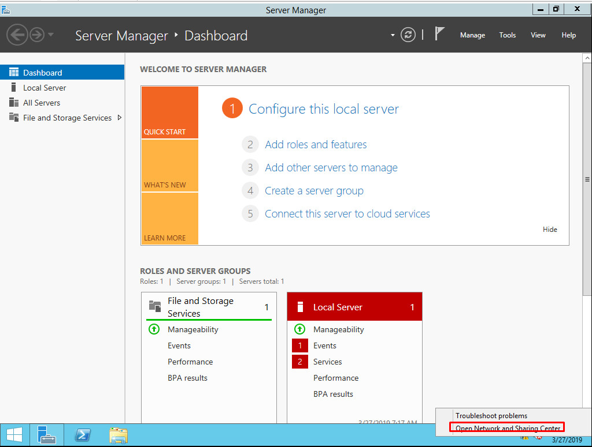
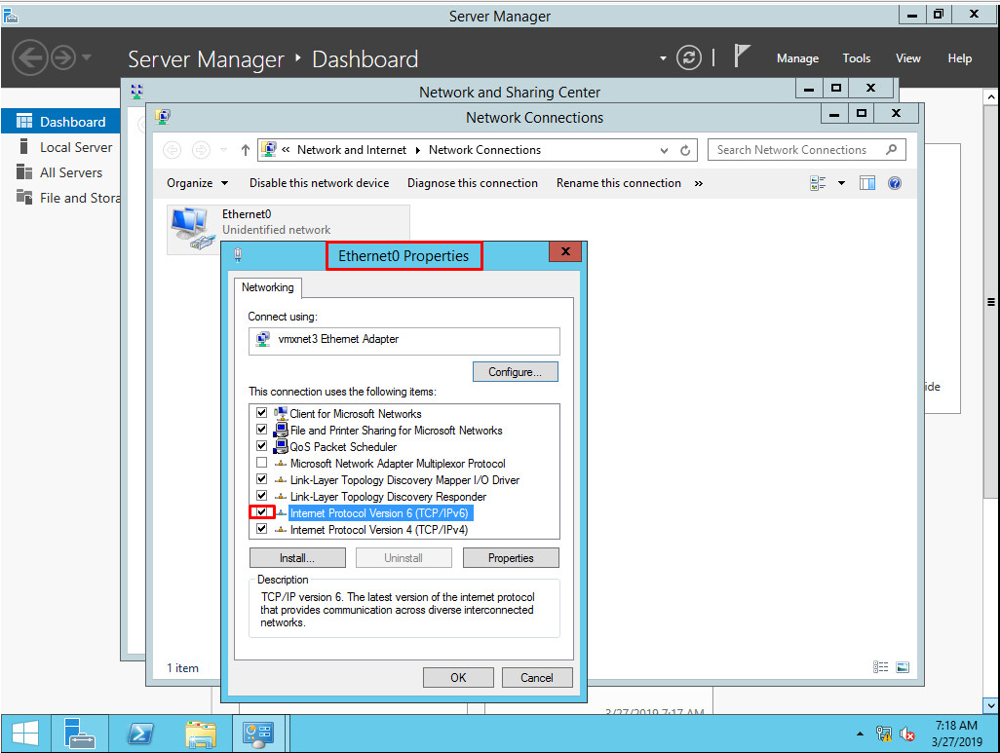
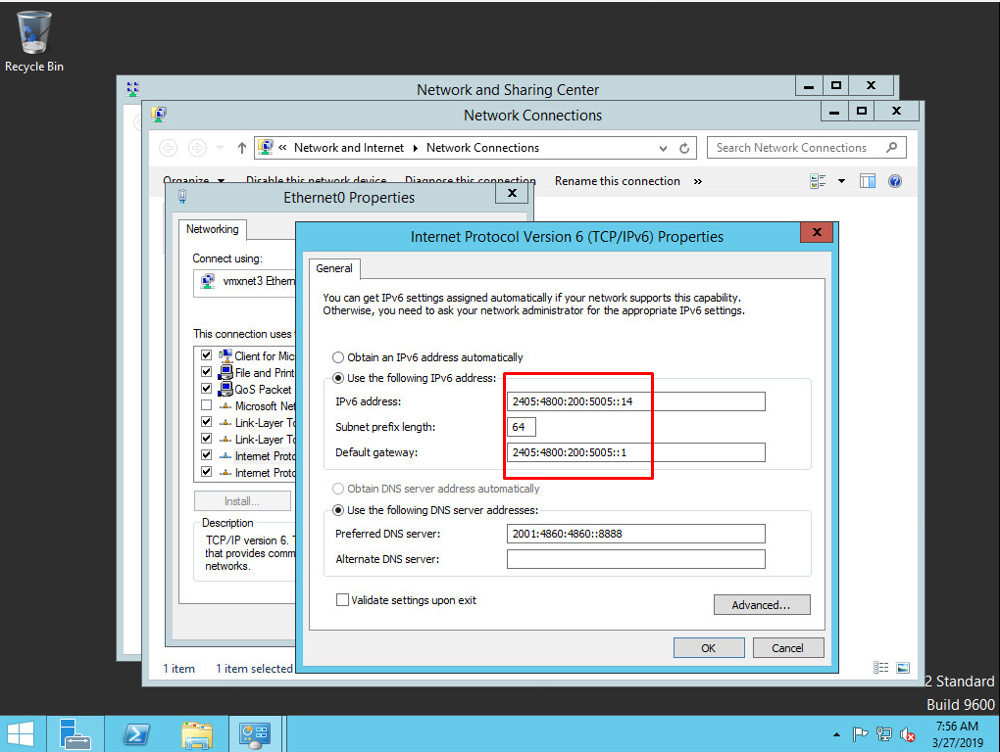
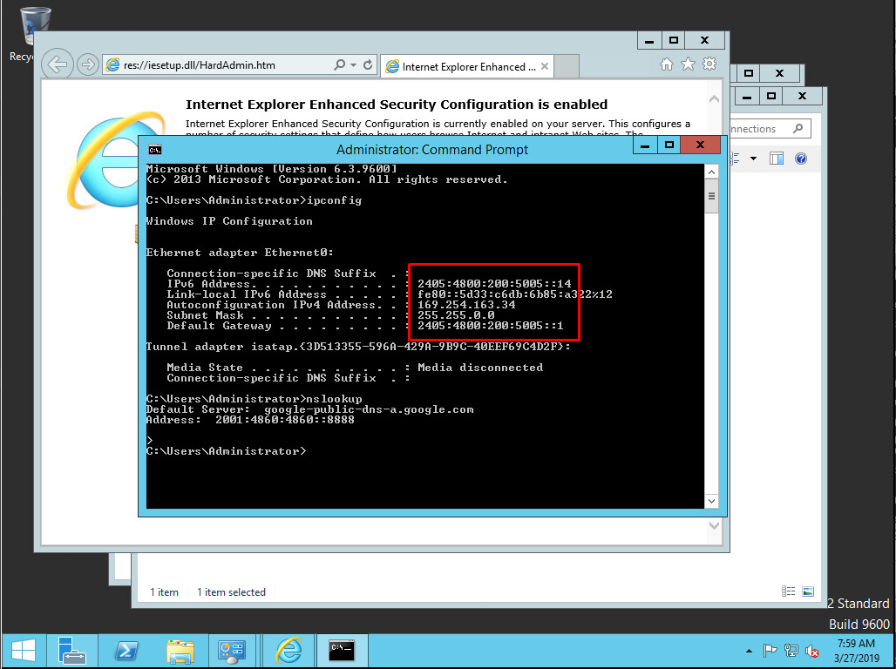

# Cấu hình IPv6 trên OS Windows Server 2012

1. Chọn `Open Network and Sharing Center`:

2. Tick chọn `TCP/IPv6` trong phần `Network Properties`:

3. Sau đó vào phần `Properties` của `IPv6`, thực hiện điển IPv6 đã được cấp, bao gồm cả prefix và gateway:

4. Chạy lệnh `ipconfig` để kiểm tra lại cấu hình:

- Kiểm tra: truy cập vào trang : `http://ipv6-test.com/`

