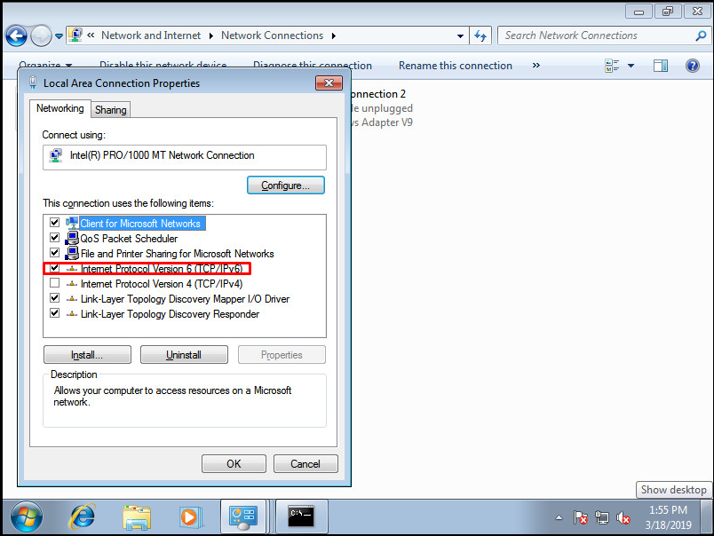
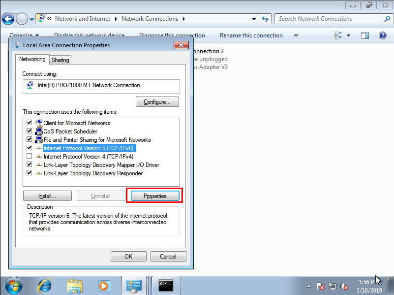
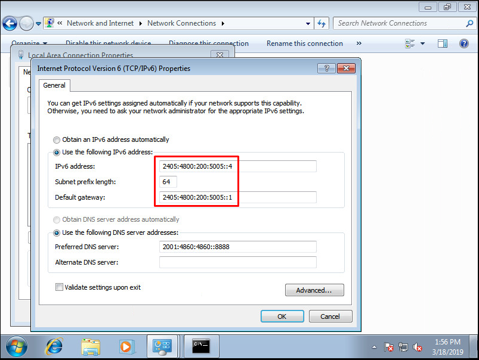
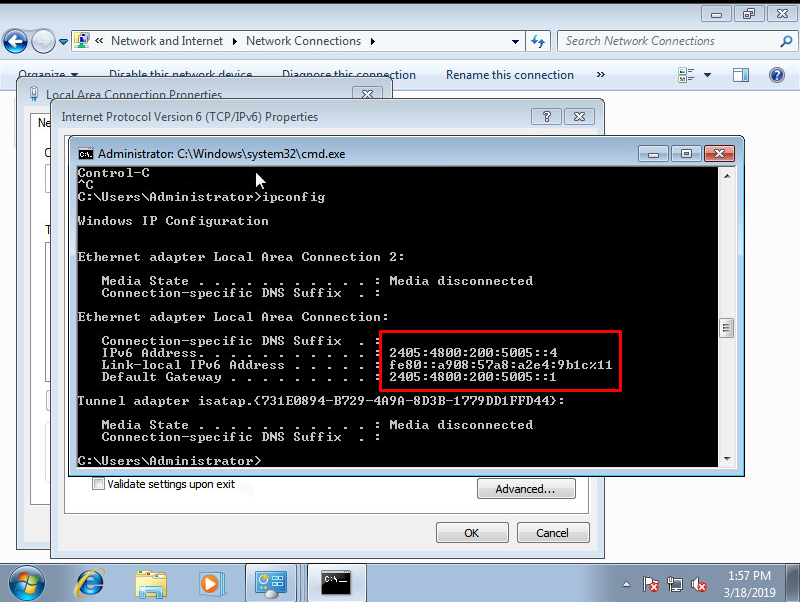
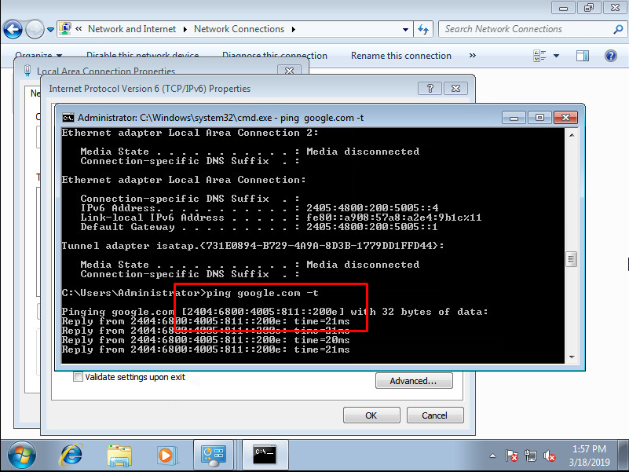
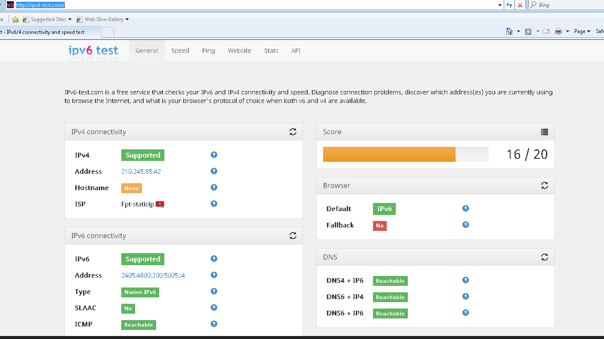

# Cấu hình IPv6 trên OS Windows 7

1. Tick chọn `TCP/IPv6` trong phần `Network Properties`:

2. Sau đó vào phần `Properties` của `IPv6`

3. Thực hiện điển IPv6 đã được cấp, bao gồm cả prefix và gateway:

4. Chạy lệnh `ipconfig` để kiểm tra lại cấu hình:

5. Thực hiện việc ping google và trả về IPv6 là thành công:

- Kiểm tra thêm: truy cập vào trang : `http://ipv6-test.com/`

