# Tổng quan về ảo hóa

## Mục Lục

- [1. Giới thiệu](#gioi-thieu)

- [2. Chức năng và lợi ích](#chuc-nang)

- [3. Phân loại các công nghệ ảo hóa](#cong-nghe)

------

#  1. Giới thiệu về ảo hóa

- Ngày nay, việc quản lí và sử dụng hạ tầng CNTT là điều rất cần thiết đối với bất kì một doanh nghiệp nào.
Tuy nhiên vẫn còn đó một vài những hạn chế trong việc quản lí và sử dụng tài nguyên theo phương pháp truyền thống:
  <ul>
  <li>Mỗi máy chủ vật lý chỉ cài đặt tương ứng 01 hệ điều hành, từ đó chỉ thiết lập được 01 môi trường hoạt động, 
  dẫn đến thiếu linh hoạt về các loại ứng dụng có thể cài đặt phục vụ cho mục đích của doanh nghiệp.</li>
  <li>Việc đầu tư máy chủ nhưng không sử dụng hết năng lực của máy chủ dẫn đến phí phạm tài nguyên và quản lý tài nguyên trở nên khó khăn.</li>
  <li>Các máy chủ vật lý được cài đặt trực tiếp hệ điều hành và ứng dụng gặp khó khăn trong việc sao lưu và phục hồi (backup và restore), 
  một số máy chủ vật lý đang hoạt động có những cơ chế đặc thù riêng và gần như rất khó hoặc “không thể” thực hiện sao lưu và phục hồi.</li>
  <li>Thời gian downtime của máy chủ vật lý thường rất lâu và dễ gặp trục trặc trong quá trình khởi động lại.</li>
  <li>Khó khăn trong quản trị và giám sát tập trung khi số lượng máy chủ vật lý tăng lên</li>
  </ul>
- Chính vì vậy, ảo hóa được coi là giải pháp nhằm tối ưu hóa việc sử dụng và khai thác tài nguyên vật lý.
- Vậy ảo hóa là gì?
- Ảo hóa được hiểu một cách đơn giản là chạy nhiều máy chủ ảo trên hạ tầng 01 máy chủ vật lý. 
Trên mỗi máy ảo có hệ điều hành riêng giống như 01 máy chủ thật và được triển khai các môi trường, 
ứng dụng khác nhau để phù hợp với hoạt động và mục đích của doanh nghiệp.

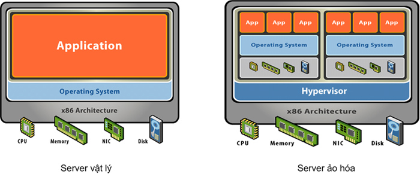

#  2. Chức năng và lợi ích của ảo hóa

** Các chức năng chính của ảo hóa **
- Phân chia: Với công nghệ ảo hóa, chúng ta có thể chạy nhiều máy ảo trên một máy thật với nhiều hệ điều hành khác nhau, nhờ thế mà 
ta cũng có thể tách từng dịch vụ ra để cài trên từng máy ảo.

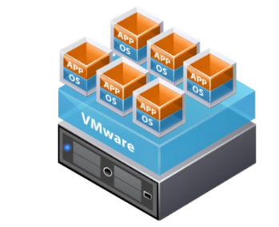

- Cô lập: Khi mỗi dịch vụ quan trọng được cài trên một máy ảo khác nhau thì nếu có sự cố, các dịch vụ khác cũng không bị ảnh hưởng gì.
Thêm vào đó, nó cũng giúp người dùng quản lí tốt hơn tài nguyên trên các máy ảo.

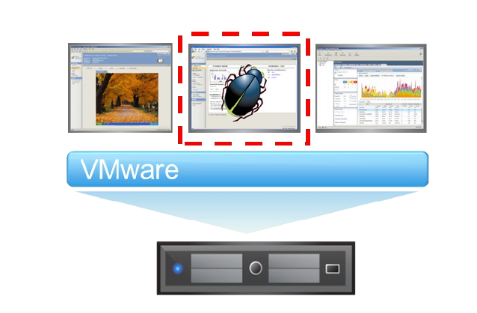

- Đóng gói: Với công nghệ ảo hóa, các máy ảo được đóng gói thành các file riêng biệt, nhờ vậy mà nó có thể dễ dàng được sao chép
 để backup và di chuyển sang các hệ thống khác để chạy.

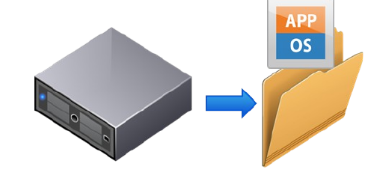

 
 ** Những lợi ích chính mà ảo hóa mang lại **

 - Giảm chi phí về hạ tầng IT và quản trị hệ thống: ảo hóa giúp tạo nhiều máy chủ ảo, khai thác triệt để tài nguyên vật lý của máy chủ, 
 từ đó giúp giảm chi phí đầu tư của doanh nghiệp, đồng thời giúp thiết lập hệ thống nhanh hơn, thuận tiện cho quản trị và giám sát, 
 giảm chi phí nhân công vận hành.
 - Tăng hiệu suất và tính linh hoạt của hệ thống: việc quản trị và khai thác triệt để tài nguyên vật lý giúp nâng cao 
 hiệu suất của từng máy chủ vật lý và của toàn hệ thống, đồng thời linh hoạt trong vấn đề mở rộng máy ảo, sao lưu, 
 dự phòng, di chuyển máy ảo.

#  3. Phân loại ảo hóa

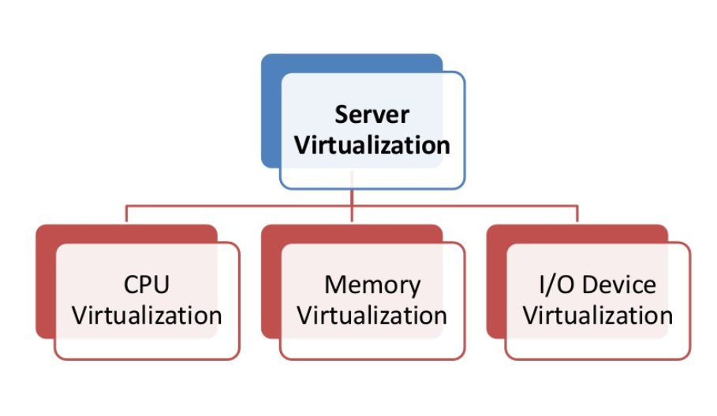

### Hypervisors vs Virtualization ###
- Hypervisors (Virtual Machine Monitor VMM) Sử dụng để cài đặt virtualization
- Điều khiển, quản lý, phân phối tài nguyên giữa các Quest OS
 
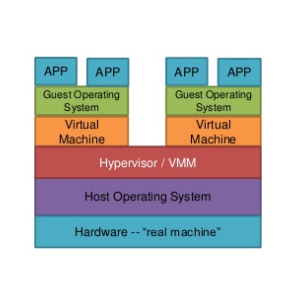

## Phân loại Hypervisor:
1. Native hoặc Bare Metal Hypervisor

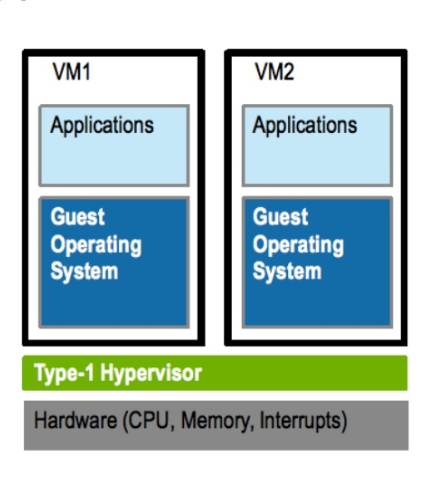
 
- Không cần cài đặt trước HĐH
- Trực tiếp kết nối tới tài nguyên vật lý
- Performance tốt, ổn định.
- Tuy nhiên, bị giới hạn do phụ thuộc vào phần cứng. (VSphere 6.0 khi cài đặt trên main + chip không đồng bộ có thể detect ra được)

2. Hosted hypervisor

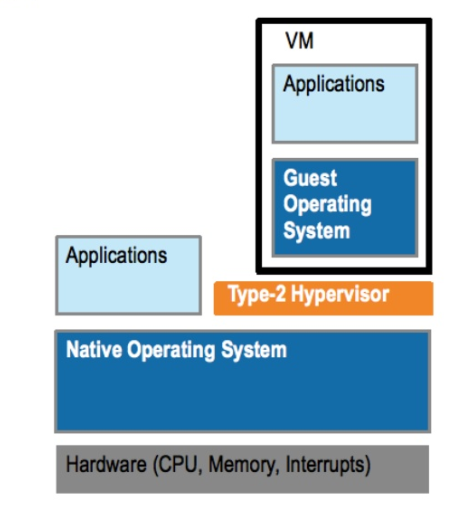)
 
- Chạy dựa vào 1 HĐH chính (Tương tự 1 software trên OS)
- Hypervisor sẽ giao tiếp với HĐH để gọi đến phần cứng
- Tương thích với phần cứng tốt hơn
- Giảm hiệu năng

Khái niệm Virtualization
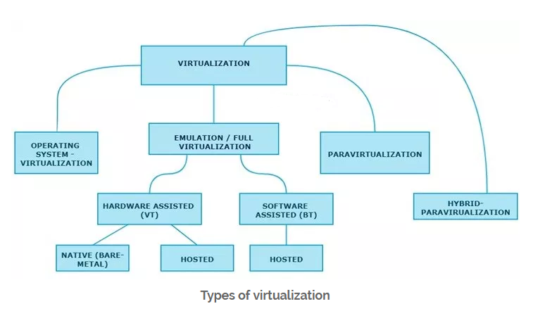

## 1. Software assisted full virtualization ( binary translation BT )

Dựa vào bản dịch nhị phân để bẫy và ảo hóa việc thực thi các bộ chỉ dẫn ,không thể ảo hóa. Mô phỏng phần cứng bằng cách sử dụng bộ hướng dẫn phần mềm. Do bản dịch nhị phân (binary translation), nó thường gặp vấn đề hiệu suất.
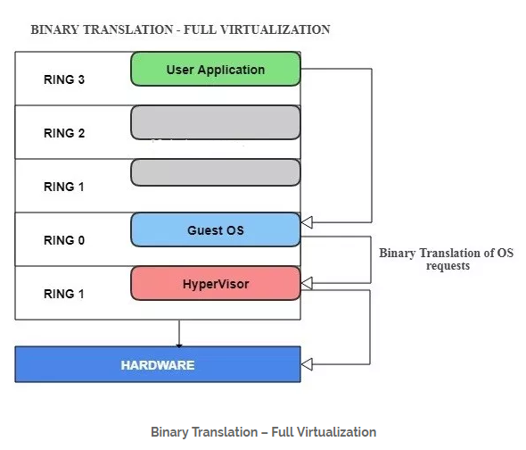
 
- VMware workstation (32Bit guests)
- Virtual PC
- VirtualBox (32-bit guests)
- VMware Server

## 2. Hardware-assisted virtualization (hardware virtual machine HVM) (VT)

Hardware-assisted full virtualization không sử dụng binary translation mà trực tiếp giao tiếp với phần cứng bằng công nghệ ảo hóa đã được tích hợp trên bộ vi xử lý X86 kể từ năm 2005 (Intel VT-x và AMD-V). 

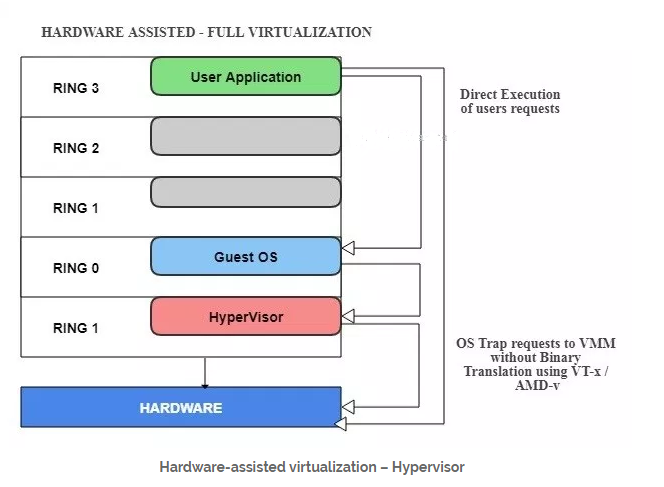

Ví dụ các nền tảng ảo hóa hardware-assisted – Full virtualization với hypervisor type 1  (Bare metal )
- VMware ESXi /ESX
- Hyper-V
- Xen
- Parallels

Nền tảng ảo hóa hardware-assisted – Full virtualization hypervisor type 2  (Hosted).
- VMware Workstation  (64-bit )
- Virtual Box (64-bit)
- VMware Server (Retired )
- KVM

## 3. Paravirtualization:
Paravirtualization hoạt động khác với Full virtualization. Nó không cần phải mô phỏng phần cứng cho các máy ảo. Các hypervisor được cài đặt trên một máy chủ vật lý và Quest OS được cài đặt vào môi trường. Các Quest OS này biết rằng nó đã được ảo hóa, không giống như Full virtualization (nơi Quest OS không biết rằng nó đã được ảo hóa).  Các Quest OS yêu cầu các phần mở rộng để thực hiện các cuộc gọi API tới hypervisor. Trong ảo hóa full, quest OS sẽ gọi phần cứng nhưng trong paravirtualization, quest OS sẽ trực tiếp giao tiếp với máy chủ (hypervisor) bằng cách sử dụng drivers.
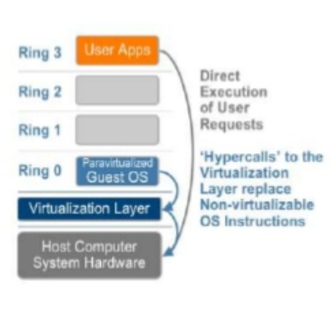
 
Đây là lisf của sản phẩm hỗ trợ paravirtualization.
- Xen
- IBM LPAR
- Oracle VM cho SPARC (LDOM)
- Oracle VM cho X86 (OVM)

##	4. Hybrid Virtualization: ( Hardware Virtualized với PV Drivers )
- Oracle VM for x86
- Xen
- VMware ESXi

## 5. OS level Virtualization ( Containerization )
- Linux LCX
- Docker
- AIX WPAR

#  Memory Virtualization
#  I/O Virtualization

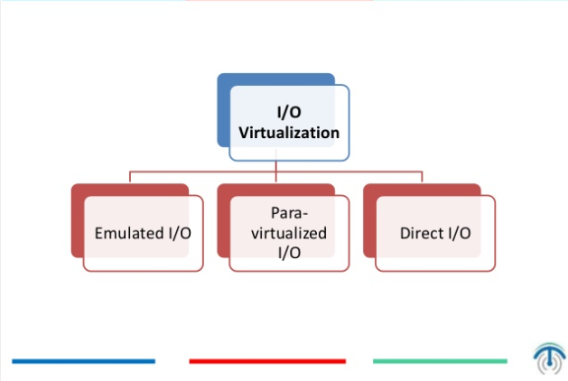
