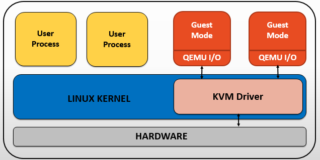
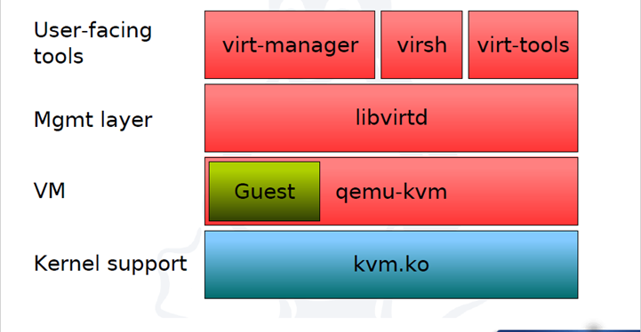
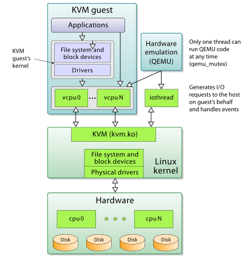
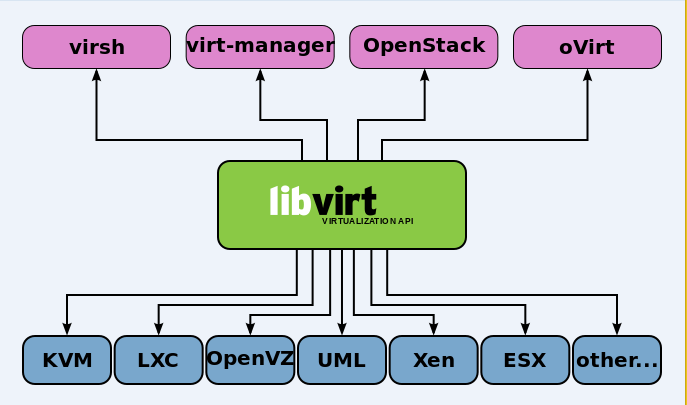
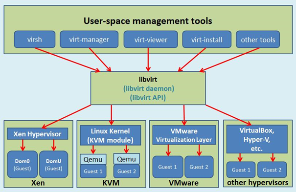

# Tìm hiểu KVM

## Mục lục

### [1. Khái niệm và vai trò](#vai-tro)
### [2. Cấu trúc](#cau-truc)
### [3. Tính năng](#tinh-nang)
-------

#  1. Khái niệm và vai trò.

KVM (Kernel-based virtual machine) là giải pháp ảo hóa cho hệ thống linux trên nền tảng phần cứng x86 có các module mở rộng hỗ trợ ảo hóa (Intel VT-x hoặc AMD-V).
Về bản chất, KVM không thực sự là một hypervisor có chức năng giả lập phần cứng để chạy các máy ảo. 
Chính xác KVM chỉ là một module của kernel linux hỗ trợ cơ chế mapping các chỉ dẫn trên CPU ảo (của guest VM)
sang chỉ dẫn trên CPU vật lý (của máy chủ chứa VM).
Hoặc có thể hình dung KVM giống như một driver cho hypervisor để sử dụng được tính năng ảo hóa của các vi xử lý như Intel VT-x
hay AMD-V, mục tiêu là tăng hiệu suất cho guest VM.

#  2. Cấu trúc của KVM

- Trong kiến trúc KVM, máy ảo là một tiến trình Linux, được lập lịch bởi chuẩn Linux scheduler.
Trong thực tế mỗi CPU ảo xuất hiện như là một tiến trình Linux. Điều này cho phép KVM sử dụng tất cả các tính năng của Linux kernel.
- Cấu trúc tổng quan:

- Linux có tất cả các cơ chế của một VMM cần thiết để vận hành (chạy) các máy ảo.
Chính vì vậy các nhà phát triển không xây dựng lại mà chỉ thêm vào đó một vài thành phần để hỗ trợ ảo hóa.
KVM được triển khai như một module hạt nhân có thể được nạp vào để mở rộng Linux bởi những khả năng này.
- Trong một môi trường linux thông thường mỗi process chạy hoặc sử dụng user-mode hoặc kernel-mode.
KVM đưa ra một chế độ thứ 3, đó là guest-mode. Nó dựa trên CPU có khả năng ảo hóa với kiến trúc Intel VT hoặc AMD SVM,
một process trong guest-mode bao gồm cả kernel-mode và user-mode.

**Trong cấu trúc tổng quan của KVM bao gồm các thành phần chính:**

-	`User-facing tools`: Là các công cụ quản lý máy ảo hỗ trợ KVM. Các công cụ có giao diện đồ họa (như virt-manager) hoặc giao diện dòng lệnh như (virsh) và virt-tool (Các công cụ này được quản lý bởi thư viện libvirt). 
  Các công cụ quản lý KVM do libivrt cung cấp tham khảo thêm tại: http://www.linux-kvm.org/page/Management_Tools

-	`Management layer`: Lớp này là thư viện `libvirt` cung cấp API để các công cụ quản lý máy ảo hoặc các hypervisor tương tác với KVM thực hiện các thao tác quản lý tài nguyên ảo hóa, bởi vì KVM chỉ là một module của nhân hỗ trợ cơ chế mapping các chỉ dẫn của CPU ảo để thực hiện trên CPU thật, nên tự thân KVM không hề có khả năng giả lập và quản lý tài nguyên ảo hóa. Mà phải dùng nhờ các công nghệ hypervisor khác, thường là QEMU.

-	`Virtual machine`: Chính là các máy ảo người dùng tạo ra. Thông thường, nếu không sử dụng các công cụ như `virsh` hay `virt-manager`, KVM sẽ sử được sử dụng phối hợp với một hypervisor khác điển hình là `QEMU`.

-	`Kernel support`: Chính là KVM, cung cấp một module làm hạt nhân cho hạ tầng ảo hóa (kvm.ko) và một module kernel đặc biệt chỉ hỗ trợ các vi xử lý VT-x hoặc AMD-V (kvm-intel.ko hoặc kvm-amd.ko) để nâng cao hiệu suất ảo hóa.

**Một số lưu ý về KVM và QEMU**:

Có thể hình dung KVM giống như driver cho hypervisor để sử dụng được virtualization extension của physical CPU nhằm boost performance cho guest VM. KVM như định nghĩa trên trang chủ thì là core virtualization infrastructure mà thôi, nó được các hypervisor khác lợi dụng làm back-end để tiếp cận được các công nghệ hardware acceleration (Dịch code để mô phỏng phần cứng)

QEMU là một Emulator nên nó có bộ dịch của nó là TCG (Tiny Code Generate) để xử lý các yêu cầu trên CPU ảo và giả lập kiến trúc của máy ảo. Nên có thể coi, QEMU như là một hypervisor type 2 (hypervisor chỉ chung cho chức năng ảo hóa). Nhằm nâng cao hiệu suất của VM. Cụ thể, lúc tạo VM bằng QEMU có VirtType là KVM thì khi đó các instruction có nghĩa đối với virtual CPU sẽ được QEMU sử dụng KVM để mapping thành các instruction có nghĩa đối với physical CPU. Làm như vậy sẽ nhanh hơn là chỉ chạy độc lập QEMU, vì nếu không có KVM thì QEMU sẽ phải quay về (fall-back) sử dụng translator của riêng nó là TCG để chuyển dịch các instruction của virtual CPU rồi đem thực thi trên physical CPU.

=> Khi QEMU/KVM kết hợp nhau thì tạo thành type-1 hypervisor.

QEMU cần KVM để boost performance và ngược lại KVM cần QEMU (modified version) để cung cấp giải pháp full virtualization hoàn chỉnh.

Do KVM kết hợp QEMU nên các máy ảo và mạng ảo có file cấu hình xml sẽ được lưu lại tại thư mục `/etc/libvirt/qemu/`

**Chi tiết thêm về libvirt:**

The hypervisor drivers currently supported by libvirt are:
https://libvirt.org/drivers.html

###  3. Tính năng

#### Security

- Trong kiến trúc KVM, máy ảo được xem như các tiến trình Linux thông thường, nhờ đó nó tận dụng được mô hình bảo mật của hệ thống Linux như SELinux, cung cấp khả năng cô lập và kiểm soát tài nguyên.
Bên cạnh đó còn có SVirt project - dự án cung cấp giải pháp bảo mật MAC (Mandatory Access Control - Kiểm soát truy cập bắt buộc) tích hợp với hệ thống ảo hóa sử dụng SELinux để cung cấp một cơ sở hạ tầng cho phép người quản trị định nghĩa nên các chính sách để cô lập các máy ảo. Nghĩa là SVirt sẽ đảm bảo rằng các tài nguyên của máy ảo không thể bị truy cập bởi bất kì các tiến trình nào khác; việc này cũng có thể thay đổi bởi người quản trị hệ thống để đặt ra quyền hạn đặc biệt, nhóm các máy ảo với nhau chia sẻ chung tài nguyên.

#### Memory Management

- KVM thừa kế tính năng quản lý bộ nhớ mạnh mẽ của Linux. Vùng nhớ của máy ảo được lưu trữ trên cùng một vùng nhớ dành cho các tiến trình Linux khác và có thể swap. KVM hỗ trợ NUMA (Non-Uniform Memory Access - bộ nhớ thiết kế cho hệ thống đa xử lý) cho phép tận dụng hiệu quả vùng nhớ kích thước lớn.
KVM hỗ trợ các tính năng ảo của mới nhất từ các nhà cung cấp CPU như EPT (Extended Page Table) của Microsoft, Rapid Virtualization Indexing (RVI) của AMD để giảm thiểu mức độ sử dụng CPU và cho thông lượng cao hơn.
KVM cũng hỗ trợ tính năng Memory page sharing bằng cách sử dụng tính năng của kernel là Kernel Same-page Merging (KSM).

#### Storage

- KVM có khả năng sử dụng bất kỳ giải pháp lưu trữ nào hỗ trợ bởi Linux để lưu trữ các Images của các máy ảo, bao gồm các ổ cục bộ như IDE, SCSI và SATA, Network Attached Storage (NAS) bao gồm NFS và SAMBA/CIFS, hoặc SAN thông qua các giao thức iSCSI và Fibre Channel.
KVM tận dụng được các hệ thống lưu trữ tin cậy từ các nhà cung cấp hàng đầu trong lĩnh vực Storage.
KVM cũng hỗ trợ các images của các máy ảo trên hệ thống tệp tin chia sẻ như GFS2 cho phép các images có thể được chia sẻ giữa nhiều host hoặc chia sẻ chung giữa các ổ logic.

#### Live migration

- KVM hỗ trợ live migration cung cấp khả năng di chuyển ác máy ảo đang chạy giữa các host vật lý mà không làm gián đoạn dịch vụ. Khả năng live migration là trong suốt với người dùng, các máy ảo vẫn duy trì trạng thái bật, kết nối mạng vẫn đảm bảo và các ứng dụng của người dùng vẫn tiếp tục duy trì trong khi máy ảo được đưa sang một host vật lý mới. KVM cũng cho phép lưu lại trạng thái hiện tại của máy ảo để cho phép lưu trữ và khôi phục trạng thái đó vào lần sử dụng tiếp theo.

#### Performance and scalability

- KVM kế thừa hiệu năng và khả năng mở rộng của Linux, hỗ trợ máy ảo với 16 CPUs ảo, 256GB RAM và hệ thống máy host lên tới 256 cores và trên 1TB RAM.

