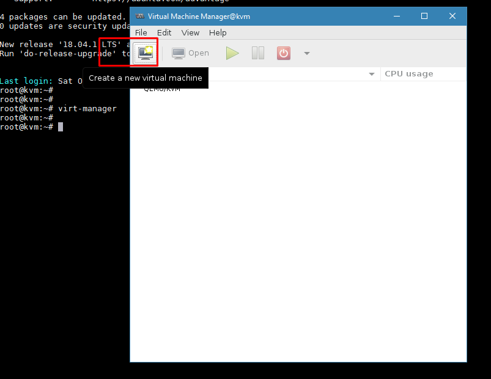
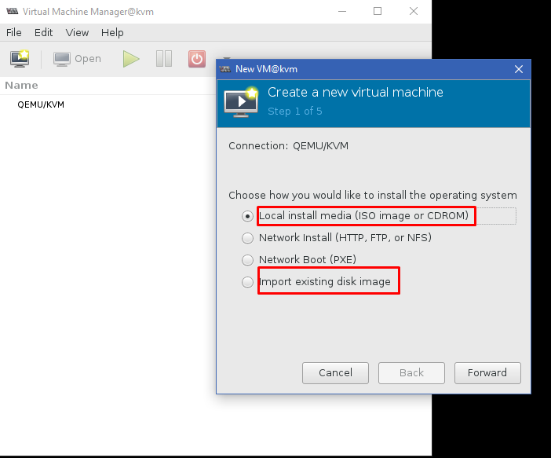
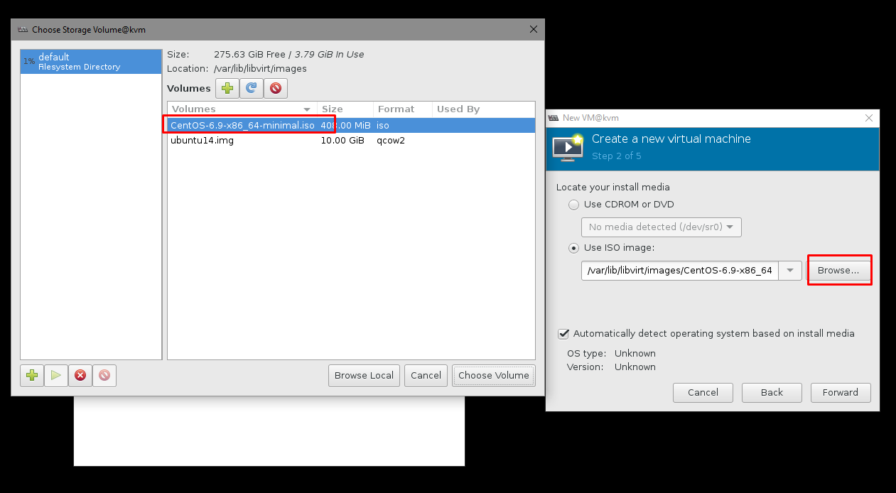
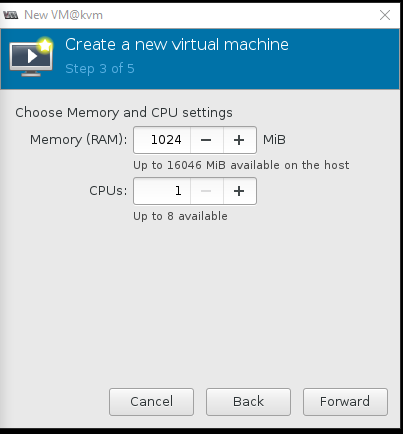
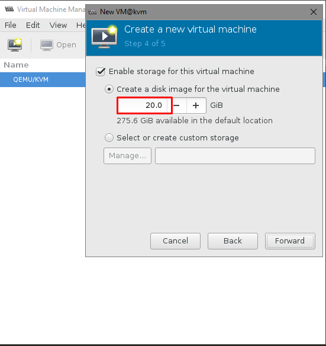
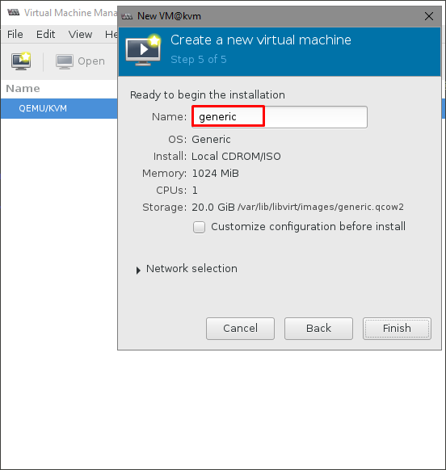
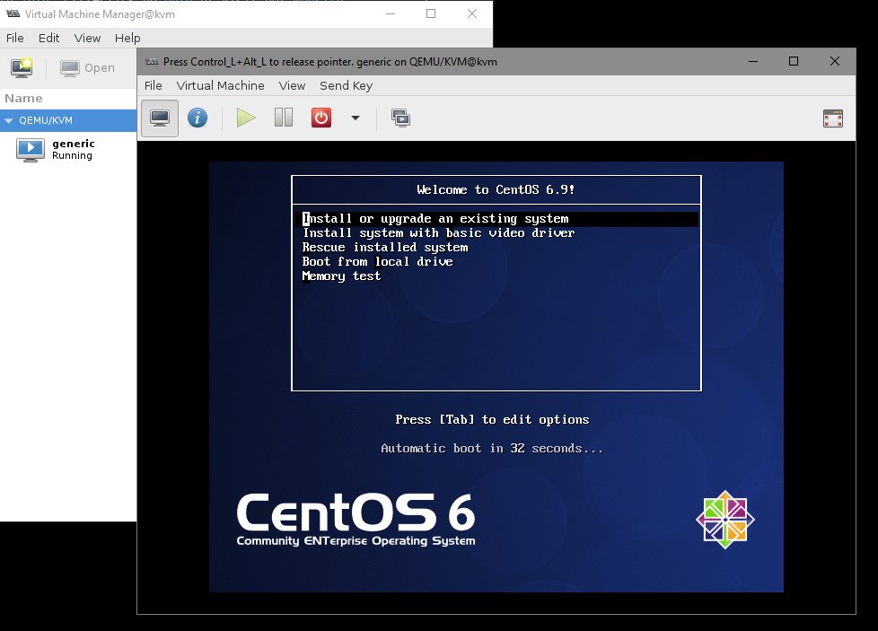
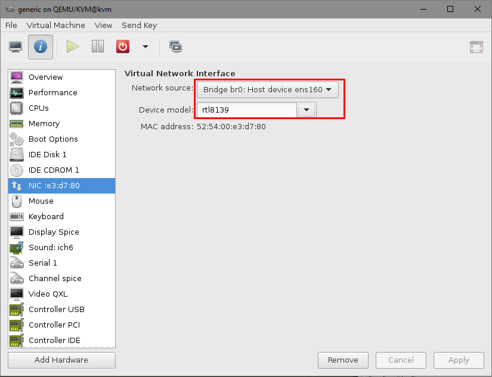

# Cài đặt KVM host

## Mục Lục

- [1. Ubuntu](#Ubuntu)

- [2. CentOS 7](#Centos)
### Mô hình
- Sử dụng VMWare làm môi trường dựng lab
- Máy server:
  <ul>
  <li>Ubuntu 16.04.5 LTS 64bit, 1 NIC (Bridge)</li>
  <li>Máy server cài các gói qemu-kvm, libvirt-bin và virt-manager để quản trị thông qua giao diện đồ họa </li>
  <li>Sử dụng Linux Bridge để ảo hóa network cho các máy ảo</li>
  </ul>


# <a name = "Ubuntu"></a>Ubuntu

Bước 1:
Chuẩn bị môi trường cài đặt:
- Cài đặt OS
- Snapshot bản OS trắng (VMware)
- Kiểm tra host có hỗ trợ ảo hóa hay không bằng câu lệnh:

```
egrep -c '(svm|vmx)' /proc/cpuinfo
```
```
grep -E '(svm|vmx)' /proc/cpuinfo
```
Trả về giá trị khác 0 hoặc rỗng là được

Bước 2:
Cài đặt môi trường và các gói phụ trợ:
```sh
sudo apt update -y && apt upgrade -y
sudo apt-get install qemu-kvm libvirt-bin bridge-utils -y
```
- Trong đó:
  `libvirt-bin`: cung cấp libvirt mà bạn cần quản lý qemu và kvm bằng libvirt
  `qemu-kvm`: Phần phụ trợ cho KVM
  `bridge-utils`: chứa một tiện ích cần thiết để tạo và quản lý các thiết bị bridge.

Bước 3: Chỉ quản trị viên (root user) và những người dùng thuộc libvirtd group có quyền sử dụng máy ảo KVM. 
  Chạy lệnh sau để thêm tài khoản người dùng vào libvirtd group:
```sh
sudo adduser Username libvirtd
```

- Bước 4: Đăng xuất rồi đăng nhập trở lại. Nhập câu lệnh sau sau khi đăng nhập:

```sh
root@kvm:~# virsh --connect qemu:///system list
 Id    Name                           State
----------------------------------------------------

```
Một danh sách máy ảo còn trống xuất hiện. Điều này thể hiện mọi thứ đang hoạt động đúng.

- Bước 4: Cấu hình Linux Bridge

Đầu tiên, hãy chạy câu lệnh sau để tạo một Bridge mới: `sudo brctl addbr br0`

Sau đó, tiến hành gán card mạng cho bridge đó `sudo brctl addif br0 Ten_card_mang`

Để lấy tên card mạng, tiến hành chạy lệnh: `sudo ip addr show`

Ở đây tôi gán card trong máy là `ens160`

Cấu hình Linux Bridge trong `/etc/network/interfaces` như sau:
```sh
# This file describes the network interfaces available on your system
# and how to activate them. For more information, see interfaces(5).

source /etc/network/interfaces.d/*

# The loopback network interface
auto lo
iface lo inet loopback

# The primary network interface

iface ens160 inet manual

auto br0
iface br0 inet static
        bridge_ports ens160
        address 10.10.10.25
        netmask 255.255.255.0
        gateway 10.10.10.1
        network 10.10.10.0
        broadcast 10.10.10.255
        dns-nameservers 8.8.8.8
        bridge_stp off
        bridge_fd 0
        bridge_maxwait 0
```
- Một vài câu lệnh cần lưu ý:
    - `bridge_ports none`: nếu bạn không muốn gán bất cứ port nào vào bridge
    - `bridge_stp off`: tắt chế độ STP (Spanning Tree Protocol)
    - `bridge_fd 0`: không delay forwarding

- Khởi động lại dịch vụ mạng bằng câu lệnh: 
```sh
service networking restart
```

- Kiểm tra lại bridge bằng câu lệnh:
```sh
root@kvm:~# brctl show
bridge name     bridge id               STP enabled     interfaces
br0             8000.000c29b14428       no              ens160
virbr0          8000.525400d86aea       yes             virbr0-nic
```
### Bước 6: Quản lý VM bằng virt-manager

- Tại phía client, tiến hành cài đặt SSH client (Putty, MobaXterm,..) và ssh vào server sau đó chạy câu lệnh: 
```sh
apt-get install virt-manager
```
để cài đặt công cụ quản lý KVM.
- Tiến hành gõ lệnh 
```sh
virt-manager
``` 
để khởi động, sẽ có một màn hình hiện ra.

**Tạo máy ảo và cài đặt bằng file ISO**

- Bước 3: Tại cửa sổ `Virtual Machine Manager`, chọn `New`


- Bước 4: Nhập tên máy ảo và chọn chế độ cài đặt từ iso: `Local install media (ISO image or CDROM` 


- Bước 5: Chỉ đến file ISO có sẵn


- Bước 6: Thiết lập các thông số cho máy ảo:
- RAM và CPU:<br/>


- Dung lượng ổ đĩa <br/>
 

- Tên máy ảo <br/>
 

- Cài đặt OS như bình thường<br/>
 

- Bước 7: Kiểm tra lại config NIC của máy ảo:

- Trong hướng dẫn này sử dụng card Bridge là br0. Lúc này máy ảo sẽ nhận IP cùng với card mạng đã được bridge.
- Phía dưới là driver của NIC:
  - Mặc định sử dụng rtl8139 - driver này hoạt động tốt đối với hầu hết các môi trường, tuy nhiên thiết bị có thể gặp phải các vấn đề về hiệu năng đối với mạng 10G.
  - Có thể chọn sang các driver khác như: Intel PRO/1000 (e1000) hoặc virtio (para-virtualized network driver).

**Tạo máy ảo bằng file images có sẵn**
- Ở bước 4, chọn `Import existing disk image` và chọn image đã có

# <a name = "Centos"></a>CentOS
Tương tự các bước cài đặt trên Ubuntu:
    
```sh
yum install qemu-kvm qemu-img virt-manager libvirt libvirt-python libvirt-client virt-install virt-viewer bridge-utils  "@X Window System"xorg-x11-xauth xorg-x11-fonts-* xorg-x11-utils -y
touch /root/.Xauthority
systemctl start libvirtd
systemctl enable libvirtd

lsmod | grep kvm
virt-manager
#Fix font
yum install dejavu-lgc-sans-fonts -y

#Disable ipv6

vi /etc/sysctl.conf
net.ipv6.conf.all.disable_ipv6 = 1
net.ipv6.conf.default.disable_ipv6 = 1
```