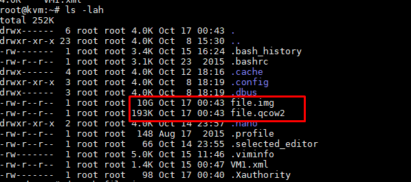

# File image trong KVM

## Mục lục

### [1. Tổng quan về file image trong KVM](#tong-quan)

### [2. Định dạng file image phổ biến trong KVM](#image)

### [3. Chuyển đổi giữa raw và qcow2](#chuyen-doi)

### [4. So sánh performance giữa hai định dạng ổ đĩa và ứng dụng của từng loại trong thực tiễn](#so-sanh)


---

### <a name = "tong-quan"> 1. Tổng quan về file image trong KVM </a>

- File Image (còn gọi là file ảnh) của đĩa CD/DVD chính là một dạng file có định dạng theo các chuẩn tạo file ảnh. File image  là một file đóng gói hết tất cả nội dung của một đĩa CD/DVD vào trong nó.
- Trong KVM Guest có 2 thành phần chính đó là VM definition được lưu dưới dạng file xml tại /etc/libvirt/qemu. File này chứa các thông tin của máy ảo như tên, số ram, số cpu... File còn lại là storage thường được lưu dưới dạng file image tại thư mục /var/lib/libvirt/images.
- 3 định dạng thông dụng nhất của file image sử dụng trong KVM đó là ISO, raw và qcow2.

### <a name ="image"> 2. Định dạng file image phổ biến trong KVM </a>

**2.1. File ISO**

- File ISO là file ảnh của 1 đĩa CD/DVD, nó chứa toàn bộ dữ liệu của đĩa CD/DVD đó. File ISO thường được sử dụng để cài đặt hệ điều hành vủa VM, người dùng có thể import trực tiếp hoặc tải từ trên internet về.
- Boot từ file ISO cũng là một trong số những tùy chọn mà người dùng có thể sử dụng khi tạo máy ảo.


**2.2. File raw**

- Là định dạng file image phi cấu trúc
- Khi người dùng tạo mới một máy ảo có disk format là raw thì dung lượng của file disk sẽ đúng bằng dung lượng của ổ đĩa máy ảo bạn đã tạo.
- Định dạng raw là hình ảnh theo dạng nhị phân (bit by bit) của ổ đĩa.
- Mặc định khi tạo máy ảo với virt-manager hoặc không khai báo khi tạo VM bằng virt-install thì định dạng ổ đĩa sẽ là raw. Hay nói cách khác, raw chính là định dạng mặc định của QEMU.

**2.3 File qcow2**

- qcow là một định dạng tập tin cho đĩa hình ảnh các tập tin được sử dụng bởi QEMU , một tổ chức màn hình máy ảo . Nó viết tắt của "QEMU Copy On Write " và sử dụng một chiến lược tối ưu hóa lưu trữ đĩa để trì hoãn phân bổ dung lượng lưu trữ cho đến khi nó thực sự cần thiết. Các tập tin trong định dạng qcow có thể chứa một loạt các hình ảnh đĩa thường được gắn liền với khách cụ thể các hệ điều hành . Hai phiên bản của các định dạng tồn tại: qcow, và qcow2, trong đó sử dụng các .qcow và .qcow2 mở rộng tập tin, tương ứng.
- Qcow2 là một phiên bản cập nhật của định dạng qcow, nhằm để thay thế nó. Khác biệt với bản gốc là qcow2 hỗ trợ nhiều snapshots thông qua một mô hình mới, linh hoạt để lưu trữ ảnh chụp nhanh. Khi khởi tạo máy ảo mới sẽ dựa vào disk này rồi snapshot thành một máy mới.
- Qcow2 hỗ trợ copy-on-write với những tính năng đặc biệt như snapshot, mã hóa ,nén dữ liệu...
  <ul>
  <li>Các tập tin với định dạng này có thể phát triển khi dữ liệu được thêm vào. Điều này cho phép kích thước tệp nhỏ hơn hình ảnh đĩa thô , phân bổ toàn bộ không gian hình ảnh vào tệp, ngay cả khi các phần của nó trống. Điều này đặc biệt hữu ích cho các hệ thống tập tin không hỗ trợ các lỗ hổng, chẳng hạn như FAT32.</li>
  <li>Định dạng qcow cũng cho phép lưu trữ các thay đổi được thực hiện với một hình ảnh cơ sở chỉ đọc trên một tập tin qcow riêng biệt bằng cách sử dung copy on write . Tập tin qcow mới này chứa đường dẫn đến hình ảnh cơ sở để có thể tham chiếu trở lại khi cần thiết. Khi một phần dữ liệu cụ thể đã được đọc từ hình ảnh mới này, nội dung sẽ được lấy ra từ nó nếu nó là mới và được lưu giữ ở đó; Nếu không, dữ liệu sẽ được lấy ra từ hình ảnh cơ sở.</li>
  <li>Tính năng tùy chọn bao gồm AES mã hóa và zlib dựa trên giải nén trong suốt .</li>
  <li>Một bất lợi của hình ảnh qcow là không thể được gắn trực tiếp như hình ảnh đĩa thô.</li>
  </ul>

- Copy on write (cow)
  Copy-on-write ( COW ), đôi khi được gọi là chia sẻ tiềm ẩn, là một kỹ thuật quản lý tài nguyên được sử dụng trong lập trình máy tính để thực hiện có hiệu quả thao tác "nhân bản" hoặc "sao chép" trên các tài nguyên có thể thay đổi. Nếu một tài nguyên được nhân đôi nhưng không bị sửa đổi, không cần thiết phải tạo một tài nguyên mới; Tài nguyên có thể được chia sẻ giữa bản sao và bản gốc. Sửa đổi vẫn phải tạo ra một bản sao, do đó kỹ thuật: các hoạt động sao chép được hoãn đến việc viết đầu tiên. Bằng cách chia sẻ tài nguyên theo cách này, có thể làm giảm đáng kể lượng tiêu thụ tài nguyên của các bản sao chưa sửa đổi.

- Qcow2 hỗ trợ việc tăng bộ nhớ bằng cơ chế Thin Provisioning (Máy ảo dùng bao nhiêu file có dung lượng bấy nhiêu). 

### <a name ="chuyen-doi"> 3. Chuyển đổi giữa raw và qcow2 </a>


- Để chuyển đổi từ định dạng raw sang qcow2, ta dùng câu lệnh: 
  `qemu-img convert -f raw -O qcow2 /var/lib/libvirt/images/VM.img /var/lib/libvirt/images/VM.qcow2`
  
- Để chuyển đổi từ định dạng qcow2 sang raw, ta dùng câu lệnh: 
  `qemu-img convert -f qcow2 -O raw /var/lib/libvirt/images/VM.qcow2 /var/lib/libvirt/images/VM.raw`
  

- Sau khi chuyển đổi, tiến hành shutdown máy ảo. Đồng thời, sửa file xml của VM bằng câu lệnh `virsh edit generic`
```sh
    <disk type='file' device='disk'>
      <driver name='qemu' type='qcow2'/>
      <source file='/var/lib/libvirt/images/generic.qcow2'/>
      <target dev='hda' bus='ide'/>
      <address type='drive' controller='0' bus='0' target='0' unit='0'/>
    </disk>
```

- Tiến hành khởi động máy ảo. Lưu ý rằng file bạn muốn chuyển đổi sẽ không bị mất đi, bạn phải tiến hành xóa bỏ nó bằng tay.


### <a name = "so-sanh"> 4. So sánh performance giữa hai định dạng ổ đĩa và ứng dụng của từng loại trong thực tiễn </a>

**Tình huống cụ thể**

- Test performance của 2 ổ cứng định dạng file raw và qcow2 để chứng thực việc định dạng raw cho performance tốt hơn so với qcow2 và qcow2 cho phép một vài tính năng nổi trội hơn so với định dạng raw.

**Phương pháp test**

- Đối với test performance, ta dùng câu lệnh "dd".

- Đối với việc chứng thực một số tính năng đặc biệt như snapshot, nén dung lượng...tôi sẽ tạo snapshot trên cả hai định dạng ổ đĩa và tiến hành đo dung lượng để so sánh.

**Cách làm**

- Đầu tiên, ta tiến hành khởi tạo 2 file với cùng dung lượng 10GB với định dạng raw và qcow2 và kiểm tra dung lượng.
```sh
root@kvm:~# qemu-img create -f raw file.img 10G
Formatting 'file.img', fmt=raw size=10737418240
root@kvm:~# qemu-img create -f qcow2 file.qcow2 10G
Formatting 'file.qcow2', fmt=qcow2 size=10737418240 encryption=off cluster_size=65536 lazy_refcounts=off refcount_bits=16
```


Như vậy, file qcow2 được chuyển đổi đã "nén" dữ liệu theo cơ chế thin provisioning, nó chỉ chiếm dung lượng đúng bằng dung lượng data đang chứa trong nó. Trong khi đó, file raw sẽ mặc định chiếm đúng 1 khoảng mà người dùng khai báo trong storage pool của KVM.

- Tiếp theo, tiến hành test performance bằng câu lệnh "dd":
    - "dd" là một câu lệnh trong linux thường được sử dụng với mục đích sao lưu và phục hồi dữ liệu của ổ cứng
    - Tiến hành đo bằng câu lệnh "dd if= /source of=test01 bs=8k count=250000". Trong đó "if" là thư mục muốn đo, "of" là thư mục đích tuy nhiên ở đây ta chỉ muốn đo tốc độ nên không cần, "bs" thể hiện quá trình đọc (ghi) bao nhiêu byte một lần đọc (ghi) và "count" cho biết máy sẽ thực hiện bao nhiêu Block trong quá trình thực thi câu lệnh.
  
- Ta thu được kết quả như sau:
```sh  
root@kvm:~# dd if=~/file.img of=~/test01 bs=8k count=250000
250000+0 records in
250000+0 records out
2048000000 bytes (2.0 GB, 1.9 GiB) copied, 6.83713 s, 300 MB/s
root@kvm:~# dd if=~/file.qcow2 of=~/test02 bs=8k count=250000
24+1 records in
24+1 records out
197120 bytes (197 kB, 192 KiB) copied, 0.00081974 s, 240 MB/s
```
  Như vậy, file raw sẽ cho tốc độ tốt hơn so với file qcow2.
    
- Tiến hành tạo thử snapshot trên định dạng ổ đĩa qcow2 bằng câu lệnh `virsh snapshot-create VMname`
```sh
root@kvm:~# cat /etc/libvirt/qemu/generic.xml | grep qcow2
      <driver name='qemu' type='qcow2'/>
      <source file='/var/lib/libvirt/images/generic.qcow2'/>
root@kvm:~# cat /etc/libvirt/qemu/tuan.xml | grep img
      <source file='/var/lib/libvirt/images/tuan.img'/>
```
```sh
root@kvm:~# virsh snapshot-create generic
Domain snapshot 1539767472 created
```
Snapshot đã được tạo thành công.
Tiếp theo là tạo snapshot trên ổ đĩa raw.
```sh
root@kvm:~# virsh snapshot-create tuan
error: unsupported configuration: internal snapshot for disk vda unsupported for storage type raw
```
Hệ thống báo lỗi do định dạng raw không support tính năng snapshot.

**Ứng dụng thực tiễn**

- Như vậy ta có thể thấy định dạng raw cho phép ổ đĩa có tốc độ tốt hơn nhưng lại không có một số tính năng nổi bật như snapshot, nén dung lượng...Trong khi đó, qcow2 cho tốc độ thấp nhưng nó cung cấp nhiều tiện ích mở rộng. Do vậy, raw thường được sử dụng nhiều hơn đối với những hệ thống yêu cầu chạy các ứng dụng liên tục. `qcow2` thường được ưu tiên hơn trong các trường hợp còn lại.
