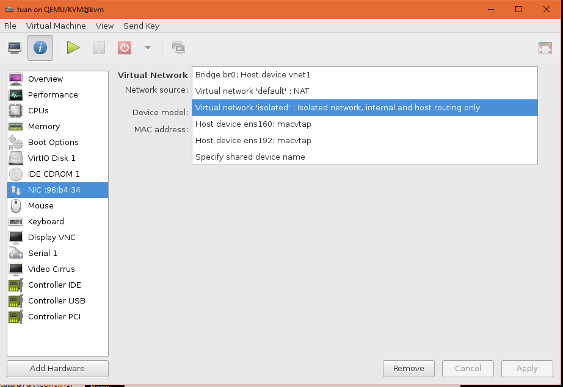

# Tìm hiểu file network xml trong KVM

## Mục lục

- [1. Tìm hiểu file network xml](#gioi-thieu)

- [2. Hướng dẫn tạo virtual network từ file xml](#tao-network)

----------

## <a name="gioi-thieu"> 1. Tìm hiểu về network trong KVM </a>

### Private Virtual Bridge
  - Thiết lập Private Network giữa 2 hoặc nhiều máy ảo, network này sẽ không truy cập được từ các máy ảo khác hoặc mạng vật lý
### Public Virtual Bridge
  - Có thể gán IP và giao tiếp với mạng vật lý bên ngoài
### NAT


## <a name="gioi-thieu"> 1. Tìm hiểu về file network xml </a>

- Giống như domain, mỗi một virtual network trong kvm sẽ được định nghĩa bằng 1 file có định dạng xml
- File virtual network mặc định của KVM là `default.xml`. Ví dụ về file network xml:
```sh
root@kvm:/etc/libvirt/qemu# virsh net-list
 Name                 State      Autostart     Persistent
----------------------------------------------------------
 default              active     yes           yes

root@kvm:/etc/libvirt/qemu# virsh net-dumpxml default
<network>
  <name>default</name>
  <uuid>af9d5880-eac3-4bb6-90c3-97773118a87d</uuid>
  <forward mode='nat'>
    <nat>
      <port start='1024' end='65535'/>
    </nat>
  </forward>
  <bridge name='virbr0' stp='on' delay='0'/>
  <mac address='52:54:00:d8:6a:ea'/>
  <ip address='192.168.122.1' netmask='255.255.255.0'>
    <dhcp>
      <range start='192.168.122.2' end='192.168.122.254'/>
    </dhcp>
  </ip>
</network>
```
File nằm ở `/etc/libvirt/qemu/default.xml`

### Các thành phần chính trong file network xml

- Thẻ không thể thiếu trong file network xml là `network`

**General Metadata**
```  
  <name>default</name>
  <uuid>af9d5880-eac3-4bb6-90c3-97773118a87d</uuid>
```
- `name` : Tên của virtual network
- `uuid` : uuid của virtual network

**Connectivity**
```sh
  <forward mode='nat'>
    <nat>
      <port start='1024' end='65535'/>
    </nat>
  </forward>
  <bridge name='virbr0' stp='on' delay='0'/>
  <mac address='52:54:00:d8:6a:ea'/>
  <ip address='192.168.122.1' netmask='255.255.255.0'>
    <dhcp>
      <range start='192.168.122.2' end='192.168.122.254'/>
    </dhcp>
  </ip>
```
- `bridge` : Bao gồm các tham số
  - `name` : tên của bridge
  - `stp` : tùy chọn bật hoặc tắt Spanning Tree Protocol
  - `delay` : thiết lập thời gian delay theo giây, mặc định là 0
  - `macTableManager` : Thiết lập quản lí bảng địa chỉ MAC, mặc định sẽ là "kernel"
  

- `mtu` : tham số bắt buộc là `size` : khai báo kích cỡ của Maximum Transmission Unit (MTU) 
- `forward` : Thẻ `forward` cho biết mạng ảo sẽ được kết nối với mạng vật lí, nếu không có thẻ này, virtual network sẽ ở trạng thái `isolated`. Tham số `mode` cho biết phương pháp forward dữ liệu ra bên ngoài, mặc định sẽ là `nat`. 

Các method:

- `nat` : Các máy ảo sẽ kết nối ra ngoài internet theo phương thức NAT. Thẻ con `address` sẽ xác định range của địa chỉ cấp cho các máy ảo, bao gồm `start` và `end`. Ngoài `address`, người dùng cũng có thể set port range.
- `route`: Dữ liệu sẽ được forward tới card vật lí nhưng không thông qua giao thức NAT. Các rules của firewall sẽ được thiết lập để hạn chế việc truyền dữ liệu.
- `open` : giống như `route` nhưng sẽ không có rules nào của firewall được thiết lập.
- `bridge` : sử dụng network bridge, có thể là linux bridge hoặc Open vSwitch.

**Quality of service**

- `bandwidth` : Thiết lập băng thông
  - average : Tốc độ bit trung bình (kilobytes/giây)
  - peak : Tham số tùy chọn, xác định tốc độ tối đa mà bridge có thể gửi dữ liệu (kilobytes/giây)

**Static Routes**


**1. Addressing**


- `mac` : Địa chỉ mac của bridge, tham số bắt buộc là `address`
- `dns` : DNS server của virtual network. Các thẻ thành phần phụ của thẻ `<dns>` bao gồm `forwarder`, `txt`, `host`, `srv`.
  Thẻ `forwarder` khai báo dns server, có thể khai báo bằng địa chỉ ip (address) hoặc tên domain.
  Thẻ `txt` khai báo bản ghi DNS TXT, nó có 2 giá trị, 1 là `name` sẽ được truy vấn qua dns, 2 là `value` được trả lại khi truy vấn thành công.
  Thẻ `host` sẽ chỉ định những máy nào được sử dụng dịch vụ dns, tham số của nó là `ip`, nó cũng có thể sử dụng thẻ phụ `hostname` để khai báo bằng tên máy.
  Thẻ `server` khai báo bản ghi DNS SRV có 2 tham số bắt buộc là `name` và `protocol`.

- `ip` : Thiết lập địa chỉ ip. Bao gồm các thẻ nhỏ: `dhcp` (bao gồm thẻ range và host) và `tftp`
```sh
# File config may ao
# Bridge
    <interface type='bridge'>
      <mac address='52:54:00:96:b4:34'/>
      <source bridge='br0'/>
      <model type='rtl8139'/>
      <address type='pci' domain='0x0000' bus='0x00' slot='0x03' function='0x0'/>
    </interface>
#NAT
	<interface type='network'>
      <mac address='52:54:00:96:b4:34'/>
      <source network='default'/>
      <model type='rtl8139'/>
      <address type='pci' domain='0x0000' bus='0x00' slot='0x03' function='0x0'/>
    </interface>
```

## <a name="tao-network"> 2. Hướng dẫn tạo virtual network từ file xml </a>

- Để tạo virtual network, tiến hành tạo 1 file xml với nội dung như sau:

Ở đây tạo 1 mạng hostonly, tạo file `isolated.xml`

```sh
<network>
<name>isolated</name>
</network>
```

- Tiến hành define network từ file xml bằng câu lệnh `virsh net-define isolated.xml`

```sh
root@kvm:/etc/libvirt/qemu/networks# virsh net-define isolated.xml
Network isolated defined from isolated.xml

```

- Sau khi đã define, bạn có thể sử dụng câu lệnh `virsh net-list --all` để xem network available:
```sh
root@kvm:/etc/libvirt/qemu/networks# virsh net-list --all
 Name                 State      Autostart     Persistent
----------------------------------------------------------
 default              active     yes           yes
 isolated             inactive   no            yes

```

`isolated` đã xuất hiện, tuy nhiên nó vẫn chưa được active
- Sau khi define, libvirt sẽ tự động add thêm một số thành phần vào file xml bạn vừa tạo và lưu nó tại `/etc/libvirt/qemu/networks/`
```sh
<network>
  <name>isolated</name>
  <uuid>5571439b-4cfc-430e-be65-3f9755daf064</uuid>
  <bridge name='virbr1' stp='on' delay='0'/>
  <mac address='52:54:00:8c:a2:74'/>
</network>
```

- Bạn có thể chỉnh sửa file xml bằng lệnh `virsh net-edit isolated` . Bên cạnh đó, bạn cũng có thể dùng lệnh `virsh net-dumpxml netname` để xem chi tiết cấu hình trong các file network xml của Linux Bridge.

- Sau khi cấu hình xong, ta tiến hành start virtual network vừa tạo bằng câu lệnh 

`virsh net-start isolated`

Như vậy, `isolated` đã được start và có thể sử dụng. Dùng virt-manager để xem:


- Trong trường hợp người dùng muốn thay đổi cấu hình, tiến hành chỉnh sửa trong file xml rồi dùng lệnh `virsh net-destroy` và `virt net-start` để reset lại virtual network.


**Tạo network mới**
- Chuẩn bị file xml
- virsh net-define ovsnet.xml
- virsh net-start br0
- virsh net-autostart br0


## Command với Network của virsh

- virsh net-autostart [network name] — Autostart a network specified as [network name]
- virsh net-create [XML file] — Generates and starts a new network using a preexisting XML file
- virsh net-define [XML file] — Generates a new network from a preexisting XML file without starting it
- virsh net-destroy [network name] — Destroy a network specified as [network name]
- virsh net-name [network UUID] — Convert a specified [network UUID] to a network name
- virsh net-uuid [network name — Convert a specified [network name] to a network UUID
- virsh net-start [name of an inactive network] — Starts a previously undefined inactive network
- virsh net-undefine [name of an inactive network] — Undefine an inactive network