## Mục Lục

- [1. Tạo máy ảo bằng virt-install](#virtinstall)

- [2. Tạo máy ảo bằng virt-manager](#virtmanager)

- [3. Tạo máy ảo bằng file XML](#xml)

- [4. Tạo máy ảo bằng Webvirt](#webvirt)

# <a name="virtinstall">1. Tạo máy ảo bằng virt-install</a>

```sh
# Tạo file qcow2 image
qemu-img create -f qcow2 /var/lib/libvirt/images/win10.qcow2  25G
# Tạo máy ảo với thông tin: disk, ram, cpu,...
virt-install --connect qemu:///system \
--name win10 --ram 4096 --vcpus 4 \
--network bridge=br0,model=virtio \
--disk path=/var/lib/libvirt/images/win10.qcow2,format=qcow2,device=disk,bus=virtio \
--cdrom /var/lib/libvirt/images/en_windows_10_enterprise_ltsc_2019_x64_dvd_74865958.iso \
--disk path=/var/lib/libvirt/images/virtio-win-0.1.141.iso,device=cdrom \
--vnc --os-type windows --os-variant win10
```
# <a name="virtmanager">2. Tạo máy ảo bằng virt-manager</a>
Link tham khảo: https://github.com/anhtuan204/ghichep/blob/master/TuanDA/KVM/docs/3.%20Cai%20dat%20KVM.md#b%C6%B0%E1%BB%9Bc-6-qu%E1%BA%A3n-l%C3%BD-vm-b%E1%BA%B1ng-virt-manager

# <a name="xml">3. Tạo máy ảo bằng file XML</a>
Link tham khảo: https://github.com/anhtuan204/ghichep/blob/master/TuanDA/KVM/docs/5.%20File%20XML%20trong%20KVM.md#create

# <a name="webvirt">4. Tạo máy ảo bằng Webvirt</a>
## Install web-virt trên Ubuntu 14.04

### Mô hình 

Cả 2 máy đều sử dụng hệ điều hành là UbuntuServer 14.04.

### Bước 1: Tải các gói cần thiết để cài đặt

```
sudo apt-get install git python-pip python-libvirt python-libxml2 novnc supervisor nginx -y
```
Trước đó có thể chạy lệnh để update OS (tùy chọn):
`apt update -y && apt upgrade -y`
### Bước 2: Cài đặt python requirements và thiết lập môi trường Django

```sh
git clone git://github.com/retspen/webvirtmgr.git
cd webvirtmgr
sudo pip install -r requirements.txt # or python-pip (RedHat, Fedora, CentOS, OpenSuse)
./manage.py syncdb
```
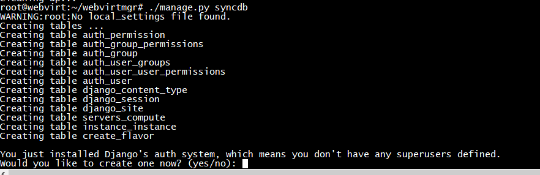

Làm theo hướng dẫn 

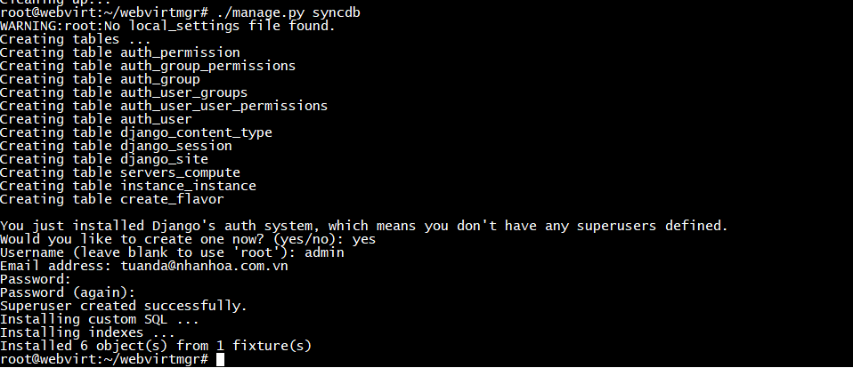


```
./manage.py collectstatic
```


### Bước 3: Cài đặt nginx

```sh
mkdir /var/www
cd ..
sudo mv webvirtmgr /var/www/
```

Kiểm tra trong thư mục /var/www/ đã có webvirtmgr chưa. Chưa có thì phải kiểm tra lại
Kiểm tra lại các file đã đủ chưa (hoặc có thể cd /var/www/ xong mới git pull)

Kết quả oke:
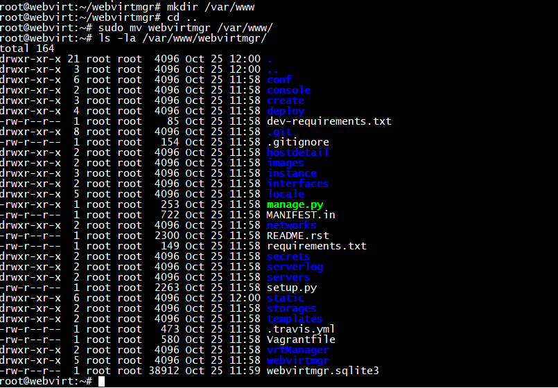


Thêm file `webvirtmgr.conf` trong `/etc/nginx/conf.d`: 

``vi /etc/nginx/conf.d/webvirtmgr.conf``

```sh
server {
    listen 80 default_server;

    server_name $hostname;
    #access_log /var/log/nginx/webvirtmgr_access_log; 

    location /static/ {
        root /var/www/webvirtmgr/webvirtmgr; # or /srv instead of /var
        expires max;
    }

    location / {
        proxy_pass http://127.0.0.1:8000;
        proxy_set_header X-Real-IP $remote_addr;
        proxy_set_header X-Forwarded-for $proxy_add_x_forwarded_for;
        proxy_set_header Host $host:$server_port;
        proxy_set_header X-Forwarded-Proto $scheme;
        proxy_connect_timeout 600;
        proxy_read_timeout 600;
        proxy_send_timeout 600;
        client_max_body_size 1024M; # Set higher depending on your needs 
    }
}
```

Vào thư mục `/etc/nginx/sites-enabled/default` comment lại section `server`

`vi /etc/nginx/sites-enabled/default`
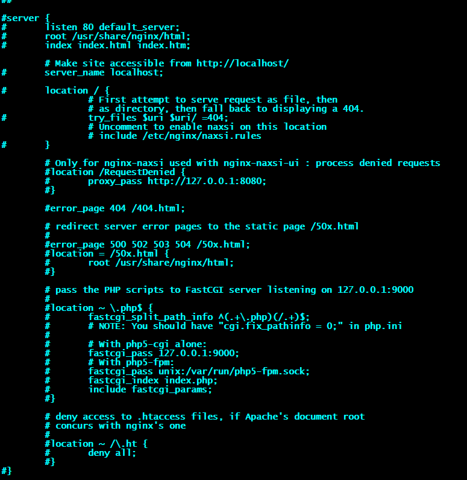


Khởi động lại nginx

`` sudo service nginx restart``

Kiểm tra lại cấu hình Nginx `nginx -t`
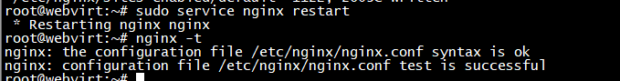

### Bước 4: Setup supervisor

``sudo vi /etc/insserv/overrides/novnc``
(Nếu không có file này thì bỏ qua)
Thêm vào đoạn sau

```sh
#!/bin/sh
### BEGIN INIT INFO
# Provides:          nova-novncproxy
# Required-Start:    $network $local_fs $remote_fs $syslog
# Required-Stop:     $remote_fs
# Default-Start:     
# Default-Stop:      
# Short-Description: Nova NoVNC proxy
# Description:       Nova NoVNC proxy
### END INIT INFO
```

Cấp quyền

``sudo chown -R www-data:www-data /var/www/webvirtmgr``

Thêm file webvirtmgr.conf vào thư mục /etc/supervisor/conf.d:

``vi /etc/supervisor/conf.d/webvirtmgr.conf``

```sh
[program:webvirtmgr]
command=/usr/bin/python /var/www/webvirtmgr/manage.py run_gunicorn -c /var/www/webvirtmgr/conf/gunicorn.conf.py
directory=/var/www/webvirtmgr
autostart=true
autorestart=true
stdout_logfile=/var/log/supervisor/webvirtmgr.log
redirect_stderr=true
user=www-data

[program:webvirtmgr-console]
command=/usr/bin/python /var/www/webvirtmgr/console/webvirtmgr-console
directory=/var/www/webvirtmgr
autostart=true
autorestart=true
stdout_logfile=/var/log/supervisor/webvirtmgr-console.log
redirect_stderr=true
user=www-data
```

Restart supervisor 

```sh
sudo service supervisor stop
sudo service supervisor start
```
Update:
```sh
cd /var/www/webvirtmgr
sudo git pull
sudo ./manage.py collectstatic
sudo service supervisor restart
```

### Bước 6: 
Sau khi cài đặt đã có thể truy cập http://10.10.10.23/login/. 

Nhập tài khoản đã tạo ở trên, vào phần add connection:
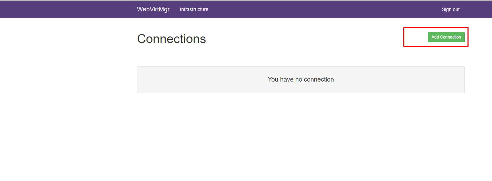

Điền đủ thông tin:
**Lưu ý : tài khoản đăng nhập là tài khoản của máy KVM**

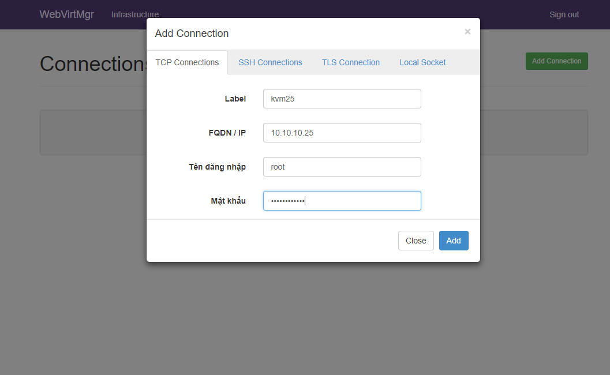

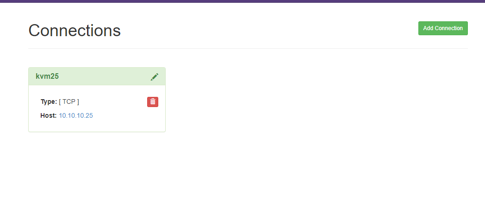

Hiển thị các máy ảo và trạng thái - menu:

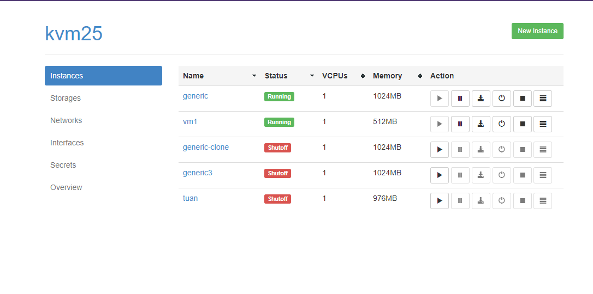

Tuy nhiên, chúng ta sẽ chưa console được các máy ảo đã cài đặt trước sẵn có thông qua `novnc`. Thế nên ta phải đi chỉnh sửa file VM.xml trên `máy KVM` như sau:

```sh 
virsh shutdown <name_VM>
virsh edit <name_VM>
.........................
<graphics type='vnc' port='-1' autoport='yes' listen='0.0.0.0'>
      <listen type='address' address='0.0.0.0'/>
</graphics>
.........................
virsh start <name_VM>
```

### Bước 7: Chỉnh sửa file cấu hình của libvirt trên `KVM` như sau 

- file libvirt.conf:
``vi /etc/libvirt/libvirtd.conf``

```sh
listen_tls = 0
listen_tcp = 1
listen_addr = "0.0.0.0"
unix_sock_group = "libvirtd"
unix_sock_ro_perms = "0777"
unix_sock_rw_perms = "0770"
auth_unix_ro = "none"
auth_unix_rw = "none"
auth_tcp = "none"
```

- file libvirt-bin:

``vi /etc/default/libvirt-bin``

```sh 
start_libvirtd="yes"
libvirtd_opts="-l -d"
```

- Khởi động lại libvirt

``service libvirt-bin restart``

- Kiểm tra lại 

```sh
ps ax | grep [l]ibvirtd
netstat -pantu | grep libvirtd
virsh -c qemu+tcp://127.0.0.1/system
```

Kết quả:

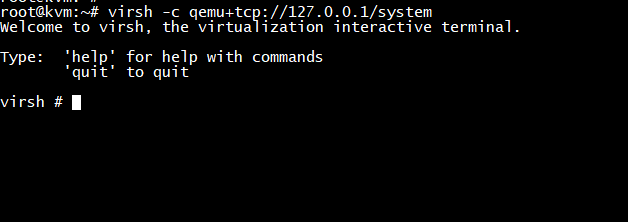

Hoặc node KVM CentOS sửa theo tài liệu:
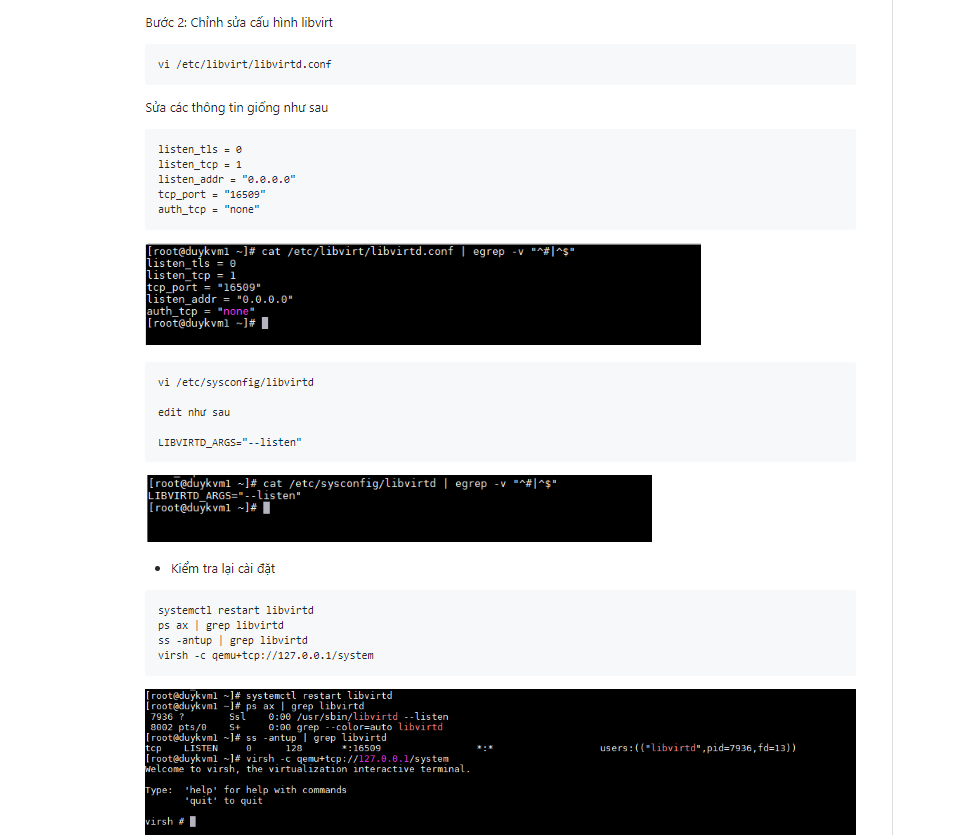

### Bước 8: Cài đặt webvirt

- Click vào đường dẫn kvm25 vừa tạo, Chọn `Storages/New Storage` để xem thư mục lưu trữ hoặc add/edit thư mục :

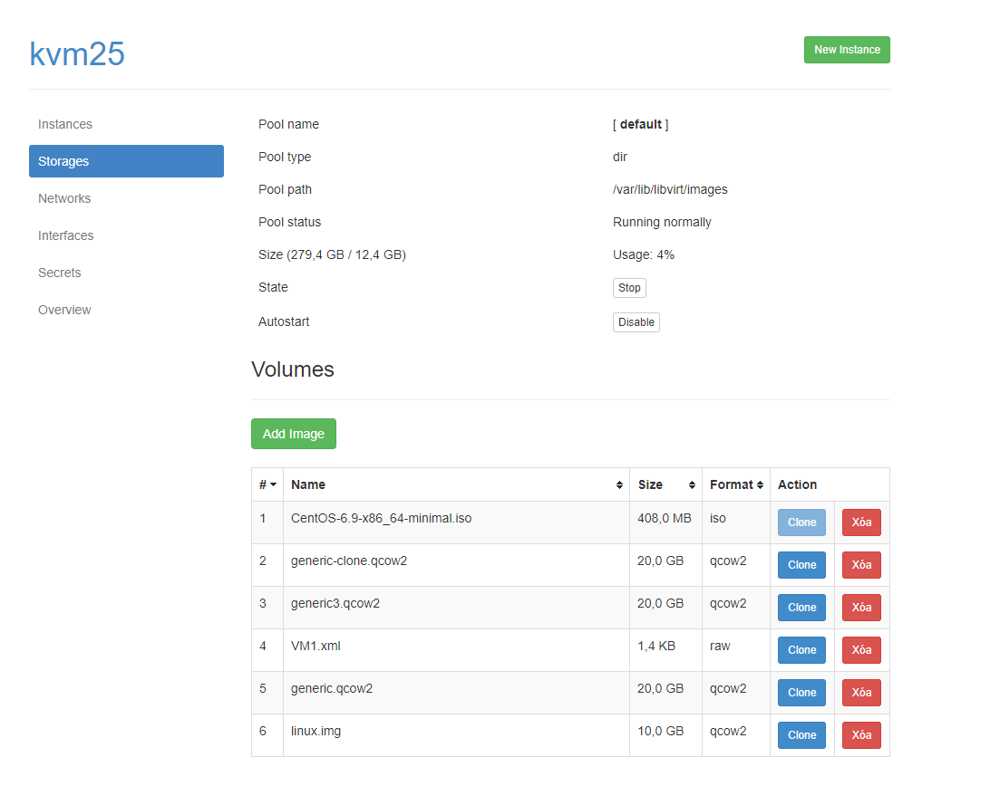
Sau khi tạo được 1 mục chứa các phân vùng đĩa và một mục chứa các file iso . Chúng ta tiến hành tạo Network

- Tab Network :

Có thể cài NAT hoặc Brigde hoăc OVS tùy theo cách cấu hình và nhu cầu sử dụng :
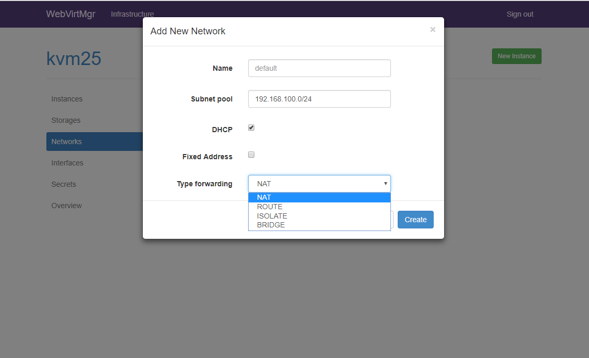

- Sau khi cài đặt mạng, tiến hành tạo img cho hệ điều hành muốn cài .Vào `Storages/Add Images`:
* phải tạo 1 image vs định dạng qcow2 trước sau đó mới create dc VM


- Vào phần Access và vào Console:

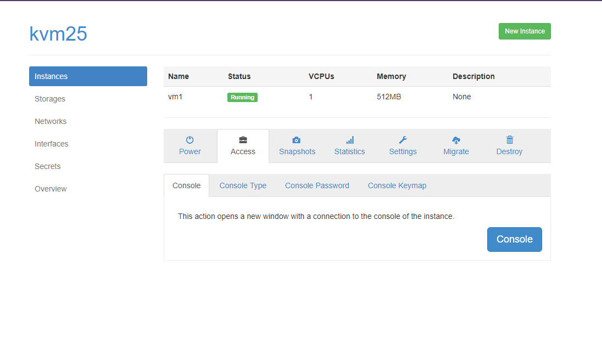

- Vào console và tiến hành cài đặt như bình thường:

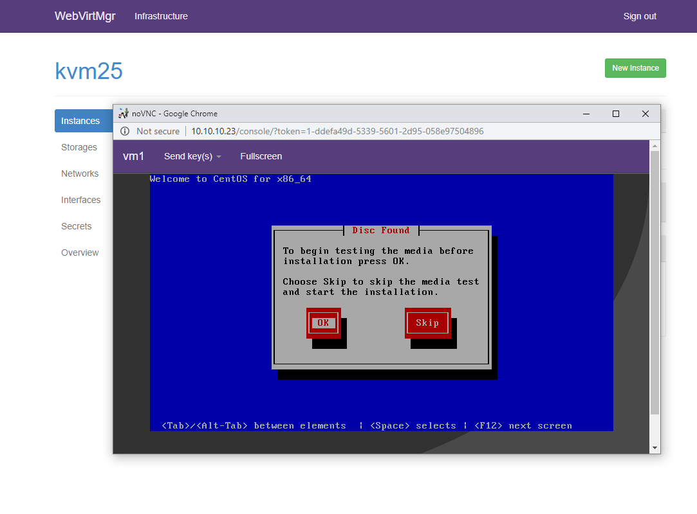