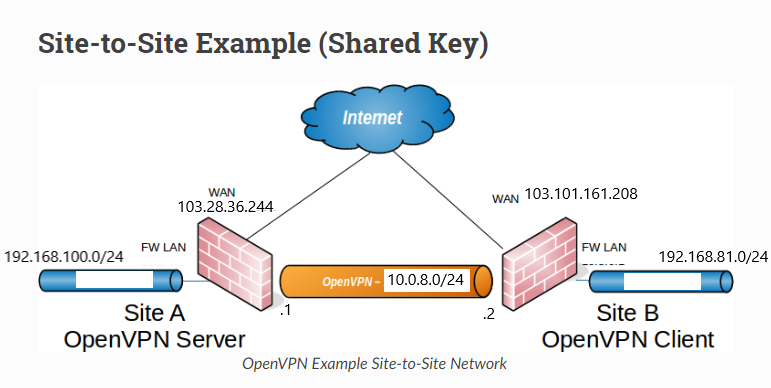
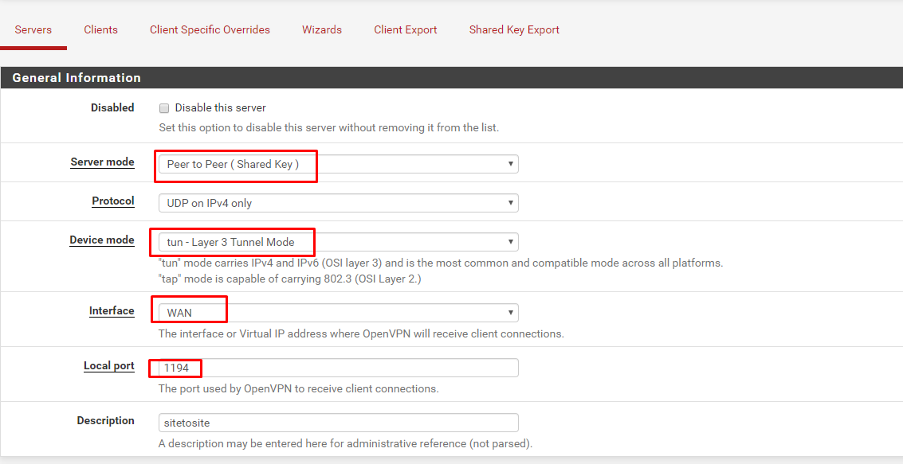
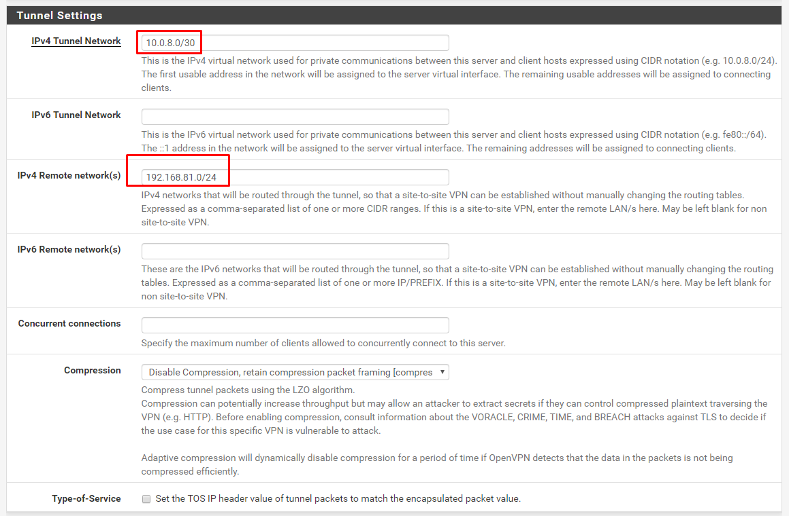
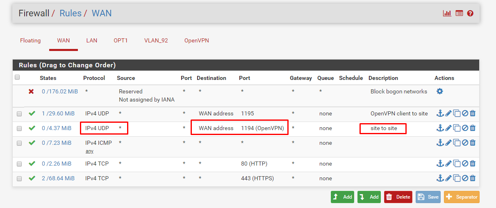
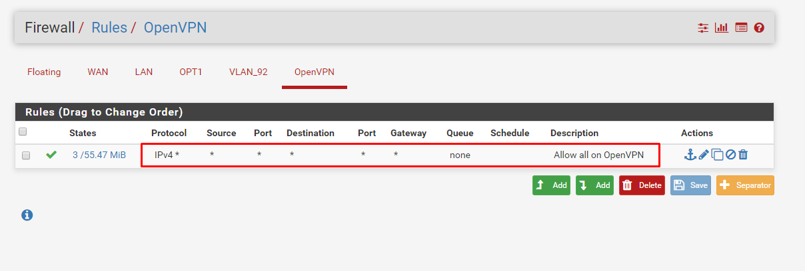
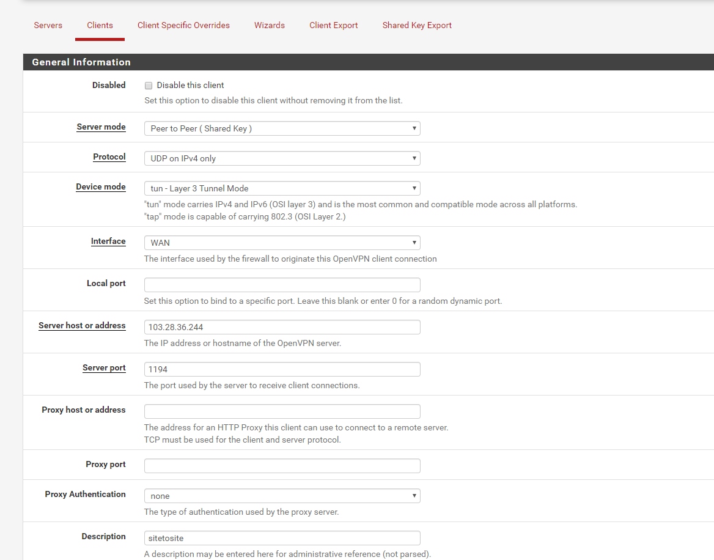
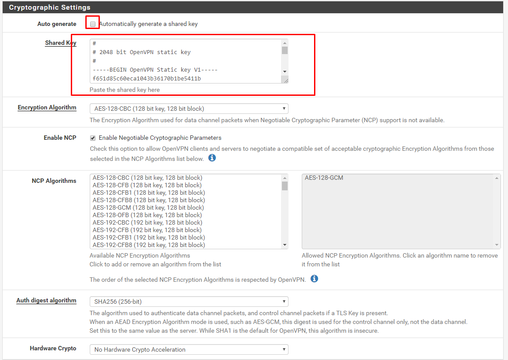
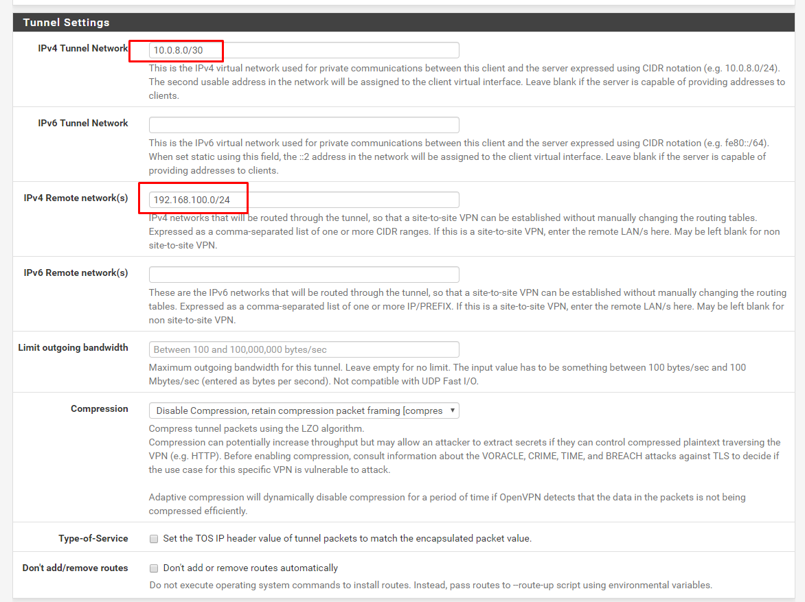
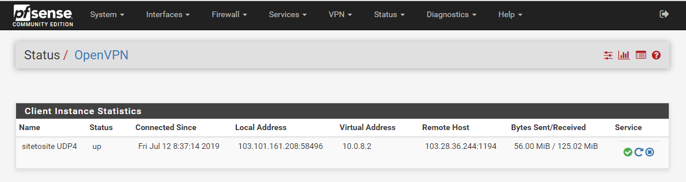

# Cấu hình VPN SiteToSite OpenVPN ( Shared Key)

## 1. Mô tả:
- Mục tiêu kết nối 2 site chạy Pfsense (OpenVPN) theo hình thức VPN Site To Site.

## 2. Mô hình

Khi cấu hình shared key site-to-site OpenVPN 1 firewall đảm nhiệm vai trò server và 1 firewall đảm nhiệm vai trò client. Thường văn phòng chính sẽ là server, và các site remove sẽ là client. 

`10.0.8.0/30` được sử dụng làm Network Tunnel

Mạng local của 2 Site lần lượt là : `192.168.100.0/24` và `192.168.81.0/24`

## 3. Tại Site A:

### Tạo server VPN:
- Vào TAb VPN > OpenVPN, Server tab, Add.
    - Fill in the fields as follows, with everything else left at defaults:
    - `Server Mode`
        - Select `Peer to Peer (Shared Key)`.
    - `Description`
        - Mô tả (Ví dụ : VPN site to site)
    - `Shared key`
        - Check `Automatically generate a shared key`.
    - `Tunnel Network`
        - Trường hợp này là `10.0.8.0/30`
    - `Remote network`
        - LAN của Site B : `192.168.81.0/24`
    - Click `Save`

- Quay lại edit server vừa tạo. Tìm phần Shared Key và copy lại toàn bộ nội dung và lưu lại.

### Allow firewall:

- Firewall > Rules, WAN tab
    - Set Protocol UDP
    - Set Source Address về IP của Client, Nếu IP client dynamic thì để Any
    - Set the Destination to WAN Address
    - Set the Destination port 1194 (Do cấu hình server phía trên)
    - Description

    - Click Apply Changes

- Add thêm rule trên OpenVPN cho phép traffic đi từ Client-side LAN đến Server-side LAN. `Allow all` có thể sử dụng tùy vào trường hợp, hoặc có thể chỉ cho đi qua 1 số giao thức
- Firewall > Rules, OpenVPN tab
- Click Add để tạo:
    - Set Protocol `any`
    - Description `Allow all on OpenVPN`
- Click Save
- Click Apply Changes

## 4. Tại Site B (Client):

### Cấu hình OpenVPN Client:
- VPN > OpenVPN, Client tab
- Click Add để tạo new OpenVPN client
- Điền các thông tin như dưới, các thông tin còn lại có thể để mặc định:
    - `Server Mode`
        - Select `Peer to Peer (Shared Key)`.
    - `Server host or address`
        - Điền IP public hoặc hostname của OpenVPN server(`103.28.36.244`).
    - `Description`
        - Ví dụ : VPN site to site
    - `Shared key`
        - Bỏ tick `Automatically generate a shared key`, sau đó paste nội dung của key server đã tạo vào
    - `Tunnel Network`
        - Khớp với network tunnel đã tạo (`10.0.8.0/30`)
    - `Remote network`
        - Điền IP network Site A (`192.168.100.0/24`)
- Click `Save`

### Allow firewall:

- Add thêm rule trên OpenVPN cho phép traffic đi từ Client-side LAN đến Server-side LAN. `Allow all` có thể sử dụng tùy vào trường hợp, hoặc có thể chỉ cho đi qua 1 số giao thức
- Firewall > Rules, OpenVPN tab
- Click Add để tạo:
    - Set Protocol `any`
    - Description `Allow all on OpenVPN`
- Click Save
- Click Apply Changes

## Kiểm tra
- Kiểm tra lại trạng  thái : 
- Status > OpenVPN:

- Kiểm tra ping giữa 2 LAN 

- The configuration of the client is complete. No firewall rules are required on the client side WAN interface because the client only initiates outbound connections. The server never initiates connections to the client.

Note

With remote access PKI configurations, typically routes and other configuration options are not defined on the client configuration, but rather they are pushed from the server to the client. With shared key deployments, routes and other parameters must be defined on both ends as needed (as described previously, and later in Custom configuration options), options cannot be pushed from the server to clients when using shared keys.

Testing the connection
The connection will immediately be active upon saving on the client side. Try to ping across to the remote end to verify connectivity. If problems arise, refer to Troubleshooting OpenVPN.