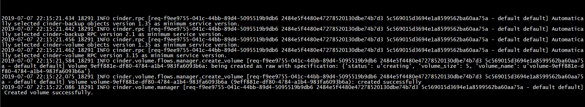

# Mô hình & IP planning


# Nội dung

Theo docs manual, Region mặc định sẽ là `RegionOne`, vì vậy chúng ta sẽ không phải cấu hình 2 node Controller `192.168.100.30` và compute `192.168.81.30`.

Trong bài, chỉ cấu hình 2 node controller `192.168.81.30` và compute `192.168.81.31` sang thành `RegionTwo`, chia sẻ Keystone, Horizon với `RegionOne`
Keystone chia sẻ giữa 2 cụm Openstack sẽ nằm trên Controller `192.168.100.30`

# Cài đặt

## Bước 1: Tạo RegionTwo trên Controller 192.168.100.30

**Thực hiện trên Controller 192.168.100.30**

- Tạo mới Region

Lưu ý: Không `source admin-openrc` khi chạy keystone-manage

```sh
keystone-manage bootstrap --bootstrap-password Welcome123 \
  --bootstrap-admin-url http://192.168.100.30:5000/v3/ \
  --bootstrap-internal-url http://192.168.100.30:5000/v3/ \
  --bootstrap-public-url http://192.168.100.30:5000/v3/ \
  --bootstrap-region-id RegionTwo
```

- Kiểm tra các Region trên hệ thống
```sh
source admin-openrc
openstack region list
+-----------+---------------+-------------+
| Region    | Parent Region | Description |
+-----------+---------------+-------------+
| RegionOne | None          |             |
| RegionTwo | None          |             |
+-----------+---------------+-------------+
```

- Sau khi sử dụng keystone khởi tạo RegionTwo, keystone sẽ tự động tạo thêm endpoint identity mới
```sh
openstack endpoint list --service identity

+----------------------------------+-----------+--------------+--------------+---------+-----------+------------------------------+
| ID                               | Region    | Service Name | Service Type | Enabled | Interface | URL                          |
+----------------------------------+-----------+--------------+--------------+---------+-----------+------------------------------+
| 47250aae55944369ac36da4b9bcdf097 | RegionTwo | keystone     | identity     | True    | internal  | http://192.168.100.30:5000/v3/ |
| 5c5deb663e7c4b95b4327f7cd441b521 | RegionTwo | keystone     | identity     | True    | admin     | http://192.168.100.30:5000/v3/ |
| 8536ac773c714e1c9a9b9ad37825c91f | RegionOne | keystone     | identity     | True    | admin     | http://192.168.100.30:5000/v3/ |
| 9ddd4069ef554c55b3efa223e8d7fb57 | RegionOne | keystone     | identity     | True    | public    | http://192.168.100.30:5000/v3/ |
| aa320e7fb3f542db8073e3022bb7bdce | RegionTwo | keystone     | identity     | True    | public    | http://192.168.100.30:5000/v3/ |
| f84726934ee4402697de24b047a16ddd | RegionOne | keystone     | identity     | True    | internal  | http://192.168.100.30:5000/v3/ |
+----------------------------------+-----------+--------------+--------------+---------+-----------+------------------------------+
```

## Bước 2: Khởi tạo các endpoint RegionTwo cho nova, cinder, glance, neutron 
**Thực hiện trên CTL 192.168.100.30**

**Lưu ý các endpoint tạo cho RegionTwo sẽ sử dụng IP CTL `192.168.81.30`**
```sh
openstack endpoint create --region RegionTwo image public http://192.168.81.30:9292
openstack endpoint create --region RegionTwo image admin http://192.168.81.30:9292
openstack endpoint create --region RegionTwo image internal http://192.168.81.30:9292

openstack endpoint create --region RegionTwo network public http://192.168.81.30:9696
openstack endpoint create --region RegionTwo network internal http://192.168.81.30:9696
openstack endpoint create --region RegionTwo network admin http://192.168.81.30:9696

openstack endpoint create --region RegionTwo compute public http://192.168.81.30:8774/v2.1
openstack endpoint create --region RegionTwo compute admin http://192.168.81.30:8774/v2.1
openstack endpoint create --region RegionTwo compute internal http://192.168.81.30:8774/v2.1

openstack endpoint create --region RegionTwo placement public http://192.168.81.30:8778
openstack endpoint create --region RegionTwo placement admin http://192.168.81.30:8778
openstack endpoint create --region RegionTwo placement internal http://192.168.81.30:8778

openstack endpoint create --region RegionTwo volumev2 public http://192.168.81.30:8776/v2/%\(project_id\)s
openstack endpoint create --region RegionTwo volumev2 internal http://192.168.81.30:8776/v2/%\(project_id\)s
openstack endpoint create --region RegionTwo volumev2 admin http://192.168.81.30:8776/v2/%\(project_id\)s

openstack endpoint create --region RegionTwo volumev3 public http://192.168.81.30:8776/v3/%\(project_id\)s
openstack endpoint create --region RegionTwo volumev3 internal http://192.168.81.30:8776/v3/%\(project_id\)s
openstack endpoint create --region RegionTwo volumev3 admin http://192.168.81.30:8776/v3/%\(project_id\)s
```

- Kiểm tra lại:
```sh
openstack endpoint list --region RegionTwo
+----------------------------------+-----------+--------------+--------------+---------+-----------+--------------------------------------------+
| ID                               | Region    | Service Name | Service Type | Enabled | Interface | URL                                        |
+----------------------------------+-----------+--------------+--------------+---------+-----------+--------------------------------------------+
| 0308402db3634ebb91a1f54dca0e00e0 | RegionTwo | nova         | compute      | True    | internal  | http://192.168.81.30:8774/v2.1              |
| 26770064c2844347ac0353a1eec59861 | RegionTwo | neutron      | network      | True    | admin     | http://192.168.81.30:9696                   |
| 3252eb96797149cb91e49d00fb82379d | RegionTwo | placement    | placement    | True    | internal  | http://192.168.81.30:8778                   |
| 47250aae55944369ac36da4b9bcdf097 | RegionTwo | keystone     | identity     | True    | internal  | http://192.168.100.30:5000/v3/               |
| 4d527af56f8d4e698e586418f77edabe | RegionTwo | cinderv3     | volumev3     | True    | public    | http://192.168.81.30:8776/v3/%(project_id)s |
| 5c5deb663e7c4b95b4327f7cd441b521 | RegionTwo | keystone     | identity     | True    | admin     | http://192.168.100.30:5000/v3/               |
| 6270705683b7419e9a988046628007cf | RegionTwo | neutron      | network      | True    | public    | http://192.168.81.30:9696                   |
| 6fd601c9babc4bc7a8e975b74bfaae52 | RegionTwo | placement    | placement    | True    | admin     | http://192.168.81.30:8778                   |
| 714545f032574c63a6a5197457377324 | RegionTwo | cinderv2     | volumev2     | True    | internal  | http://192.168.81.30:8776/v2/%(project_id)s |
| 7161d59670ae4ca79dfc7145c1c47c0a | RegionTwo | glance       | image        | True    | admin     | http://192.168.81.30:9292                   |
| 807cceca6ee94cc099f1384aed8f99b7 | RegionTwo | neutron      | network      | True    | internal  | http://192.168.81.30:9696                   |
| 84e3cd6ef87d46a6902475ceb790e372 | RegionTwo | nova         | compute      | True    | admin     | http://192.168.81.30:8774/v2.1              |
| 985e7b9dcae347129683e66e16ef64f1 | RegionTwo | glance       | image        | True    | public    | http://192.168.81.30:9292                   |
| a964253ee36e4ea68bae6f8a67fee0e6 | RegionTwo | placement    | placement    | True    | public    | http://192.168.81.30:8778                   |
| aa320e7fb3f542db8073e3022bb7bdce | RegionTwo | keystone     | identity     | True    | public    | http://192.168.100.30:5000/v3/               |
| bcebccfb282542d78d656b9476f32d8c | RegionTwo | cinderv3     | volumev3     | True    | admin     | http://192.168.81.30:8776/v3/%(project_id)s |
| e264f1d1a4fd4db99bd3d8519a3e7c5c | RegionTwo | cinderv2     | volumev2     | True    | admin     | http://192.168.81.30:8776/v2/%(project_id)s |
| ecda943a02d1470491e1e6db93a2009b | RegionTwo | cinderv2     | volumev2     | True    | public    | http://192.168.81.30:8776/v2/%(project_id)s |
| f551f05549c44d8b9f52cece479985c9 | RegionTwo | cinderv3     | volumev3     | True    | internal  | http://192.168.81.30:8776/v3/%(project_id)s |
| f92678989eab43eb939182598889a36a | RegionTwo | nova         | compute      | True    | public    | http://192.168.81.30:8774/v2.1              |
| fc0e1d8b9e0746d7a3232c68f3968e2d | RegionTwo | glance       | image        | True    | internal  | http://192.168.81.30:9292                   |
+----------------------------------+-----------+--------------+--------------+---------+-----------+--------------------------------------------+
```

## Bước 3: Tạo admin openstack resource trên cho cả 2 node CTL 100.30 và 81.30
```sh
cat << EOF >> admin-openrc-r2
export OS_REGION_NAME=RegionTwo
export OS_PROJECT_DOMAIN_NAME=Default
export OS_USER_DOMAIN_NAME=Default
export OS_PROJECT_NAME=admin
export OS_USERNAME=admin
export OS_PASSWORD=Welcome123
export OS_AUTH_URL=http://192.168.100.30:5000/v3
export OS_IDENTITY_API_VERSION=3
export OS_IMAGE_API_VERSION=2
export PS1='[\u@\h \W(admin-openrc)]\$ '
EOF
```
> Có thể sửa lại file admin-openrc cũ , thêm tham số:
`export OS_REGION_NAME=RegionOne`

## Bước 4: Chỉnh sửa dịch vụ Glance

**Truy cập controller 81.30**

Với Glance, chúng ta sẽ chỉnh sửa mục xác thực keystone về CTL 100.30 (`/etc/glance/glance-api.conf` và `/etc/glance/glance-registry.conf`)

- Mục `[keystone_authtoken]`

    - `auth_uri`, `auth_url` về CTL 100.30
    - Chỉnh sửa `region_name` về RegionTwo.
    - Lưu ý, sẽ chỉnh sửa 2 file `glance-api.conf` và `glance-registry.conf`

Kiểm tra trên CTL1 hoặc CTL2 với điều kiện xác thực 
`. admin-openrc-r2`

```sh
openstack --debug image list --os-region-name RegionTwo
```

Đứng trên CTL 100.30 tiến hành xác thực qua keystone 81.30 trên RegionTwo

```sh
source admin-openrc-r2
```
- Upload image mới lên

```sh
openstack image create "cirrosr2-2" --file cirros-0.3.5-x86_64-disk.img --disk-format qcow2 \
--container-format bare --public --os-region-name RegionTwo
```

- Kiểm tra image trên Node 100.30

```sh
openstack image list --os-region-name RegionTwo
+--------------------------------------+----------+--------+
| ID                                   | Name     | Status |
+--------------------------------------+----------+--------+
| 24d4eb74-75ac-45cc-8cd4-a95039ebdeb3 | cirros   | active |
| 2344440b-3c23-4b83-a0cc-db6ab45dac58 | cirrosr2 | active |
+--------------------------------------+----------+--------+
```

## Bước 4: Chỉnh sửa dịch vụ Nova ##

**Với Nova, ta cần chỉnh sửa lại settings trên CTL 81.30, COM1 3.223**

**Thực hiện trên CTL 81.30**

Với dịch vụ Nova, chúng ta sẽ chỉnh sửa lại các mục `[keystone_authtoken]`, `[neutron]`, `[placement]`, `[cinder]` tại `/etc/nova/nova.conf`

- Mục `[cinder]`:
  - Chỉnh sửa `os_region_name` về `RegionTwo`

- Mục `[keystone_authtoken]`:
  - Chỉnh sửa `auth_url` về CTL 100.30
  - `region_name` về `RegionTwo`

- Mục `[neutron]`:
  - Chỉnh sửa `auth_url` về CTL 100.30
  - `region_name` về `RegionTwo`

- Mục `[placement]`
  - `os_region_name` về `RegionTwo`
  - `auth_url` về CTL 100.30

```sh
systemctl restart openstack-nova-api.service openstack-nova-scheduler.service \
openstack-nova-consoleauth.service openstack-nova-conductor.service openstack-nova-novncproxy.service
```

- Kiểm tra lại
```sh
openstack --debug server list --os-region-name RegionTwo
```

Với dịch vụ nova chỉnh sửa `/etc/nova/nova.conf` tại COM 81.31, chúng ta sẽ chỉnh sửa lại `[cinder]`, `[keystone_authtoken]`, `[neutron]`, 
`[placement]`

- Mục `[cinder]`:
  - Chỉ định sử dụng cinder service của RegionTwo (`os_region_name = RegionTwo`)

- Mục `[keystone_authtoken]`:
  - Chỉnh sửa `auth_url` về CTL 100.30
  - `region_name = RegionTwo`

- Mục `[neutron]`:
  - Chỉnh sửa `auth_url` về CTL 100.30
  - `region_name = RegionTwo`

- Mục `[placement]`:
  - Chỉnh sửa `auth_url` về CTL 100.30
  - Sửa `os_region_name` về `RegionTwo`

- Khởi động lại dịch vụ tại node COM
```sh
systemctl restart libvirtd.service openstack-nova-compute
```

**Lưu ý: Kiểm tra log tại Nova Compute**
```sh
cat /var/log/nova/nova-compute.log | grep 'placement'

2019-04-11 10:36:33.694 14368 ERROR nova.scheduler.client.report [req-6c9a2cb8-b840-4345-bb9e-088068c8568f - - - - -] [req-5d53d9f5-99a8-4ce3-9579-92d93ec5f31f] Failed to retrieve resource provider tree from placement API for UUID 52517eca-5525-4905-aaa1-fed226b3366f. Got 401: {"error": {"message": "The request you have made requires authentication.", "code": 401, "title": "Unauthorized"}}.
```

- Nếu xuất hiện, kiểm tra config tại nova controller và nova compute, sau đó khởi động os CTL 81.30 vầ 81.31 thuộc `RegionTwo` (do db hoặc cache)

**Trở lại CTL 81.30**

Kiểm tra dịch vụ bằng câu lệnh
```sh
openstack compute service list --os-region-name RegionTwo

+----+------------------+------------+----------+---------+-------+----------------------------+
| ID | Binary           | Host       | Zone     | Status  | State | Updated At                 |
+----+------------------+------------+----------+---------+-------+----------------------------+
|  1 | nova-conductor   | controller | internal | enabled | up    | 2019-07-08T01:52:10.000000 |
|  3 | nova-scheduler   | controller | internal | enabled | up    | 2019-07-08T01:52:10.000000 |
|  4 | nova-consoleauth | controller | internal | enabled | up    | 2019-07-08T01:52:09.000000 |
|  7 | nova-compute     | compute01  | nova     | enabled | up    | 2019-07-08T01:52:10.000000 |
+----+------------------+------------+----------+---------+-------+----------------------------+
```

## Bước 6: Chỉnh sửa dịch vụ Cinder
**Thực hiện trên CTL 81.30**

Với dịch vụ Cinder, ta sẽ chỉnh sửa các mục `[keystone_authtoken]` tại `/etc/cinder/cinder.conf`

Mục `[keystone_authtoken]`
Sửa `auth_uri`, `auth_url` về CTL 100.30
region_name = RegionTwo

- Khởi động lại dịch vụ
```sh
systemctl restart openstack-cinder-api.service openstack-cinder-volume.service openstack-cinder-scheduler.service
```

Kiểm tra dịch vụ

Trở về CTL 100.30, kiểm tra service
```sh
openstack volume service list --os-region-name RegionTwo
+------------------+----------------+------+---------+-------+----------------------------+
| Binary           | Host           | Zone | Status  | State | Updated At                 |
+------------------+----------------+------+---------+-------+----------------------------+
| cinder-scheduler | controller     | nova | enabled | up    | 2019-07-08T02:11:16.000000 |
| cinder-volume    | controller@lvm | nova | enabled | up    | 2019-07-08T02:11:25.000000 |
+------------------+----------------+------+---------+-------+----------------------------+
```

- Trở về Horion thử tạo Volume + Volume có chưa Image và kiểm tra log.


## Bước 7: Chỉnh sửa dịch vụ Neutron

**Với Neutron, ta cần chỉnh sửa lại settings trên CTL 81.30, COM1 81.31**

**Thực hiện trên CTL 81.30**

Chỉnh sửa các mục `[keystone_authtoken]`, `[nova]` tại `/etc/neutron/neutron.conf`

Mục `[keystone_authtoken]`

Sửa `auth_uri`, `auth_url` về CTL 100.30
`region_name =  RegionTwo`

Mục `[nova]`

`auth_url` về CTL 100.30
`region_name` = RegionTwo

Khởi động lại dịch vụ nova và neutron
```sh
systemctl restart openstack-nova-api.service openstack-nova-scheduler.service openstack-nova-consoleauth.service openstack-nova-conductor.service openstack-nova-novncproxy.service
systemctl restart neutron-server.service neutron-linuxbridge-agent.service \
neutron-l3-agent.service
```

**Thực hiện trên COM1 81.31**

Chỉnh sửa lại các mục `[keystone_authtoken]` tại `/etc/neutron/neutron.conf`

Sửa `auth_uri`, `auth_url` về CTL 100.30
`region_name = RegionTwo`

- Restart lại service 

Kiểm tra

**Trở về CTL 80.83**
```sh
openstack network agent list --os-region-name RegionTwo
+--------------------------------------+--------------------+------------+-------------------+-------+-------+---------------------------+
| ID                                   | Agent Type         | Host       | Availability Zone | Alive | State | Binary                    |
+--------------------------------------+--------------------+------------+-------------------+-------+-------+---------------------------+
| 3f697c20-adf8-4023-95e0-0b55f0fda738 | DHCP agent         | compute01  | nova              | :-)   | UP    | neutron-dhcp-agent        |
| 46be7c66-aba3-4937-9f82-69d614570975 | Metadata agent     | compute01  | None              | :-)   | UP    | neutron-metadata-agent    |
| 6852b0e4-af68-4d7a-8903-3df3db39ca34 | Linux bridge agent | controller | None              | :-)   | UP    | neutron-linuxbridge-agent |
| 689f554e-8789-4406-b6ae-b3bfe0f3c491 | Linux bridge agent | compute01  | None              | :-)   | UP    | neutron-linuxbridge-agent |
| 8237497e-5c62-4fb5-8da1-ab5adef3007e | L3 agent           | controller | nova              | :-)   | UP    | neutron-l3-agent          |
+--------------------------------------+--------------------+------------+-------------------+-------+-------+---------------------------+
```

Truy cập RegionOne, thử tạo VM với volume cinder

Truy cập RegionTwo, thử tạo VM với volume cinder

`openstack volume create vl1 --size 5 --os-region-name RegionTwo`

Nếu xuất hiện lỗi tại Node Compute
```sh

[root@compute01 ~]# cat /var/log/nova/nova-compute.log | grep ERROR

2019-04-11 11:40:05.363 15299 ERROR nova.compute.manager [instance: 5350c69f-24de-4345-9556-0cc92faa3ef2] BuildAbortException: Build of instance 5350c69f-24de-4345-9556-0cc92faa3ef2 aborted: Invalid input received: Invalid image identifier or unable to access requested image. (HTTP 400) (Request-ID: req-1e69aa25-4f63-477d-a8a5-678ebf1bb869)
```

- Kiểm tra lại cấu hình cinder:

Tại Controller, có thể thiếu `glance_api_servers` section `[DEFAULT]` (`/etc/cinder/cinder.conf`)

glance_api_servers = http://192.168.81.30:9292

Tại Compute, có thể thiếu `os_region_name` tại section `[cinder]` (`/etc/nova/nova.conf`)

Nếu xuất hiện lỗi tại Node Compute
```sh
2019-04-11 10:58:40.625 14019 ERROR nova.compute.manager [instance: 66eef324-058d-443e-afa6-8893f183a7db] PortBindingFailed: Binding failed for port 68e62053-fed2-4bd8-b3a8-0755012774ad, please check neutron logs for more information.
```

Kiểm tra lại cấu hình Neutron:

Dịch vụ Neutron đã cấu hình không chính xác, kiểm tra lại service neutron
restart dịch vụ httpd trên CTL 100.30
```
openstack server create Provider_VM01 --flavor flavor1 --image cirrosr2 \
     --nic net-id=350ac90c-2d2d-43a7-bf45-ddf059b4eb5b --os-region-name RegionTwo
```

