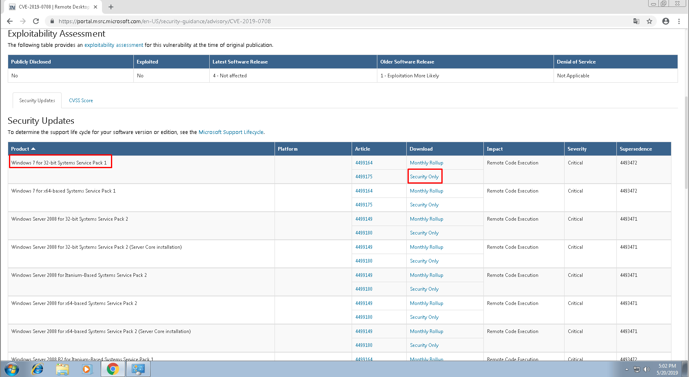
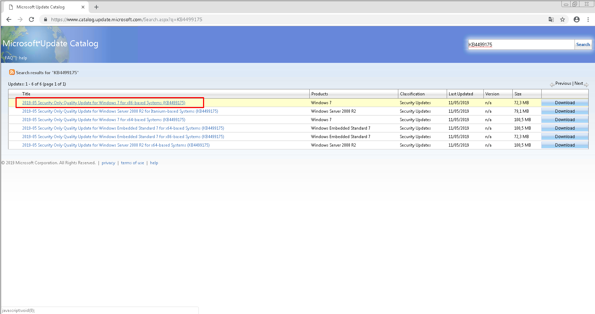
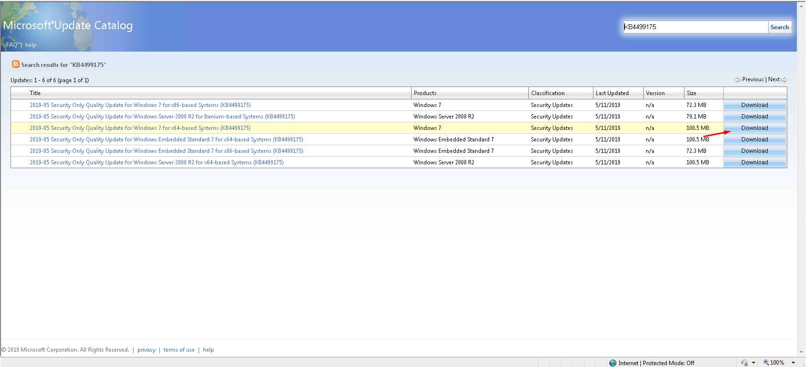
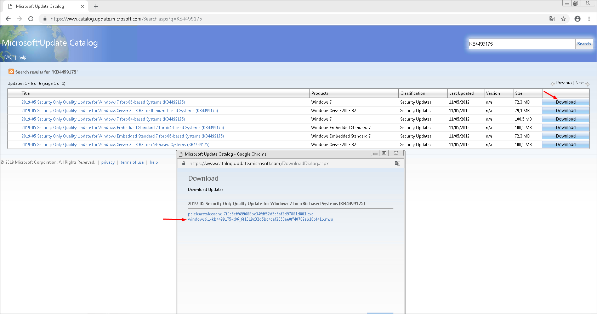
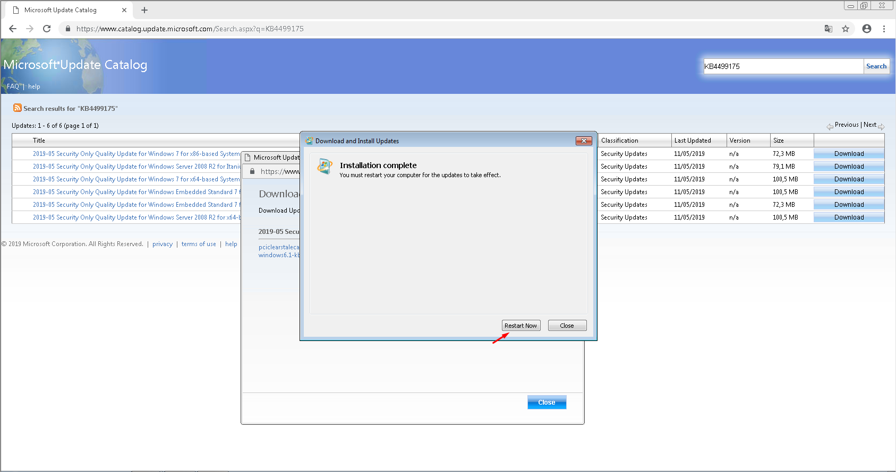

Ngày 14/5, Microsoft đã thực hiện cảnh báo về lỗ hổng bảo mật nghiêm trọng trên các phiên bản Windows server (CVE-2019-0708 - Remote Desktop Services Remote Code Execution Vulnerability), cụ thể:
1.	Thông tin lỗ hổng CVE-2019-0708:
Lỗ hổng tồn tại trong Remote Desktop Services - trước đây gọi là Terminal Services.
Kẻ tấn công không cần xác thực kết nối tới máy chủ bằng RDP mà gửi các yêu cầu đặc biệt. Lỗ hổng này không tương tác với người dùng, không cần biết user / mật khẩu remote. 
Sau khi khai thác thành công, kẻ tấn công có thể thực thi các hành động tùy ý trên hệ thống đích, sau đó có thể cài đặt chương trình: xem, thay đổi hoặc xóa dữ liệu hoặc tạo tài khoản mới với quyền người dùng đầy đủ.
2.	Cách khắc phục: 
- Quý khách download vào cài đặt các bản vá lỗi theo hướng dẫn trên tương ứng với từng phiên bản windows.
3.	Thông tin bản vá:
- Windows 2008 + Windows 7 : 
https://portal.msrc.microsoft.com/en-US/security-guidance/advisory/CVE-2019-0708
- Windows XP + Windows 2003 : 
https://support.microsoft.com/en-us/help/4500705/customer-guidance-for-cve-2019-0708
4.	Các phiên bản Windows bị ảnh hưởng:
- Windows 7 for 32-bit Systems Service Pack 1
- Windows 7 for x64-based Systems Service Pack 1	
- Windows Server 2008 for 32-bit Systems Service Pack 2
- Windows Server 2008 for 32-bit Systems Service Pack 2 (Server Core)		
- Windows Server 2008 for Itanium-Based Systems Service Pack 2	
- Windows Server 2008 for x64-based Systems Service Pack 2		
- Windows Server 2008 for x64-based Systems Service Pack 2 (Server Core)	
- Windows Server 2008 R2 for Itanium-Based Systems Service Pack 1	
- Windows Server 2008 R2 for x64-based Systems Service Pack 1		
- Windows Server 2008 R2 for x64-based Systems Service Pack 1 (Server Core)
- Windows XP SP3 x86
- Windows XP Professional x64 Edition SP2
- Windows XP Embedded SP3 x86
- Windows Server 2003 SP2 x86
- Windows Server 2003 x64 Edition SP2

Win 7 Pro 32bit SP1: OK
Win 7 Pro 64bit SP1: OK
Win 7 Ultimate 64bit SP1: OK
Win 7 Enterprises 64bit SP1: OK

https://portal.msrc.microsoft.com/en-US/security-guidance/advisory/CVE-2019-0708