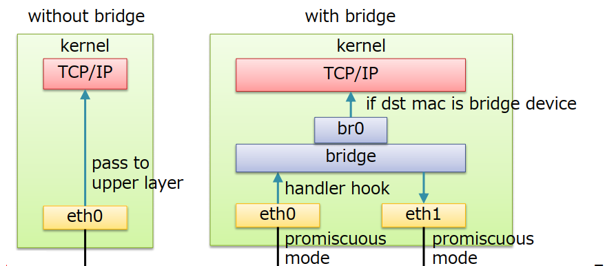
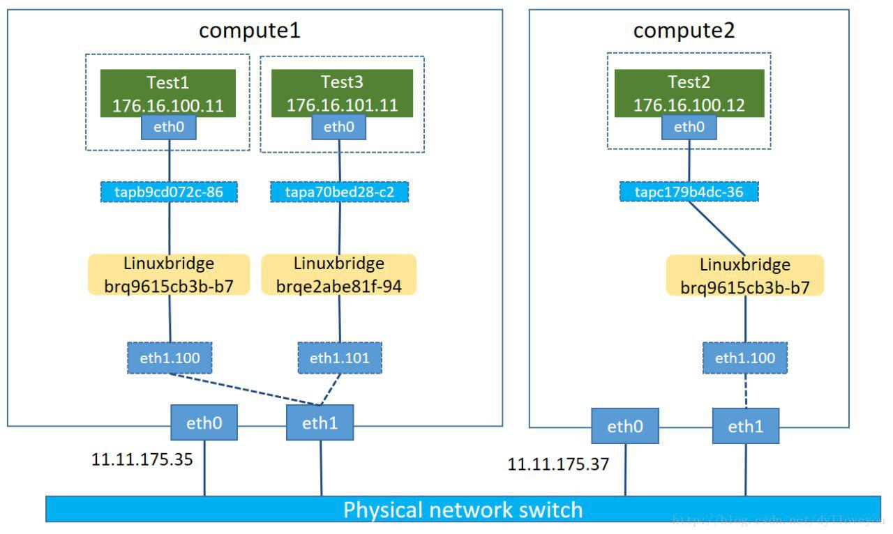
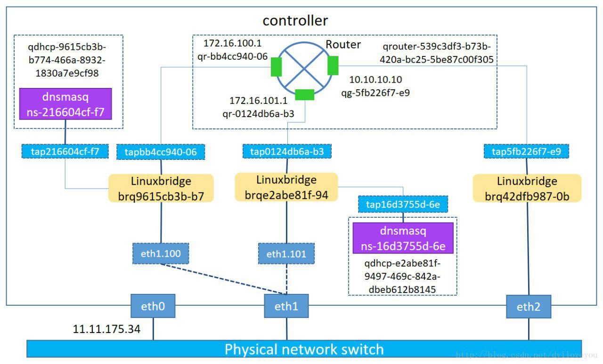

# LINUX BRIDGE

## ***Mục lục***

[I. Tổng quan network Linux](#A)

- [1. Linux Bridge](#1)
    - [1.1. Giới thiệu - Cấu trúc](#1.1)
    - [1.2. Một số câu lệnh với Linux bridge](#1.2)
        - [1.2.1]111
    - [1.3. Lab cơ bản ](#1.3)
    - [1.4. Tham khảo](#1.4)

---

# <a name = "1"></a>1. Tổng quan các công nghệ Network trong Linux

- Linux Bridge
- OpenvSwitch
- macvlan


## <a name = "1.1"></a>1.1. Giới thiệu


-   **Linux bridge** sử dụng chuẩn (IEEE 802.1D)
- Sử dụng chế độ promiscuous mode cho phép nhận tất cả các gói tin trong local 



- Bao gồm 4 thành phần chính:

    - Tập hợp các cổng mạng (interface): được sử dụng để chuyển tiếp lưu lượng giữa các switch đến các máy chủ khác trong mạng.
    - Control plane: được sử dụng để chạy Spanning Tree Protocol (STP), ngăn chặn loop.
    - Forwarding plane: được sử dụng để xử lý frames đến từ các port, chuyển tiếp chúng đến cổng mạng bằng cách đưa ra quyết định chuyển tiếp dựa trên MAC database.
    - MAC learning database: được sử dụng để theo dõi các vị trí máy chủ trong mạng LAN.

Đối với mỗi địa chỉ mac unicast, bridge quản lý cmac learning database để quyết định cổng nào chuyển tiếp dựa trên địa chỉ MAC và nếu không thể tìm thấy, nó sẽ broadcase cho tất cả các cổng trừ cổng nó nhận frame.

**Có ba các cấu hình chính cho bride:**

- `ioctl` (`brctl`): Giao diện này được sử dụng để create/destroy bridges add/remove interfaces to/from bridge.
- `sysfs`: Quản lý các tham số cụ thể của bridge và port (thường dùng trong lập trình).
- `netlink`: Giao tiếp dựa trên hàng đợi không đồng bộ sử dụng họ địa chỉ AF_NETLINK.
Ví dụ:
    - Adding bridge : `ip link add name br0 type bridge`
    - Bringing bridge UP : `ip link set dev br0 up`
    - Adding interface to bridge : `ip link set dev eth1 master br0`
    - Bringing interface UP. : `ip link set dev eth1 up`
    - Xem thêm ở:
https://github.com/ebiken/doc-network/wiki/Linux-iproute2-:-ip-link-bridge-operations

Mô hình Khi sử dụng với KVM :


Khi sử dụng với Openstack :





##<a name = "3"></a>3. Các thao tác quản lý Linux Bridge

## 3.1. Cài đặt công cụ phần mềm quản lý Linux Bridge

Linux bridge được hỗ trợ từ version nhân kernel từ 2.4 trở lên. Để sử dụng và quản lý các tính năng của linux birdge, cần cài đặt gói `bridge-utilities` (dùng các câu lệnh `brctl` để sử dụng linux bridge)

`sudo  apt-get install bridge-ultils -y`

<a name = '3.2'></a>
## 3.2. Một số câu lệnh quản lý

### BRIDGE MANAGEMENT

|ACTION	|BRCTL	|BRIDGE|
|-|-|-|
|creating bridge|	`brctl addbr <bridge>`| |	
|deleting bridge|	`brctl delbr <bridge>`| |
|add interface (port) to bridge	| `brctl addif <bridge> <ifname>`	| |
|delete interface (port) on bridge |	`brctl delbr <bridge>`|  |	


### FDB MANAGEMENT

|ACTION	|BRCTL	|BRIDGE|
|-|-|-|
|Shows a list of MACs in FDB|	`brctl showmacs <bridge>`	|`bridge fdb show`|
|Sets FDB entries ageing time|	`brctl setageingtime  <bridge> <time>`|	|
|Sets FDB garbage collector interval|	`brctl setgcint <brname> <time>`| |	
|Adds FDB entry	|	|`bridge fdb add dev <interface> [dst, vni, port, via]`|
|Appends FDB entry|		|`bridge fdb append` (parameters same as for fdb add)|
|Deletes FDB entry|		|`bridge fdb delete ` (parameters same as for fdb add)|

### STP MANAGEMENT

|ACTION	|BRCTL	|BRIDGE|
|-|-|-|
|Turning STP on/off	|`brctl stp <bridge> <state>`| |	
|Setting bridge priority|	`brctl setbridgeprio <bridge> <priority>`	| |
|Setting bridge forward delay|	`brctl setfd <bridge> <time>`	| |
|Setting bridge 'hello' time|	`brctl sethello <bridge> <time>`| |	
|Setting bridge maximum message age|	`brctl setmaxage <bridge> <time>`	| |
|Setting cost of the port on bridge|	`brctl setpathcost <bridge> <port> <cost>`|	`bridge link set dev <port> cost <cost>`|
|Setting bridge port priority	|`brctl setportprio <bridge> <port> <priority>`|	`bridge link set dev <port> priority <priority>`|
|Should port proccess STP BDPUs	|	|`bridge link set dev <port > guard [on, off]`|
|Should bridge might send traffic on the port it was received|		|`bridge link set dev <port> hairpin [on,off]`|
|Enabling/disabling fastleave options on port|		|`bridge link set dev <port> fastleave [on,off]`|
|Setting STP port state	|	|`bridge link set dev <port> state <state>`|

### VLAN MANAGEMENT

|ACTION|	BRCTL|	BRIDGE|
|-|-|-|
|Creating new VLAN filter entry|		|`bridge vlan add dev <dev> [vid, pvid, untagged, self, master]`|
|Delete VLAN filter entry	|	|`bridge vlan delete dev <dev>` (parameters same as for vlan add)|
|List VLAN configuration|		|`bridge vlan show`|


***Lưu ý*** : Các ảnh hưởng của câu lệnh chỉ là tạm thời cho đến khi máy host khởi động lại, sau khi khởi động lại, toàn bộ thông tin sẽ bị mất. 


<a name = '4.4'></a>
## 4.4.	Cấu hình linux bridge khởi động cùng hệ điều hành

- Khi tạo bridge bằng command `brctl addbr thì bridge` là `non-persistent bridge` (tức là sẽ không có hiệu lực khi hệ thống khởi động lại).

    `brctl addbr br1 `

- Ban đầu, khi mới được tạo, bridge sẽ có một địa chỉ MAC mặc định ban đầu. Khi thêm một NIC của host vào thì MAC của bridge sẽ là MAC của NIC luôn. Khi del hết các NIC của host trên bridge thì MAC của bridge sẽ về là 00:00:00:00:00:00 và chờ khi nào có NIC khác add vào thì sẽ lấy MAC của NIC đó.

    

- Khi cấu hình bằng câu lệnh `brctl`, các ảnh hưởng của nó sẽ biến mất sau khi khởi động lại hệ thống host server. Để lưu lại thông tin cấu hình trên bridge và khởi động lại cùng hệ thống thì nên lưu lại cấu hình vào file (Ghi vào file, khi boot lại hệ thống, thông tin trong file cũng được cấu hình lại. Những thông tin được lưu dưới dạng file, thì luôn khởi động cùng hệ thống - nên có thể coi là vĩnh viễn - trừ khi tự tay stop lại dịch vụ.)

- Cấu hình trong file /etc/network/interfaces

    ```
    # This file describes the network interfaces available on your system
    # and how to activate them. For more information, see interfaces(5).
    # The loopback network interface
    auto lo 
    iface lo inet loopback
    # Set up interfaces manually, avoiding conflicts with, e.g., network manager
    iface eth0 inet manual
    iface eth1 inet manual
    # Bridge setup
    auto br0
    iface br0 inet static
        bridge_ports eth0 eth1
        address 192.168.1.2         # Địa chỉ của br1 có thể là cùng dải địa chỉ của eth0 hoặc eth1 tùy ý. 
        broadcast 192.168.1.255
        netmask 255.255.255.0
        gateway 192.168.1.1
    ```

    Khi khởi động lại, hệ thông sẽ đọc file cấu hình, và cấp địa chỉ cho interface br0 (đại điện cho bridge br0) thông qua liên kết giữa eth0 và mạng 192.168.1.0/24. Và các máy VM kết nối tới bridge, lấy chung dải mạng với bridge thông qua liên kết uplink qua eth0 và có thể liên lạc với mạng bên ngoài.

- Tham khảo thêm cấu hình các thông số khác cho linux bridge trong file `/etc/network/interfaces`  tại: http://manpages.ubuntu.com/manpages/xenial/man5/bridge-utils-interfaces.5.html

<a name = "5"></a>
# 5. LAB cơ bản

<a name = "5.1"></a>
## 3.1. Chuẩn bị và mô hình

- Topology:


- Chuẩn bị:

    - Một máy tính với  card eth1 thuộc dải 10.10.10.0/24, cài HĐH ubuntu 14.04.

    - Máy tính đã cài đặt sẵn các công cụ để quản lý và tạo máy ảo KVM. 


- Nội dung bài lab: Tạo một switch ảo br1 và gán interface eth1 vào switch đó, tạo một máy ảo bên trong máy host, gắn vào tap interface của switch và kiểm tra địa chỉ được cấp phát. Tạo 2 VM trong host cùng gắn vào tap interface của switch, ping kiểm tra kết nối).

<a name = "5.2"></a>
## 5.2. Cấu hình

- **Bước 1:** Tạo switch ảo br1. Nếu đã tồn tại có thể xóa switch này đi và tạo lại:

    `brctl delbr br1 # xóa đi nếu đã tồn tại`

    `brctl addbr br1 # tạo mới`

- **Bước 2:** Gán eth1 vào swicth br1

    `brctl addif br1 eth1`

    `brctl stp br1 on # enable tính năng STP nếu cần`

- **Bước 3:** Khi tạo một switch mới br1, trên máy host sẽ xuất hiện thêm 1 NIC ảo trùng tên switch đó (br1).

    Ta có thể cấu hình xin cấp phát IP cho NIC này sử dụng command hoặc cấu hình trong file /etc/network/interfacesđể giữ cấu hình cho switch ảo sau khi khởi động lại:

    - Cấu hình bằng command:

        `ifconfig eth1 0 # xóa IP của eth1`

        `dhclient br1`

    - Cấu hình trong file `/etc/network/interfaces`: Nếu trước đó trong file /etc/network/interfaces đã cấu hình cho NIC eth1, ta phải comment lại cấu hình đó hoặc xóa cấu hình đó đi và thay bằng các dòng cấu hình sau:

        ```
        auto br1
        iface br1 inet dhcp
        bridge_ports eth1
        bridge_stp on
        bridge_fd 0
        bridge_maxwait 0
        ```

- **Bước 4**: Khởi động lại các card mạng và kiểm tra lại cấu hình bridge:

    `ifdown -a && ifup -a # khởi động lại tất cả các NIC`

    `brctl show # kiểm tra cấu hình switch ảo`

    Kết quả kiểm tra cấu hình sẽ tương tự như sau:

    ```
    Bridge	name		bridge id	STP	enabled	interfaces
    br0		8000.000		c29586f24	yes	eth0
    br1		8000.000		c29586f2e	yes     eth1
    ```

    Kết quả cấu hình thành công gắn NIC eth1 vào switch ảo br1 sẽ hiển thị như đoạn mã trên.

- **Bước 5:** Để kiểm tra, ta có thể tạo 2  máy ảo và kết nối với switch br1 như mô hình:


Kết quả: Máy kvm1 và kvm2 cùng nhận được IP cùng dải 10.10.10.0/24 như hình. Thực hiện ping kiểm tra giữa 2 máy.


<a name = "6"></a>
# 6. Tham khảo

[1] - http://manpages.ubuntu.com/manpages/trusty/man5/bridge-utils-interfaces.5.html

[2] - https://github.com/thaihust/Thuc-tap-thang-03-2016/blob/master/ThaiPH/VirtualSwitch/Linux-bridge/ThaiPH_tim_hieu_linux_bridge.md

[3] - https://github.com/thaihust/Thuc-tap-thang-03-2016/blob/master/ThaiPH/VirtualSwitch/Linux-bridge/ThaiPH_tim_hieu_linux_bridge.md

[4] - https://wiki.debian.org/BridgeNetworkConnections#Bridging_Network_Connections

[5] - https://github.com/hocchudong/thuctap012017/edit/master/TamNT/Virtualization/docs/Virtual_Switch/1.Linux-Bridge.md

https://goyalankit.com/blog/linux-bridge
