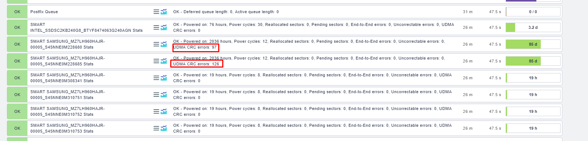

# Các tham số S.M.A.R.T

- UDMA CRC Error Count : Lỗi kết nối cable giữa ổ và server / card raid. Nếu không tăng -> ổn. Nếu vẫn tăng cần thay thế dây.
Powered on: Số giờ disk đã chạy https://kb.acronis.com/content/9109

Power cycles: Số lần bật tắt nguồn của ổ https://kb.acronis.com/content/9112

Reallocated sectors: Số lượng sector bị bad hệ thống phát hiện và đã di chuyển dữ liệu sang sector khác https://kb.acronis.com/content/9105

Pending sectors: Số lượng sector không ổn định đang chờ để map lại sector khác https://kb.acronis.com/content/9133

End-to-End errors: Số lượng dữ liệu tham chiếu giữa bộ đệm RAM và disk không khớp https://kb.acronis.com/content/9119

Uncorrectable errors: Số lượng lỗi ổ cứng không thể phục hồi bằng chức năng ECC (error-correcting code) https://kb.acronis.com/content/9122

UDMACRCError_Count: Số lượng lỗi trong quá trình truyền dữ liệu (Có thể do dây SAS, card RAID, hoặc là bộ phận điều khiển trên Disk) https://kb.acronis.com/content/9135