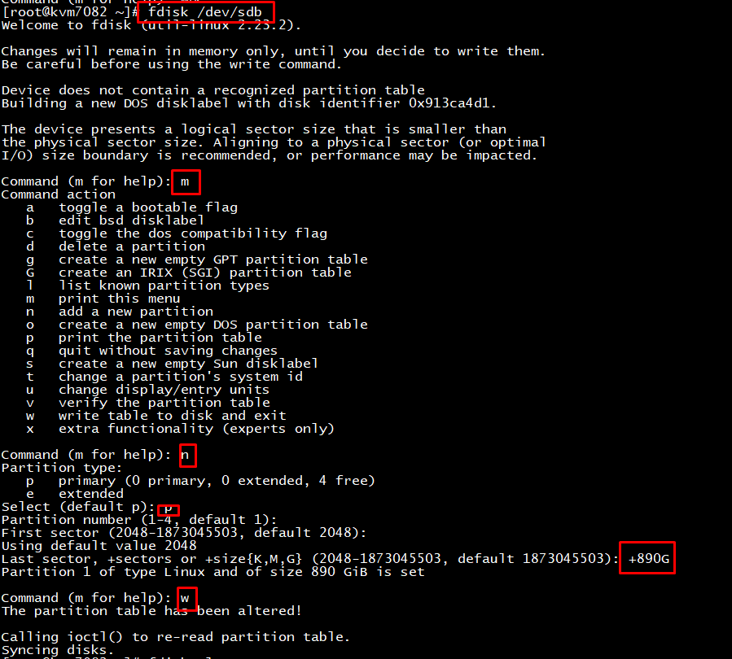
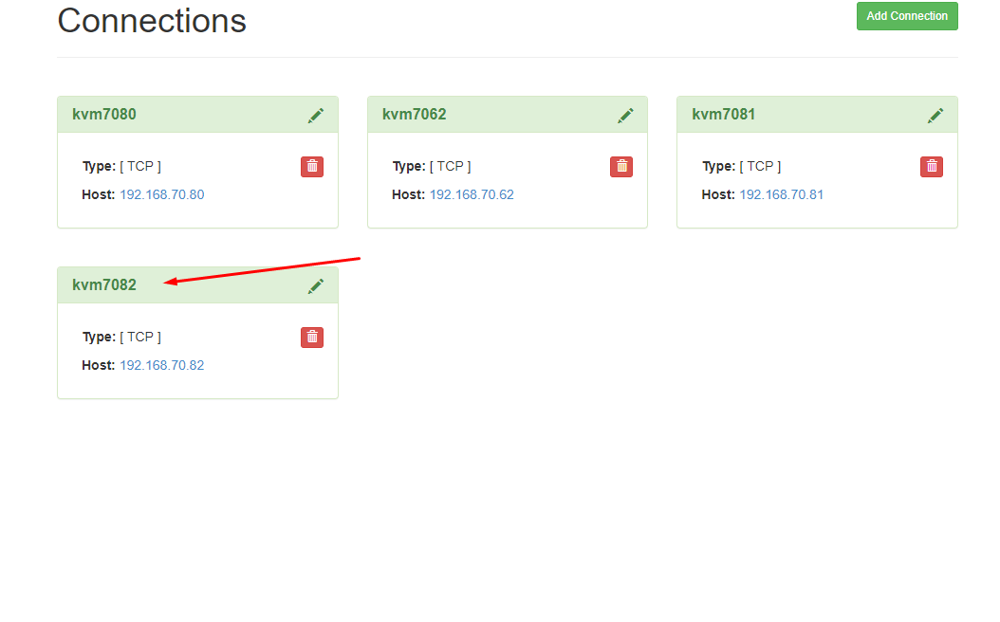
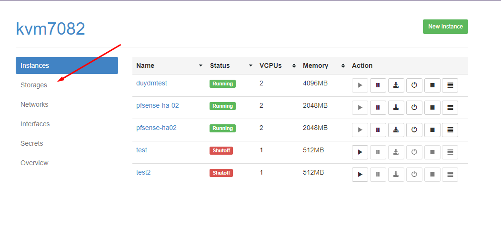
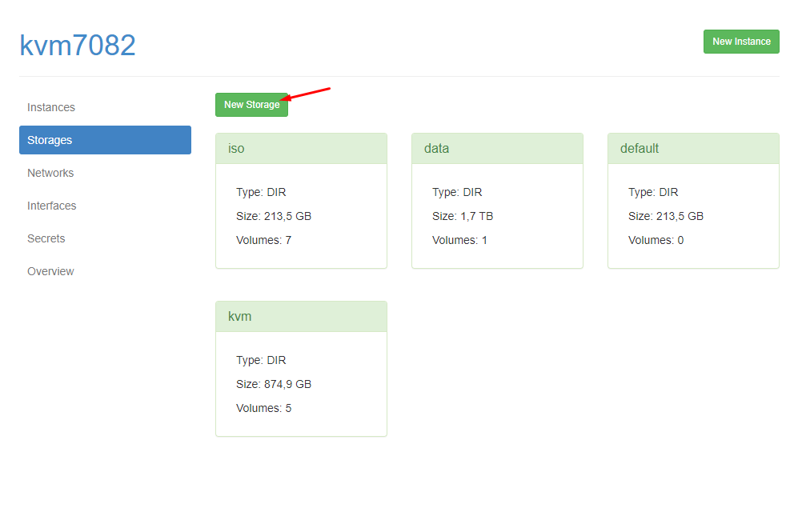
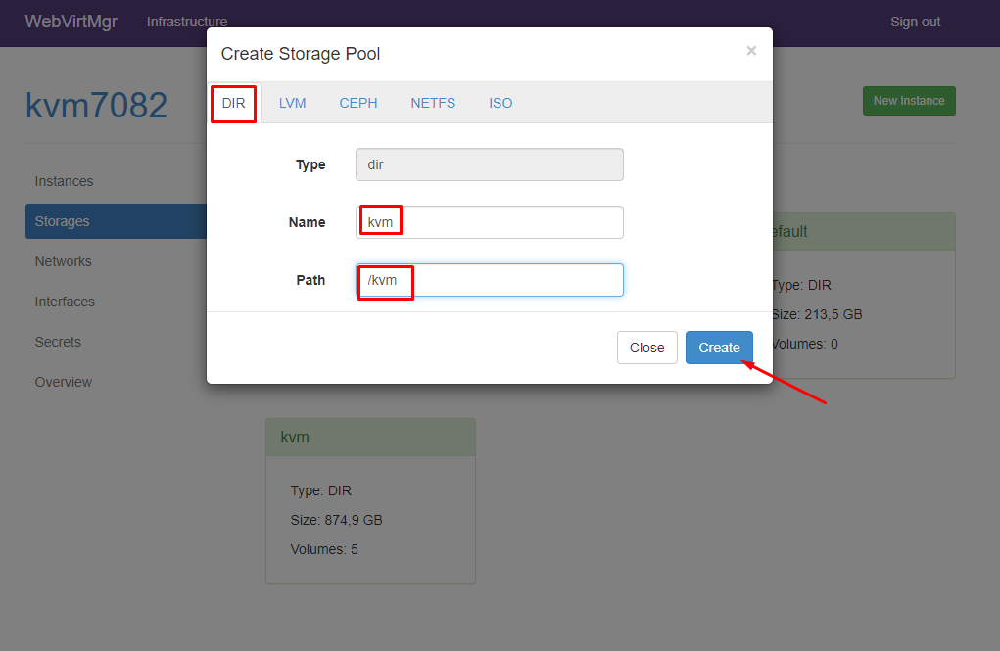

# Cấu hình network

## Update và cài đặt package

```sh
yum update --exclude=kernel -y
yum install bridge-utils -y

yum install qemu-kvm libvirt-bin libvirt bridge-utils virt-manager -y
```

Trong đó:
- qemu-kvm: Phần phụ trợ cho KVM.
- libvirt-bin: cung cấp libvirt mà bạn cần quản lý qemu và KVM bằng libvirt.
- bridge-utils: chứa một tiện ích cần thiết để tạo và quản lý các thiết bị bridge.
- virt-manager: cung cấp giao diện đồ họa để quản lý máy ảo.
- Kiểm tra để chắc chắn rằng KVM đã được cài đặt:

```sh
# lsmod | grep kvm
kvm_intel             204800  0
kvm                   593920  1 kvm_intel
irqbypass              16384  1 kvm
```

## 1. Cấu hình đường management:
Ở đây đường VLAN sử dụng để management là em3 - VLAN 70.

Đầu trên switch cấu hình trunking và allow VLAN 70

- Tạo interface VLAN với IP để management:
```sh
vi /etc/sysconfig/network-scripts/ifcfg-vlan70
```
```
DEVICE=vlan70
TYPE=Bridge
BOOTPROTO=none
ONBOOT=yes
NM_CONTROLLED=no
IPADDR=<ip_management>
PREFIX=24
GATEWAY=<ip>
```

- Tạo subinterface kết nối tới VLAN 70:
```sh
vi /etc/sysconfig/network-scripts/ifcfg-em3.70
```
```
DEVICE=em3.70
BOOTPROTO=none
ONBOOT=yes
VLAN=yes
BRIDGE=vlan70
TYPE=Ethernet
NM_CONTROLLED=no
```

- Kiểm tra lại bằng lệnh `brctl show`
```sh
[root@kvm7082 ~]# brctl show
bridge name     bridge id               STP enabled     interfaces
virbr0          8000.52540086bd29       yes             virbr0-nic
vlan70          8000.ecf4bbc11162       no              em3.70
```

## 2. Cấu hình network cho các VLAN dành cho máy ảo:
Tạo các interface và bridge (ở đây là interface em1 - VLAN 192 - Đầu switch cấu hình trunk allow VLAN 192):

```sh
vi /etc/sysconfig/network-scripts/ifcfg-em1.192

DEVICE=em1.192
BOOTPROTO=none
ONBOOT=yes
VLAN=yes
BRIDGE=vlan192
TYPE=Ethernet
NM_CONTROLLED=no

vi /etc/sysconfig/network-scripts/ifcfg-vlan192

DEVICE=vlan192
TYPE=Bridge
BOOTPROTO=none
ONBOOT=yes
NM_CONTROLLED=no
```
```
ifdown em1.192 && ifup m1.192
ifdown vlan192 && ifup vlan192
```

- Kiểm tra lại bằng lệnh:
```
brctl show
[root@kvm7082 ~]# brctl show
bridge name     bridge id               STP enabled     interfaces
virbr0          8000.52540086bd29       yes             virbr0-nic
vlan192         8000.ecf4bbc11160       no              em1.192
```

## Virt-manager
Đối với bản Minimal để dùng được công cụ đồ họa virt-manager người dùng phải cài đặt gói x-window bằng câu lệnh

```sh
yum install "@X Window System" xorg-x11-xauth xorg-x11-fonts-* xorg-x11-utils -y
```

Start dịch vụ libvirt và cho nó khởi động cùng hệ thống

```sh
systemctl start libvirtd
systemctl enable libvirtd
```

# Cài đặt trên host KVM

Để Webvirtmgr có thể kết nối đến Host KVM và quản lý được các VM trong host KVM ta cần cấu hình một số thông tin sau trên host KVM:

Trên môi trường lab tiến hành tắt firewalld

```sh
systemctl stop firewalld
```

Nếu ko muốn bạn có thể mở port 16509 để webvirtmgr có thể kết nối đến

Bỏ comment và chỉnh sửa một số dòng sau trong file `/etc/libvirt/libvirtd.conf` :

```sh
listen_tls = 0
listen_tcp = 1
tcp_port = "16509"
#secure lại VNC chỉ listen local
listen_addr = "<ip>"
auth_tcp = "none"
```

Bỏ comment các dòng trong file `/etc/libvirt/qemu.conf`
```sh
user = "root"

group = "root"
```

Bỏ comment dòng LIBVIRTD_ARGS=”--listen” trong file `/etc/sysconfig/libvirtd`

```sh
Restart libvirtd

systemctl restart libvirtd
```

## Add storage

- Kiểm tra các ổ hiện đang gắn vào server:

```
fdisk -l
```

- Tiến hành tạo phân vùng :

```
fdisk /dev/sdb
```
		m : xem hướng dẫn
		n : new partition
		p : primary
		default Partition number
		default First sector
		+890G
		w :  Ghi lại thay đổi vào đĩa - phải rất cẩn thận khi sử dụng lệnh này!!
		


- Kiểm tra lại bằng `fdisk -l`

- Tạo PV: 
```sh
[root@kvm7082 ~]# pvcreate /dev/sdb1
  Physical volume "/dev/sdb1" successfully created.
```
- Tạo VG:
```sh
[root@kvm7082 ~]# vgcreate vg-kvm /dev/sdb1 
  Volume group "vg-kvm" successfully created
```
- Tạo LVM: (dung lượng nhỏ hơn)
```
[root@kvm7082 ~]# lvcreate -L 889G -n lv-kvm vg-kvm  
  Logical volume "lv-kvm" created.
```
- Dùng `lvscan` để kiểm tra lại LV đã tạo đã chính xác và ACTIVE chưa:
```
[root@kvm7082 ~]# lvscan
  ACTIVE            '/dev/vg-kvm/lv-kvm' [889.00 GiB] inherit
  ACTIVE            '/dev/centos_kvm7082/root' [213.58 GiB] inherit
```
- Format ext4
```
mkfs.ext4 /dev/vg-kvm/lv-kvm
```
- Tạo thư mục /kvm và mount:
```
mount /dev/vg-kvm/lv-kvm /kvm
```

- Sửa trong `/etc/fstab`. Thêm dòng:
```
UUID=<ID> /data ext4 defaults 0 0
```

**Để tìm ID ổ cứng dùng lệnh `blkid`**

## Add vào Webvirtmgr

Chọn host add storage:



Chọn phần Storage:



New Storage:



Điền thông tin thư mục đã mount ở trên và chọn kiểu DIR, nhấn CREATE:



# Cấu hình allow và deny

Thêm vào `/etc/hosts.allow` : 

`
sshd: 192.168.70.*,27.72.59.135
`

Thêm vào `/etc/hosts.deny` :

`
sshd: ALL
`

# Secure VNC:
- Các VM tạo ra nên có password VNC.
- Logout sau mỗi phiên làm việc.

