# Migrate từ mail Mdaemon sang Zimbra

## A. Chuyển Account list

### 1. Export Email Account từ Mdaemon

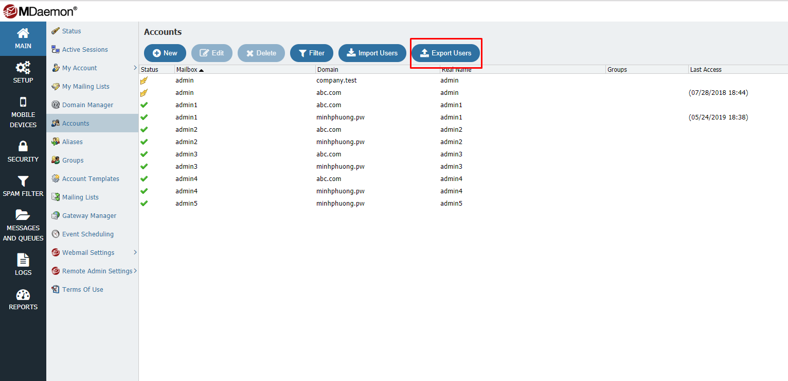

- Sau khi `Export` sẽ download được file có đuôi .csv có nội dung tương tự như sau:

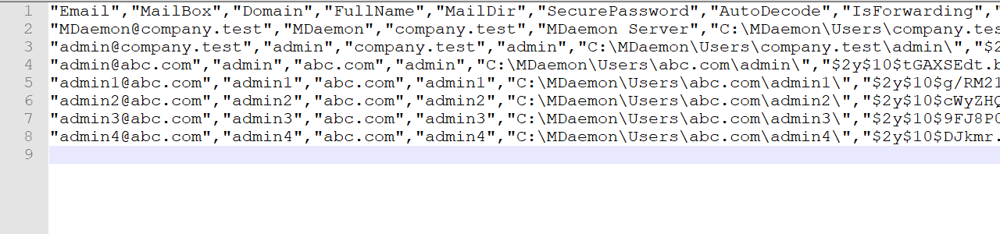

- Trước khi convert có thể thực hiện mở bằng Excel , chỉnh sửa và lưu lại:
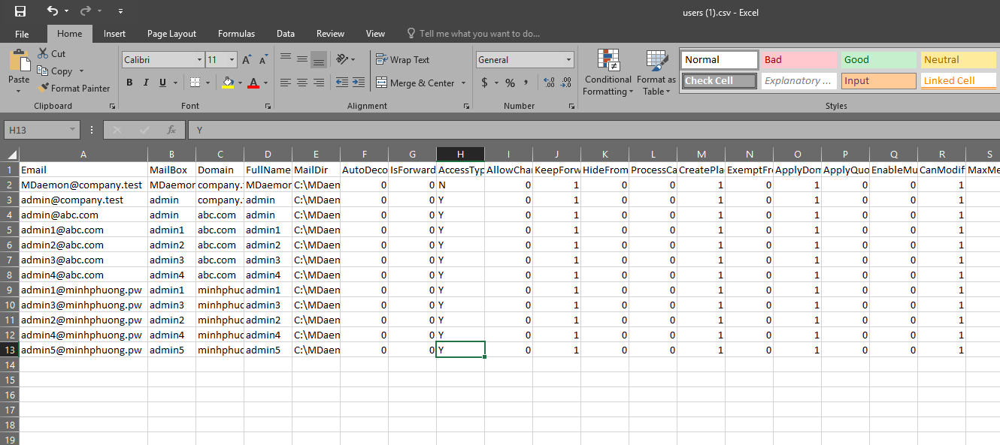

(Mục tiêu remove các dấu " để thành format chuẩn, tránh gặp lỗi khi muốn migrate cả Password)

- Truy cập vào trang : https://www.freeformatter.com/csv-to-xml-converter.html#ad-output

- Paste nội dung file .csv trên vào.
- Format XML ở dưới điền theo dạng:
```
<User>
<sn>##4##</sn>
<givenName>##4##</givenName>
<displayName>##4##</displayName>
<RemoteEmailAddress>##1##</RemoteEmailAddress>
<password>test123</password>
<zimbraPasswordMustChange>TRUE</zimbraPasswordMustChange>
</User>
```

- Sau khi điền thông tin sẽ như bên dưới:
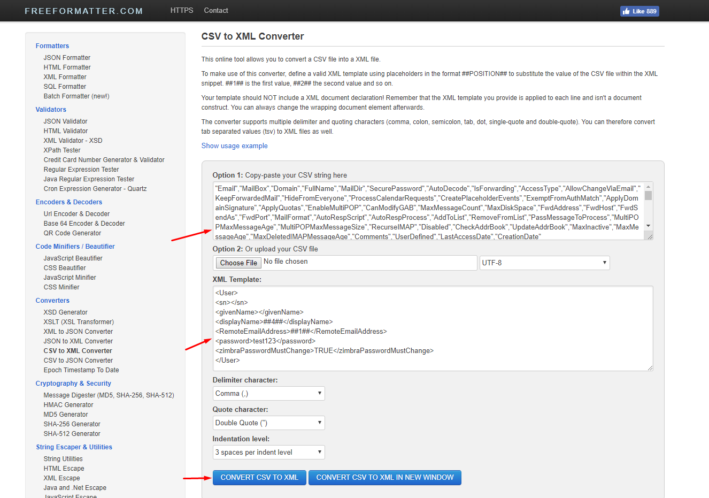

- Thực hiện Convert
- Copy dữ liệu sau convert lại.
- Sau đó sửa lại file XML theo format:
```sh
<?xml version="1.0" encoding="UTF-8"?>
<ZCSImport>
<ImportUsers>
<User>
<sn>Sample</sn>
<givenName>Sam</givenName>
<displayName>Sam Sample</displayName>
<RemoteEmailAddress>ssample@example.com</RemoteEmailAddress>
<password>test123</password>
<zimbraPasswordMustChange>TRUE</zimbraPasswordMustChange>
</User>
<User>
<sn>Zackry</sn>
<givenName>Zak</givenName>
<displayName>Zak Zackry</displayName>
<RemoteEmailAddress>zzackry@example.com</RemoteEmailAddress>
<password>test123</password>
<zimbraPasswordMustChange>TRUE</zimbraPasswordMustChange>
</User>
</ImportUsers>
</ZCSImport>
```

### 2. Import user vào Zimbra

- Vào phần `Tools And Migration` chọn `Account Migration`:
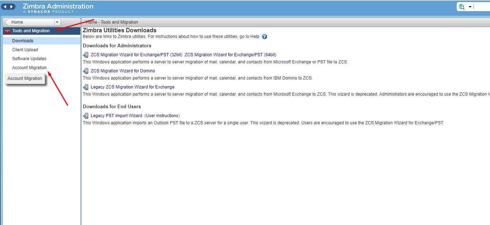

- Chọn `Migration Wizard`:
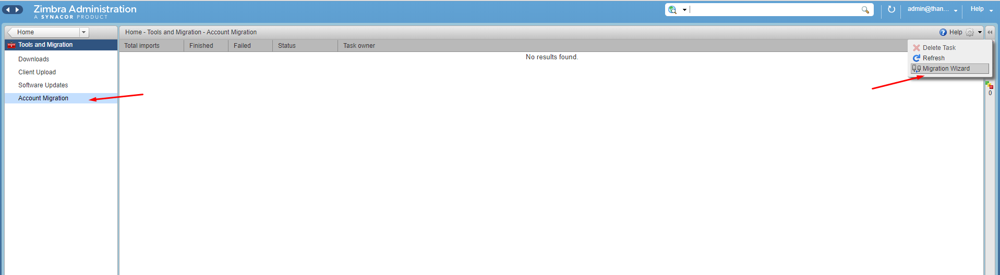

- Tùy chọn như hình dưới và `Next`:
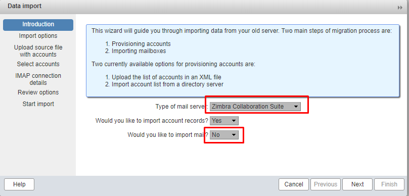

- Chọn `Import from an XML file` và `Next`:
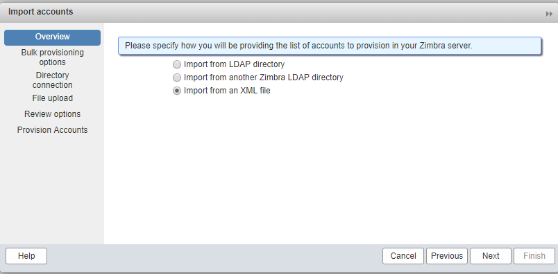

- Sau khi chọn file (đúng format như phần trước) thành công sẽ hiển thị số lượng user sẽ import vào :
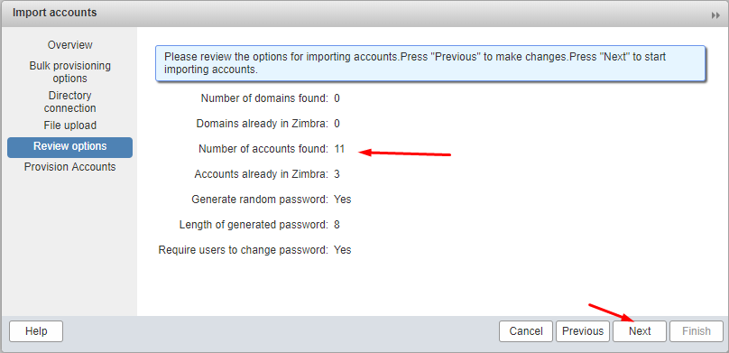

- Sau khi hiển thị import thành công và không có `fail account` (như dưới) và cancel không thực hiện việc data import ngay
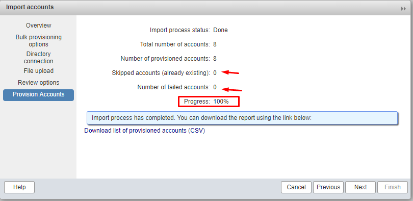

## B. Chuyển Account Data

- Thực hiện việc cài đặt `epel-release` và `imapsync`.

Thực hiện việc sync data từng user giữa 2 server:
- Thông qua port 993/SSL:
```sh
imapsync --host1 <ip/hostname_oldhost>  \
--user1 <oldaccount> \
--password1 <password_old_user> \
--ssl1 \
--host2 <ip/hostname_newhost> \
--user2 <newaccount> \
--password2 <password_new_user> \
--ssl2
```

- Thông qua port 143:
```sh
imapsync --host1 <ip/hostname_oldhost>  \
--user1 <oldaccount> \
--password1 <password_old_user> \
--host2 <ip/hostname_newhost> \
--user2 <newaccount> \
--password2 <password_new_user>
```

**Lưu ý**: 
- kiểm tra firewall trên server Mdaemon allow port
- Port của Zimbra còn tùy thuộc vào cấu hình mailproxy trên máy chủ. Trong 1 số trường hợp thay vì sử dụng PLAINTEXT qua port 143, có thể sử dụng option `--ssl2`, hoặc `--port2 7143`

- Sau khi đồng bộ, hiển thị như dưới là đã hoàn tất và không gặp lỗi:

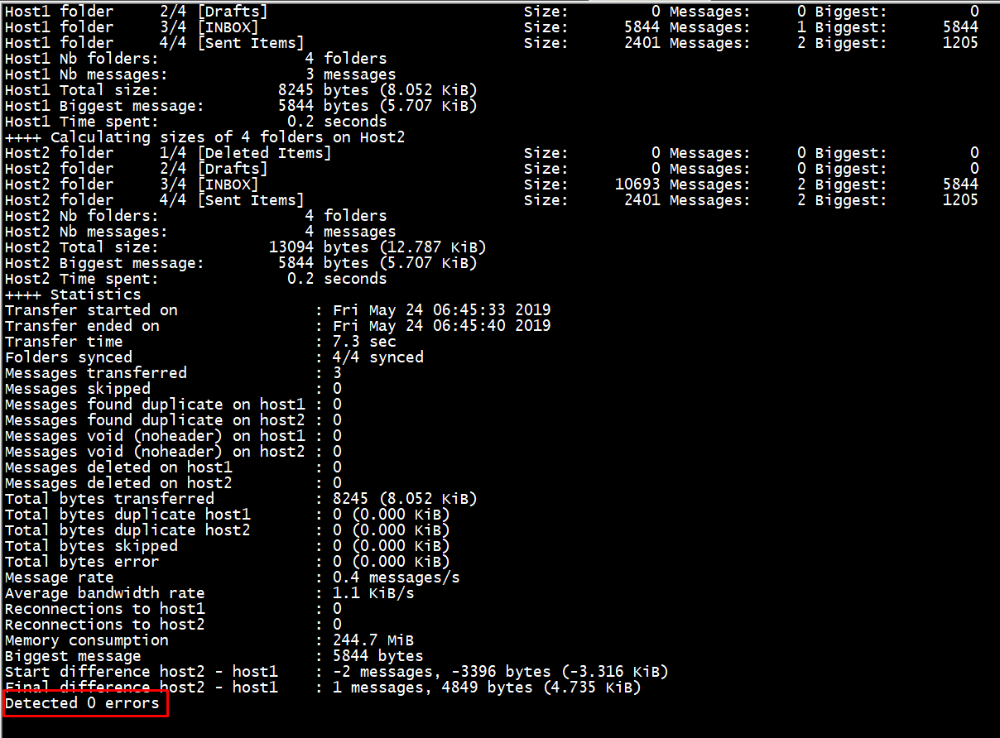

**Link tham khảo** :
- https://wiki.xmission.com/Zimbra_Migration:_IMAPSync
- https://github.com/imapsync/imapsync
