# Setup 
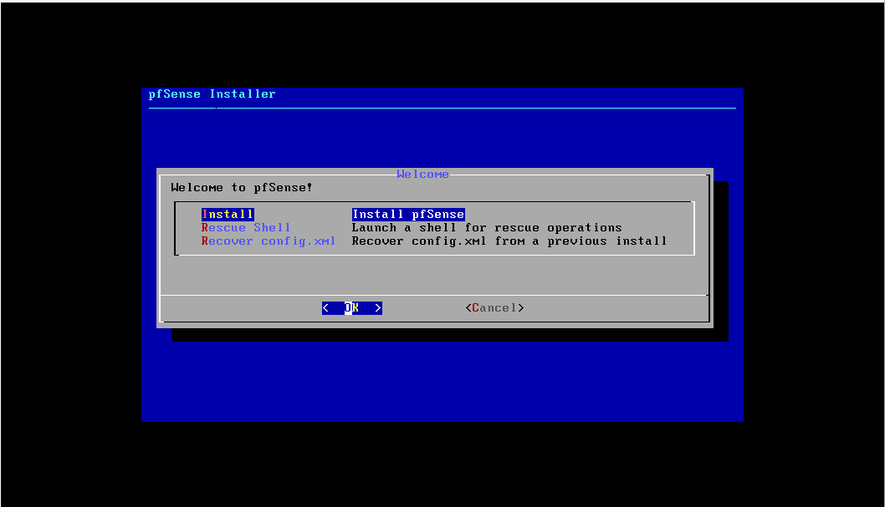

- remove hết config card LAN và config IP dải WAN để managerment ở dải WAN trước.

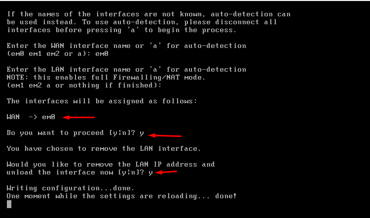

Chuyển qua tab `System/Advanced/Networking`
Kéo xuống phần `Network Interfaces`. Check vào tùy chọn `Disable hardware checksum offload` sau rồi save lại.

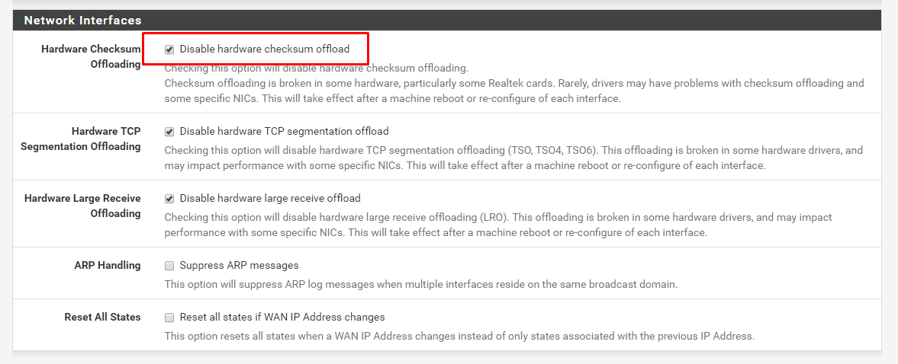

Mục đích là để sử dụng được với device model là `virtio`. Nếu không check vào tùy chọn này, sau này khi tạo vpn mode tap sẽ gặp lỗi máy ping được nhưng không thể ssh.

Lưu ý: Nếu ở trên bạn chọn device model là `pcnet` thì không cần check vào tùy chọn này.

- Add Interface LAN vào:

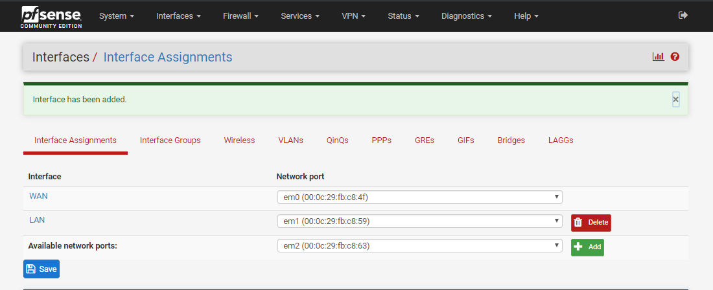

- **Note**: sau khi add thêm LAN add rules để chạy dashboard sang card WAN sau đó reboot lại.

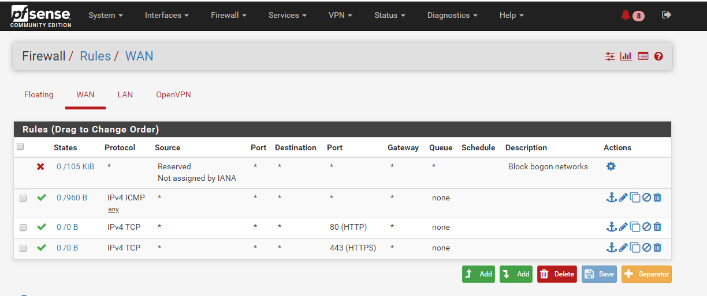


# Setup VPN

1. Tạo CA
Tại tab System/Certificate Manager/CA, chọn `Add` để thêm một CA mới, CA này sẽ xác thực tất cả các certificate của server VPN và user VPN khi kết nối tới PFSense OpenVPN


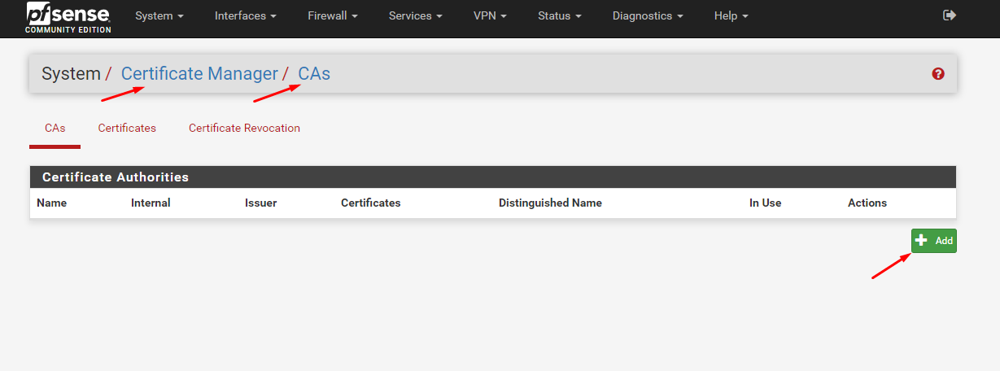


2. tạo Cert
Tại tab System/Certificate Manager/Certificate, tạo cho server VPN

- Tạo cert:

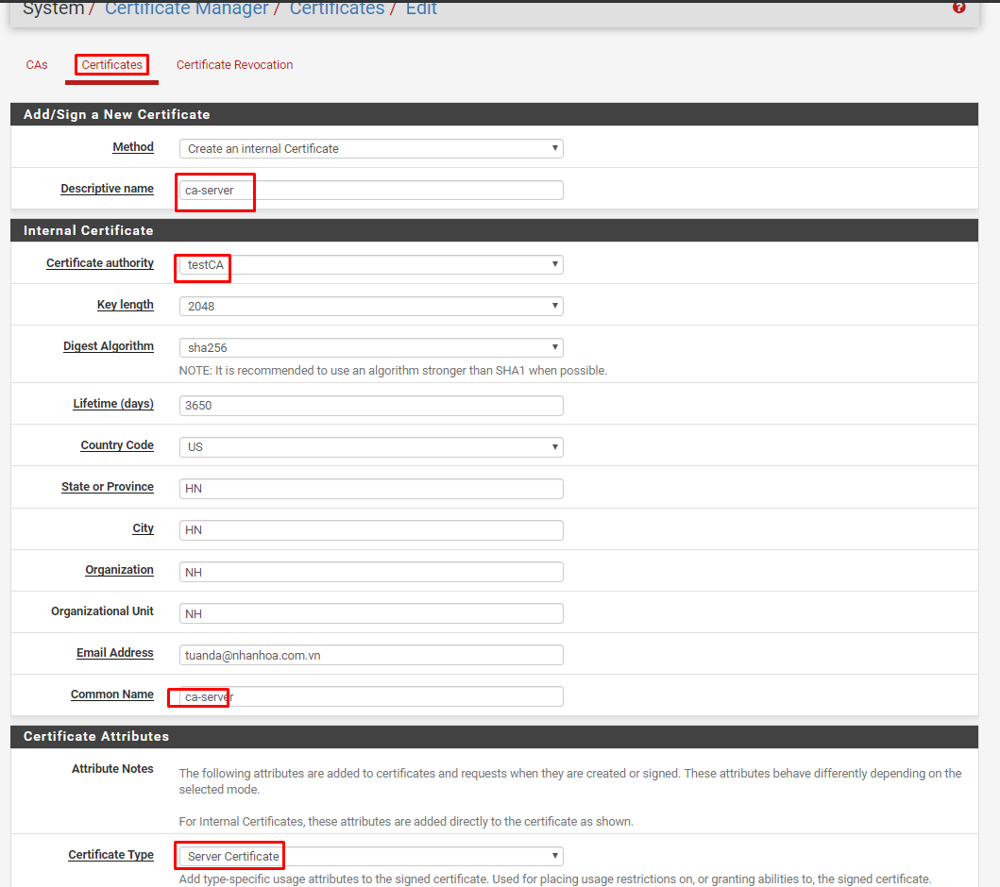


3. tạo user VPN
- Tại tab System/UserManager, tạo user được VPN

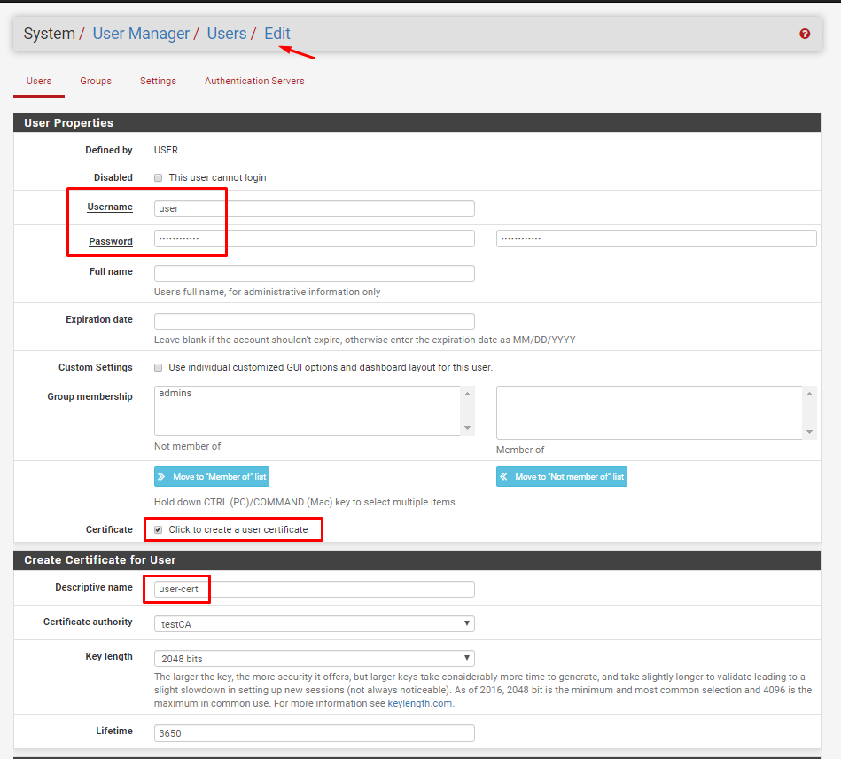

4. cài package / update

Tại VPN server 
- Tại tab `System/Packet Manager`, cài đặt Plugin `openvpn-client-export`
- Nếu không hiển thị Package Avaiable cần update lên phiên bản Lastest Stable

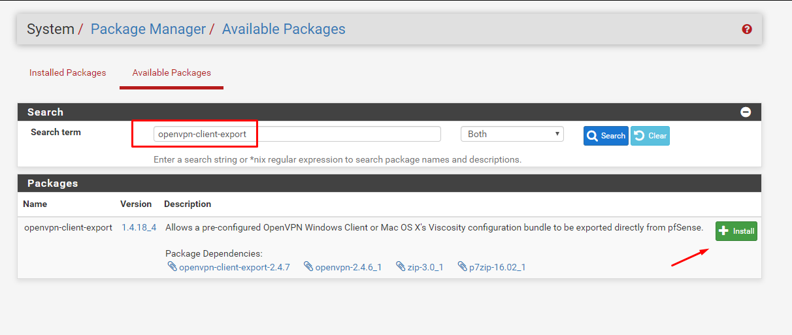


5. Tạo VPN server
Tại tab VPN/OpenVPN/Server, click “Add” để tạo VPN server
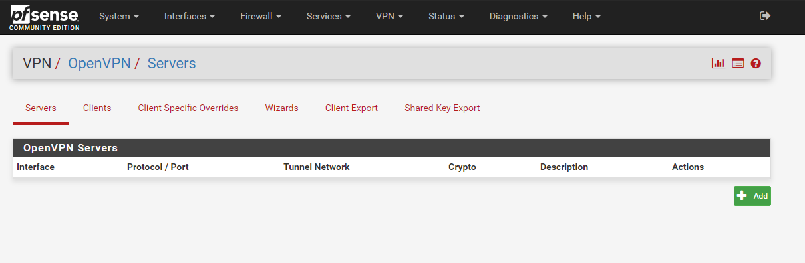

- Khai báo các thông tin về mode kết nối:
- Server mode: `Remote Access (SSL/TLS + User Auth)`
- Device mode: `tap`
- Interface: `WAN`
- Local port: `1194 (tùy ý lựa chọn port)`


Cấu hình Tunnel như sau : 
Bridge Interface : Chọn VLAN10, các IP của user khi VPN sẽ nhận IP dải VLAN10
Server Bridge DHCP Start – End : Dải IP cấp cho user VPN
Inter-client communication : Cho phép các client giao tiếp với nhau qua VPN
Duplicate Connection : Cho phép các client cùng tên có thể kết nối VPN


Cấu hình Routing : 
DNS Server 1 & 2 : Đặt DNS 8.8.8.8 và 8.8.4.4
Custom option : Cho phép các dải mạng LAN được phép kết nối với nhau.
(Nếu không sử dụng bỏ qua)
```sh 
push "route 172.17.10.0 255.255.255.0";push "route 172.17.12.0 255.255.255.0";push "route 172.17.13.0 255.255.255.0"
```

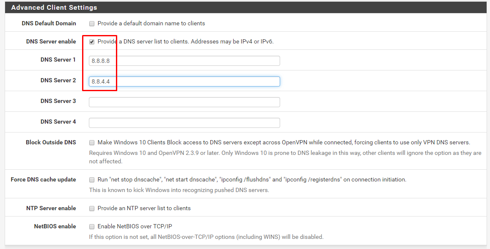

6. Cấu hình Interface
- Tại tab `Interfaces/InterfaceAssignments`, add thêm network port của VPN, đặt tên là `vpn`

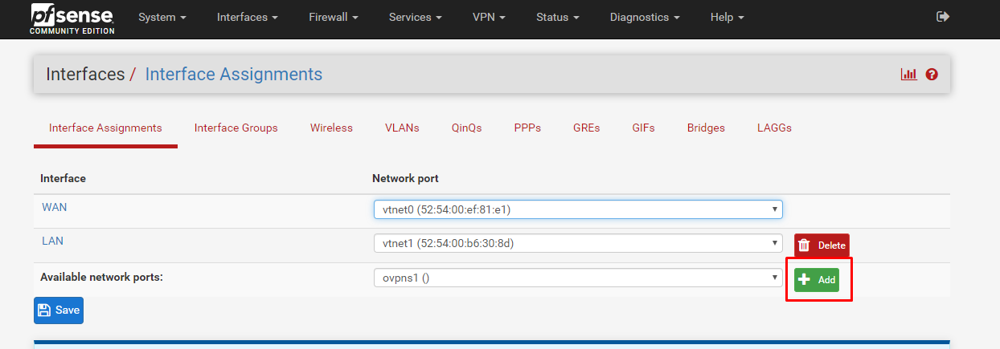


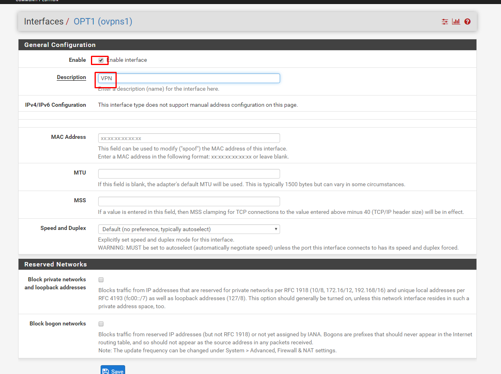

-  - Tại tab Inteface/Bridge, tạo bridge mới và add 2 interface VPN và LAN vào bridge

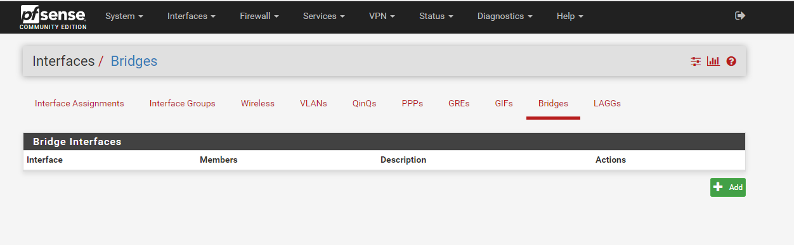

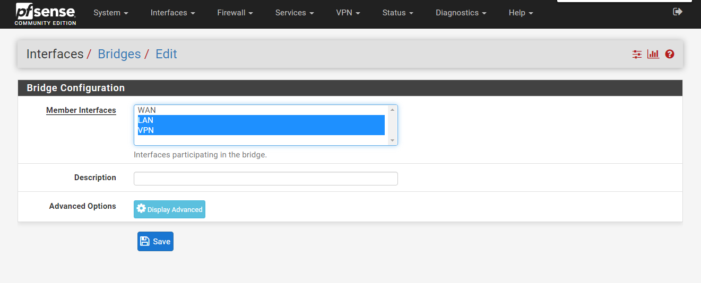

7.Cấu hình Firewall : 
 - Tại tab Firewall/Rules/WAN, add thêm rule cho phép client kết nối tới port 1198 của VPN. Cho phép port 443 và 80 TCP và 1198 UDP. 

- Setup firewall cho port 1198 UDP. Chú ý các option sau : 
	- Interface : WAN
	- Protocol : UDP
	- Destination : WAN address
	- Destination Port Range from – to : 1198

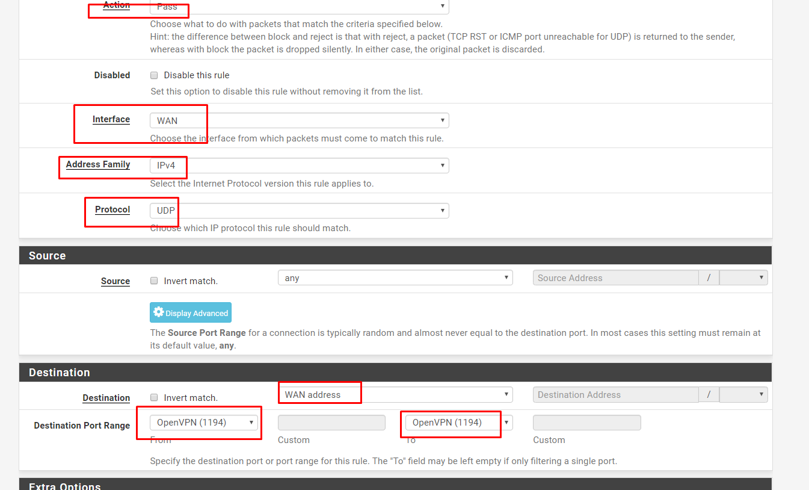

- Setup firewall cho service HTTP port 80 TCP và HTTPs port 443 TCP với các option như sau : 
	- Interface : WAN
	- Protocol : TCP
	- Destination : WAN address
	- Destination Port Range from – to : HTTP (và HTTPS)

- Tại tab Firewall/Rules/VPN, add rule cho phép lưu lượng đi qua : 

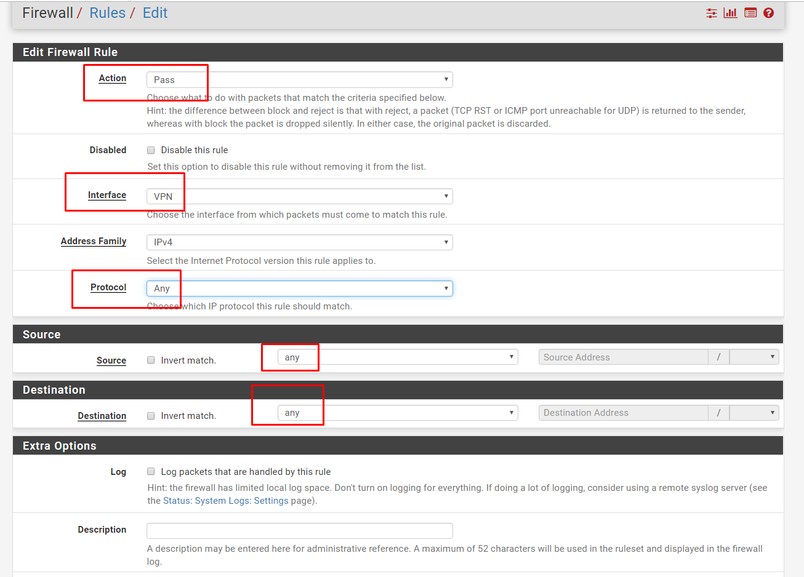

- Config NAT Rule : Cho phép inter VLAN, các VLAN có thể giao tiếp với nhau. 
Tại mục : Firewall/NAT/Outbound, chọn Add thêm NAT Rule. Chú ý chọn dạng Hybrid


Thêm Interface được NAT dải LAN (Nếu muốn NAT ra ngoài)

Export OpenVPN config
Tại tab VPN/OpenVPN/ClientExport, khai báo các thông số:
Remote Access Server: lựa chọn OpenVPN server và port 1198
Hostname Resolution: lựa chọn khai báo Interface IP của WAN 


