# Hướng dẫn cài đặt Pritunl VPN trên Cloud365


## Mục tiêu
Mô hình này sử dụng 3 máy ảo, trong đó:
- `VM Pritunl` đóng vai trò VPN Server.
- `VM Client` đóng vai trò VPN Client.
- `VM Target` sau khi cấu hình thành công khi máy remote quay VPN thành công và ping được tới dải Private LAN, và ra được internet.

## Mô hình
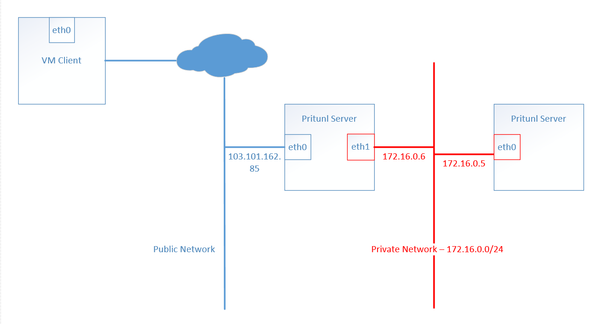

## Yêu cầu
- Server Pritunl cài đặt hệ điều hành CentOS 7
- Server Pritunl có 2 card mạng : 1 card IP public, 1 card IP Private LAN.

## Cấu hình
1. Cài đặt Server:

```sh
sudo tee /etc/yum.repos.d/mongodb-org-4.0.repo << EOF
[mongodb-org-4.0]
name=MongoDB Repository
baseurl=https://repo.mongodb.org/yum/redhat/7/mongodb-org/4.0/x86_64/
gpgcheck=1
enabled=1
gpgkey=https://www.mongodb.org/static/pgp/server-4.0.asc
EOF

sudo tee /etc/yum.repos.d/pritunl.repo << EOF
[pritunl]
name=Pritunl Repository
baseurl=https://repo.pritunl.com/stable/yum/centos/7/
gpgcheck=1
enabled=1
EOF

sudo rpm -Uvh https://dl.fedoraproject.org/pub/epel/epel-release-latest-7.noarch.rpm
gpg --keyserver hkp://keyserver.ubuntu.com --recv-keys 7568D9BB55FF9E5287D586017AE645C0CF8E292A
gpg --armor --export 7568D9BB55FF9E5287D586017AE645C0CF8E292A > key.tmp; sudo rpm --import key.tmp; rm -f key.tmp
sudo yum -y install pritunl mongodb-org
sudo systemctl start mongod pritunl
sudo systemctl enable mongod pritunl
```

2. Cấu hình mở thêm open file limit (Tùy chọn)
```sh
sudo sh -c 'echo "* hard nofile 64000" >> /etc/security/limits.conf'
sudo sh -c 'echo "* soft nofile 64000" >> /etc/security/limits.conf'
sudo sh -c 'echo "root hard nofile 64000" >> /etc/security/limits.conf'
sudo sh -c 'echo "root soft nofile 64000" >> /etc/security/limits.conf'
```

3. Cấu hình hệ thống:

**Cấu hình truy cập:**

- Truy cập vào đường dẫn webbase:
`https://<ip>`
- Truy cập SSH vào server chạy lệnh để lấy `setup-key`

```sh
sudo pritunl setup-key
```

- MongoDB URI để default
- Điền `setup-key` và Save:


- Chạy lệnh trên CLI để lấy default password và user:
```sh
sudo pritunl default-password
```

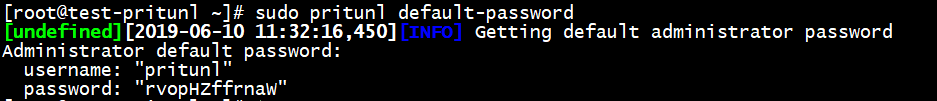

- Sau đó điền user và password đăng nhập:

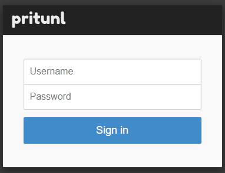

- Hoàn thành bước setup (change password user pritunl nếu cần):

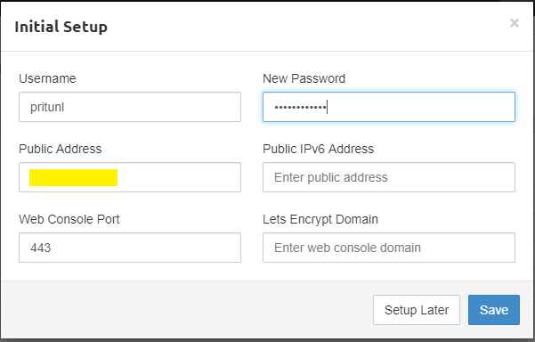

**Cấu hình :**

- Vào mục `Users`, chọn `Add organization`, đặt tên cho `Organization`:
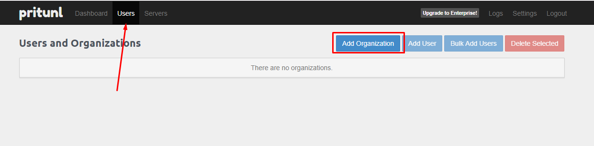


- Sau khi tạo `Organization`, lựa chọn `Add user`:

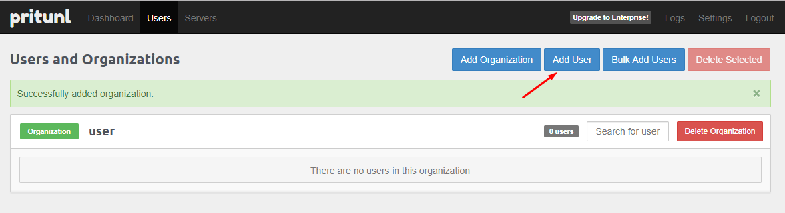

- Điền các thông tin liên quan: username, PIN (sử dụng để connect):

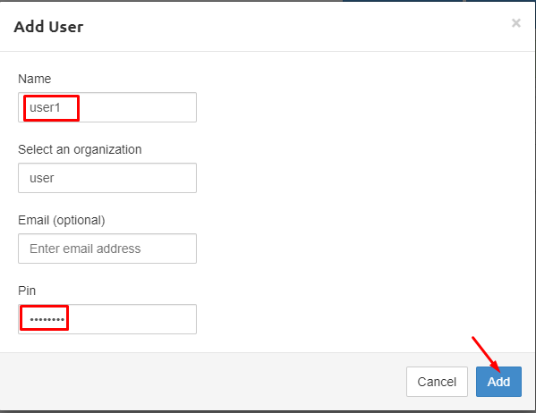

- Chuyển sang mục `Servers`, chọn `Add Server`, khai báo các thông tin cho Server:
    - Tên Server
    - Port và giao thức truy cập
    - Virtual network: đây là dải mạng cấp cho Client connect (TUN)

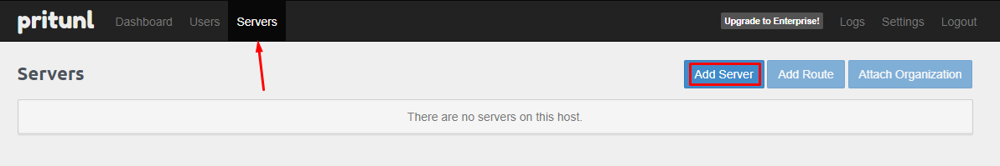

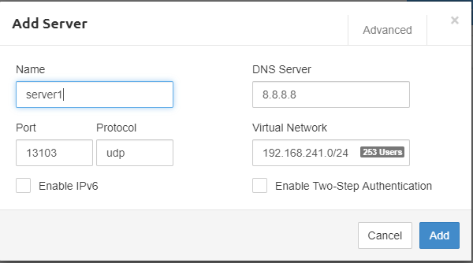

- Add thành công, chọn phần `Add Route` để add thêm route về dải Private Network:

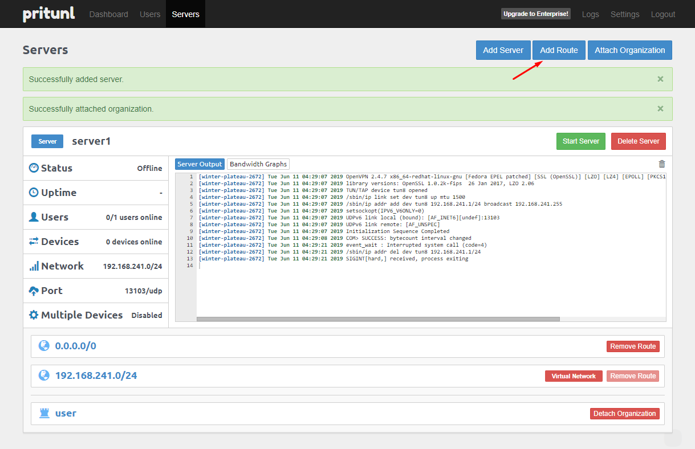

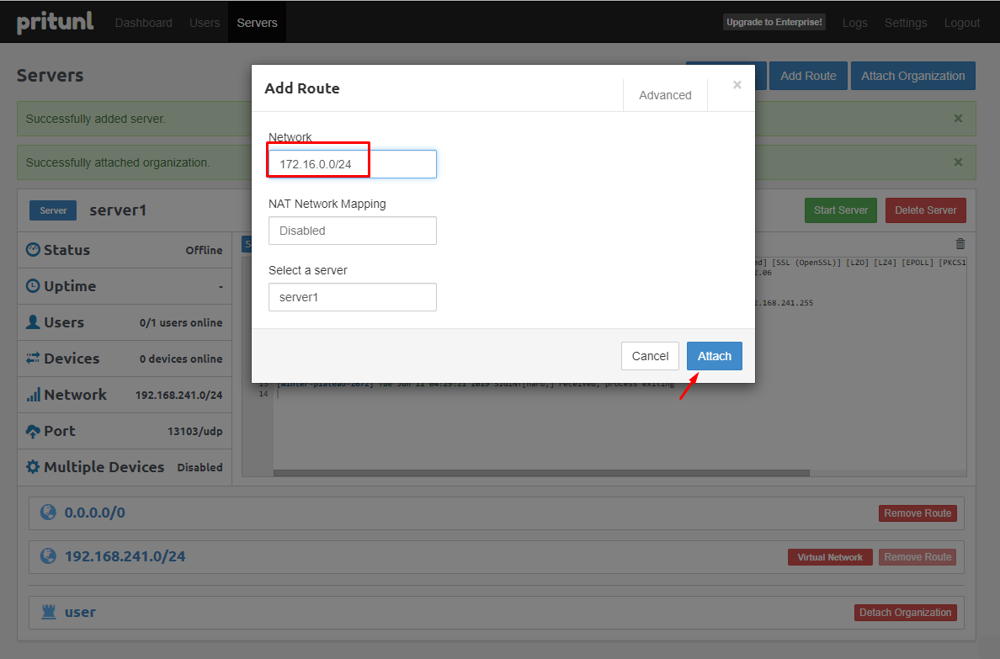

- Sau khi add xong Server, tiếp tục chọn mục `Attach Organization`:

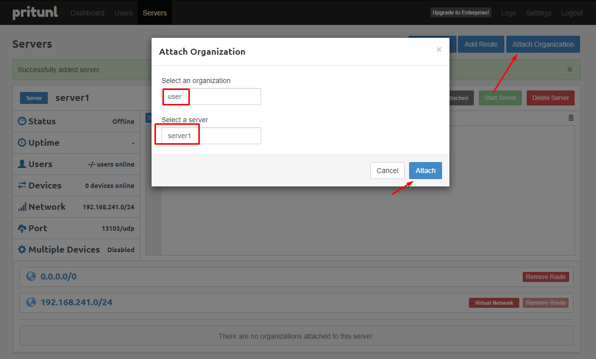

- Vào mục Server, chọn `Start Server`:

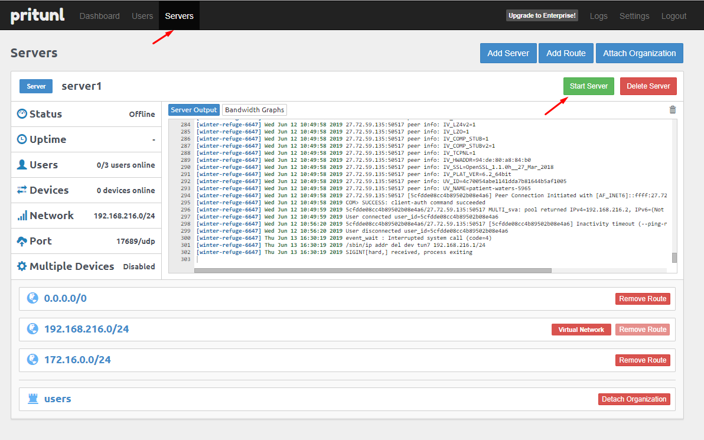

**Kết nối Client**

- Lấy thông tin Client:

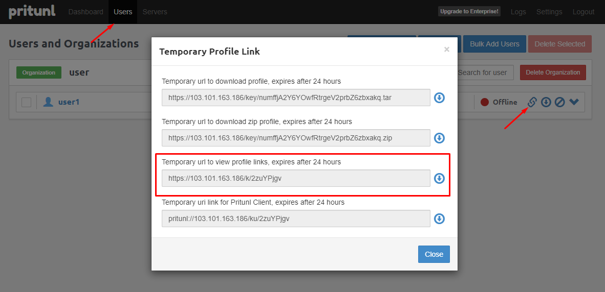

- Truy cập để download Client (Ở ví dụ Client là Windows):

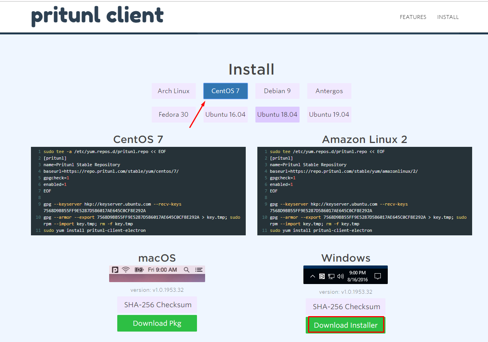

- Thực hiện kết nối (mở Pritunl Client có giao diện như sau):


- Chọn `Import Profile URI` và nhập Profile URI đã copy phía trên

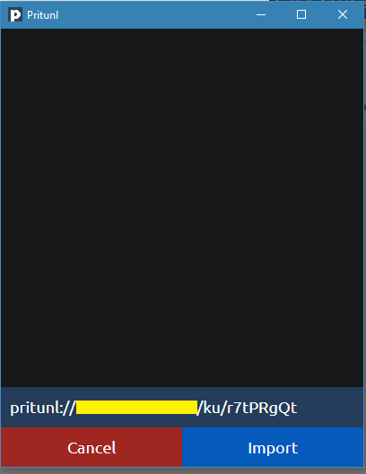

- Sau khi import đúng sẽ hiển thị user và chọn menu bên góc phải -> `Connect` 


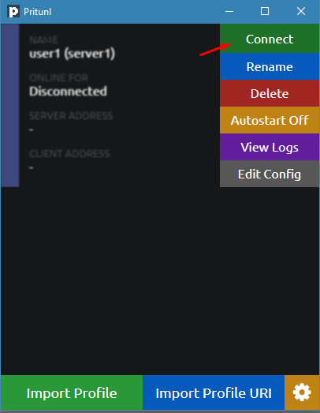

- Nhập mã PIN khi tạo user:

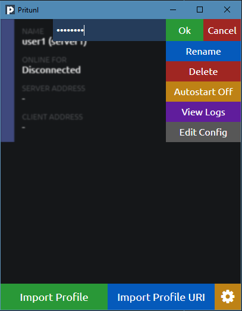

- Connect và lấy IP thành công:

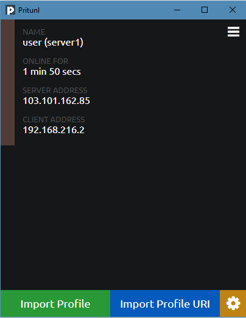

- Test connect tới dải Private OK:

```sh
ping 172.16.0.6

Pinging 172.16.0.6 with 32 bytes of data:
Reply from 172.16.0.6: bytes=32 time=4ms TTL=63

Ping statistics for 172.16.0.6:
    Packets: Sent = 1, Received = 1, Lost = 0 (0% loss),
Approximate round trip times in milli-seconds:
    Minimum = 4ms, Maximum = 4ms, Average = 4ms

ping 172.16.0.5

Pinging 172.16.0.5 with 32 bytes of data:
Reply from 172.16.0.5: bytes=32 time=3ms TTL=64
Reply from 172.16.0.5: bytes=32 time=4ms TTL=64
```

