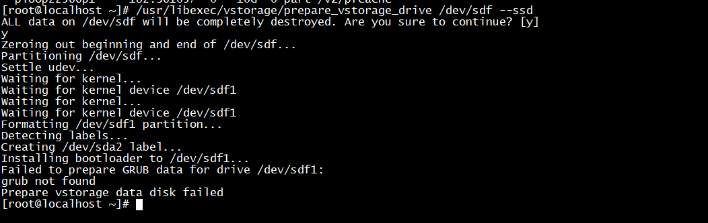
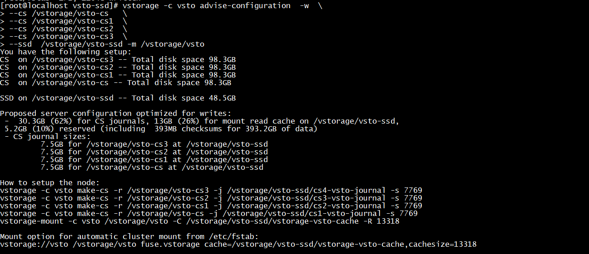

- [Các câu lệnh cơ bản](#cmd)
- [Cấu hình ổ CS (không Cache)](#create-cs-nocache)
- [Move từ không cache sang có cache ](#virtinstall)
- [Cấu hình ổ CS (+ Cache) ](#virtinstall)
- [Set replicate ](#virtinstall)
- [add thêm LUN vào target đang chạy ](#virtinstall)
- [Thay đổi LUN size ](#changelunsize)
- [Thay đổi target IP ](#changeiptarget)
- [Xử lý lỗi không nhận HA](#noha)
- [Register target trên node mới](#register)
- [Thay thế ổ MDS](#changemds)
- [Thay thế ổ Chunk (CS)](#changecs)
- [Thay thế ổ Cache](#changecache)
- [Lỗi target unknow](#unknow)

# <a name="cmd"> Các câu lệnh cơ bản </a>

```
vstorage -c nhanhoa-storage top
#Monitor hệ thống Virtuozzo storage
```

```
vstorage -c nhanhoa-storage list-services
#List ra các CS đang hoạt động trên node
```

```
vstorage -c nhanhoa-storage get-event
#View event logs trên virtuozzo storage
```

```
vzlicview
#view license node
```

```
vzlicload -p license
#Active license cho node
```

```
vstorage -c nhanhoa-storage view-license 
#View license virtuozzo storage và HWID của node
```

```
vstorage -c nhanhoa-storage update-license
#Update license virtuozzo storage
```

```
vstorage-iscsi list -a
#List all target
```

```
vstorage-iscsi list -t
#View thông tin về target
```

```
iscsiadm --mode node
#List target đang connect vào (trên server client)
```

```
ls -lah /dev/disk/by-path/
#Để view target nào gán vào ổ nào của server (đứng trên server client)
```

```
[root@vz1 ~]# cat /etc/vstorage/host_id
ada9ff74a9a3474a
#Kiểm tra ID của Host
```

```
vstorage get-attr /vstorage/vsto
connected to MDS#4
Path: 'vstorage://vsto/'
Attributes:
  directory
  client-ssd-cache=1
  replicas=3:2
  failure-domain=host
  tier=0
  chunk-size=268435456
#Kiểm tra trạng thái Cluster
```


# <a name="register"> Register target trên node mới </a>

- Trên node Compute logout target:

```sh
 iscsiadm --mode node --targetname  iqn.2014-06.com.vstorage:kvm2 --portal 10.10.11.225:3260 --logout
```

- Kiểm tra trên node cũ :

```sh 
vstorage-iscsi list -t iqn.2014-06.com.vstorage:target1
vstorage-iscsi stop -t iqn.2014-06.com.vstorage:target1
```

- Trên node storage cũ:  

```sh
vstorage-iscsi unregister -t iqn.2014-06.com.vstorage:target1
```

- Trên node storage mới: 

```sh
 vstorage-iscsi register -t iqn.2014-06.com.vstorage:target1
```

- Start target trên node compute

```sh
vstorage-iscsi start -t iqn.2014-06.com.vstorage:target1
```

**Đăng ký và sử dụng free License (Cho việc HA target)**

- Đăng ký trên trang chủ: https://www.virtuozzo.com/
```
vzlicload -p A40R00-S2VH74-M3FS45-G4B100-9HVS40
```

# <a name="noha"> Xử lý lỗi không nhận HA </a>

```sh
yum install hastart -y
hastart -c vsto  -n 10.10.11.0/24 <iscsi>
shaman -c vsto add-role ISCSI

#if you want HA to work only for iSCSI targets, change the shaman roles on the node by running the following command:

shaman -c vsto set-roles ISCSI
```

# <a name="changeiptarget"> Thay đổi target IP </a>

If you need to change target’s IP address, stop the target as described in `Stopping Virtuozzo Storage iSCSI Targets`

- Chạy câu lệnh dưới:
```sh
vstorage-iscsi set -t <target_name> -a <new_IP_address>.
```

# <a name="changelunsize"> Thay đổi LUN size </a>

If you need to increase the size of a LUN, stop the target as described in `Stopping Virtuozzo Storage iSCSI Targets`

- Chạy câu lệnh dưới:

```sh
vstorage-iscsi lun-grow -t <target_name> -l <lun_ID> -s <new_size>.
```

# <a name="create-cs-nocache"> Cấu hình CS (không Cache) </a>
## 1. Format ổ cứng
```
/usr/libexec/vstorage/prepare_vstorage_drive /dev/sdb --noboot
/usr/libexec/vstorage/prepare_vstorage_drive /dev/sdc --noboot
```

## Tạo CS
```
cd /vstorage/
mkdir vsto-cs
mkdir vsto-cs1

[root@localhost vstorage]# mount /dev/sdb1 /vstorage/vsto-cs
[root@localhost vstorage]# mount /dev/sdc1 /vstorage/vsto-cs1
```

## Add vào /etc/fstab (không reboot sẽ mất CS)
**Lấy ID của ổ qua lệnh blkid**

```
UUID=bbc013c1-5ee0-40b8-8607-859bf9c2fbcc /vstorage/vsto-cs ext4    defaults,noatime,lazytime 0 0
UUID=2bc88979-ee75-48cd-bca2-29fab6376b04 /vstorage/vsto-cs1 ext4    defaults,noatime,lazytime 0 0
```

## Xóa thư mục lost+found (không tạo CS sẽ lỗi) 

```
cd /vstorage/vsto-cs1 && rm -rf lost+found
cd /vstorage/vsto-cs && rm -rf lost+found
```

## Tạo CS
```
vstorage -c vsto make-cs -r /vstorage/vsto-cs
vstorage -c vsto make-cs -r /vstorage/vsto-cs1
service vstorage-csd.vsto.1025 start
service vstorage-csd.vsto.1026 start
```

## Move nocache -> cache ()
```
/usr/libexec/vstorage/prepare_vstorage_drive /dev/sde --ssd
mkfs.ext4 /dev/sde2
mkdir /vstorage/vsto-ssd
mount /dev/sde2 /vstorage/vsto-ssd/
```
- Add vao `/etc/fstab`

**Đối với các ổ đã có cache cần drop cache đang có**
```
vstorage -c vsto configure-cs -r /vstorage/vsto-cs1 -d
```

```
vstorage -c vsto configure-cs -r /vstorage/vsto-cs1 -a /vstorage/vsto-ssd/vsto-cs1-journal -s   15000
vstorage -c vsto configure-cs -r /vstorage/vsto-cs -a /vstorage/vsto-ssd/vsto-cs-journal -s   15000
```

### Mount storage - Không Cache (Read)

**Khi thay đổi cache READ cần umount **
```sh
mkdir /vstorage/vsto
vstorage-mount -c vsto /vstorage/vsto
vstorage://vsto /vstorage/vsto fuse.vstorage rw,nosuid,nodev 0 0
```

### Mount cache Write

```sh
vstorage -c vsto configure-cs -r /vstorage/vsto-cs1 -a /vstorage/vsto-ssd/vsto-cs1-journal -s 15000
vstorage -c vsto configure-cs -r /vstorage/vsto-cs -a /vstorage/vsto-ssd/vsto-cs-journal -s 15000
```

### Mount cache Read

```sh
vstorage-mount -c vsto /vstorage/vsto -C /vstorage/vsto-ssd/vstorage-vsto-cache -R 7769
```
# Tạo CS (+ Cache)
# <a name="create-cs-nocache"> Cấu hình CS (không Cache) </a>
```sh
/usr/libexec/vstorage/prepare_vstorage_drive /dev/sdf --ssd
mkfs.ext4 /dev/sdf2
```



- add vao fstab

## Tạo ổ SSD và 4 ổ CS

```sh
cd /vstorage/
mkdir vsto-ssd
mkdir vsto-cs
mkdir vsto-cs1
mkdir vsto-cs2
mkdir vsto-cs3
```

**Lưu ý khi có cache cần mount không sẽ lỗi CS không start được do không tìm được thư mục cache**
```sh
mount /dev/sdf2 /vstorage/vsto-ssd/
/usr/libexec/vstorage/prepare_vstorage_drive /dev/sdb --noboot
/usr/libexec/vstorage/prepare_vstorage_drive /dev/sdc --noboot
/usr/libexec/vstorage/prepare_vstorage_drive /dev/sdd --noboot
/usr/libexec/vstorage/prepare_vstorage_drive /dev/sde --noboot
```
```
mount /dev/sdb1 /vstorage/vsto-cs/
mount /dev/sdc1 /vstorage/vsto-cs1/
mount /dev/sdd1 /vstorage/vsto-cs2/
mount /dev/sde1 /vstorage/vsto-cs3/
```

## Sửa /etc/fstab

```sh
UUID=52181d92-7d27-42c4-8989-90c5e4432cad /vstorage/vsto-cs/                    ext4    defaults,noatime,lazytime 0 0
UUID=b82a82ed-941a-4b06-b354-29a8afdcea7e /vstorage/vsto-cs1/                   ext4    defaults,noatime,lazytime 0 0
UUID=cbbada98-8455-426a-8451-b751f39ac3fa /vstorage/vsto-cs2/                   ext4    defaults,noatime,lazytime 0 0
UUID=ac5b10ac-f5c0-4019-b5b3-0510f5da9a31 /vstorage/vsto-cs3/                   ext4    defaults,noatime,lazytime 0 0
UUID=a847aaf6-69eb-4bce-84ba-cfa5c18793a0 /vstorage/vsto-ssd/					ext4    defaults,noatime,lazytime 0 0
```

## Tính toán dung lượng.

```sh
vstorage -c vsto advise-configuration  -w  \
--cs /vstorage/vsto-cs   \
--cs /vstorage/vsto-cs1  \
--cs /vstorage/vsto-cs2  \
--cs /vstorage/vsto-cs3  \
--ssd  /vstorage/vsto-ssd -m /vstorage/vsto
```


## Xóa thư mục lost+found (không tạo CS lỗi)

## Mount cache Write

```sh
vstorage -c vsto make-cs -r /vstorage/vsto-cs3 -j /vstorage/vsto-ssd/cs3-vsto-journal -s 7769
vstorage -c vsto make-cs -r /vstorage/vsto-cs2 -j /vstorage/vsto-ssd/cs2-vsto-journal -s 7769
vstorage -c vsto make-cs -r /vstorage/vsto-cs1 -j /vstorage/vsto-ssd/cs1-vsto-journal -s 7769
vstorage -c vsto make-cs -r /vstorage/vsto-cs -j /vstorage/vsto-ssd/cs-vsto-journal -s 7769
```

## Mount cache Read

```
vstorage-mount -c vsto /vstorage/vsto -C /vstorage/vsto-ssd/vstorage-vsto-cache -R 13318
```

### Add /etc/fstab cho cache READ:

```
vstorage://vsto /vstorage/vsto fuse.vstorage cache=/vstorage/vsto-ssd/vstorage-vsto-cache,cachesize=13318
```
- Start các ổ CS lên :
```
service vstorage-csd.vsto.1027 start
service vstorage-csd.vsto.1028 start
service vstorage-csd.vsto.1029 start
service vstorage-csd.vsto.1030 start
```

### Stop start target ###

```
vstorage-iscsi start -t iqn.2014-06.com.vstorage:kvm1
vstorage-iscsi stop -t iqn.2014-06.com.vstorage:kvm1
```

## Set replicate ##

```sh
vstorage set-attr -R /vstorage/vsto replicas=3 (dc chết 2 node ( với điều kiện có 5 node))
vstorage set-attr -R /vstorage/vsto replicas=2 (dc chết 1 node mọi trường hợp)
```
- view lại:
```
vstorage get-attr /vstorage/vsto
```


## add thêm LUN vào target đang chạy ##

```
vstorage-iscsi lun-add -t iqn.2014-06.com.vstorage:kvm2 -l 4 -s 40G
```
**Trên node COMPUTE thì cần rescan lại để hiện ổ mới:**
```
iscsiadm --mode node --rescan
```

## Move từ không cache sang có cache ##

- Format o ssd
```sh
/usr/libexec/vstorage/prepare_vstorage_drive /dev/sdk --ssd
mkfs.ext4 /dev/sdk2
```

- Tạo thư muc ssd
```sh
mkdir vsto-ssd2
```

- Mount o ssd vao thu muc
```
 mount /dev/sdk2 /vstorage/vsto-ssd2
```

- Add them o vua mount vao file /etc/fstab
+ Lấy uuid `blkid /dev/sdk2`
+ Thêm vào `/etc/fstab`:
```sh
UUID=c3173f66-06aa-4433-b57f-d1e6ea6ae08a /vstorage/vsto-ssd2                     ext4    defaults,noatime,lazytime 0 0
```

- Xác định các ổ cần move cache
```sh
vstorage -c vsto top
```
để nhìn thấy ổ chưa cache ấn phím C sau đấy ấn phím i đến phần FLAGS 
kí hiệu D là ổ sata chưa được write cache ssd

- Thực hiện tính toán:
```sh
vstorage -c vsto advise-configuration  -w  \
--cs  /vstorage/vsto-cs  \
--cs /vstorage/vsto-cs3 \
--ssd  /vstorage/vsto-ssd -m /vstorage/vsto
```
- Dựa vào size tính toán (trường hợp này là 15607)
```sh
vstorage -c vsto configure-cs -r /vstorage/vsto-cs  -a /vstorage/vsto-ssd/cs-vsto-journal -s 15607
```
- Sau đó chạy lần lượt:
```sh
vstorage -c vsto configure-cs3 -r /vstorage/vsto-cs3  -a /vstorage/vsto-ssd/cs3-vsto-journal -s 15607
```

# <a name="changecs"> Thay thế ổ CS </a>
```sh
vstorage -c vsto list-services

[root@vz1 ~]# vstorage -c vsto rm-cs --wait 1026
connected to MDS#3
Removing CS#1026 ...
done

/usr/libexec/vstorage/prepare_vstorage_drive /dev/sdf --noboot
y
```

```sh
cd /vstorage/
mkdir vsto-cs3
mount /dev/sdf1 /vstorage/vsto-cs3
cd /vstorage/vsto-cs3 && rm -rf lost+found
vstorage -c vsto make-cs -r /vstorage/vsto-cs3
```

- List ổ lấy ID:
```
vstorage -c vsto list-services

service vstorage-csd.vsto.1034 start
```

**add vao fstab**
```
UUID=bbc013c1-5ee0-40b8-8607-859bf9c2fbcc /vstorage/vsto-cs3                     ext4    defaults,noatime,lazytime 0 0
```

# <a name="changemds"> Thay thế ổ MDS </a>
- Remove ổ MDS cũ:

```sh
vstorage -c vsto rm-mds 3
```

- Add ổ MDS mới:

```sh
vstorage -c vsto make-mds -a 10.10.15.231:2510 -r /vstorage/vsto-mds
```

# <a name="changecache"> Thay thế ổ Cache </a>

```sh
cd /vstorage/
mkdir vsto-ssd2
/usr/libexec/vstorage/prepare_vstorage_drive /dev/sdh --ssd
```
```
mkfs.ext4 /dev/sdh2
mount /dev/sdh2  /vstorage/vsto-ssd2
```
**Add vào /etc/fstab**
```
UUID=692277d3-9d1b-426b-a422-e213fa8742d1 /vstorage/vsto-ssd2 ext4    defaults,noatime,lazytime 0 0 
```

- Tính toán dung lượng để move cache từ ổ ssd cũ sang ổ ssdl mới.

```sh
vstorage -c vsto advise-configuration  -w  \
--cs /vstorage/vsto-cs   \
--cs /vstorage/vsto-cs1  \
--cs /vstorage/vsto-cs3  \
--ssd  /vstorage/vsto-ssd2 -m /vstorage/vsto
```

- Có 2 cách chuyển cache:

**Cách 1: Move gián tiếp.**

- Bỏ cache trên ổ ssd cũ.

```sh
vstorage -c vsto configure-cs -r /vstorage/vsto-cs -d
vstorage -c vsto configure-cs -r /vstorage/vsto-cs1 -d
vstorage -c vsto configure-cs -r /vstorage/vsto-cs3 -d
```
+ add cache sang ổ ssd mới.

```sh
vstorage -c vsto configure-cs -r /vstorage/vsto-cs -a /vstorage/vsto-ssd2/cs-vsto-journal -s 34108
vstorage -c vsto configure-cs -r /vstorage/vsto-cs1 -a /vstorage/vsto-ssd2/cs1-vsto-journal -s 34108
vstorage -c vsto configure-cs -r /vstorage/vsto-cs2 -a /vstorage/vsto-ssd2/cs2-vsto-journal -s 34108
vstorage -c vsto configure-cs -r /vstorage/vsto-cs3 -a /vstorage/vsto-ssd2/cs3-vsto-journal -s 34108
```
**Note**: Nên thao tác với từng ổ chờ khi nào data đồng bộ xong rồi thao tác tiếp trên các ổ tiếp theo( làm lần lượt )


**Cách 2: Move trực tiếp.**

```sh
vstorage -c vsto configure-cs -r /vstorage/vsto-cs -m /vstorage/vsto-ssd2/cs-vsto-journal -s 34108
vstorage -c vsto configure-cs -r /vstorage/vsto-cs1 -m /vstorage/vsto-ssd2/cs1-vsto-journal -s 34108
vstorage -c vsto configure-cs -r /vstorage/vsto-cs2 -m /vstorage/vsto-ssd2/cs2-vsto-journal -s 34108
vstorage -c vsto configure-cs -r /vstorage/vsto-cs3 -m /vstorage/vsto-ssd2/cs3-vsto-journal -s 34108
```

# <a name="unknow"> Lỗi target unknow </a>
- Xóa cache shaman:
```sh
shaman -c vsto cleanup-broken 
```
- sync lại shaman
```
shaman -c vsto sync
```
- Check lại trạng thái các target:
```
shaman stat
```
- Nếu trạng thái bị stop, nhưng khi chạy lệnh `vstorage-iscsi  list` trên từng node lại đang RUNNING thì cần restart lại iSCSI target để active lại trạng thái


