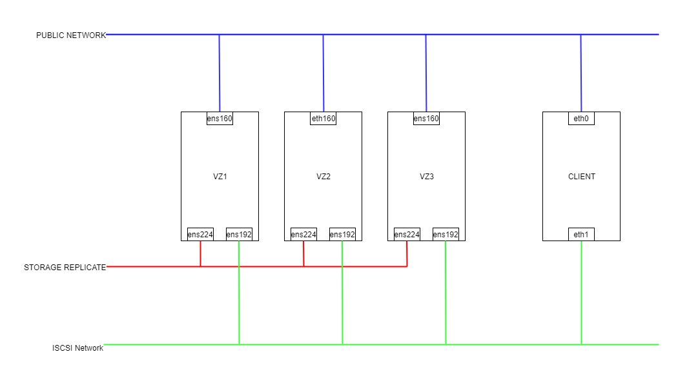
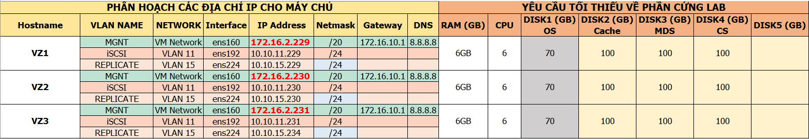

# Mô hình



# IP planning



**VMWARE**

- Install VMware tools 

(For VM on ESXi)

` yum install -y open-vm-tools`

- Edit VM config to Setup hypervisord on VM ESXi  

(For VM on ESXi if necessary)

 **Shutdown VM --> SSH to ESXi --> go to folder --> edit VM-name.vmx --> Add line**
```
vhv.enable = "TRUE"
```

**Save and close the file**
```
vim-cmd vmsvc/getallvms | grep -i <vm_name> 
vim-cmd vmsvc/reload 44 (id_VM)
```
```
grep -E '(vmx|svm)' /proc/cpuinfo (tren VM)
```


