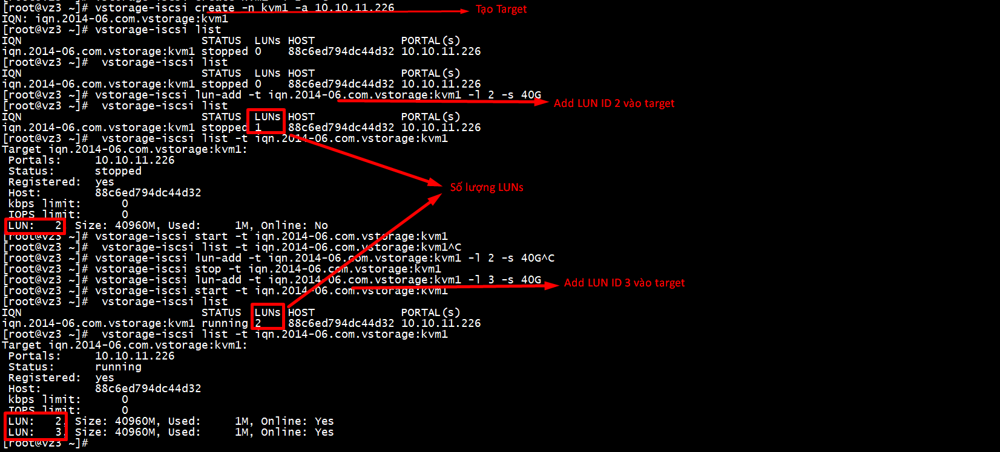

# Connect node KVM vào VZ storage để tạo máy ảo

**Yêu cầu:**
- 1 node client đã cài đặt KVM
- cụm VZ storage đã cấu hình thành công

## Trên node VZ bất kỳ
`
mkdir -p /vstorage/vsto/iscsi
`

**Cần cấu hình trên tất cả các con VZ**
```
[root@vz3 ~]# vi /etc/vstorage/iscsi/config
# Configuration file for vstorage's ISCSI exports
# path to directory with targets on vstorage
ISCSI_ROOT=/vstorage/vsto/iscsi
```

- Tạo target có tên kvm1:

```sh
[root@vz3 ~]# vstorage-iscsi create -n kvm1 -a 10.10.11.226
IQN: iqn.2014-06.com.vstorage:kvm1
```

- Tạo LUN có ID là 2 với dung lượng 40GB:

```sh
[root@vz3 ~]# vstorage-iscsi lun-add -t iqn.2014-06.com.vstorage:kvm1 -l 2 -s 40G
[root@vz3 ~]# vstorage-iscsi start -t iqn.2014-06.com.vstorage:kvm1
```

- Kiểm tra lại :

```sh
vstorage-iscsi  list
IQN                           STATUS  LUNs HOST             PORTAL(s)    
iqn.2014-06.com.vstorage:kvm1 running 1    88c6ed794dc44d32 10.10.11.226

vstorage-iscsi list -t iqn.2014-06.com.vstorage:kvm1
Target iqn.2014-06.com.vstorage:kvm1:
 Portals:     10.10.11.226
 Status:      running
 Registered:  yes
 Host:        88c6ed794dc44d32
 kbps limit:      0
 IOPS limit:      0
 LUN:   2, Size: 40960M, Used:     1M, Online: Yes
```



**Disable / Allow Port firewalld :**
```sh
firewall-cmd --permanent --add-port=3260/tcp
firewall-cmd --reload
firewall-cmd --list-ports
```

# ISCSI Client
- Kiểm tra lại gói:
```
rpm -qa | grep iscsi-initiator-utils
#Nếu chưa có gói 
yum install iscsi-initiator-utils
```

- Discover target

```sh
[root@kvm-vz ~]# iscsiadm --mode discoverydb --type sendtargets --portal 10.10.11.226 --discover
10.10.11.226:3260,1 iqn.2014-06.com.vstorage:kvm1
```

- Login vào target:

```sh
iscsiadm --mode node --targetname  iqn.2014-06.com.vstorage:kvm1 --portal 10.10.11.226:3260 --login
```


## Các thao tác ##

- Logout khỏi target:

```
iscsiadm --mode node --targetname iqn.2014-06.com.vstorage:kvm1 --portal 10.10.11.226:3260 --logout
iscsiadm --mode node
```

- delete iscsi-target:

```sh
iscsiadm -m node -o delete -T "iqn.2014-06.com.vstorage:kvm1" --portal 10.10.11.226:3260 
```

- delete lun ID 3

```sh
vstorage-iscsi lun-del -t iqn.2014-06.com.vstorage:kvm1 -l 3 
```