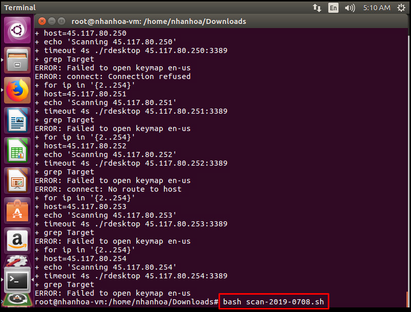
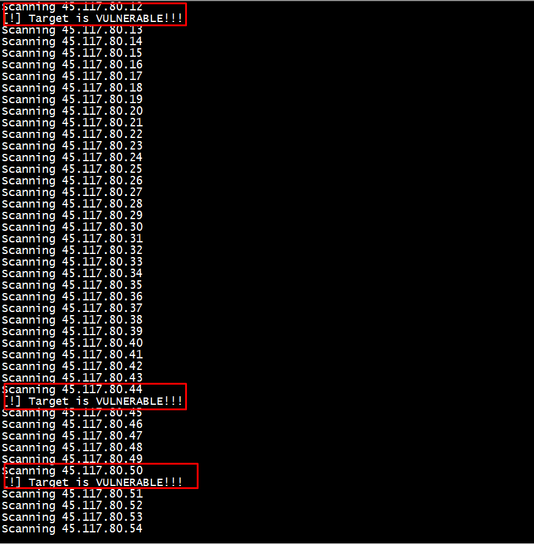
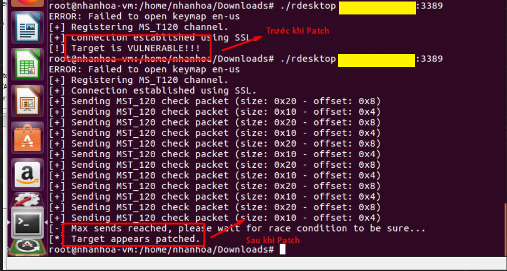

# Hướng dẫn sử dụng tool scan CVE2019-0708

- Bước 1: Setup 1 VM có internet và có gói GUI. ( ở đây sử dụng Ubuntu Desktop 16.04)

- Bước 2: Download script và file run về
```sh
wget https://github.com/anhtuan204/ghichep/blob/master/TuanDA/script/CVE2019-0708/rdesktop?raw=true && mv rdesktop?raw=true rdesktop

wget https://raw.githubusercontent.com/anhtuan204/ghichep/master/TuanDA/script/CVE2019-0708/scan-2019-0708.sh
```

- Bước 3: Edit lại thông số network và port


Bước 4: Chạy script và check file output 



File output ví dụ ở đây là `test`
(Các IP như dưới có nguy cơ tồn tại lỗ hổng):



- Bước 4: Check lại host sau khi đã patch

Login vào VM và thực hiện việc chạy file run để check theo cú pháp:

```sh
<đường dẫn>/rdesktop <IP>:<Port remote>
```

Ví dụ:

